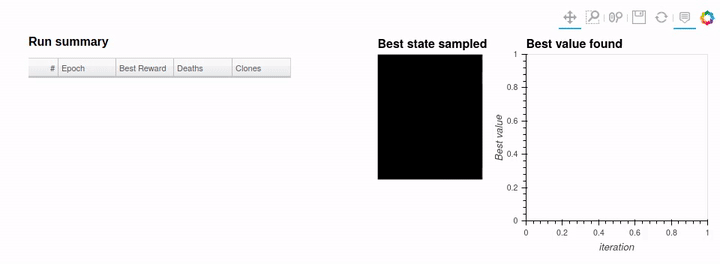

.. include:: ../color_roles.rst
Introduction to fragile
========================
.. note::
    The notebook version of this example is available in the
    `examples <https://github.com/FragileTech/fragile/tree/master/examples>`_
    section as `01_getting_started.ipynb <https://github.com/FragileTech/fragile/blob/master/examples/01_getting_started.ipynb>`_

This is a tutorial that explains how to crate a :swarm:`Swarm` to sample
Atari games from the `OpenAI gym <https://gym.openai.com>`_ library. It covers how to
instantiate a :class:`Swarm` and the most important parameters needed to
control the sampling process.

Structure of a :swarm:`Swarm`
^^^^^^^^^^^^^^^^^^^^^^^^^^^^^^

The :swarm:`Swarm` is the class that implements the algorithm’s evolution
loop, and controls all the other classes involved in solving a given
problem:

.. figure:: ../images/fragile_architecture.png
   :alt: swarm architecture

   swarm architecture

For every problem we want to solve, we will need to define callables
that return instances of the following classes:

-  :env:`Environment`: Represents problem we want to solve. Given states
   and actions, it returns the next state.

-  :model:`Model`: It provides an strategy for sampling actions (Policy).

-  :walkers:`Walkers`: This class handles the computations of the evolution
   process of the algorithm.

-  :tree:`StateTree`: It stores the history of states samples by the :swarm:`Swarm`.

-  :critic:`Critic`: This class implements additional computation, such as a
   new reward, or extra values for our policy.

Choosing to pass callables to the :swarm:`Swarm` instead of instances is a
design decision that simplifies the deployment at scale in a cluster,
because it avoids writing tricky serialization code for all the classes.

Defining the :env:`Environment`
^^^^^^^^^^^^^^^^^^^^^^^^^^^^^^^

For playing Atari games we will use the interface provided by the
`plangym <https://github.com/Guillemdb/plangym>`__ package. It is a
wrapper of OpenAI ``gym`` that allows to easily set and recover the state
of the environments, as well as stepping the environment with batches of
states.

The following code will initialize a ``plangym.Environment`` for an
OpenAI ``gym`` Atari game. The game names use the same convention as the
OpenAI ``gym`` library.

In order to use a ``plangym.Environment`` in a :swarm:`Swarm` we will need to
define the appropriate Callable object to pass as a parameter.

``fragile`` incorporates a wrapper to use a ``plangym.AtariEnvironment``
that will take care of matching the ``fragile`` API and constructing the
appropriate :env-st:`StatesEnv` class to store its data.

The environment callable does not take any parameters, and must return
an instance of :env:`fragile.BaseEnvironment`.

.. code:: ipython3

    from plangym import AtariEnvironment, ParallelEnvironment
    from fragile.atari import AtariEnv
    def atari_environment():
        game_name = "MsPacman-v0"
        plangym_env = ParallelEnvironment(
            env_class=AtariEnvironment,
            name=game_name,
            clone_seeds=True,
            autoreset=True,
            )
        return AtariEnv(env=plangym_env)

Defining the :model:`Model`
^^^^^^^^^^^^^^^^^^^^^^^^^^^

The :model:`Model` defines the policy that will be used to sample the :env:`Environment`. In this tutorial we will be using a random sampling strategy over a discrete uniform distribution. This means that every time we sample an action, the :model:`Model` will return an integer in the range \[0, N_actions\] for each state.

By default each action will be applied for one time step. In case you want to apply the actions a different number of time steps it is possible to use a :critic:`Critic`. The Critics that allow you to sample time steps values for the actions can be found in `fragile.core.dt_samplers`.

In this example we will apply each sampled action a variable number of time steps using the :critic:`GaussianDt`. The :class:`GaussianDt` draws the number of time steps for each action from a normal distribution.

The model callable passed to the :swarm:`Swarm` takes as a parameter the :env:`Environment` and returns an instance of :model:`Model`.

.. code:: ipython3

    from fragile.core import GaussianDt, GaussianDt
    dt = GaussianDt(min_dt=3, max_dt=1000, loc_dt=4, scale_dt=2)
    model_callable = lambda env: DiscreteUniform(env=env, critic=dt)

Storing the sampled data inside a :tree:`HistoryTree`
^^^^^^^^^^^^^^^^^^^^^^^^^^^^^^^^^^^^^^^^^^^^^^^^^^^^^^

It is possible to keep track of the sampled data by using a
:tree:`HistoryTree`. This data structure will construct a directed acyclic
graph that will contain the sampled states and their transitions.

Passing the ``prune_tree`` parameter to the :class:`HistoryTree` we can choose to
store only the branches of the :tree:`HistoryTree` that are being explored.
If ``prune_tree`` is ``True`` all the branches of the graph with no
walkers will be removed after every iteration, and if it is ``False``
all the visited states will be kept in memory.

In order to save memory we will be setting it to ``True``.

With the ``names`` attribute, we can control the data that is stored in the search tree.
In this example we will be saving the state of the atari emulator, the actions and the number of times the actions have been applied at every environment step.

.. code:: ipython3

    from fragile.core.tree import HistoryTree
    tree_callable = lambda: HistoryTree(names=["states", "actions", "dt"], prune=True)

Initializing a Swarm
^^^^^^^^^^^^^^^^^^^^^^^^^^^^^^

Once we have defined the problem-specific callables for the :model:`Model`
and the :env:`Environment`, we need to define the parameters used by the
algorithm:

-  ``n_walkers``: This is population size of our algorithm. It defines
   the number of different states that will be explored simultaneously
   at every iteration of the algorithm. It will be equal to the
   ``batch_size`` of the :states:`States` (size of the first dimension of the
   data they store).

-  ``max_epochs``: Maximum number of iterations that the :swarm:`Swarm` will
   execute. The algorithm will stop either when all the walkers reached
   a death condition, or when the maximum number of iterations is
   reached.

-  ``reward_scale``: Relative importance given to the :env:`Environment`
   reward with respect to the diversity score of the walkers.

-  ``distance_scale``: Relative importance given to the diversity
   measure of the walkers with respect to their reward.

-  ``minimize``: If ``True``, the :swarm:`Swarm` will try to sample states
   with the lowest reward possible. If ``False`` the :swarm:`Swarm` will
   undergo a maximization process.

.. code:: ipython3

    n_walkers = 64  # A bigger number will increase the quality of the trajectories sampled.
    max_epochs = 500  # Increase to sample longer games.
    reward_scale = 2  # Rewards are more important than diversity.
    distance_scale = 1
    minimize = False  # We want to get the maximum score possible.

.. code:: ipython3

    from fragile.core import Swarm
    swarm = Swarm(
        model=model_callable,
        env=atari_environment,
        tree=tree_callable,
        n_walkers=n_walkers,
        max_epochs=max_epochs,
        prune_tree=prune_tree,
        reward_scale=reward_scale,
        distance_scale=distance_scale,
        minimize=minimize,
    )

By printing a :class:`Swarm` we can get an overview of the internal data it
contains.

.. code:: ipython3

    print(swarm)

.. parsed-literal::

    
    Best reward found: -inf , efficiency 0.000, Critic: None
    Walkers iteration 0 Dead walkers: 0.00% Cloned: 0.00%
    
    Walkers States: 
    id_walkers shape (64,) Mean: 0.000, Std: 0.000, Max: 0.000 Min: 0.000
    compas_clone shape (64,) Mean: 0.000, Std: 0.000, Max: 0.000 Min: 0.000
    processed_rewards shape (64,) Mean: 0.000, Std: 0.000, Max: 0.000 Min: 0.000
    virtual_rewards shape (64,) Mean: 0.000, Std: 0.000, Max: 0.000 Min: 0.000
    cum_rewards shape (64,) Mean: 0.000, Std: 0.000, Max: 0.000 Min: 0.000
    distances shape (64,) Mean: 0.000, Std: 0.000, Max: 0.000 Min: 0.000
    clone_probs shape (64,) Mean: 0.000, Std: 0.000, Max: 0.000 Min: 0.000
    will_clone shape (64,) Mean: 0.000, Std: 0.000, Max: 0.000 Min: 0.000
    alive_mask shape (64,) Mean: 0.000, Std: 0.000, Max: 0.000 Min: 0.000
    end_condition shape (64,) Mean: 0.000, Std: 0.000, Max: 0.000 Min: 0.000
    best_reward shape None Mean: nan, Std: nan, Max: nan Min: nan
    best_obs shape None Mean: nan, Std: nan, Max: nan Min: nan
    best_state shape None Mean: nan, Std: nan, Max: nan Min: nan
    distance_scale shape None Mean: nan, Std: nan, Max: nan Min: nan
    critic_score shape (64,) Mean: 0.000, Std: 0.000, Max: 0.000 Min: 0.000
    
    Env States: 
    states shape (64, 1021) Mean: 0.000, Std: 0.000, Max: 0.000 Min: 0.000
    rewards shape (64,) Mean: 0.000, Std: 0.000, Max: 0.000 Min: 0.000
    ends shape (64,) Mean: 0.000, Std: 0.000, Max: 0.000 Min: 0.000
    game_ends shape (64,) Mean: 0.000, Std: 0.000, Max: 0.000 Min: 0.000
    
    Model States: 
    actions shape (64,) Mean: 0.000, Std: 0.000, Max: 0.000 Min: 0.000
    dt shape (64,) Mean: 0.000, Std: 0.000, Max: 0.000 Min: 0.000
    
    

Visualizing the sampling
^^^^^^^^^^^^^^^^^^^^^^^^^

We will be using the Atari visuzalizer to see how the sampling process
evolves. For more information about how the visualizer works please
refer to the ``dataviz`` module tutorial.

.. code:: ipython3

    from fragile.dataviz.swarm_viz import AtariViz
    import holoviews
    holoviews.extension("bokeh")
    swarm_viz = AtariViz(swarm, stream_interval=10)
    swarm_viz.plot()

.. raw:: html

    
    <link rel="stylesheet" href="https://code.jquery.com/ui/1.10.4/themes/smoothness/jquery-ui.css">
    
    
    
    

    <img src='data:image/png;base64,iVBORw0KGgoAAAANSUhEUgAAAEAAAABACAYAAACqaXHeAAAABHNCSVQICAgIfAhkiAAAAAlwSFlz
    AAAB+wAAAfsBxc2miwAAABl0RVh0U29mdHdhcmUAd3d3Lmlua3NjYXBlLm9yZ5vuPBoAAA6zSURB
    VHic7ZtpeFRVmsf/5966taWqUlUJ2UioBBJiIBAwCZtog9IOgjqACsogKtqirT2ttt069nQ/zDzt
    tI4+CrJIREFaFgWhBXpUNhHZQoKBkIUASchWla1S+3ar7r1nPkDaCAnZKoQP/D7mnPOe9/xy76n3
    nFSAW9ziFoPFNED2LLK5wcyBDObkb8ZkxuaoSYlI6ZcOKq1eWFdedqNzGHQBk9RMEwFAASkk0Xw3
    ETacDNi2vtvc7L0ROdw0AjoSotQVkKSvHQz/wRO1lScGModBFbDMaNRN1A4tUBCS3lk7BWhQkgpD
    lG4852/+7DWr1R3uHAZVQDsbh6ZPN7CyxUrCzJMRouusj0ipRwD2uKm0Zn5d2dFwzX1TCGhnmdGo
    G62Nna+isiUqhkzuKrkQaJlPEv5mFl2fvGg2t/VnzkEV8F5ioioOEWkLG86fvbpthynjdhXYZziQ
    x1hC9J2NFyi8vCTt91Fh04KGip0AaG9zuCk2wQCVyoNU3Hjezee9bq92duzzTmxsRJoy+jEZZZYo
    GTKJ6SJngdJqAfRzpze0+jHreUtPc7gpBLQnIYK6BYp/uGhw9YK688eu7v95ysgshcg9qSLMo3JC
    4jqLKQFBgdKDPoQ+Pltb8dUyQLpeDjeVgI6EgLIQFT5tEl3rn2losHVsexbZ3EyT9wE1uGdkIPcy
    BGxn8QUq1QrA5nqW5i2tLqvrrM9NK6AdkVIvL9E9bZL/oyfMVd/jqvc8LylzRBKDJSzIExwhQzuL
    QYGQj4rHfFTc8mUdu3E7yoLtbTe9gI4EqVgVkug2i5+uXGo919ixbRog+3fTbQ8qJe4ZOYNfMoTI
    OoshUNosgO60AisX15aeI2PSIp5KiFLI9ubb1vV3Qb2ltwLakUCDAkWX7/nHKRmmGIl9VgYsUhJm
    2NXjKYADtM1ygne9QQDIXlk49FBstMKx66D1v4+XuQr7vqTe0VcBHQlRWiOCbmmSYe2SqtL6q5rJ
    zsTb7lKx3FKOYC4DoqyS/B5bvLPxvD9Qtf6saxYLQGJErmDOdOMr/zo96km1nElr8bmPOBwI9COv
    HnFPRIwmkSOv9kcAS4heRsidOkpeWBgZM+UBrTFAXNYL5Vf2ii9c1trNzpYdaoVil3WIc+wdk+gQ
    noie3ecCcxt9ITcLAPWt/laGEO/9U6PmzZkenTtsSMQ8uYywJVW+grCstAvCIaAdArAsIWkRDDs/
    KzLm2YcjY1Lv0UdW73HabE9n6V66cxSzfEmuJssTpKGVp+0vHq73FwL46eOjpMpbRAnNmJFrGJNu
    Ukf9Yrz+3rghiumCKNXXWPhLYcjxGsIpoCMsIRoFITkW8AuyM8jC1+/QLx4bozCEJIq38+1rtpR6
    V/yzb8eBlRb3fo5l783N0CWolAzJHaVNzkrTzlEp2bQ2q3TC5gn6wpnoQAmwSiGh2GitnTmVMc5O
    UyfKWUKCIsU7+fZDKwqdT6DDpvkzAX4/+AMFjk0tDp5GRXLpQ2MUmhgDp5gxQT8+Y7hyPsMi8uxF
    71H0oebujHALECjFKaW9Lm68n18wXp2kVzIcABytD5iXFzg+WVXkegpAsOOYziqo0OkK76GyquC3
    ltZAzMhhqlSNmmWTE5T6e3IN05ITFLM4GdN0vtZ3ob8Jh1NAKXFbm5PtLU/eqTSlGjkNAJjdgn/N
    aedXa0tdi7+t9G0FIF49rtMSEgAs1kDLkTPO7ebm4IUWeyh1bKomXqlgMG6kJmHcSM0clYLJ8XtR
    1GTnbV3F6I5wCGikAb402npp1h1s7LQUZZSMIfALFOuL3UUrfnS8+rez7v9qcold5tilgHbO1fjK
    9ubb17u9oshxzMiUBKXWqJNxd+fqb0tLVs4lILFnK71H0Ind7uiPgACVcFJlrb0tV6DzxqqTIhUM
    CwDf1/rrVhTa33/3pGPxJYdQ2l2cbgVcQSosdx8uqnDtbGjh9SlDVSMNWhlnilfqZk42Th2ZpLpf
    xrHec5e815zrr0dfBZSwzkZfqsv+1FS1KUknUwPARVvItfKUY+cn57yP7qv07UE3p8B2uhUwLk09
    e0SCOrK+hbdYHYLjRIl71wWzv9jpEoeOHhGRrJAzyEyNiJuUqX0g2sBN5kGK6y2Blp5M3lsB9Qh4
    y2Ja6x6+i0ucmKgwMATwhSjdUu49tKrQ/pvN5d53ml2CGwCmJipmKjgmyuaXzNeL2a0AkQ01Th5j
    2DktO3Jyk8f9vcOBQHV94OK+fPumJmvQHxJoWkaKWq9Vs+yUsbq0zGT1I4RgeH2b5wef7+c7bl8F
    eKgoHVVZa8ZPEORzR6sT1BzDUAD/d9F78e2Tzv99v8D+fLVTqAKAsbGamKey1Mt9Ann4eH3gTXTz
    idWtAJ8PQWOk7NzSeQn/OTHDuEikVF1R4z8BQCy+6D1aWRfY0tTGG2OM8rRoPaeIj5ZHzJxszElN
    VM8K8JS5WOfv8mzRnQAKoEhmt8gyPM4lU9SmBK1MCQBnW4KONT86v1hZ1PbwSXPw4JWussVjtH9Y
    NCoiL9UoH/6PSu8jFrfY2t36erQHXLIEakMi1SydmzB31h3GGXFDFNPaK8Rme9B79Ixrd0WN+1ij
    NRQ/doRmuFLBkHSTOm5GruG+pFjFdAmorG4IXH1Qua6ASniclfFtDYt+oUjKipPrCQB7QBQ2lrgP
    fFzm+9XWUtcqJ3/5vDLDpJ79XHZk3u8nGZ42qlj1+ydtbxysCezrydp6ugmipNJ7WBPB5tydY0jP
    HaVNzs3QzeE4ZpTbI+ZbnSFPbVOw9vsfnVvqWnirPyCNGD08IlqtYkh2hjZ5dErEQzoNm+6ykyOt
    Lt5/PQEuSRRKo22VkydK+vvS1XEKlhCJAnsqvcVvH7f/ZU2R67eXbMEGAMiIV5oWZWiWvz5Fv2xG
    sjqNJQRvn3Rs2lji/lNP19VjAQDgD7FHhujZB9OGqYxRkZxixgRDVlqS6uEOFaJUVu0rPFzctrnF
    JqijImVp8dEKVWyUXDk92zAuMZ6bFwpBU1HrOw6AdhQgUooChb0+ItMbWJitSo5Ws3IAOGEOtL53
    0vHZih9sC4vtofZ7Qu6523V/fmGcds1TY3V36pUsBwAbSlxnVh2xLfAD/IAIMDf7XYIkNmXfpp2l
    18rkAJAy9HKFaIr/qULkeQQKy9zf1JgDB2uaeFNGijo5QsUyacNUUTOnGO42xSnv4oOwpDi1zYkc
    efUc3I5Gk6PhyTuVKaOGyLUAYPGIoY9Pu/atL/L92+4q9wbflRJ2Trpm/jPjdBtfnqB/dIThcl8A
    KG7hbRuKnb8qsQsVvVlTrwQAQMUlf3kwJI24Z4JhPMtcfng5GcH49GsrxJpGvvHIaeem2ma+KSjQ
    lIwUdYyCY8j4dE1KzijNnIP2llF2wcXNnsoapw9XxsgYAl6k+KzUXbi2yP3KR2ecf6z3BFsBICdW
    nvnIaG3eHybqX7vbpEqUMT+9OL4Qpe8VON7dXuFd39v19FoAABRVePbGGuXTszO0P7tu6lghUonE
    llRdrhArLvmKdh9u29jcFiRRkfLUxBiFNiqSU9icoZQHo5mYBI1MBgBH6wMNb+U7Pnw337H4gi1Y
    ciWs+uks3Z9fztUvfzxTm9Ne8XXkvQLHNytOOZeiD4e0PgkAIAYCYknKUNUDSXEKzdWNpnil7r4p
    xqkjTarZMtk/K8TQ6Qve78qqvXurGwIJqcOUKfUWHsm8KGvxSP68YudXq4pcj39X49uOK2X142O0
    Tz5/u/7TVybqH0rSya6ZBwD21/gubbrgWdDgEOx9WUhfBaC2ibcEBYm7a7x+ukrBMNcEZggyR0TE
    T8zUPjikQ4VosQZbTpS4vqizBKvqmvjsqnpfzaZyx9JPiz1/bfGKdgD45XB1zoIMzYbfTdS/NClB
    Gct0USiY3YL/g0LHy/uq/Ef6uo5+n0R/vyhp17Klpge763f8rMu6YU/zrn2nml+2WtH+Z+5IAAFc
    2bUTdTDOSNa9+cQY7YLsOIXhevEkCvzph7a8laecz/Un/z4/Ae04XeL3UQb57IwU9ZDr9UuKVajv
    nxp1+1UVIo/LjztZkKH59fO3G/JemqCfmaCRqbqbd90ZZ8FfjtkfAyD0J/9+C2h1hDwsSxvGjNDc
    b4zk5NfrSwiQblLHzZhg+Jf4aPlUwpDqkQqa9nimbt1/TDH8OitGMaQnj+RJS6B1fbF7SY1TqO5v
    /v0WAADl1f7zokgS7s7VT2DZ7pegUjBM7mjtiDZbcN4j0YrHH0rXpCtY0qPX0cVL0rv5jv/ZXend
    0u/EESYBAFBU4T4Qa5TflZOhTe7pmKpaP8kCVUVw1+yhXfJWvn1P3hnXi33JsTN6PnP3hHZ8Z3/h
    aLHzmkNPuPj7Bc/F/Q38CwjTpSwQXgE4Vmwry9tpfq/ZFgqFMy4AVDtCvi8rvMvOmv0N4YwbVgEA
    sPM72/KVnzfspmH7HQGCRLG2yL1+z8XwvPcdCbsAANh+xPzstgMtxeGKt+6MK3/tacfvwhWvIwMi
    oKEBtm0H7W+UVfkc/Y1V0BhoPlDr/w1w/eu1vjIgAgDg22OtX6/eYfnEz/focrZTHAFR+PSs56/7
    q32nwpjazxgwAQCwcU/T62t3WL7r6/jVRa6/byp1rei+Z98ZUAEAhEPHPc8fKnTU9nbgtnOe8h0l
    9hcGIqmODLQAHCy2Xti6v/XNRivf43f4fFvIteu854+VHnR7q9tfBlwAAGz+pnndB9vM26UebAe8
    SLHujPOTPVW+rwY+sxskAAC2HrA8t2Vvc7ffP1r9o+vwR2dcr92InIAbKKC1FZ5tB1tf+/G8p8sv
    N/9Q5zd/XR34LYCwV5JdccMEAMDBk45DH243r/X4xGvqxFa/GNpS7n6rwOwNWwHVE26oAADYurf1
    zx/utOzt+DMKYM0p17YtZZ5VNzqfsB2HewG1WXE8PoZ7gOclbTIvynZf9JV+fqZtfgs/8F/Nu5rB
    EIBmJ+8QRMmpU7EzGRsf2FzuePqYRbzh/zE26EwdrT10f6r6o8HOYzCJB9Dpff8tbnGLG8L/A/WE
    roTBs2RqAAAAAElFTkSuQmCC'
         style='height:25px; border-radius:12px; display: inline-block; float: left; vertical-align: middle'></img>
    
    
      </img>
    
    
    
    
    
    

.. raw:: html

    

        

    
    
    
    
    
    
      

    
        

        

    <script type="application/javascript">(function(root) {
      function embed_document(root) {
    
      var docs_json = {"7b81d0ca-b478-4f6e-a3fa-dc1a2dcaca0e":{"roots":{"references":[{"attributes":{"children":[{"id":"1138","type":"ToolbarBox"},{"id":"1136","type":"GridBox"}]},"id":"1139","type":"Column"},{"attributes":{},"id":"1080","type":"LinearScale"},{"attributes":{},"id":"1083","type":"BasicTicker"},{"attributes":{"callback":null,"end":0.5,"reset_end":0.5,"reset_start":-0.5,"start":-0.5,"tags":[[["y","y",null]]]},"id":"1028","type":"Range1d"},{"attributes":{"callback":null,"data":{"Best_Reward":{"__ndarray__":"","dtype":"float64","shape":[0]},"Clones":{"__ndarray__":"","dtype":"float64","shape":[0]},"Deaths":{"__ndarray__":"","dtype":"float64","shape":[0]},"Epoch":{"__ndarray__":"","dtype":"float64","shape":[0]}},"selected":{"id":"1002","type":"Selection"},"selection_policy":{"id":"1117","type":"UnionRenderers"}},"id":"1001","type":"ColumnDataSource"},{"attributes":{"children":[{"id":"1025","type":"Div"},{"id":"1023","type":"DataTable"}]},"id":"1026","type":"Column"},{"attributes":{"data_source":{"id":"1104","type":"ColumnDataSource"},"glyph":{"id":"1107","type":"Line"},"hover_glyph":null,"muted_glyph":{"id":"1109","type":"Line"},"nonselection_glyph":{"id":"1108","type":"Line"},"selection_glyph":null,"view":{"id":"1111","type":"CDSView"}},"id":"1110","type":"GlyphRenderer"},{"attributes":{},"id":"1002","type":"Selection"},{"attributes":{"format":"0,0.0[00000]"},"id":"1003","type":"NumberFormatter"},{"attributes":{"callback":null,"end":0.5,"reset_end":0.5,"reset_start":-0.5,"start":-0.5,"tags":[[["x","x",null]]]},"id":"1027","type":"Range1d"},{"attributes":{"align":null,"below":[{"id":"1038","type":"LinearAxis"}],"center":[{"id":"1042","type":"Grid"},{"id":"1047","type":"Grid"}],"left":[{"id":"1043","type":"LinearAxis"}],"margin":null,"min_border_bottom":10,"min_border_left":10,"min_border_right":10,"min_border_top":10,"plot_height":210,"plot_width":160,"renderers":[{"id":"1064","type":"GlyphRenderer"}],"sizing_mode":"fixed","title":{"id":"1030","type":"Title"},"toolbar":{"id":"1053","type":"Toolbar"},"toolbar_location":null,"x_range":{"id":"1027","type":"Range1d"},"x_scale":{"id":"1034","type":"LinearScale"},"y_range":{"id":"1028","type":"Range1d"},"y_scale":{"id":"1036","type":"LinearScale"}},"id":"1029","subtype":"Figure","type":"Plot"},{"attributes":{"align":null,"below":[{"id":"1082","type":"LinearAxis"}],"center":[{"id":"1086","type":"Grid"},{"id":"1091","type":"Grid"}],"left":[{"id":"1087","type":"LinearAxis"}],"margin":null,"min_border_bottom":10,"min_border_left":10,"min_border_right":10,"min_border_top":10,"plot_height":300,"plot_width":300,"renderers":[{"id":"1110","type":"GlyphRenderer"}],"sizing_mode":"fixed","title":{"id":"1074","type":"Title"},"toolbar":{"id":"1097","type":"Toolbar"},"toolbar_location":null,"x_range":{"id":"1070","type":"Range1d"},"x_scale":{"id":"1078","type":"LinearScale"},"y_range":{"id":"1071","type":"Range1d"},"y_scale":{"id":"1080","type":"LinearScale"}},"id":"1073","subtype":"Figure","type":"Plot"},{"attributes":{},"id":"1117","type":"UnionRenderers"},{"attributes":{"dimension":1,"grid_line_color":null,"ticker":{"id":"1044","type":"BasicTicker"}},"id":"1047","type":"Grid"},{"attributes":{"overlay":{"id":"1123","type":"BoxAnnotation"}},"id":"1051","type":"BoxZoomTool"},{"attributes":{},"id":"1105","type":"Selection"},{"attributes":{},"id":"1060","type":"Selection"},{"attributes":{"line_alpha":0.1,"line_color":"#30a2da","line_width":2,"x":{"field":"x"},"y":{"field":"best_val"}},"id":"1108","type":"Line"},{"attributes":{},"id":"1048","type":"SaveTool"},{"attributes":{"dh":{"field":"dh","units":"data"},"dw":{"field":"dw","units":"data"},"image":{"field":"image"},"x":{"field":"x"},"y":{"field":"y"}},"id":"1063","type":"ImageRGBA"},{"attributes":{},"id":"1114","type":"BasicTickFormatter"},{"attributes":{"editor":{"id":"1014","type":"NumberEditor"},"field":"Deaths","formatter":{"id":"1013","type":"NumberFormatter"},"title":"Deaths"},"id":"1015","type":"TableColumn"},{"attributes":{"line_color":"#30a2da","line_width":2,"x":{"field":"x"},"y":{"field":"best_val"}},"id":"1107","type":"Line"},{"attributes":{"editor":{"id":"1019","type":"NumberEditor"},"field":"Clones","formatter":{"id":"1018","type":"NumberFormatter"},"title":"Clones"},"id":"1020","type":"TableColumn"},{"attributes":{},"id":"1068","type":"BasicTickFormatter"},{"attributes":{"format":"0,0.0[00000]"},"id":"1013","type":"NumberFormatter"},{"attributes":{"data_source":{"id":"1059","type":"ColumnDataSource"},"glyph":{"id":"1062","type":"ImageRGBA"},"hover_glyph":null,"muted_glyph":null,"nonselection_glyph":{"id":"1063","type":"ImageRGBA"},"selection_glyph":null,"view":{"id":"1065","type":"CDSView"}},"id":"1064","type":"GlyphRenderer"},{"attributes":{"callback":null,"data":{"best_val":{"__ndarray__":"","dtype":"float64","shape":[0]},"x":{"__ndarray__":"","dtype":"float64","shape":[0]}},"selected":{"id":"1105","type":"Selection"},"selection_policy":{"id":"1134","type":"UnionRenderers"}},"id":"1104","type":"ColumnDataSource"},{"attributes":{"format":"0,0.0[00000]"},"id":"1018","type":"NumberFormatter"},{"attributes":{"source":{"id":"1104","type":"ColumnDataSource"}},"id":"1111","type":"CDSView"},{"attributes":{"active_drag":"auto","active_inspect":"auto","active_multi":null,"active_scroll":"auto","active_tap":"auto","tools":[{"id":"1048","type":"SaveTool"},{"id":"1049","type":"PanTool"},{"id":"1050","type":"WheelZoomTool"},{"id":"1051","type":"BoxZoomTool"},{"id":"1052","type":"ResetTool"}]},"id":"1053","type":"Toolbar"},{"attributes":{"line_alpha":0.2,"line_color":"#30a2da","line_width":2,"x":{"field":"x"},"y":{"field":"best_val"}},"id":"1109","type":"Line"},{"attributes":{},"id":"1019","type":"NumberEditor"},{"attributes":{"axis_label":"iteration","bounds":"auto","formatter":{"id":"1112","type":"BasicTickFormatter"},"major_label_orientation":"horizontal","ticker":{"id":"1083","type":"BasicTicker"}},"id":"1082","type":"LinearAxis"},{"attributes":{},"id":"1049","type":"PanTool"},{"attributes":{"text":"Best value found","text_color":{"value":"black"},"text_font_size":{"value":"12pt"}},"id":"1074","type":"Title"},{"attributes":{"format":"0,0.0[00000]"},"id":"1008","type":"NumberFormatter"},{"attributes":{},"id":"1050","type":"WheelZoomTool"},{"attributes":{"editor":{"id":"1009","type":"NumberEditor"},"field":"Best_Reward","formatter":{"id":"1008","type":"NumberFormatter"},"title":"Best Reward"},"id":"1010","type":"TableColumn"},{"attributes":{},"id":"1112","type":"BasicTickFormatter"},{"attributes":{"dh":{"field":"dh","units":"data"},"dw":{"field":"dw","units":"data"},"image":{"field":"image"},"x":{"field":"x"},"y":{"field":"y"}},"id":"1062","type":"ImageRGBA"},{"attributes":{},"id":"1014","type":"NumberEditor"},{"attributes":{"editor":{"id":"1004","type":"NumberEditor"},"field":"Epoch","formatter":{"id":"1003","type":"NumberFormatter"},"title":"Epoch"},"id":"1005","type":"TableColumn"},{"attributes":{},"id":"1052","type":"ResetTool"},{"attributes":{},"id":"1036","type":"LinearScale"},{"attributes":{},"id":"1009","type":"NumberEditor"},{"attributes":{},"id":"1004","type":"NumberEditor"},{"attributes":{"columns":[{"id":"1005","type":"TableColumn"},{"id":"1010","type":"TableColumn"},{"id":"1015","type":"TableColumn"},{"id":"1020","type":"TableColumn"}],"height":300,"reorderable":false,"source":{"id":"1001","type":"ColumnDataSource"},"view":{"id":"1024","type":"CDSView"},"width":350},"id":"1023","type":"DataTable"},{"attributes":{},"id":"1078","type":"LinearScale"},{"attributes":{"source":{"id":"1059","type":"ColumnDataSource"}},"id":"1065","type":"CDSView"},{"attributes":{"text":"Best state sampled","text_color":{"value":"black"},"text_font_size":{"value":"12pt"}},"id":"1030","type":"Title"},{"attributes":{"callback":null,"renderers":[{"id":"1110","type":"GlyphRenderer"}],"tags":["hv_created"],"tooltips":[["x","@{x}"],["best_val","@{best_val}"]]},"id":"1072","type":"HoverTool"},{"attributes":{"callback":null,"tags":[[["best_val","best_val",null]]]},"id":"1071","type":"Range1d"},{"attributes":{"bottom_units":"screen","fill_alpha":{"value":0.5},"fill_color":{"value":"lightgrey"},"left_units":"screen","level":"overlay","line_alpha":{"value":1.0},"line_color":{"value":"black"},"line_dash":[4,4],"line_width":{"value":2},"render_mode":"css","right_units":"screen","top_units":"screen"},"id":"1123","type":"BoxAnnotation"},{"attributes":{"grid_line_color":null,"ticker":{"id":"1039","type":"BasicTicker"}},"id":"1042","type":"Grid"},{"attributes":{"active_drag":"auto","active_inspect":"auto","active_multi":null,"active_scroll":"auto","active_tap":"auto","tools":[{"id":"1072","type":"HoverTool"},{"id":"1092","type":"SaveTool"},{"id":"1093","type":"PanTool"},{"id":"1094","type":"WheelZoomTool"},{"id":"1095","type":"BoxZoomTool"},{"id":"1096","type":"ResetTool"}]},"id":"1097","type":"Toolbar"},{"attributes":{"axis_label":"Best value","bounds":"auto","formatter":{"id":"1114","type":"BasicTickFormatter"},"major_label_orientation":"horizontal","ticker":{"id":"1088","type":"BasicTicker"}},"id":"1087","type":"LinearAxis"},{"attributes":{"callback":null,"tags":[[["x","x",null]]]},"id":"1070","type":"Range1d"},{"attributes":{},"id":"1088","type":"BasicTicker"},{"attributes":{},"id":"1125","type":"UnionRenderers"},{"attributes":{"children":[[{"id":"1026","type":"Column"},0,0],[{"id":"1029","subtype":"Figure","type":"Plot"},0,1],[{"id":"1073","subtype":"Figure","type":"Plot"},0,2]]},"id":"1136","type":"GridBox"},{"attributes":{},"id":"1044","type":"BasicTicker"},{"attributes":{"grid_line_color":null,"ticker":{"id":"1083","type":"BasicTicker"}},"id":"1086","type":"Grid"},{"attributes":{"callback":null,"data":{"dh":[1.0],"dw":[1.0],"image":[{"__ndarray__":"AAAA/wAAAP8AAAD/AAAA/wAAAP8AAAD/AAAA/wAAAP8AAAD/AAAA/wAAAP8AAAD/AAAA/wAAAP8AAAD/AAAA/wAAAP8AAAD/AAAA/wAAAP8AAAD/AAAA/wAAAP8AAAD/AAAA/wAAAP8AAAD/AAAA/wAAAP8AAAD/AAAA/wAAAP8AAAD/AAAA/wAAAP8AAAD/AAAA/wAAAP8AAAD/AAAA/wAAAP8AAAD/AAAA/wAAAP8AAAD/AAAA/wAAAP8AAAD/AAAA/wAAAP8AAAD/AAAA/wAAAP8AAAD/AAAA/wAAAP8AAAD/AAAA/wAAAP8AAAD/AAAA/wAAAP8AAAD/AAAA/wAAAP8AAAD/AAAA/wAAAP8AAAD/AAAA/wAAAP8AAAD/AAAA/wAAAP8AAAD/AAAA/wAAAP8AAAD/AAAA/wAAAP8AAAD/AAAA/wAAAP8AAAD/AAAA/wAAAP8AAAD/AAAA/wAAAP8AAAD/AAAA/wAAAP8AAAD/AAAA/wAAAP8AAAD/AAAA/wAAAP8AAAD/AAAA/wAAAP8AAAD/AAAA/wAAAP8AAAD/AAAA/wAAAP8AAAD/AAAA/wAAAP8AAAD/AAAA/wAAAP8AAAD/AAAA/wAAAP8AAAD/AAAA/wAAAP8AAAD/AAAA/wAAAP8AAAD/AAAA/wAAAP8AAAD/AAAA/wAAAP8AAAD/AAAA/wAAAP8AAAD/AAAA/wAAAP8AAAD/AAAA/wAAAP8AAAD/AAAA/wAAAP8AAAD/AAAA/wAAAP8AAAD/AAAA/wAAAP8AAAD/AAAA/wAAAP8AAAD/AAAA/wAAAP8AAAD/AAAA/wAAAP8AAAD/AAAA/wAAAP8AAAD/AAAA/wAAAP8AAAD/AAAA/wAAAP8AAAD/AAAA/wAAAP8AAAD/AAAA/wAAAP8AAAD/AAAA/wAAAP8AAAD/AAAA/wAAAP8AAAD/AAAA/wAAAP8AAAD/AAAA/wAAAP8AAAD/AAAA/wAAAP8AAAD/AAAA/wAAAP8AAAD/AAAA/wAAAP8AAAD/AAAA/wAAAP8AAAD/AAAA/wAAAP8AAAD/AAAA/wAAAP8AAAD/AAAA/wAAAP8AAAD/AAAA/wAAAP8AAAD/AAAA/wAAAP8AAAD/AAAA/wAAAP8AAAD/AAAA/wAAAP8AAAD/AAAA/wAAAP8AAAD/AAAA/wAAAP8AAAD/AAAA/wAAAP8AAAD/AAAA/wAAAP8AAAD/AAAA/wAAAP8AAAD/AAAA/wAAAP8AAAD/AAAA/wAAAP8AAAD/AAAA/wAAAP8AAAD/AAAA/wAAAP8AAAD/AAAA/wAAAP8AAAD/AAAA/wAAAP8AAAD/AAAA/wAAAP8AAAD/AAAA/wAAAP8AAAD/AAAA/wAAAP8AAAD/AAAA/wAAAP8AAAD/AAAA/wAAAP8AAAD/AAAA/wAAAP8AAAD/AAAA/wAAAP8AAAD/AAAA/wAAAP8AAAD/AAAA/wAAAP8AAAD/AAAA/wAAAP8AAAD/AAAA/wAAAP8AAAD/AAAA/wAAAP8AAAD/AAAA/wAAAP8AAAD/AAAA/wAAAP8AAAD/AAAA/wAAAP8AAAD/AAAA/wAAAP8AAAD/AAAA/wAAAP8AAAD/AAAA/wAAAP8AAAD/AAAA/wAAAP8AAAD/AAAA/wAAAP8AAAD/AAAA/wAAAP8AAAD/AAAA/wAAAP8AAAD/AAAA/wAAAP8AAAD/AAAA/wAAAP8AAAD/AAAA/wAAAP8AAAD/AAAA/wAAAP8AAAD/AAAA/wAAAP8AAAD/AAAA/wAAAP8AAAD/AAAA/wAAAP8AAAD/AAAA/wAAAP8AAAD/AAAA/wAAAP8AAAD/AAAA/wAAAP8AAAD/AAAA/wAAAP8AAAD/AAAA/wAAAP8AAAD/AAAA/wAAAP8AAAD/AAAA/wAAAP8AAAD/AAAA/wAAAP8AAAD/AAAA/wAAAP8AAAD/AAAA/wAAAP8AAAD/AAAA/wAAAP8AAAD/AAAA/wAAAP8AAAD/AAAA/wAAAP8AAAD/AAAA/wAAAP8AAAD/AAAA/wAAAP8AAAD/AAAA/wAAAP8AAAD/AAAA/wAAAP8AAAD/AAAA/wAAAP8AAAD/AAAA/wAAAP8AAAD/AAAA/wAAAP8AAAD/AAAA/wAAAP8AAAD/AAAA/wAAAP8AAAD/AAAA/wAAAP8AAAD/AAAA/wAAAP8AAAD/AAAA/wAAAP8AAAD/AAAA/wAAAP8AAAD/AAAA/wAAAP8AAAD/AAAA/wAAAP8AAAD/AAAA/wAAAP8AAAD/AAAA/wAAAP8AAAD/AAAA/wAAAP8AAAD/AAAA/wAAAP8AAAD/AAAA/wAAAP8AAAD/AAAA/wAAAP8AAAD/AAAA/wAAAP8AAAD/AAAA/wAAAP8AAAD/AAAA/wAAAP8AAAD/AAAA/wAAAP8AAAD/AAAA/wAAAP8AAAD/AAAA/wAAAP8AAAD/AAAA/wAAAP8AAAD/AAAA/wAAAP8AAAD/AAAA/wAAAP8AAAD/AAAA/wAAAP8AAAD/AAAA/wAAAP8AAAD/AAAA/wAAAP8AAAD/AAAA/wAAAP8AAAD/AAAA/wAAAP8AAAD/AAAA/wAAAP8AAAD/AAAA/wAAAP8AAAD/AAAA/wAAAP8AAAD/AAAA/wAAAP8AAAD/AAAA/wAAAP8AAAD/AAAA/wAAAP8AAAD/AAAA/wAAAP8AAAD/AAAA/wAAAP8AAAD/AAAA/wAAAP8AAAD/AAAA/wAAAP8AAAD/AAAA/wAAAP8AAAD/AAAA/wAAAP8AAAD/AAAA/wAAAP8AAAD/AAAA/wAAAP8AAAD/AAAA/wAAAP8AAAD/AAAA/wAAAP8AAAD/AAAA/wAAAP8AAAD/AAAA/wAAAP8AAAD/AAAA/wAAAP8AAAD/AAAA/wAAAP8AAAD/AAAA/wAAAP8AAAD/AAAA/wAAAP8AAAD/AAAA/wAAAP8AAAD/AAAA/wAAAP8AAAD/AAAA/wAAAP8AAAD/AAAA/wAAAP8AAAD/AAAA/wAAAP8AAAD/AAAA/wAAAP8AAAD/AAAA/wAAAP8AAAD/AAAA/wAAAP8AAAD/AAAA/wAAAP8AAAD/AAAA/wAAAP8AAAD/AAAA/wAAAP8AAAD/AAAA/wAAAP8AAAD/AAAA/wAAAP8AAAD/AAAA/wAAAP8AAAD/AAAA/wAAAP8AAAD/AAAA/wAAAP8AAAD/AAAA/wAAAP8AAAD/AAAA/wAAAP8AAAD/AAAA/wAAAP8AAAD/AAAA/wAAAP8AAAD/AAAA/wAAAP8AAAD/AAAA/wAAAP8AAAD/AAAA/wAAAP8AAAD/AAAA/wAAAP8AAAD/AAAA/wAAAP8AAAD/AAAA/wAAAP8AAAD/AAAA/wAAAP8AAAD/AAAA/wAAAP8AAAD/AAAA/wAAAP8AAAD/AAAA/wAAAP8AAAD/AAAA/wAAAP8AAAD/AAAA/wAAAP8AAAD/AAAA/wAAAP8AAAD/AAAA/wAAAP8AAAD/AAAA/wAAAP8AAAD/AAAA/wAAAP8AAAD/AAAA/wAAAP8AAAD/AAAA/wAAAP8AAAD/AAAA/wAAAP8AAAD/AAAA/wAAAP8AAAD/AAAA/wAAAP8AAAD/AAAA/wAAAP8AAAD/AAAA/wAAAP8AAAD/AAAA/wAAAP8AAAD/AAAA/wAAAP8AAAD/AAAA/wAAAP8AAAD/AAAA/wAAAP8AAAD/AAAA/wAAAP8AAAD/AAAA/wAAAP8AAAD/AAAA/wAAAP8AAAD/AAAA/wAAAP8AAAD/AAAA/wAAAP8AAAD/AAAA/wAAAP8AAAD/AAAA/wAAAP8AAAD/AAAA/wAAAP8AAAD/AAAA/wAAAP8AAAD/AAAA/wAAAP8AAAD/AAAA/wAAAP8AAAD/AAAA/wAAAP8AAAD/AAAA/wAAAP8AAAD/AAAA/wAAAP8AAAD/AAAA/wAAAP8AAAD/AAAA/wAAAP8AAAD/AAAA/wAAAP8AAAD/AAAA/wAAAP8AAAD/AAAA/wAAAP8AAAD/AAAA/wAAAP8AAAD/AAAA/wAAAP8AAAD/AAAA/wAAAP8AAAD/AAAA/wAAAP8AAAD/AAAA/wAAAP8AAAD/AAAA/wAAAP8AAAD/AAAA/wAAAP8AAAD/AAAA/wAAAP8AAAD/AAAA/wAAAP8AAAD/AAAA/wAAAP8AAAD/AAAA/wAAAP8AAAD/AAAA/wAAAP8AAAD/AAAA/wAAAP8AAAD/AAAA/wAAAP8AAAD/AAAA/wAAAP8AAAD/AAAA/wAAAP8AAAD/AAAA/wAAAP8AAAD/AAAA/wAAAP8AAAD/AAAA/wAAAP8AAAD/AAAA/wAAAP8AAAD/AAAA/wAAAP8AAAD/AAAA/wAAAP8AAAD/AAAA/wAAAP8AAAD/AAAA/wAAAP8AAAD/AAAA/wAAAP8AAAD/AAAA/wAAAP8AAAD/AAAA/wAAAP8AAAD/AAAA/wAAAP8AAAD/AAAA/wAAAP8AAAD/AAAA/wAAAP8AAAD/AAAA/wAAAP8AAAD/AAAA/wAAAP8AAAD/AAAA/wAAAP8AAAD/AAAA/wAAAP8AAAD/AAAA/wAAAP8AAAD/AAAA/wAAAP8AAAD/AAAA/wAAAP8AAAD/AAAA/wAAAP8AAAD/AAAA/wAAAP8AAAD/AAAA/wAAAP8AAAD/AAAA/wAAAP8AAAD/AAAA/wAAAP8AAAD/AAAA/wAAAP8AAAD/AAAA/wAAAP8AAAD/AAAA/wAAAP8AAAD/AAAA/wAAAP8AAAD/AAAA/wAAAP8AAAD/AAAA/wAAAP8AAAD/AAAA/wAAAP8AAAD/AAAA/wAAAP8AAAD/AAAA/wAAAP8AAAD/AAAA/wAAAP8AAAD/AAAA/wAAAP8AAAD/AAAA/wAAAP8AAAD/AAAA/wAAAP8AAAD/AAAA/wAAAP8AAAD/AAAA/wAAAP8AAAD/AAAA/wAAAP8AAAD/AAAA/wAAAP8AAAD/AAAA/wAAAP8AAAD/AAAA/wAAAP8AAAD/AAAA/wAAAP8AAAD/AAAA/wAAAP8AAAD/AAAA/wAAAP8AAAD/AAAA/wAAAP8AAAD/AAAA/wAAAP8AAAD/AAAA/wAAAP8AAAD/AAAA/wAAAP8AAAD/AAAA/wAAAP8AAAD/AAAA/wAAAP8AAAD/AAAA/wAAAP8AAAD/AAAA/wAAAP8AAAD/AAAA/wAAAP8AAAD/AAAA/wAAAP8AAAD/AAAA/wAAAP8AAAD/AAAA/wAAAP8AAAD/AAAA/wAAAP8AAAD/AAAA/wAAAP8AAAD/AAAA/wAAAP8AAAD/AAAA/wAAAP8AAAD/AAAA/wAAAP8AAAD/AAAA/wAAAP8AAAD/AAAA/wAAAP8AAAD/AAAA/wAAAP8AAAD/AAAA/wAAAP8AAAD/AAAA/wAAAP8AAAD/AAAA/wAAAP8AAAD/AAAA/wAAAP8AAAD/AAAA/wAAAP8AAAD/AAAA/wAAAP8AAAD/AAAA/wAAAP8AAAD/AAAA/wAAAP8AAAD/AAAA/wAAAP8AAAD/AAAA/wAAAP8AAAD/AAAA/wAAAP8AAAD/AAAA/wAAAP8AAAD/AAAA/wAAAP8AAAD/AAAA/wAAAP8AAAD/AAAA/wAAAP8AAAD/AAAA/wAAAP8AAAD/AAAA/wAAAP8AAAD/AAAA/wAAAP8AAAD/AAAA/wAAAP8AAAD/AAAA/wAAAP8AAAD/AAAA/wAAAP8AAAD/AAAA/wAAAP8AAAD/AAAA/wAAAP8AAAD/AAAA/wAAAP8AAAD/AAAA/wAAAP8AAAD/AAAA/wAAAP8AAAD/AAAA/wAAAP8AAAD/AAAA/wAAAP8AAAD/AAAA/wAAAP8AAAD/AAAA/wAAAP8AAAD/AAAA/wAAAP8AAAD/AAAA/wAAAP8AAAD/AAAA/wAAAP8AAAD/AAAA/wAAAP8AAAD/AAAA/wAAAP8AAAD/AAAA/wAAAP8AAAD/AAAA/wAAAP8AAAD/AAAA/wAAAP8AAAD/AAAA/wAAAP8AAAD/AAAA/wAAAP8AAAD/AAAA/wAAAP8AAAD/AAAA/wAAAP8AAAD/AAAA/wAAAP8AAAD/AAAA/wAAAP8AAAD/AAAA/wAAAP8AAAD/AAAA/wAAAP8AAAD/AAAA/wAAAP8AAAD/AAAA/wAAAP8AAAD/AAAA/wAAAP8AAAD/AAAA/wAAAP8AAAD/AAAA/wAAAP8AAAD/AAAA/wAAAP8AAAD/AAAA/wAAAP8AAAD/AAAA/wAAAP8AAAD/AAAA/wAAAP8AAAD/AAAA/wAAAP8AAAD/AAAA/wAAAP8AAAD/AAAA/wAAAP8AAAD/AAAA/wAAAP8AAAD/AAAA/wAAAP8AAAD/AAAA/wAAAP8AAAD/AAAA/wAAAP8AAAD/AAAA/wAAAP8AAAD/AAAA/wAAAP8AAAD/AAAA/wAAAP8AAAD/AAAA/wAAAP8AAAD/AAAA/wAAAP8AAAD/AAAA/wAAAP8AAAD/AAAA/wAAAP8AAAD/AAAA/wAAAP8AAAD/AAAA/wAAAP8AAAD/AAAA/wAAAP8AAAD/AAAA/wAAAP8AAAD/AAAA/wAAAP8AAAD/AAAA/wAAAP8AAAD/AAAA/wAAAP8AAAD/AAAA/wAAAP8AAAD/AAAA/wAAAP8AAAD/AAAA/wAAAP8AAAD/AAAA/wAAAP8AAAD/AAAA/wAAAP8AAAD/AAAA/wAAAP8AAAD/AAAA/wAAAP8AAAD/AAAA/wAAAP8AAAD/AAAA/wAAAP8AAAD/AAAA/wAAAP8AAAD/AAAA/wAAAP8AAAD/AAAA/wAAAP8AAAD/AAAA/wAAAP8AAAD/AAAA/wAAAP8AAAD/AAAA/wAAAP8AAAD/AAAA/wAAAP8AAAD/AAAA/wAAAP8AAAD/AAAA/wAAAP8AAAD/AAAA/wAAAP8AAAD/AAAA/wAAAP8AAAD/AAAA/wAAAP8AAAD/AAAA/wAAAP8AAAD/AAAA/wAAAP8AAAD/AAAA/wAAAP8AAAD/AAAA/wAAAP8AAAD/AAAA/wAAAP8AAAD/AAAA/wAAAP8AAAD/AAAA/wAAAP8AAAD/AAAA/wAAAP8AAAD/AAAA/wAAAP8AAAD/AAAA/wAAAP8AAAD/AAAA/wAAAP8AAAD/AAAA/wAAAP8AAAD/AAAA/wAAAP8AAAD/AAAA/wAAAP8AAAD/AAAA/wAAAP8AAAD/AAAA/wAAAP8AAAD/AAAA/wAAAP8AAAD/AAAA/wAAAP8AAAD/AAAA/wAAAP8AAAD/AAAA/wAAAP8AAAD/AAAA/wAAAP8AAAD/AAAA/wAAAP8AAAD/AAAA/wAAAP8AAAD/AAAA/wAAAP8AAAD/AAAA/wAAAP8AAAD/AAAA/wAAAP8AAAD/AAAA/wAAAP8AAAD/AAAA/wAAAP8AAAD/AAAA/wAAAP8AAAD/AAAA/wAAAP8AAAD/AAAA/wAAAP8AAAD/AAAA/wAAAP8AAAD/AAAA/wAAAP8AAAD/AAAA/wAAAP8AAAD/AAAA/wAAAP8AAAD/AAAA/wAAAP8AAAD/AAAA/wAAAP8AAAD/AAAA/wAAAP8AAAD/AAAA/wAAAP8AAAD/AAAA/wAAAP8AAAD/AAAA/wAAAP8AAAD/AAAA/wAAAP8AAAD/AAAA/wAAAP8AAAD/AAAA/wAAAP8AAAD/AAAA/wAAAP8AAAD/AAAA/wAAAP8AAAD/AAAA/wAAAP8AAAD/AAAA/wAAAP8AAAD/AAAA/wAAAP8AAAD/AAAA/wAAAP8AAAD/AAAA/wAAAP8AAAD/AAAA/wAAAP8AAAD/AAAA/wAAAP8AAAD/AAAA/wAAAP8AAAD/AAAA/wAAAP8AAAD/AAAA/wAAAP8AAAD/AAAA/wAAAP8AAAD/AAAA/wAAAP8AAAD/AAAA/wAAAP8AAAD/AAAA/wAAAP8AAAD/AAAA/wAAAP8AAAD/AAAA/wAAAP8AAAD/AAAA/wAAAP8AAAD/AAAA/wAAAP8AAAD/AAAA/wAAAP8AAAD/AAAA/wAAAP8AAAD/AAAA/wAAAP8AAAD/AAAA/wAAAP8AAAD/AAAA/wAAAP8AAAD/AAAA/wAAAP8AAAD/AAAA/wAAAP8AAAD/AAAA/wAAAP8AAAD/AAAA/wAAAP8AAAD/AAAA/wAAAP8AAAD/AAAA/wAAAP8AAAD/AAAA/wAAAP8AAAD/AAAA/wAAAP8AAAD/AAAA/wAAAP8AAAD/AAAA/wAAAP8AAAD/AAAA/wAAAP8AAAD/AAAA/wAAAP8AAAD/AAAA/wAAAP8AAAD/AAAA/wAAAP8AAAD/AAAA/wAAAP8AAAD/AAAA/wAAAP8AAAD/AAAA/wAAAP8AAAD/AAAA/wAAAP8AAAD/AAAA/wAAAP8AAAD/AAAA/wAAAP8AAAD/AAAA/wAAAP8AAAD/AAAA/wAAAP8AAAD/AAAA/wAAAP8AAAD/AAAA/wAAAP8AAAD/AAAA/wAAAP8AAAD/AAAA/wAAAP8AAAD/AAAA/wAAAP8AAAD/AAAA/wAAAP8AAAD/AAAA/wAAAP8AAAD/AAAA/wAAAP8AAAD/AAAA/wAAAP8AAAD/AAAA/wAAAP8AAAD/AAAA/wAAAP8AAAD/AAAA/wAAAP8AAAD/AAAA/wAAAP8AAAD/AAAA/wAAAP8AAAD/AAAA/wAAAP8AAAD/AAAA/wAAAP8AAAD/AAAA/wAAAP8AAAD/AAAA/wAAAP8AAAD/AAAA/wAAAP8AAAD/AAAA/wAAAP8AAAD/AAAA/wAAAP8AAAD/AAAA/wAAAP8AAAD/AAAA/wAAAP8AAAD/AAAA/wAAAP8AAAD/AAAA/wAAAP8AAAD/AAAA/wAAAP8AAAD/AAAA/wAAAP8AAAD/AAAA/wAAAP8AAAD/AAAA/wAAAP8AAAD/AAAA/wAAAP8AAAD/AAAA/wAAAP8AAAD/AAAA/wAAAP8AAAD/AAAA/wAAAP8AAAD/AAAA/wAAAP8AAAD/AAAA/wAAAP8AAAD/AAAA/wAAAP8AAAD/AAAA/wAAAP8AAAD/AAAA/wAAAP8AAAD/AAAA/wAAAP8AAAD/AAAA/wAAAP8AAAD/AAAA/wAAAP8AAAD/AAAA/wAAAP8AAAD/AAAA/wAAAP8AAAD/AAAA/wAAAP8AAAD/AAAA/wAAAP8AAAD/AAAA/wAAAP8AAAD/AAAA/wAAAP8AAAD/AAAA/wAAAP8AAAD/AAAA/wAAAP8AAAD/AAAA/wAAAP8AAAD/AAAA/wAAAP8AAAD/AAAA/wAAAP8AAAD/AAAA/wAAAP8AAAD/AAAA/wAAAP8AAAD/AAAA/wAAAP8AAAD/AAAA/wAAAP8AAAD/AAAA/wAAAP8AAAD/AAAA/wAAAP8AAAD/AAAA/wAAAP8AAAD/AAAA/wAAAP8AAAD/AAAA/wAAAP8AAAD/AAAA/wAAAP8AAAD/AAAA/wAAAP8AAAD/AAAA/wAAAP8AAAD/AAAA/wAAAP8AAAD/AAAA/wAAAP8AAAD/AAAA/wAAAP8AAAD/AAAA/wAAAP8AAAD/AAAA/wAAAP8AAAD/AAAA/wAAAP8AAAD/AAAA/wAAAP8AAAD/AAAA/wAAAP8AAAD/AAAA/wAAAP8AAAD/AAAA/wAAAP8AAAD/AAAA/wAAAP8AAAD/AAAA/wAAAP8AAAD/AAAA/wAAAP8AAAD/AAAA/wAAAP8AAAD/AAAA/wAAAP8AAAD/AAAA/wAAAP8AAAD/AAAA/wAAAP8AAAD/AAAA/wAAAP8AAAD/AAAA/wAAAP8AAAD/AAAA/wAAAP8AAAD/AAAA/wAAAP8AAAD/AAAA/wAAAP8AAAD/AAAA/wAAAP8AAAD/AAAA/wAAAP8AAAD/AAAA/wAAAP8AAAD/AAAA/wAAAP8AAAD/AAAA/wAAAP8AAAD/AAAA/wAAAP8AAAD/AAAA/wAAAP8AAAD/AAAA/wAAAP8AAAD/AAAA/wAAAP8AAAD/AAAA/wAAAP8AAAD/AAAA/wAAAP8AAAD/AAAA/wAAAP8AAAD/AAAA/wAAAP8AAAD/AAAA/wAAAP8AAAD/AAAA/wAAAP8AAAD/AAAA/wAAAP8AAAD/AAAA/wAAAP8AAAD/AAAA/wAAAP8AAAD/AAAA/wAAAP8AAAD/AAAA/wAAAP8AAAD/AAAA/wAAAP8AAAD/AAAA/wAAAP8AAAD/AAAA/wAAAP8AAAD/AAAA/wAAAP8AAAD/AAAA/wAAAP8AAAD/AAAA/wAAAP8AAAD/AAAA/wAAAP8AAAD/AAAA/wAAAP8AAAD/AAAA/wAAAP8AAAD/AAAA/wAAAP8AAAD/AAAA/wAAAP8AAAD/AAAA/wAAAP8AAAD/AAAA/wAAAP8AAAD/AAAA/wAAAP8AAAD/AAAA/wAAAP8AAAD/AAAA/wAAAP8AAAD/AAAA/wAAAP8AAAD/AAAA/wAAAP8AAAD/AAAA/wAAAP8AAAD/AAAA/wAAAP8AAAD/AAAA/wAAAP8AAAD/AAAA/wAAAP8AAAD/AAAA/wAAAP8AAAD/AAAA/wAAAP8AAAD/AAAA/wAAAP8AAAD/AAAA/wAAAP8AAAD/AAAA/wAAAP8AAAD/AAAA/wAAAP8AAAD/AAAA/wAAAP8AAAD/AAAA/wAAAP8AAAD/AAAA/wAAAP8AAAD/AAAA/wAAAP8AAAD/AAAA/wAAAP8AAAD/AAAA/wAAAP8AAAD/AAAA/wAAAP8AAAD/AAAA/wAAAP8AAAD/AAAA/wAAAP8AAAD/AAAA/wAAAP8AAAD/AAAA/wAAAP8AAAD/AAAA/wAAAP8AAAD/AAAA/wAAAP8AAAD/AAAA/wAAAP8AAAD/AAAA/wAAAP8AAAD/AAAA/wAAAP8AAAD/AAAA/wAAAP8AAAD/AAAA/wAAAP8AAAD/AAAA/wAAAP8AAAD/AAAA/wAAAP8AAAD/AAAA/wAAAP8AAAD/AAAA/wAAAP8AAAD/AAAA/wAAAP8AAAD/AAAA/wAAAP8AAAD/AAAA/wAAAP8AAAD/AAAA/wAAAP8AAAD/AAAA/wAAAP8AAAD/AAAA/wAAAP8AAAD/AAAA/wAAAP8AAAD/AAAA/wAAAP8AAAD/AAAA/wAAAP8AAAD/AAAA/wAAAP8AAAD/AAAA/wAAAP8AAAD/AAAA/wAAAP8AAAD/AAAA/wAAAP8AAAD/AAAA/wAAAP8AAAD/AAAA/wAAAP8AAAD/AAAA/wAAAP8AAAD/AAAA/wAAAP8AAAD/AAAA/wAAAP8AAAD/AAAA/wAAAP8AAAD/AAAA/wAAAP8AAAD/AAAA/wAAAP8AAAD/AAAA/wAAAP8AAAD/AAAA/wAAAP8AAAD/AAAA/wAAAP8AAAD/AAAA/wAAAP8AAAD/AAAA/wAAAP8AAAD/AAAA/wAAAP8AAAD/AAAA/wAAAP8AAAD/AAAA/wAAAP8AAAD/AAAA/wAAAP8AAAD/AAAA/wAAAP8AAAD/AAAA/wAAAP8AAAD/AAAA/wAAAP8AAAD/AAAA/wAAAP8AAAD/AAAA/wAAAP8AAAD/AAAA/wAAAP8AAAD/AAAA/wAAAP8AAAD/AAAA/wAAAP8AAAD/AAAA/wAAAP8AAAD/AAAA/wAAAP8AAAD/AAAA/wAAAP8AAAD/AAAA/wAAAP8AAAD/AAAA/wAAAP8AAAD/AAAA/wAAAP8AAAD/AAAA/wAAAP8AAAD/AAAA/wAAAP8AAAD/AAAA/wAAAP8AAAD/AAAA/wAAAP8AAAD/AAAA/wAAAP8AAAD/AAAA/wAAAP8AAAD/AAAA/wAAAP8AAAD/AAAA/wAAAP8AAAD/AAAA/wAAAP8AAAD/AAAA/wAAAP8AAAD/AAAA/wAAAP8AAAD/AAAA/wAAAP8AAAD/AAAA/wAAAP8AAAD/AAAA/wAAAP8AAAD/AAAA/wAAAP8AAAD/AAAA/wAAAP8AAAD/AAAA/wAAAP8AAAD/AAAA/wAAAP8AAAD/AAAA/wAAAP8AAAD/AAAA/wAAAP8AAAD/AAAA/wAAAP8AAAD/AAAA/wAAAP8AAAD/AAAA/wAAAP8AAAD/AAAA/wAAAP8AAAD/AAAA/wAAAP8AAAD/AAAA/wAAAP8AAAD/AAAA/wAAAP8AAAD/AAAA/wAAAP8AAAD/AAAA/wAAAP8AAAD/AAAA/wAAAP8AAAD/AAAA/wAAAP8AAAD/AAAA/wAAAP8AAAD/AAAA/wAAAP8AAAD/AAAA/wAAAP8AAAD/AAAA/wAAAP8AAAD/AAAA/wAAAP8AAAD/AAAA/wAAAP8AAAD/AAAA/wAAAP8AAAD/AAAA/wAAAP8AAAD/AAAA/wAAAP8AAAD/AAAA/wAAAP8AAAD/AAAA/wAAAP8AAAD/AAAA/wAAAP8AAAD/AAAA/wAAAP8AAAD/AAAA/wAAAP8AAAD/AAAA/wAAAP8AAAD/AAAA/wAAAP8AAAD/AAAA/wAAAP8AAAD/AAAA/wAAAP8AAAD/AAAA/wAAAP8AAAD/AAAA/wAAAP8AAAD/AAAA/wAAAP8AAAD/AAAA/wAAAP8AAAD/AAAA/wAAAP8AAAD/AAAA/wAAAP8AAAD/AAAA/wAAAP8AAAD/AAAA/wAAAP8AAAD/AAAA/wAAAP8AAAD/AAAA/wAAAP8AAAD/AAAA/wAAAP8AAAD/AAAA/wAAAP8AAAD/AAAA/wAAAP8AAAD/AAAA/wAAAP8AAAD/AAAA/wAAAP8AAAD/AAAA/wAAAP8AAAD/AAAA/wAAAP8AAAD/AAAA/wAAAP8AAAD/AAAA/wAAAP8AAAD/AAAA/wAAAP8AAAD/AAAA/wAAAP8AAAD/AAAA/wAAAP8AAAD/AAAA/wAAAP8AAAD/AAAA/wAAAP8AAAD/AAAA/wAAAP8AAAD/AAAA/wAAAP8AAAD/AAAA/wAAAP8AAAD/AAAA/wAAAP8AAAD/AAAA/wAAAP8AAAD/AAAA/wAAAP8AAAD/AAAA/wAAAP8AAAD/AAAA/wAAAP8AAAD/AAAA/wAAAP8AAAD/AAAA/wAAAP8AAAD/AAAA/wAAAP8AAAD/AAAA/wAAAP8AAAD/AAAA/wAAAP8AAAD/AAAA/wAAAP8AAAD/AAAA/wAAAP8AAAD/AAAA/wAAAP8AAAD/AAAA/wAAAP8AAAD/AAAA/wAAAP8AAAD/AAAA/wAAAP8AAAD/AAAA/wAAAP8AAAD/AAAA/wAAAP8AAAD/AAAA/wAAAP8AAAD/AAAA/wAAAP8AAAD/AAAA/wAAAP8AAAD/AAAA/wAAAP8AAAD/AAAA/wAAAP8AAAD/AAAA/wAAAP8AAAD/AAAA/wAAAP8AAAD/AAAA/wAAAP8AAAD/AAAA/wAAAP8AAAD/AAAA/wAAAP8AAAD/AAAA/wAAAP8AAAD/AAAA/wAAAP8AAAD/AAAA/wAAAP8AAAD/AAAA/wAAAP8AAAD/AAAA/wAAAP8AAAD/AAAA/wAAAP8AAAD/AAAA/wAAAP8AAAD/AAAA/wAAAP8AAAD/AAAA/wAAAP8AAAD/AAAA/wAAAP8AAAD/AAAA/wAAAP8AAAD/AAAA/wAAAP8AAAD/AAAA/wAAAP8AAAD/AAAA/wAAAP8AAAD/AAAA/wAAAP8AAAD/AAAA/wAAAP8AAAD/AAAA/wAAAP8AAAD/AAAA/wAAAP8AAAD/AAAA/wAAAP8AAAD/AAAA/wAAAP8AAAD/AAAA/wAAAP8AAAD/AAAA/wAAAP8AAAD/AAAA/wAAAP8AAAD/AAAA/wAAAP8AAAD/AAAA/wAAAP8AAAD/AAAA/wAAAP8AAAD/AAAA/wAAAP8AAAD/AAAA/wAAAP8AAAD/AAAA/wAAAP8AAAD/AAAA/wAAAP8AAAD/AAAA/wAAAP8AAAD/AAAA/wAAAP8AAAD/AAAA/wAAAP8AAAD/AAAA/wAAAP8AAAD/AAAA/wAAAP8AAAD/AAAA/wAAAP8AAAD/AAAA/wAAAP8AAAD/AAAA/wAAAP8AAAD/AAAA/wAAAP8AAAD/AAAA/wAAAP8AAAD/AAAA/wAAAP8AAAD/AAAA/wAAAP8AAAD/AAAA/wAAAP8AAAD/AAAA/wAAAP8AAAD/AAAA/wAAAP8AAAD/AAAA/wAAAP8AAAD/AAAA/wAAAP8AAAD/AAAA/wAAAP8AAAD/AAAA/wAAAP8AAAD/AAAA/wAAAP8AAAD/AAAA/wAAAP8AAAD/AAAA/wAAAP8AAAD/AAAA/wAAAP8AAAD/AAAA/wAAAP8AAAD/AAAA/wAAAP8AAAD/AAAA/wAAAP8AAAD/AAAA/wAAAP8AAAD/AAAA/wAAAP8AAAD/AAAA/wAAAP8AAAD/AAAA/wAAAP8AAAD/AAAA/wAAAP8AAAD/AAAA/wAAAP8AAAD/AAAA/wAAAP8AAAD/AAAA/wAAAP8AAAD/AAAA/wAAAP8AAAD/AAAA/wAAAP8AAAD/AAAA/wAAAP8AAAD/AAAA/wAAAP8AAAD/AAAA/wAAAP8AAAD/AAAA/wAAAP8AAAD/AAAA/wAAAP8AAAD/AAAA/wAAAP8AAAD/AAAA/wAAAP8AAAD/AAAA/wAAAP8AAAD/AAAA/wAAAP8AAAD/AAAA/wAAAP8AAAD/AAAA/wAAAP8AAAD/AAAA/wAAAP8AAAD/AAAA/wAAAP8AAAD/AAAA/wAAAP8AAAD/AAAA/wAAAP8AAAD/AAAA/wAAAP8AAAD/AAAA/wAAAP8AAAD/AAAA/wAAAP8AAAD/AAAA/wAAAP8AAAD/AAAA/wAAAP8AAAD/AAAA/wAAAP8AAAD/AAAA/wAAAP8AAAD/AAAA/wAAAP8AAAD/AAAA/wAAAP8AAAD/AAAA/wAAAP8AAAD/AAAA/wAAAP8AAAD/AAAA/wAAAP8AAAD/AAAA/wAAAP8AAAD/AAAA/wAAAP8AAAD/AAAA/wAAAP8AAAD/AAAA/wAAAP8AAAD/AAAA/wAAAP8AAAD/AAAA/wAAAP8AAAD/AAAA/wAAAP8AAAD/AAAA/wAAAP8AAAD/AAAA/wAAAP8AAAD/AAAA/wAAAP8AAAD/AAAA/wAAAP8AAAD/AAAA/wAAAP8AAAD/AAAA/wAAAP8AAAD/AAAA/wAAAP8AAAD/AAAA/wAAAP8AAAD/AAAA/wAAAP8AAAD/AAAA/wAAAP8AAAD/AAAA/wAAAP8AAAD/AAAA/wAAAP8AAAD/AAAA/wAAAP8AAAD/AAAA/wAAAP8AAAD/AAAA/wAAAP8AAAD/AAAA/wAAAP8AAAD/AAAA/wAAAP8AAAD/AAAA/wAAAP8AAAD/AAAA/wAAAP8AAAD/AAAA/wAAAP8AAAD/AAAA/wAAAP8AAAD/AAAA/wAAAP8AAAD/AAAA/wAAAP8AAAD/AAAA/wAAAP8AAAD/AAAA/wAAAP8AAAD/AAAA/wAAAP8AAAD/AAAA/wAAAP8AAAD/AAAA/wAAAP8AAAD/AAAA/wAAAP8AAAD/AAAA/wAAAP8AAAD/AAAA/wAAAP8AAAD/AAAA/wAAAP8AAAD/AAAA/wAAAP8AAAD/AAAA/wAAAP8AAAD/AAAA/wAAAP8AAAD/AAAA/wAAAP8AAAD/AAAA/wAAAP8AAAD/AAAA/wAAAP8AAAD/AAAA/wAAAP8AAAD/AAAA/wAAAP8AAAD/AAAA/wAAAP8AAAD/AAAA/wAAAP8AAAD/AAAA/wAAAP8AAAD/AAAA/wAAAP8AAAD/AAAA/wAAAP8AAAD/AAAA/wAAAP8AAAD/AAAA/wAAAP8AAAD/AAAA/wAAAP8AAAD/AAAA/wAAAP8AAAD/AAAA/wAAAP8AAAD/AAAA/wAAAP8AAAD/AAAA/wAAAP8AAAD/AAAA/wAAAP8AAAD/AAAA/wAAAP8AAAD/AAAA/wAAAP8AAAD/AAAA/wAAAP8AAAD/AAAA/wAAAP8AAAD/AAAA/wAAAP8AAAD/AAAA/wAAAP8AAAD/AAAA/wAAAP8AAAD/AAAA/wAAAP8AAAD/AAAA/wAAAP8AAAD/AAAA/wAAAP8AAAD/AAAA/wAAAP8AAAD/AAAA/wAAAP8AAAD/AAAA/wAAAP8AAAD/AAAA/wAAAP8AAAD/AAAA/wAAAP8AAAD/AAAA/wAAAP8AAAD/AAAA/wAAAP8AAAD/AAAA/wAAAP8AAAD/AAAA/wAAAP8AAAD/AAAA/wAAAP8AAAD/AAAA/wAAAP8AAAD/AAAA/wAAAP8AAAD/AAAA/wAAAP8AAAD/AAAA/wAAAP8AAAD/AAAA/wAAAP8AAAD/AAAA/wAAAP8AAAD/AAAA/wAAAP8AAAD/AAAA/wAAAP8AAAD/AAAA/wAAAP8AAAD/AAAA/wAAAP8AAAD/AAAA/wAAAP8AAAD/AAAA/wAAAP8AAAD/AAAA/wAAAP8AAAD/AAAA/wAAAP8AAAD/AAAA/wAAAP8AAAD/AAAA/wAAAP8AAAD/AAAA/wAAAP8AAAD/AAAA/wAAAP8AAAD/AAAA/wAAAP8AAAD/AAAA/wAAAP8AAAD/AAAA/wAAAP8AAAD/AAAA/wAAAP8AAAD/AAAA/wAAAP8AAAD/AAAA/wAAAP8AAAD/AAAA/wAAAP8AAAD/AAAA/wAAAP8AAAD/AAAA/wAAAP8AAAD/AAAA/wAAAP8AAAD/AAAA/wAAAP8AAAD/AAAA/wAAAP8AAAD/AAAA/wAAAP8AAAD/AAAA/wAAAP8AAAD/AAAA/wAAAP8AAAD/AAAA/wAAAP8AAAD/AAAA/wAAAP8AAAD/AAAA/wAAAP8AAAD/AAAA/wAAAP8AAAD/AAAA/wAAAP8AAAD/AAAA/wAAAP8AAAD/AAAA/wAAAP8AAAD/AAAA/wAAAP8AAAD/AAAA/wAAAP8AAAD/AAAA/wAAAP8AAAD/AAAA/wAAAP8AAAD/AAAA/wAAAP8AAAD/AAAA/wAAAP8AAAD/AAAA/wAAAP8AAAD/AAAA/wAAAP8AAAD/AAAA/wAAAP8AAAD/AAAA/wAAAP8AAAD/AAAA/wAAAP8AAAD/AAAA/wAAAP8AAAD/AAAA/wAAAP8AAAD/AAAA/wAAAP8AAAD/AAAA/wAAAP8AAAD/AAAA/wAAAP8AAAD/AAAA/wAAAP8AAAD/AAAA/wAAAP8AAAD/AAAA/wAAAP8AAAD/AAAA/wAAAP8AAAD/AAAA/wAAAP8AAAD/AAAA/wAAAP8AAAD/AAAA/wAAAP8AAAD/AAAA/wAAAP8AAAD/AAAA/wAAAP8AAAD/AAAA/wAAAP8AAAD/AAAA/wAAAP8AAAD/AAAA/wAAAP8AAAD/AAAA/wAAAP8AAAD/AAAA/wAAAP8AAAD/AAAA/wAAAP8AAAD/AAAA/wAAAP8AAAD/AAAA/wAAAP8AAAD/AAAA/wAAAP8AAAD/AAAA/wAAAP8AAAD/AAAA/wAAAP8AAAD/AAAA/wAAAP8AAAD/AAAA/wAAAP8AAAD/AAAA/wAAAP8AAAD/AAAA/wAAAP8AAAD/AAAA/wAAAP8AAAD/AAAA/wAAAP8AAAD/AAAA/wAAAP8AAAD/AAAA/wAAAP8AAAD/AAAA/wAAAP8AAAD/AAAA/wAAAP8AAAD/AAAA/wAAAP8AAAD/AAAA/wAAAP8AAAD/AAAA/wAAAP8AAAD/AAAA/wAAAP8AAAD/AAAA/wAAAP8AAAD/AAAA/wAAAP8AAAD/AAAA/wAAAP8AAAD/AAAA/wAAAP8AAAD/AAAA/wAAAP8AAAD/AAAA/wAAAP8AAAD/AAAA/wAAAP8AAAD/AAAA/wAAAP8AAAD/AAAA/wAAAP8AAAD/AAAA/wAAAP8AAAD/AAAA/wAAAP8AAAD/AAAA/wAAAP8AAAD/AAAA/wAAAP8AAAD/AAAA/wAAAP8AAAD/AAAA/wAAAP8AAAD/AAAA/wAAAP8AAAD/AAAA/wAAAP8AAAD/AAAA/wAAAP8AAAD/AAAA/wAAAP8AAAD/AAAA/wAAAP8AAAD/AAAA/wAAAP8AAAD/AAAA/wAAAP8AAAD/AAAA/wAAAP8AAAD/AAAA/wAAAP8AAAD/AAAA/wAAAP8AAAD/AAAA/wAAAP8AAAD/AAAA/wAAAP8AAAD/AAAA/wAAAP8AAAD/AAAA/wAAAP8AAAD/AAAA/wAAAP8AAAD/AAAA/wAAAP8AAAD/AAAA/wAAAP8AAAD/AAAA/wAAAP8AAAD/AAAA/wAAAP8AAAD/AAAA/wAAAP8AAAD/AAAA/wAAAP8AAAD/AAAA/wAAAP8AAAD/AAAA/wAAAP8AAAD/AAAA/wAAAP8AAAD/AAAA/wAAAP8AAAD/AAAA/wAAAP8AAAD/AAAA/wAAAP8AAAD/AAAA/wAAAP8AAAD/AAAA/wAAAP8AAAD/AAAA/wAAAP8AAAD/AAAA/wAAAP8AAAD/AAAA/wAAAP8AAAD/AAAA/wAAAP8AAAD/AAAA/wAAAP8AAAD/AAAA/wAAAP8AAAD/AAAA/wAAAP8AAAD/AAAA/wAAAP8AAAD/AAAA/wAAAP8AAAD/AAAA/wAAAP8AAAD/AAAA/wAAAP8AAAD/AAAA/wAAAP8AAAD/AAAA/wAAAP8AAAD/AAAA/wAAAP8AAAD/AAAA/wAAAP8AAAD/AAAA/wAAAP8AAAD/AAAA/wAAAP8AAAD/AAAA/wAAAP8AAAD/AAAA/wAAAP8AAAD/AAAA/wAAAP8AAAD/AAAA/wAAAP8AAAD/AAAA/wAAAP8AAAD/AAAA/wAAAP8AAAD/AAAA/wAAAP8AAAD/AAAA/wAAAP8AAAD/AAAA/wAAAP8AAAD/AAAA/wAAAP8AAAD/AAAA/wAAAP8AAAD/AAAA/wAAAP8AAAD/AAAA/wAAAP8AAAD/AAAA/wAAAP8AAAD/AAAA/wAAAP8AAAD/AAAA/wAAAP8AAAD/AAAA/wAAAP8AAAD/AAAA/wAAAP8AAAD/AAAA/wAAAP8AAAD/AAAA/wAAAP8AAAD/AAAA/wAAAP8AAAD/AAAA/wAAAP8AAAD/AAAA/wAAAP8AAAD/AAAA/wAAAP8AAAD/AAAA/wAAAP8AAAD/AAAA/wAAAP8AAAD/AAAA/wAAAP8AAAD/AAAA/wAAAP8AAAD/AAAA/wAAAP8AAAD/AAAA/wAAAP8AAAD/AAAA/wAAAP8AAAD/AAAA/wAAAP8AAAD/AAAA/wAAAP8AAAD/AAAA/wAAAP8AAAD/AAAA/wAAAP8AAAD/AAAA/wAAAP8AAAD/AAAA/wAAAP8AAAD/AAAA/wAAAP8AAAD/AAAA/wAAAP8AAAD/AAAA/wAAAP8AAAD/AAAA/wAAAP8AAAD/AAAA/wAAAP8AAAD/AAAA/wAAAP8AAAD/AAAA/wAAAP8AAAD/AAAA/wAAAP8AAAD/AAAA/wAAAP8AAAD/AAAA/wAAAP8AAAD/AAAA/wAAAP8AAAD/AAAA/wAAAP8AAAD/AAAA/wAAAP8AAAD/AAAA/wAAAP8AAAD/AAAA/wAAAP8AAAD/AAAA/wAAAP8AAAD/AAAA/wAAAP8AAAD/AAAA/wAAAP8AAAD/AAAA/wAAAP8AAAD/AAAA/wAAAP8AAAD/AAAA/wAAAP8AAAD/AAAA/wAAAP8AAAD/AAAA/wAAAP8AAAD/AAAA/wAAAP8AAAD/AAAA/wAAAP8AAAD/AAAA/wAAAP8AAAD/AAAA/wAAAP8AAAD/AAAA/wAAAP8AAAD/AAAA/wAAAP8AAAD/AAAA/wAAAP8AAAD/AAAA/wAAAP8AAAD/AAAA/wAAAP8AAAD/AAAA/wAAAP8AAAD/AAAA/wAAAP8AAAD/AAAA/wAAAP8AAAD/AAAA/wAAAP8AAAD/AAAA/wAAAP8AAAD/AAAA/wAAAP8AAAD/AAAA/wAAAP8AAAD/AAAA/wAAAP8AAAD/AAAA/wAAAP8AAAD/AAAA/wAAAP8AAAD/AAAA/wAAAP8AAAD/AAAA/wAAAP8AAAD/AAAA/wAAAP8AAAD/AAAA/wAAAP8AAAD/AAAA/wAAAP8AAAD/AAAA/wAAAP8AAAD/AAAA/wAAAP8AAAD/AAAA/wAAAP8AAAD/AAAA/wAAAP8AAAD/AAAA/wAAAP8AAAD/AAAA/wAAAP8AAAD/AAAA/wAAAP8AAAD/AAAA/wAAAP8AAAD/AAAA/wAAAP8AAAD/AAAA/wAAAP8AAAD/AAAA/wAAAP8AAAD/AAAA/wAAAP8AAAD/AAAA/wAAAP8AAAD/AAAA/wAAAP8AAAD/AAAA/wAAAP8AAAD/AAAA/wAAAP8AAAD/AAAA/wAAAP8AAAD/AAAA/wAAAP8AAAD/AAAA/wAAAP8AAAD/AAAA/wAAAP8AAAD/AAAA/wAAAP8AAAD/AAAA/wAAAP8AAAD/AAAA/wAAAP8AAAD/AAAA/wAAAP8AAAD/AAAA/wAAAP8AAAD/AAAA/wAAAP8AAAD/AAAA/wAAAP8AAAD/AAAA/wAAAP8AAAD/AAAA/wAAAP8AAAD/AAAA/wAAAP8AAAD/AAAA/wAAAP8AAAD/AAAA/wAAAP8AAAD/AAAA/wAAAP8AAAD/AAAA/wAAAP8AAAD/AAAA/wAAAP8AAAD/AAAA/wAAAP8AAAD/AAAA/wAAAP8AAAD/AAAA/wAAAP8AAAD/AAAA/wAAAP8AAAD/AAAA/wAAAP8AAAD/AAAA/wAAAP8AAAD/AAAA/wAAAP8AAAD/AAAA/wAAAP8AAAD/AAAA/wAAAP8AAAD/AAAA/wAAAP8AAAD/AAAA/wAAAP8AAAD/AAAA/wAAAP8AAAD/AAAA/wAAAP8AAAD/AAAA/wAAAP8AAAD/AAAA/wAAAP8AAAD/AAAA/wAAAP8AAAD/AAAA/wAAAP8AAAD/AAAA/wAAAP8AAAD/AAAA/wAAAP8AAAD/AAAA/wAAAP8AAAD/AAAA/wAAAP8AAAD/AAAA/wAAAP8AAAD/AAAA/wAAAP8AAAD/AAAA/wAAAP8AAAD/AAAA/wAAAP8AAAD/AAAA/wAAAP8AAAD/AAAA/wAAAP8AAAD/AAAA/wAAAP8AAAD/AAAA/wAAAP8AAAD/AAAA/wAAAP8AAAD/AAAA/wAAAP8AAAD/AAAA/wAAAP8AAAD/AAAA/wAAAP8AAAD/AAAA/wAAAP8AAAD/AAAA/wAAAP8AAAD/AAAA/wAAAP8AAAD/AAAA/wAAAP8AAAD/AAAA/wAAAP8AAAD/AAAA/wAAAP8AAAD/AAAA/wAAAP8AAAD/AAAA/wAAAP8AAAD/AAAA/wAAAP8AAAD/AAAA/wAAAP8AAAD/AAAA/wAAAP8AAAD/AAAA/wAAAP8AAAD/AAAA/wAAAP8AAAD/AAAA/wAAAP8AAAD/AAAA/wAAAP8AAAD/AAAA/wAAAP8AAAD/AAAA/wAAAP8AAAD/AAAA/wAAAP8AAAD/AAAA/wAAAP8AAAD/AAAA/wAAAP8AAAD/AAAA/wAAAP8AAAD/AAAA/wAAAP8AAAD/AAAA/wAAAP8AAAD/AAAA/wAAAP8AAAD/AAAA/wAAAP8AAAD/AAAA/wAAAP8AAAD/AAAA/wAAAP8AAAD/AAAA/wAAAP8AAAD/AAAA/wAAAP8AAAD/AAAA/wAAAP8AAAD/AAAA/wAAAP8AAAD/AAAA/wAAAP8AAAD/AAAA/wAAAP8AAAD/AAAA/wAAAP8AAAD/AAAA/wAAAP8AAAD/AAAA/wAAAP8AAAD/AAAA/wAAAP8AAAD/AAAA/wAAAP8AAAD/AAAA/wAAAP8AAAD/AAAA/wAAAP8AAAD/AAAA/wAAAP8AAAD/AAAA/wAAAP8AAAD/AAAA/wAAAP8AAAD/AAAA/wAAAP8AAAD/AAAA/wAAAP8AAAD/AAAA/wAAAP8AAAD/AAAA/wAAAP8AAAD/AAAA/wAAAP8AAAD/AAAA/wAAAP8AAAD/AAAA/wAAAP8AAAD/AAAA/wAAAP8AAAD/AAAA/wAAAP8AAAD/AAAA/wAAAP8AAAD/AAAA/wAAAP8AAAD/AAAA/wAAAP8AAAD/AAAA/wAAAP8AAAD/AAAA/wAAAP8AAAD/AAAA/wAAAP8AAAD/AAAA/wAAAP8AAAD/AAAA/wAAAP8AAAD/AAAA/wAAAP8AAAD/AAAA/wAAAP8AAAD/AAAA/wAAAP8AAAD/AAAA/wAAAP8AAAD/AAAA/wAAAP8AAAD/AAAA/wAAAP8AAAD/AAAA/wAAAP8AAAD/AAAA/wAAAP8AAAD/AAAA/wAAAP8AAAD/AAAA/wAAAP8AAAD/AAAA/wAAAP8AAAD/AAAA/wAAAP8AAAD/AAAA/wAAAP8AAAD/AAAA/wAAAP8AAAD/AAAA/wAAAP8AAAD/AAAA/wAAAP8AAAD/AAAA/wAAAP8AAAD/AAAA/wAAAP8AAAD/AAAA/wAAAP8AAAD/AAAA/wAAAP8AAAD/AAAA/wAAAP8AAAD/AAAA/wAAAP8AAAD/AAAA/wAAAP8AAAD/AAAA/wAAAP8AAAD/AAAA/wAAAP8AAAD/AAAA/wAAAP8AAAD/AAAA/wAAAP8AAAD/AAAA/wAAAP8AAAD/AAAA/wAAAP8AAAD/AAAA/wAAAP8AAAD/AAAA/wAAAP8AAAD/AAAA/wAAAP8AAAD/AAAA/wAAAP8AAAD/AAAA/wAAAP8AAAD/AAAA/wAAAP8AAAD/AAAA/wAAAP8AAAD/AAAA/wAAAP8AAAD/AAAA/wAAAP8AAAD/AAAA/wAAAP8AAAD/AAAA/wAAAP8AAAD/AAAA/wAAAP8AAAD/AAAA/wAAAP8AAAD/AAAA/wAAAP8AAAD/AAAA/wAAAP8AAAD/AAAA/wAAAP8AAAD/AAAA/wAAAP8AAAD/AAAA/wAAAP8AAAD/AAAA/wAAAP8AAAD/AAAA/wAAAP8AAAD/AAAA/wAAAP8AAAD/AAAA/wAAAP8AAAD/AAAA/wAAAP8AAAD/AAAA/wAAAP8AAAD/AAAA/wAAAP8AAAD/AAAA/wAAAP8AAAD/AAAA/wAAAP8AAAD/AAAA/wAAAP8AAAD/AAAA/wAAAP8AAAD/AAAA/wAAAP8AAAD/AAAA/wAAAP8AAAD/AAAA/wAAAP8AAAD/AAAA/wAAAP8AAAD/AAAA/wAAAP8AAAD/AAAA/wAAAP8AAAD/AAAA/wAAAP8AAAD/AAAA/wAAAP8AAAD/AAAA/wAAAP8AAAD/AAAA/wAAAP8AAAD/AAAA/wAAAP8AAAD/AAAA/wAAAP8AAAD/AAAA/wAAAP8AAAD/AAAA/wAAAP8AAAD/AAAA/wAAAP8AAAD/AAAA/wAAAP8AAAD/AAAA/wAAAP8AAAD/AAAA/wAAAP8AAAD/AAAA/wAAAP8AAAD/AAAA/wAAAP8AAAD/AAAA/wAAAP8AAAD/AAAA/wAAAP8AAAD/AAAA/wAAAP8AAAD/AAAA/wAAAP8AAAD/AAAA/wAAAP8AAAD/AAAA/wAAAP8AAAD/AAAA/wAAAP8AAAD/AAAA/wAAAP8AAAD/AAAA/wAAAP8AAAD/AAAA/wAAAP8AAAD/AAAA/wAAAP8AAAD/AAAA/wAAAP8AAAD/AAAA/wAAAP8AAAD/AAAA/wAAAP8AAAD/AAAA/wAAAP8AAAD/AAAA/wAAAP8AAAD/AAAA/wAAAP8AAAD/AAAA/wAAAP8AAAD/AAAA/wAAAP8AAAD/AAAA/wAAAP8AAAD/AAAA/wAAAP8AAAD/AAAA/wAAAP8AAAD/AAAA/wAAAP8AAAD/AAAA/wAAAP8AAAD/AAAA/wAAAP8AAAD/AAAA/wAAAP8AAAD/AAAA/wAAAP8AAAD/AAAA/wAAAP8AAAD/AAAA/wAAAP8AAAD/AAAA/wAAAP8AAAD/AAAA/wAAAP8AAAD/AAAA/wAAAP8AAAD/AAAA/wAAAP8AAAD/AAAA/wAAAP8AAAD/AAAA/wAAAP8AAAD/AAAA/wAAAP8AAAD/AAAA/wAAAP8AAAD/AAAA/wAAAP8AAAD/AAAA/wAAAP8AAAD/AAAA/wAAAP8AAAD/AAAA/wAAAP8AAAD/AAAA/wAAAP8AAAD/AAAA/wAAAP8AAAD/AAAA/wAAAP8AAAD/AAAA/wAAAP8AAAD/AAAA/wAAAP8AAAD/AAAA/wAAAP8AAAD/AAAA/wAAAP8AAAD/AAAA/wAAAP8AAAD/AAAA/wAAAP8AAAD/AAAA/wAAAP8AAAD/AAAA/wAAAP8AAAD/AAAA/wAAAP8AAAD/AAAA/wAAAP8AAAD/AAAA/wAAAP8AAAD/AAAA/wAAAP8AAAD/AAAA/wAAAP8AAAD/AAAA/wAAAP8AAAD/AAAA/wAAAP8AAAD/AAAA/wAAAP8AAAD/AAAA/wAAAP8AAAD/AAAA/wAAAP8AAAD/AAAA/wAAAP8AAAD/AAAA/wAAAP8AAAD/AAAA/wAAAP8AAAD/AAAA/wAAAP8AAAD/AAAA/wAAAP8AAAD/AAAA/wAAAP8AAAD/AAAA/wAAAP8AAAD/AAAA/wAAAP8AAAD/AAAA/wAAAP8AAAD/AAAA/wAAAP8AAAD/AAAA/wAAAP8AAAD/AAAA/wAAAP8AAAD/AAAA/wAAAP8AAAD/AAAA/wAAAP8AAAD/AAAA/wAAAP8AAAD/AAAA/wAAAP8AAAD/AAAA/wAAAP8AAAD/AAAA/wAAAP8AAAD/AAAA/wAAAP8AAAD/AAAA/wAAAP8AAAD/AAAA/wAAAP8AAAD/AAAA/wAAAP8AAAD/AAAA/wAAAP8AAAD/AAAA/wAAAP8AAAD/AAAA/wAAAP8AAAD/AAAA/wAAAP8AAAD/AAAA/wAAAP8AAAD/AAAA/wAAAP8AAAD/AAAA/wAAAP8AAAD/AAAA/wAAAP8AAAD/AAAA/wAAAP8AAAD/AAAA/wAAAP8AAAD/AAAA/wAAAP8AAAD/AAAA/wAAAP8AAAD/AAAA/wAAAP8AAAD/AAAA/wAAAP8AAAD/AAAA/wAAAP8AAAD/AAAA/wAAAP8AAAD/AAAA/wAAAP8AAAD/AAAA/wAAAP8AAAD/AAAA/wAAAP8AAAD/AAAA/wAAAP8AAAD/AAAA/wAAAP8AAAD/AAAA/wAAAP8AAAD/AAAA/wAAAP8AAAD/AAAA/wAAAP8AAAD/AAAA/wAAAP8AAAD/AAAA/wAAAP8AAAD/AAAA/wAAAP8AAAD/AAAA/wAAAP8AAAD/AAAA/wAAAP8AAAD/AAAA/wAAAP8AAAD/AAAA/wAAAP8AAAD/AAAA/wAAAP8AAAD/AAAA/wAAAP8AAAD/AAAA/wAAAP8AAAD/AAAA/wAAAP8AAAD/AAAA/wAAAP8AAAD/AAAA/wAAAP8AAAD/AAAA/wAAAP8AAAD/AAAA/wAAAP8AAAD/AAAA/wAAAP8AAAD/AAAA/wAAAP8AAAD/AAAA/wAAAP8AAAD/AAAA/wAAAP8AAAD/AAAA/wAAAP8AAAD/AAAA/wAAAP8AAAD/AAAA/wAAAP8AAAD/AAAA/wAAAP8AAAD/AAAA/wAAAP8AAAD/AAAA/wAAAP8AAAD/AAAA/wAAAP8AAAD/AAAA/wAAAP8AAAD/AAAA/wAAAP8AAAD/AAAA/wAAAP8AAAD/AAAA/wAAAP8AAAD/AAAA/wAAAP8AAAD/AAAA/wAAAP8AAAD/AAAA/wAAAP8AAAD/AAAA/wAAAP8AAAD/AAAA/wAAAP8AAAD/AAAA/wAAAP8AAAD/AAAA/wAAAP8AAAD/AAAA/wAAAP8AAAD/AAAA/wAAAP8AAAD/AAAA/wAAAP8AAAD/AAAA/wAAAP8AAAD/AAAA/wAAAP8AAAD/AAAA/wAAAP8AAAD/AAAA/wAAAP8AAAD/AAAA/wAAAP8AAAD/AAAA/wAAAP8AAAD/AAAA/wAAAP8AAAD/AAAA/wAAAP8AAAD/AAAA/wAAAP8AAAD/AAAA/wAAAP8AAAD/AAAA/wAAAP8AAAD/AAAA/wAAAP8AAAD/AAAA/wAAAP8AAAD/AAAA/wAAAP8AAAD/AAAA/wAAAP8AAAD/AAAA/wAAAP8AAAD/AAAA/wAAAP8AAAD/AAAA/wAAAP8AAAD/AAAA/wAAAP8AAAD/AAAA/wAAAP8AAAD/AAAA/wAAAP8AAAD/AAAA/wAAAP8AAAD/AAAA/wAAAP8AAAD/AAAA/wAAAP8AAAD/AAAA/wAAAP8AAAD/AAAA/wAAAP8AAAD/AAAA/wAAAP8AAAD/AAAA/wAAAP8AAAD/AAAA/wAAAP8AAAD/AAAA/wAAAP8AAAD/AAAA/wAAAP8AAAD/AAAA/wAAAP8AAAD/AAAA/wAAAP8AAAD/AAAA/wAAAP8AAAD/AAAA/wAAAP8AAAD/AAAA/wAAAP8AAAD/AAAA/wAAAP8AAAD/AAAA/wAAAP8AAAD/AAAA/wAAAP8AAAD/AAAA/wAAAP8AAAD/AAAA/wAAAP8AAAD/AAAA/wAAAP8AAAD/AAAA/wAAAP8AAAD/AAAA/wAAAP8AAAD/AAAA/wAAAP8AAAD/AAAA/wAAAP8AAAD/AAAA/wAAAP8AAAD/AAAA/wAAAP8AAAD/AAAA/wAAAP8AAAD/AAAA/wAAAP8AAAD/AAAA/wAAAP8AAAD/AAAA/wAAAP8AAAD/AAAA/wAAAP8AAAD/AAAA/wAAAP8AAAD/AAAA/wAAAP8AAAD/AAAA/wAAAP8AAAD/AAAA/wAAAP8AAAD/AAAA/wAAAP8AAAD/AAAA/wAAAP8AAAD/AAAA/wAAAP8AAAD/AAAA/wAAAP8AAAD/AAAA/wAAAP8AAAD/AAAA/wAAAP8AAAD/AAAA/wAAAP8AAAD/AAAA/wAAAP8AAAD/AAAA/wAAAP8AAAD/AAAA/wAAAP8AAAD/AAAA/wAAAP8AAAD/AAAA/wAAAP8AAAD/AAAA/wAAAP8AAAD/AAAA/wAAAP8AAAD/AAAA/wAAAP8AAAD/AAAA/wAAAP8AAAD/AAAA/wAAAP8AAAD/AAAA/wAAAP8AAAD/AAAA/wAAAP8AAAD/AAAA/wAAAP8AAAD/AAAA/wAAAP8AAAD/AAAA/wAAAP8AAAD/AAAA/wAAAP8AAAD/AAAA/wAAAP8AAAD/AAAA/wAAAP8AAAD/AAAA/wAAAP8AAAD/AAAA/wAAAP8AAAD/AAAA/wAAAP8AAAD/AAAA/wAAAP8AAAD/AAAA/wAAAP8AAAD/AAAA/wAAAP8AAAD/AAAA/wAAAP8AAAD/AAAA/wAAAP8AAAD/AAAA/wAAAP8AAAD/AAAA/wAAAP8AAAD/AAAA/wAAAP8AAAD/AAAA/wAAAP8AAAD/AAAA/wAAAP8AAAD/AAAA/wAAAP8AAAD/AAAA/wAAAP8AAAD/AAAA/wAAAP8AAAD/AAAA/wAAAP8AAAD/AAAA/wAAAP8AAAD/AAAA/wAAAP8AAAD/AAAA/wAAAP8AAAD/AAAA/wAAAP8AAAD/AAAA/wAAAP8AAAD/AAAA/wAAAP8AAAD/AAAA/wAAAP8AAAD/AAAA/wAAAP8AAAD/AAAA/wAAAP8AAAD/AAAA/wAAAP8AAAD/AAAA/wAAAP8AAAD/AAAA/wAAAP8AAAD/AAAA/wAAAP8AAAD/AAAA/wAAAP8AAAD/AAAA/wAAAP8AAAD/AAAA/wAAAP8AAAD/AAAA/wAAAP8AAAD/AAAA/wAAAP8AAAD/AAAA/wAAAP8AAAD/AAAA/wAAAP8AAAD/AAAA/wAAAP8AAAD/AAAA/wAAAP8AAAD/AAAA/wAAAP8AAAD/AAAA/wAAAP8AAAD/AAAA/wAAAP8AAAD/AAAA/wAAAP8AAAD/AAAA/wAAAP8AAAD/AAAA/wAAAP8AAAD/AAAA/wAAAP8AAAD/AAAA/wAAAP8AAAD/AAAA/wAAAP8AAAD/AAAA/wAAAP8AAAD/AAAA/wAAAP8AAAD/AAAA/wAAAP8AAAD/AAAA/wAAAP8AAAD/AAAA/wAAAP8AAAD/AAAA/wAAAP8AAAD/AAAA/wAAAP8AAAD/AAAA/wAAAP8AAAD/AAAA/wAAAP8AAAD/AAAA/wAAAP8AAAD/AAAA/wAAAP8AAAD/AAAA/wAAAP8AAAD/AAAA/wAAAP8AAAD/AAAA/wAAAP8AAAD/AAAA/wAAAP8AAAD/AAAA/wAAAP8AAAD/AAAA/wAAAP8AAAD/AAAA/wAAAP8AAAD/AAAA/wAAAP8AAAD/AAAA/wAAAP8AAAD/AAAA/wAAAP8AAAD/AAAA/wAAAP8AAAD/AAAA/wAAAP8AAAD/AAAA/wAAAP8AAAD/AAAA/wAAAP8AAAD/AAAA/wAAAP8AAAD/AAAA/wAAAP8AAAD/AAAA/wAAAP8AAAD/AAAA/wAAAP8AAAD/AAAA/wAAAP8AAAD/AAAA/wAAAP8AAAD/AAAA/wAAAP8AAAD/AAAA/wAAAP8AAAD/AAAA/wAAAP8AAAD/AAAA/wAAAP8AAAD/AAAA/wAAAP8AAAD/AAAA/wAAAP8AAAD/AAAA/wAAAP8AAAD/AAAA/wAAAP8AAAD/AAAA/wAAAP8AAAD/AAAA/wAAAP8AAAD/AAAA/wAAAP8AAAD/AAAA/wAAAP8AAAD/AAAA/wAAAP8AAAD/AAAA/wAAAP8AAAD/AAAA/wAAAP8AAAD/AAAA/wAAAP8AAAD/AAAA/wAAAP8AAAD/AAAA/wAAAP8AAAD/AAAA/wAAAP8AAAD/AAAA/wAAAP8AAAD/AAAA/wAAAP8AAAD/AAAA/wAAAP8AAAD/AAAA/wAAAP8AAAD/AAAA/wAAAP8AAAD/AAAA/wAAAP8AAAD/AAAA/wAAAP8AAAD/AAAA/wAAAP8AAAD/AAAA/wAAAP8AAAD/AAAA/wAAAP8AAAD/AAAA/wAAAP8AAAD/AAAA/wAAAP8AAAD/AAAA/wAAAP8AAAD/AAAA/wAAAP8AAAD/AAAA/wAAAP8AAAD/AAAA/wAAAP8AAAD/AAAA/wAAAP8AAAD/AAAA/wAAAP8AAAD/AAAA/wAAAP8AAAD/AAAA/wAAAP8AAAD/AAAA/wAAAP8AAAD/AAAA/wAAAP8AAAD/AAAA/wAAAP8AAAD/AAAA/wAAAP8AAAD/AAAA/wAAAP8AAAD/AAAA/wAAAP8AAAD/AAAA/wAAAP8AAAD/AAAA/wAAAP8AAAD/AAAA/wAAAP8AAAD/AAAA/wAAAP8AAAD/AAAA/wAAAP8AAAD/AAAA/wAAAP8AAAD/AAAA/wAAAP8AAAD/AAAA/wAAAP8AAAD/AAAA/wAAAP8AAAD/AAAA/wAAAP8AAAD/AAAA/wAAAP8AAAD/AAAA/wAAAP8AAAD/AAAA/wAAAP8AAAD/AAAA/wAAAP8AAAD/AAAA/wAAAP8AAAD/AAAA/wAAAP8AAAD/AAAA/wAAAP8AAAD/AAAA/wAAAP8AAAD/AAAA/wAAAP8AAAD/AAAA/wAAAP8AAAD/AAAA/wAAAP8AAAD/AAAA/wAAAP8AAAD/AAAA/wAAAP8AAAD/AAAA/wAAAP8AAAD/AAAA/wAAAP8AAAD/AAAA/wAAAP8AAAD/AAAA/wAAAP8AAAD/AAAA/wAAAP8AAAD/AAAA/wAAAP8AAAD/AAAA/wAAAP8AAAD/AAAA/wAAAP8AAAD/AAAA/wAAAP8AAAD/AAAA/wAAAP8AAAD/AAAA/wAAAP8AAAD/AAAA/wAAAP8AAAD/AAAA/wAAAP8AAAD/AAAA/wAAAP8AAAD/AAAA/wAAAP8AAAD/AAAA/wAAAP8AAAD/AAAA/wAAAP8AAAD/AAAA/wAAAP8AAAD/AAAA/wAAAP8AAAD/AAAA/wAAAP8AAAD/AAAA/wAAAP8AAAD/AAAA/wAAAP8AAAD/AAAA/wAAAP8AAAD/AAAA/wAAAP8AAAD/AAAA/wAAAP8AAAD/AAAA/wAAAP8AAAD/AAAA/wAAAP8AAAD/AAAA/wAAAP8AAAD/AAAA/wAAAP8AAAD/AAAA/wAAAP8AAAD/AAAA/wAAAP8AAAD/AAAA/wAAAP8AAAD/AAAA/wAAAP8AAAD/AAAA/wAAAP8AAAD/AAAA/wAAAP8AAAD/AAAA/wAAAP8AAAD/AAAA/wAAAP8AAAD/AAAA/wAAAP8AAAD/AAAA/wAAAP8AAAD/AAAA/wAAAP8AAAD/AAAA/wAAAP8AAAD/AAAA/wAAAP8AAAD/AAAA/wAAAP8AAAD/AAAA/wAAAP8AAAD/AAAA/wAAAP8AAAD/AAAA/wAAAP8AAAD/AAAA/wAAAP8AAAD/AAAA/wAAAP8AAAD/AAAA/wAAAP8AAAD/AAAA/wAAAP8AAAD/AAAA/wAAAP8AAAD/AAAA/wAAAP8AAAD/AAAA/wAAAP8AAAD/AAAA/wAAAP8AAAD/AAAA/wAAAP8AAAD/AAAA/wAAAP8AAAD/AAAA/wAAAP8AAAD/AAAA/wAAAP8AAAD/AAAA/wAAAP8AAAD/AAAA/wAAAP8AAAD/AAAA/wAAAP8AAAD/AAAA/wAAAP8AAAD/AAAA/wAAAP8AAAD/AAAA/wAAAP8AAAD/AAAA/wAAAP8AAAD/AAAA/wAAAP8AAAD/AAAA/wAAAP8AAAD/AAAA/wAAAP8AAAD/AAAA/wAAAP8AAAD/AAAA/wAAAP8AAAD/AAAA/wAAAP8AAAD/AAAA/wAAAP8AAAD/AAAA/wAAAP8AAAD/AAAA/wAAAP8AAAD/AAAA/wAAAP8AAAD/AAAA/wAAAP8AAAD/AAAA/wAAAP8AAAD/AAAA/wAAAP8AAAD/AAAA/wAAAP8AAAD/AAAA/wAAAP8AAAD/AAAA/wAAAP8AAAD/AAAA/wAAAP8AAAD/AAAA/wAAAP8AAAD/AAAA/wAAAP8AAAD/AAAA/wAAAP8AAAD/AAAA/wAAAP8AAAD/AAAA/wAAAP8AAAD/AAAA/wAAAP8AAAD/AAAA/wAAAP8AAAD/AAAA/wAAAP8AAAD/AAAA/wAAAP8AAAD/AAAA/wAAAP8AAAD/AAAA/wAAAP8AAAD/AAAA/wAAAP8AAAD/AAAA/wAAAP8AAAD/AAAA/wAAAP8AAAD/AAAA/wAAAP8AAAD/AAAA/wAAAP8AAAD/AAAA/wAAAP8AAAD/AAAA/wAAAP8AAAD/AAAA/wAAAP8AAAD/AAAA/wAAAP8AAAD/AAAA/wAAAP8AAAD/AAAA/wAAAP8AAAD/AAAA/wAAAP8AAAD/AAAA/wAAAP8AAAD/AAAA/wAAAP8AAAD/AAAA/wAAAP8AAAD/AAAA/wAAAP8AAAD/AAAA/wAAAP8AAAD/AAAA/wAAAP8AAAD/AAAA/wAAAP8AAAD/AAAA/wAAAP8AAAD/AAAA/wAAAP8AAAD/AAAA/wAAAP8AAAD/AAAA/wAAAP8AAAD/AAAA/wAAAP8AAAD/AAAA/wAAAP8AAAD/AAAA/wAAAP8AAAD/AAAA/wAAAP8AAAD/AAAA/wAAAP8AAAD/AAAA/wAAAP8AAAD/AAAA/wAAAP8AAAD/AAAA/wAAAP8AAAD/AAAA/wAAAP8AAAD/AAAA/wAAAP8AAAD/AAAA/wAAAP8AAAD/AAAA/wAAAP8AAAD/AAAA/wAAAP8AAAD/AAAA/wAAAP8AAAD/AAAA/wAAAP8AAAD/AAAA/wAAAP8AAAD/AAAA/wAAAP8AAAD/AAAA/wAAAP8AAAD/AAAA/wAAAP8AAAD/AAAA/wAAAP8AAAD/AAAA/wAAAP8AAAD/AAAA/wAAAP8AAAD/AAAA/wAAAP8AAAD/AAAA/wAAAP8AAAD/AAAA/wAAAP8AAAD/AAAA/wAAAP8AAAD/AAAA/wAAAP8AAAD/AAAA/wAAAP8AAAD/AAAA/wAAAP8AAAD/AAAA/wAAAP8AAAD/AAAA/wAAAP8AAAD/AAAA/wAAAP8AAAD/AAAA/wAAAP8AAAD/AAAA/wAAAP8AAAD/AAAA/wAAAP8AAAD/AAAA/wAAAP8AAAD/AAAA/wAAAP8AAAD/AAAA/wAAAP8AAAD/AAAA/wAAAP8AAAD/AAAA/wAAAP8AAAD/AAAA/wAAAP8AAAD/AAAA/wAAAP8AAAD/AAAA/wAAAP8AAAD/AAAA/wAAAP8AAAD/AAAA/wAAAP8AAAD/AAAA/wAAAP8AAAD/AAAA/wAAAP8AAAD/AAAA/wAAAP8AAAD/AAAA/wAAAP8AAAD/AAAA/wAAAP8AAAD/AAAA/wAAAP8AAAD/AAAA/wAAAP8AAAD/AAAA/wAAAP8AAAD/AAAA/wAAAP8AAAD/AAAA/wAAAP8AAAD/AAAA/wAAAP8AAAD/AAAA/wAAAP8AAAD/AAAA/wAAAP8AAAD/AAAA/wAAAP8AAAD/AAAA/wAAAP8AAAD/AAAA/wAAAP8AAAD/AAAA/wAAAP8AAAD/AAAA/wAAAP8AAAD/AAAA/wAAAP8AAAD/AAAA/wAAAP8AAAD/AAAA/wAAAP8AAAD/AAAA/wAAAP8AAAD/AAAA/wAAAP8AAAD/AAAA/wAAAP8AAAD/AAAA/wAAAP8AAAD/AAAA/wAAAP8AAAD/AAAA/wAAAP8AAAD/AAAA/wAAAP8AAAD/AAAA/wAAAP8AAAD/AAAA/wAAAP8AAAD/AAAA/wAAAP8AAAD/AAAA/wAAAP8AAAD/AAAA/wAAAP8AAAD/AAAA/wAAAP8AAAD/AAAA/wAAAP8AAAD/AAAA/wAAAP8AAAD/AAAA/wAAAP8AAAD/AAAA/wAAAP8AAAD/AAAA/wAAAP8AAAD/AAAA/wAAAP8AAAD/AAAA/wAAAP8AAAD/AAAA/wAAAP8AAAD/AAAA/wAAAP8AAAD/AAAA/wAAAP8AAAD/AAAA/wAAAP8AAAD/AAAA/wAAAP8AAAD/AAAA/wAAAP8AAAD/AAAA/wAAAP8AAAD/AAAA/wAAAP8AAAD/AAAA/wAAAP8AAAD/AAAA/wAAAP8AAAD/AAAA/wAAAP8AAAD/AAAA/wAAAP8AAAD/AAAA/wAAAP8AAAD/AAAA/wAAAP8AAAD/AAAA/wAAAP8AAAD/AAAA/wAAAP8AAAD/AAAA/wAAAP8AAAD/AAAA/wAAAP8AAAD/AAAA/wAAAP8AAAD/AAAA/wAAAP8AAAD/AAAA/wAAAP8AAAD/AAAA/wAAAP8AAAD/AAAA/wAAAP8AAAD/AAAA/wAAAP8AAAD/AAAA/wAAAP8AAAD/AAAA/wAAAP8AAAD/AAAA/wAAAP8AAAD/AAAA/wAAAP8AAAD/AAAA/wAAAP8AAAD/AAAA/wAAAP8AAAD/AAAA/wAAAP8AAAD/AAAA/wAAAP8AAAD/AAAA/wAAAP8AAAD/AAAA/wAAAP8AAAD/AAAA/wAAAP8AAAD/AAAA/wAAAP8AAAD/AAAA/wAAAP8AAAD/AAAA/wAAAP8AAAD/AAAA/wAAAP8AAAD/AAAA/wAAAP8AAAD/AAAA/wAAAP8AAAD/AAAA/wAAAP8AAAD/AAAA/wAAAP8AAAD/AAAA/wAAAP8AAAD/AAAA/wAAAP8AAAD/AAAA/wAAAP8AAAD/AAAA/wAAAP8AAAD/AAAA/wAAAP8AAAD/AAAA/wAAAP8AAAD/AAAA/wAAAP8AAAD/AAAA/wAAAP8AAAD/AAAA/wAAAP8AAAD/AAAA/wAAAP8AAAD/AAAA/wAAAP8AAAD/AAAA/wAAAP8AAAD/AAAA/wAAAP8AAAD/AAAA/wAAAP8AAAD/AAAA/wAAAP8AAAD/AAAA/wAAAP8AAAD/AAAA/wAAAP8AAAD/AAAA/wAAAP8AAAD/AAAA/wAAAP8AAAD/AAAA/wAAAP8AAAD/AAAA/wAAAP8AAAD/AAAA/wAAAP8AAAD/AAAA/wAAAP8AAAD/AAAA/wAAAP8AAAD/AAAA/wAAAP8AAAD/AAAA/wAAAP8AAAD/AAAA/wAAAP8AAAD/AAAA/wAAAP8AAAD/AAAA/wAAAP8AAAD/AAAA/wAAAP8AAAD/AAAA/wAAAP8AAAD/AAAA/wAAAP8AAAD/AAAA/wAAAP8AAAD/AAAA/wAAAP8AAAD/AAAA/wAAAP8AAAD/AAAA/wAAAP8AAAD/AAAA/wAAAP8AAAD/AAAA/wAAAP8AAAD/AAAA/wAAAP8AAAD/AAAA/wAAAP8AAAD/AAAA/wAAAP8AAAD/AAAA/wAAAP8AAAD/AAAA/wAAAP8AAAD/AAAA/wAAAP8AAAD/AAAA/wAAAP8AAAD/AAAA/wAAAP8AAAD/AAAA/wAAAP8AAAD/AAAA/wAAAP8AAAD/AAAA/wAAAP8AAAD/AAAA/wAAAP8AAAD/AAAA/wAAAP8AAAD/AAAA/wAAAP8AAAD/AAAA/wAAAP8AAAD/AAAA/wAAAP8AAAD/AAAA/wAAAP8AAAD/AAAA/wAAAP8AAAD/AAAA/wAAAP8AAAD/AAAA/wAAAP8AAAD/AAAA/wAAAP8AAAD/AAAA/wAAAP8AAAD/AAAA/wAAAP8AAAD/AAAA/wAAAP8AAAD/AAAA/wAAAP8AAAD/AAAA/wAAAP8AAAD/AAAA/wAAAP8AAAD/AAAA/wAAAP8AAAD/AAAA/wAAAP8AAAD/AAAA/wAAAP8AAAD/AAAA/wAAAP8AAAD/AAAA/wAAAP8AAAD/AAAA/wAAAP8AAAD/AAAA/wAAAP8AAAD/AAAA/wAAAP8AAAD/AAAA/wAAAP8AAAD/AAAA/wAAAP8AAAD/AAAA/wAAAP8AAAD/AAAA/wAAAP8AAAD/AAAA/wAAAP8AAAD/AAAA/wAAAP8AAAD/AAAA/wAAAP8AAAD/AAAA/wAAAP8AAAD/AAAA/wAAAP8AAAD/AAAA/wAAAP8AAAD/AAAA/wAAAP8AAAD/AAAA/wAAAP8AAAD/AAAA/wAAAP8AAAD/AAAA/wAAAP8AAAD/AAAA/wAAAP8AAAD/AAAA/wAAAP8AAAD/AAAA/wAAAP8AAAD/AAAA/wAAAP8AAAD/AAAA/wAAAP8AAAD/AAAA/wAAAP8AAAD/AAAA/wAAAP8AAAD/AAAA/wAAAP8AAAD/AAAA/wAAAP8AAAD/AAAA/wAAAP8AAAD/AAAA/wAAAP8AAAD/AAAA/wAAAP8AAAD/AAAA/wAAAP8AAAD/AAAA/wAAAP8AAAD/AAAA/wAAAP8AAAD/AAAA/wAAAP8AAAD/AAAA/wAAAP8AAAD/AAAA/wAAAP8AAAD/AAAA/wAAAP8AAAD/AAAA/wAAAP8AAAD/AAAA/wAAAP8AAAD/AAAA/wAAAP8AAAD/AAAA/wAAAP8AAAD/AAAA/wAAAP8AAAD/AAAA/wAAAP8AAAD/AAAA/wAAAP8AAAD/AAAA/wAAAP8AAAD/AAAA/wAAAP8AAAD/AAAA/wAAAP8AAAD/AAAA/wAAAP8AAAD/AAAA/wAAAP8AAAD/AAAA/wAAAP8AAAD/AAAA/wAAAP8AAAD/AAAA/wAAAP8AAAD/AAAA/wAAAP8AAAD/AAAA/wAAAP8AAAD/AAAA/wAAAP8AAAD/AAAA/wAAAP8AAAD/AAAA/wAAAP8AAAD/AAAA/wAAAP8AAAD/AAAA/wAAAP8AAAD/AAAA/wAAAP8AAAD/AAAA/wAAAP8AAAD/AAAA/wAAAP8AAAD/AAAA/wAAAP8AAAD/AAAA/wAAAP8AAAD/AAAA/wAAAP8AAAD/AAAA/wAAAP8AAAD/AAAA/wAAAP8AAAD/AAAA/wAAAP8AAAD/AAAA/wAAAP8AAAD/AAAA/wAAAP8AAAD/AAAA/wAAAP8AAAD/AAAA/wAAAP8AAAD/AAAA/wAAAP8AAAD/AAAA/wAAAP8AAAD/AAAA/wAAAP8AAAD/AAAA/wAAAP8AAAD/AAAA/wAAAP8AAAD/AAAA/wAAAP8AAAD/AAAA/wAAAP8AAAD/AAAA/wAAAP8AAAD/AAAA/wAAAP8AAAD/AAAA/wAAAP8AAAD/AAAA/wAAAP8AAAD/AAAA/wAAAP8AAAD/AAAA/wAAAP8AAAD/AAAA/wAAAP8AAAD/AAAA/wAAAP8AAAD/AAAA/wAAAP8AAAD/AAAA/wAAAP8AAAD/AAAA/wAAAP8AAAD/AAAA/wAAAP8AAAD/AAAA/wAAAP8AAAD/AAAA/wAAAP8AAAD/AAAA/wAAAP8AAAD/AAAA/wAAAP8AAAD/AAAA/wAAAP8AAAD/AAAA/wAAAP8AAAD/AAAA/wAAAP8AAAD/AAAA/wAAAP8AAAD/AAAA/wAAAP8AAAD/AAAA/wAAAP8AAAD/AAAA/wAAAP8AAAD/AAAA/wAAAP8AAAD/AAAA/wAAAP8AAAD/AAAA/wAAAP8AAAD/AAAA/wAAAP8AAAD/AAAA/wAAAP8AAAD/AAAA/wAAAP8AAAD/AAAA/wAAAP8AAAD/AAAA/wAAAP8AAAD/AAAA/wAAAP8AAAD/AAAA/wAAAP8AAAD/AAAA/wAAAP8AAAD/AAAA/wAAAP8AAAD/AAAA/wAAAP8AAAD/AAAA/wAAAP8AAAD/AAAA/wAAAP8AAAD/AAAA/wAAAP8AAAD/AAAA/wAAAP8AAAD/AAAA/wAAAP8AAAD/AAAA/wAAAP8AAAD/AAAA/wAAAP8AAAD/AAAA/wAAAP8AAAD/AAAA/wAAAP8AAAD/AAAA/wAAAP8AAAD/AAAA/wAAAP8AAAD/AAAA/wAAAP8AAAD/AAAA/wAAAP8AAAD/AAAA/wAAAP8AAAD/AAAA/wAAAP8AAAD/AAAA/wAAAP8AAAD/AAAA/wAAAP8AAAD/AAAA/wAAAP8AAAD/AAAA/wAAAP8AAAD/AAAA/wAAAP8AAAD/AAAA/wAAAP8AAAD/AAAA/wAAAP8AAAD/AAAA/wAAAP8AAAD/AAAA/wAAAP8AAAD/AAAA/wAAAP8AAAD/AAAA/wAAAP8AAAD/AAAA/wAAAP8AAAD/AAAA/wAAAP8AAAD/AAAA/wAAAP8AAAD/AAAA/wAAAP8AAAD/AAAA/wAAAP8AAAD/AAAA/wAAAP8AAAD/AAAA/wAAAP8AAAD/AAAA/wAAAP8AAAD/AAAA/wAAAP8AAAD/AAAA/wAAAP8AAAD/AAAA/wAAAP8AAAD/AAAA/wAAAP8AAAD/AAAA/wAAAP8AAAD/AAAA/wAAAP8AAAD/AAAA/wAAAP8AAAD/AAAA/wAAAP8AAAD/AAAA/wAAAP8AAAD/AAAA/wAAAP8AAAD/AAAA/wAAAP8AAAD/AAAA/wAAAP8AAAD/AAAA/wAAAP8AAAD/AAAA/wAAAP8AAAD/AAAA/wAAAP8AAAD/AAAA/wAAAP8AAAD/AAAA/wAAAP8AAAD/AAAA/wAAAP8AAAD/AAAA/wAAAP8AAAD/AAAA/wAAAP8AAAD/AAAA/wAAAP8AAAD/AAAA/wAAAP8AAAD/AAAA/wAAAP8AAAD/AAAA/wAAAP8AAAD/AAAA/wAAAP8AAAD/AAAA/wAAAP8AAAD/AAAA/wAAAP8AAAD/AAAA/wAAAP8AAAD/AAAA/wAAAP8AAAD/AAAA/wAAAP8AAAD/AAAA/wAAAP8AAAD/AAAA/wAAAP8AAAD/AAAA/wAAAP8AAAD/AAAA/wAAAP8AAAD/AAAA/wAAAP8AAAD/AAAA/wAAAP8AAAD/AAAA/wAAAP8AAAD/AAAA/wAAAP8AAAD/AAAA/wAAAP8AAAD/AAAA/wAAAP8AAAD/AAAA/wAAAP8AAAD/AAAA/wAAAP8AAAD/AAAA/wAAAP8AAAD/AAAA/wAAAP8AAAD/AAAA/wAAAP8AAAD/AAAA/wAAAP8AAAD/AAAA/wAAAP8AAAD/AAAA/wAAAP8AAAD/AAAA/wAAAP8AAAD/AAAA/wAAAP8AAAD/AAAA/wAAAP8AAAD/AAAA/wAAAP8AAAD/AAAA/wAAAP8AAAD/AAAA/wAAAP8AAAD/AAAA/wAAAP8AAAD/AAAA/wAAAP8AAAD/AAAA/wAAAP8AAAD/AAAA/wAAAP8AAAD/AAAA/wAAAP8AAAD/AAAA/wAAAP8AAAD/AAAA/wAAAP8AAAD/AAAA/wAAAP8AAAD/AAAA/wAAAP8AAAD/AAAA/wAAAP8AAAD/AAAA/wAAAP8AAAD/AAAA/wAAAP8AAAD/AAAA/wAAAP8AAAD/AAAA/wAAAP8AAAD/AAAA/wAAAP8AAAD/AAAA/wAAAP8AAAD/AAAA/wAAAP8AAAD/AAAA/wAAAP8AAAD/AAAA/wAAAP8AAAD/AAAA/wAAAP8AAAD/AAAA/wAAAP8AAAD/AAAA/wAAAP8AAAD/AAAA/wAAAP8AAAD/AAAA/wAAAP8AAAD/AAAA/wAAAP8AAAD/AAAA/wAAAP8AAAD/AAAA/wAAAP8AAAD/AAAA/wAAAP8AAAD/AAAA/wAAAP8AAAD/AAAA/wAAAP8AAAD/AAAA/wAAAP8AAAD/AAAA/wAAAP8AAAD/AAAA/wAAAP8AAAD/AAAA/wAAAP8AAAD/AAAA/wAAAP8AAAD/AAAA/wAAAP8AAAD/AAAA/wAAAP8AAAD/AAAA/wAAAP8AAAD/AAAA/wAAAP8AAAD/AAAA/wAAAP8AAAD/AAAA/wAAAP8AAAD/AAAA/wAAAP8AAAD/AAAA/wAAAP8AAAD/AAAA/wAAAP8AAAD/AAAA/wAAAP8AAAD/AAAA/wAAAP8AAAD/AAAA/wAAAP8AAAD/AAAA/wAAAP8AAAD/AAAA/wAAAP8AAAD/AAAA/wAAAP8AAAD/AAAA/wAAAP8AAAD/AAAA/wAAAP8AAAD/AAAA/wAAAP8AAAD/AAAA/wAAAP8AAAD/AAAA/wAAAP8AAAD/AAAA/wAAAP8AAAD/AAAA/wAAAP8AAAD/AAAA/wAAAP8AAAD/AAAA/wAAAP8AAAD/AAAA/wAAAP8AAAD/AAAA/wAAAP8AAAD/AAAA/wAAAP8AAAD/AAAA/wAAAP8AAAD/AAAA/wAAAP8AAAD/AAAA/wAAAP8AAAD/AAAA/wAAAP8AAAD/AAAA/wAAAP8AAAD/AAAA/wAAAP8AAAD/AAAA/wAAAP8AAAD/AAAA/wAAAP8AAAD/AAAA/wAAAP8AAAD/AAAA/wAAAP8AAAD/AAAA/wAAAP8AAAD/AAAA/wAAAP8AAAD/AAAA/wAAAP8AAAD/AAAA/wAAAP8AAAD/AAAA/wAAAP8AAAD/AAAA/wAAAP8AAAD/AAAA/wAAAP8AAAD/AAAA/wAAAP8AAAD/AAAA/wAAAP8AAAD/AAAA/wAAAP8AAAD/AAAA/wAAAP8AAAD/AAAA/wAAAP8AAAD/AAAA/wAAAP8AAAD/AAAA/wAAAP8AAAD/AAAA/wAAAP8AAAD/AAAA/wAAAP8AAAD/AAAA/wAAAP8AAAD/AAAA/wAAAP8AAAD/AAAA/wAAAP8AAAD/AAAA/wAAAP8AAAD/AAAA/wAAAP8AAAD/AAAA/wAAAP8AAAD/AAAA/wAAAP8AAAD/AAAA/wAAAP8AAAD/AAAA/wAAAP8AAAD/AAAA/wAAAP8AAAD/AAAA/wAAAP8AAAD/AAAA/wAAAP8AAAD/AAAA/wAAAP8AAAD/AAAA/wAAAP8AAAD/AAAA/wAAAP8AAAD/AAAA/wAAAP8AAAD/AAAA/wAAAP8AAAD/AAAA/wAAAP8AAAD/AAAA/wAAAP8AAAD/AAAA/wAAAP8AAAD/AAAA/wAAAP8AAAD/AAAA/wAAAP8AAAD/AAAA/wAAAP8AAAD/AAAA/wAAAP8AAAD/AAAA/wAAAP8AAAD/AAAA/wAAAP8AAAD/AAAA/wAAAP8AAAD/AAAA/wAAAP8AAAD/AAAA/wAAAP8AAAD/AAAA/wAAAP8AAAD/AAAA/wAAAP8AAAD/AAAA/wAAAP8AAAD/AAAA/wAAAP8AAAD/AAAA/wAAAP8AAAD/AAAA/wAAAP8AAAD/AAAA/wAAAP8AAAD/AAAA/wAAAP8AAAD/AAAA/wAAAP8AAAD/AAAA/wAAAP8AAAD/AAAA/wAAAP8AAAD/AAAA/wAAAP8AAAD/AAAA/wAAAP8AAAD/AAAA/wAAAP8AAAD/AAAA/wAAAP8AAAD/AAAA/wAAAP8AAAD/AAAA/wAAAP8AAAD/AAAA/wAAAP8AAAD/AAAA/wAAAP8AAAD/AAAA/wAAAP8AAAD/AAAA/wAAAP8AAAD/AAAA/wAAAP8AAAD/AAAA/wAAAP8AAAD/AAAA/wAAAP8AAAD/AAAA/wAAAP8AAAD/AAAA/wAAAP8AAAD/AAAA/wAAAP8AAAD/AAAA/wAAAP8AAAD/AAAA/wAAAP8AAAD/AAAA/wAAAP8AAAD/AAAA/wAAAP8AAAD/AAAA/wAAAP8AAAD/AAAA/wAAAP8AAAD/AAAA/wAAAP8AAAD/AAAA/wAAAP8AAAD/AAAA/wAAAP8AAAD/AAAA/wAAAP8AAAD/AAAA/wAAAP8AAAD/AAAA/wAAAP8AAAD/AAAA/wAAAP8AAAD/AAAA/wAAAP8AAAD/AAAA/wAAAP8AAAD/AAAA/wAAAP8AAAD/AAAA/wAAAP8AAAD/AAAA/wAAAP8AAAD/AAAA/wAAAP8AAAD/AAAA/wAAAP8AAAD/AAAA/wAAAP8AAAD/AAAA/wAAAP8AAAD/AAAA/wAAAP8AAAD/AAAA/wAAAP8AAAD/AAAA/wAAAP8AAAD/AAAA/wAAAP8AAAD/AAAA/wAAAP8AAAD/AAAA/wAAAP8AAAD/AAAA/wAAAP8AAAD/AAAA/wAAAP8AAAD/AAAA/wAAAP8AAAD/AAAA/wAAAP8AAAD/AAAA/wAAAP8AAAD/AAAA/wAAAP8AAAD/AAAA/wAAAP8AAAD/AAAA/wAAAP8AAAD/AAAA/wAAAP8AAAD/AAAA/wAAAP8AAAD/AAAA/wAAAP8AAAD/AAAA/wAAAP8AAAD/AAAA/wAAAP8AAAD/AAAA/wAAAP8AAAD/AAAA/wAAAP8AAAD/AAAA/wAAAP8AAAD/AAAA/wAAAP8AAAD/AAAA/wAAAP8AAAD/AAAA/wAAAP8AAAD/AAAA/wAAAP8AAAD/AAAA/wAAAP8AAAD/AAAA/wAAAP8AAAD/AAAA/wAAAP8AAAD/AAAA/wAAAP8AAAD/AAAA/wAAAP8AAAD/AAAA/wAAAP8AAAD/AAAA/wAAAP8AAAD/AAAA/wAAAP8AAAD/AAAA/wAAAP8AAAD/AAAA/wAAAP8AAAD/AAAA/wAAAP8AAAD/AAAA/wAAAP8AAAD/AAAA/wAAAP8AAAD/AAAA/wAAAP8AAAD/AAAA/wAAAP8AAAD/AAAA/wAAAP8AAAD/AAAA/wAAAP8AAAD/AAAA/wAAAP8AAAD/AAAA/wAAAP8AAAD/AAAA/wAAAP8AAAD/AAAA/wAAAP8AAAD/AAAA/wAAAP8AAAD/AAAA/wAAAP8AAAD/AAAA/wAAAP8AAAD/AAAA/wAAAP8AAAD/AAAA/wAAAP8AAAD/AAAA/wAAAP8AAAD/AAAA/wAAAP8AAAD/AAAA/wAAAP8AAAD/AAAA/wAAAP8AAAD/AAAA/wAAAP8AAAD/AAAA/wAAAP8AAAD/AAAA/wAAAP8AAAD/AAAA/wAAAP8AAAD/AAAA/wAAAP8AAAD/AAAA/wAAAP8AAAD/AAAA/wAAAP8AAAD/AAAA/wAAAP8AAAD/AAAA/wAAAP8AAAD/AAAA/wAAAP8AAAD/AAAA/wAAAP8AAAD/AAAA/wAAAP8AAAD/AAAA/wAAAP8AAAD/AAAA/wAAAP8AAAD/AAAA/wAAAP8AAAD/AAAA/wAAAP8AAAD/AAAA/wAAAP8AAAD/AAAA/wAAAP8AAAD/AAAA/wAAAP8AAAD/AAAA/wAAAP8AAAD/AAAA/wAAAP8AAAD/AAAA/wAAAP8AAAD/AAAA/wAAAP8AAAD/AAAA/wAAAP8AAAD/AAAA/wAAAP8AAAD/AAAA/wAAAP8AAAD/AAAA/wAAAP8AAAD/AAAA/wAAAP8AAAD/AAAA/wAAAP8AAAD/AAAA/wAAAP8AAAD/AAAA/wAAAP8AAAD/AAAA/wAAAP8AAAD/AAAA/wAAAP8AAAD/AAAA/wAAAP8AAAD/AAAA/wAAAP8AAAD/AAAA/wAAAP8AAAD/AAAA/wAAAP8AAAD/AAAA/wAAAP8AAAD/AAAA/wAAAP8AAAD/AAAA/wAAAP8AAAD/AAAA/wAAAP8AAAD/AAAA/wAAAP8AAAD/AAAA/wAAAP8AAAD/AAAA/wAAAP8AAAD/AAAA/wAAAP8AAAD/AAAA/wAAAP8AAAD/AAAA/wAAAP8AAAD/AAAA/wAAAP8AAAD/AAAA/wAAAP8AAAD/AAAA/wAAAP8AAAD/AAAA/wAAAP8AAAD/AAAA/wAAAP8AAAD/AAAA/wAAAP8AAAD/AAAA/wAAAP8AAAD/AAAA/wAAAP8AAAD/AAAA/wAAAP8AAAD/AAAA/wAAAP8AAAD/AAAA/wAAAP8AAAD/AAAA/wAAAP8AAAD/AAAA/wAAAP8AAAD/AAAA/wAAAP8AAAD/AAAA/wAAAP8AAAD/AAAA/wAAAP8AAAD/AAAA/wAAAP8AAAD/AAAA/wAAAP8AAAD/AAAA/wAAAP8AAAD/AAAA/wAAAP8AAAD/AAAA/wAAAP8AAAD/AAAA/wAAAP8AAAD/AAAA/wAAAP8AAAD/AAAA/wAAAP8AAAD/AAAA/wAAAP8AAAD/AAAA/wAAAP8AAAD/AAAA/wAAAP8AAAD/AAAA/wAAAP8AAAD/AAAA/wAAAP8AAAD/AAAA/wAAAP8AAAD/AAAA/wAAAP8AAAD/AAAA/wAAAP8AAAD/AAAA/wAAAP8AAAD/AAAA/wAAAP8AAAD/AAAA/wAAAP8AAAD/AAAA/wAAAP8AAAD/AAAA/wAAAP8AAAD/AAAA/wAAAP8AAAD/AAAA/wAAAP8AAAD/AAAA/wAAAP8AAAD/AAAA/wAAAP8AAAD/AAAA/wAAAP8AAAD/AAAA/wAAAP8AAAD/AAAA/wAAAP8AAAD/AAAA/wAAAP8AAAD/AAAA/wAAAP8AAAD/AAAA/wAAAP8AAAD/AAAA/wAAAP8AAAD/AAAA/wAAAP8AAAD/AAAA/wAAAP8AAAD/AAAA/wAAAP8AAAD/AAAA/wAAAP8AAAD/AAAA/wAAAP8AAAD/AAAA/wAAAP8AAAD/AAAA/wAAAP8AAAD/AAAA/wAAAP8AAAD/AAAA/wAAAP8AAAD/AAAA/wAAAP8AAAD/AAAA/wAAAP8AAAD/AAAA/wAAAP8AAAD/AAAA/wAAAP8AAAD/AAAA/wAAAP8AAAD/AAAA/wAAAP8AAAD/AAAA/wAAAP8AAAD/AAAA/wAAAP8AAAD/AAAA/wAAAP8AAAD/AAAA/wAAAP8AAAD/AAAA/wAAAP8AAAD/AAAA/wAAAP8AAAD/AAAA/wAAAP8AAAD/AAAA/wAAAP8AAAD/AAAA/wAAAP8AAAD/AAAA/wAAAP8AAAD/AAAA/wAAAP8AAAD/AAAA/wAAAP8AAAD/AAAA/wAAAP8AAAD/AAAA/wAAAP8AAAD/AAAA/wAAAP8AAAD/AAAA/wAAAP8AAAD/AAAA/wAAAP8AAAD/AAAA/wAAAP8AAAD/AAAA/wAAAP8AAAD/AAAA/wAAAP8AAAD/AAAA/wAAAP8AAAD/AAAA/wAAAP8AAAD/AAAA/wAAAP8AAAD/AAAA/wAAAP8AAAD/AAAA/wAAAP8AAAD/AAAA/wAAAP8AAAD/AAAA/wAAAP8AAAD/AAAA/wAAAP8AAAD/AAAA/wAAAP8AAAD/AAAA/wAAAP8AAAD/AAAA/wAAAP8AAAD/AAAA/wAAAP8AAAD/AAAA/wAAAP8AAAD/AAAA/wAAAP8AAAD/AAAA/wAAAP8AAAD/AAAA/wAAAP8AAAD/AAAA/wAAAP8AAAD/AAAA/wAAAP8AAAD/AAAA/wAAAP8AAAD/AAAA/wAAAP8AAAD/AAAA/wAAAP8AAAD/AAAA/wAAAP8AAAD/AAAA/wAAAP8AAAD/AAAA/wAAAP8AAAD/AAAA/wAAAP8AAAD/AAAA/wAAAP8AAAD/AAAA/wAAAP8AAAD/AAAA/wAAAP8AAAD/AAAA/wAAAP8AAAD/AAAA/wAAAP8AAAD/AAAA/wAAAP8AAAD/AAAA/wAAAP8AAAD/AAAA/wAAAP8AAAD/AAAA/wAAAP8AAAD/AAAA/wAAAP8AAAD/AAAA/wAAAP8AAAD/AAAA/wAAAP8AAAD/AAAA/wAAAP8AAAD/AAAA/wAAAP8AAAD/AAAA/wAAAP8AAAD/AAAA/wAAAP8AAAD/AAAA/wAAAP8AAAD/AAAA/wAAAP8AAAD/AAAA/wAAAP8AAAD/AAAA/wAAAP8AAAD/AAAA/wAAAP8AAAD/AAAA/wAAAP8AAAD/AAAA/wAAAP8AAAD/AAAA/wAAAP8AAAD/AAAA/wAAAP8AAAD/AAAA/wAAAP8AAAD/AAAA/wAAAP8AAAD/AAAA/wAAAP8AAAD/AAAA/wAAAP8AAAD/AAAA/wAAAP8AAAD/AAAA/wAAAP8AAAD/AAAA/wAAAP8AAAD/AAAA/wAAAP8AAAD/AAAA/wAAAP8AAAD/AAAA/wAAAP8AAAD/AAAA/wAAAP8AAAD/AAAA/wAAAP8AAAD/AAAA/wAAAP8AAAD/AAAA/wAAAP8AAAD/AAAA/wAAAP8AAAD/AAAA/wAAAP8AAAD/AAAA/wAAAP8AAAD/AAAA/wAAAP8AAAD/AAAA/wAAAP8AAAD/AAAA/wAAAP8AAAD/AAAA/wAAAP8AAAD/AAAA/wAAAP8AAAD/AAAA/wAAAP8AAAD/AAAA/wAAAP8AAAD/AAAA/wAAAP8AAAD/AAAA/wAAAP8AAAD/AAAA/wAAAP8AAAD/AAAA/wAAAP8AAAD/AAAA/wAAAP8AAAD/AAAA/wAAAP8AAAD/AAAA/wAAAP8AAAD/AAAA/wAAAP8AAAD/AAAA/wAAAP8AAAD/AAAA/wAAAP8AAAD/AAAA/wAAAP8AAAD/AAAA/wAAAP8AAAD/AAAA/wAAAP8AAAD/AAAA/wAAAP8AAAD/AAAA/wAAAP8AAAD/AAAA/wAAAP8AAAD/AAAA/wAAAP8AAAD/AAAA/wAAAP8AAAD/AAAA/wAAAP8AAAD/AAAA/wAAAP8AAAD/AAAA/wAAAP8AAAD/AAAA/wAAAP8AAAD/AAAA/wAAAP8AAAD/AAAA/wAAAP8AAAD/AAAA/wAAAP8AAAD/AAAA/wAAAP8AAAD/AAAA/wAAAP8AAAD/AAAA/wAAAP8AAAD/AAAA/wAAAP8AAAD/AAAA/wAAAP8AAAD/AAAA/wAAAP8AAAD/AAAA/wAAAP8AAAD/AAAA/wAAAP8AAAD/AAAA/wAAAP8AAAD/AAAA/wAAAP8AAAD/AAAA/wAAAP8AAAD/AAAA/wAAAP8AAAD/AAAA/wAAAP8AAAD/AAAA/wAAAP8AAAD/AAAA/wAAAP8AAAD/AAAA/wAAAP8AAAD/AAAA/wAAAP8AAAD/AAAA/wAAAP8AAAD/AAAA/wAAAP8AAAD/AAAA/wAAAP8AAAD/AAAA/wAAAP8AAAD/AAAA/wAAAP8AAAD/AAAA/wAAAP8AAAD/AAAA/wAAAP8AAAD/AAAA/wAAAP8AAAD/AAAA/wAAAP8AAAD/AAAA/wAAAP8AAAD/AAAA/wAAAP8AAAD/AAAA/wAAAP8AAAD/AAAA/wAAAP8AAAD/AAAA/wAAAP8AAAD/AAAA/wAAAP8AAAD/AAAA/wAAAP8AAAD/AAAA/wAAAP8AAAD/AAAA/wAAAP8AAAD/AAAA/wAAAP8AAAD/AAAA/wAAAP8AAAD/AAAA/wAAAP8AAAD/AAAA/wAAAP8AAAD/AAAA/wAAAP8AAAD/AAAA/wAAAP8AAAD/AAAA/wAAAP8AAAD/AAAA/wAAAP8AAAD/AAAA/wAAAP8AAAD/AAAA/wAAAP8AAAD/AAAA/wAAAP8AAAD/AAAA/wAAAP8AAAD/AAAA/wAAAP8AAAD/AAAA/wAAAP8AAAD/AAAA/wAAAP8AAAD/AAAA/wAAAP8AAAD/AAAA/wAAAP8AAAD/AAAA/wAAAP8AAAD/AAAA/wAAAP8AAAD/AAAA/wAAAP8AAAD/AAAA/wAAAP8AAAD/AAAA/wAAAP8AAAD/AAAA/wAAAP8AAAD/AAAA/wAAAP8AAAD/AAAA/wAAAP8AAAD/AAAA/wAAAP8AAAD/AAAA/wAAAP8AAAD/AAAA/wAAAP8AAAD/AAAA/wAAAP8AAAD/AAAA/wAAAP8AAAD/AAAA/wAAAP8AAAD/AAAA/wAAAP8AAAD/AAAA/wAAAP8AAAD/AAAA/wAAAP8AAAD/AAAA/wAAAP8AAAD/AAAA/wAAAP8AAAD/AAAA/wAAAP8AAAD/AAAA/wAAAP8AAAD/AAAA/wAAAP8AAAD/AAAA/wAAAP8AAAD/AAAA/wAAAP8AAAD/AAAA/wAAAP8AAAD/AAAA/wAAAP8AAAD/AAAA/wAAAP8AAAD/AAAA/wAAAP8AAAD/AAAA/wAAAP8AAAD/AAAA/wAAAP8AAAD/AAAA/wAAAP8AAAD/AAAA/wAAAP8AAAD/AAAA/wAAAP8AAAD/AAAA/wAAAP8AAAD/AAAA/wAAAP8AAAD/AAAA/wAAAP8AAAD/AAAA/wAAAP8AAAD/AAAA/wAAAP8AAAD/AAAA/wAAAP8AAAD/AAAA/wAAAP8AAAD/AAAA/wAAAP8AAAD/AAAA/wAAAP8AAAD/AAAA/wAAAP8AAAD/AAAA/wAAAP8AAAD/AAAA/wAAAP8AAAD/AAAA/wAAAP8AAAD/AAAA/wAAAP8AAAD/AAAA/wAAAP8AAAD/AAAA/wAAAP8AAAD/AAAA/wAAAP8AAAD/AAAA/wAAAP8AAAD/AAAA/wAAAP8AAAD/AAAA/wAAAP8AAAD/AAAA/wAAAP8AAAD/AAAA/wAAAP8AAAD/AAAA/wAAAP8AAAD/AAAA/wAAAP8AAAD/AAAA/wAAAP8AAAD/AAAA/wAAAP8AAAD/AAAA/wAAAP8AAAD/AAAA/wAAAP8AAAD/AAAA/wAAAP8AAAD/AAAA/wAAAP8AAAD/AAAA/wAAAP8AAAD/AAAA/wAAAP8AAAD/AAAA/wAAAP8AAAD/AAAA/wAAAP8AAAD/AAAA/wAAAP8AAAD/AAAA/wAAAP8AAAD/AAAA/wAAAP8AAAD/AAAA/wAAAP8AAAD/AAAA/wAAAP8AAAD/AAAA/wAAAP8AAAD/AAAA/wAAAP8AAAD/AAAA/wAAAP8AAAD/AAAA/wAAAP8AAAD/AAAA/wAAAP8AAAD/AAAA/wAAAP8AAAD/AAAA/wAAAP8AAAD/AAAA/wAAAP8AAAD/AAAA/wAAAP8AAAD/AAAA/wAAAP8AAAD/AAAA/wAAAP8AAAD/AAAA/wAAAP8AAAD/AAAA/wAAAP8AAAD/AAAA/wAAAP8AAAD/AAAA/wAAAP8AAAD/AAAA/wAAAP8AAAD/AAAA/wAAAP8AAAD/AAAA/wAAAP8AAAD/AAAA/wAAAP8AAAD/AAAA/wAAAP8AAAD/AAAA/wAAAP8AAAD/AAAA/wAAAP8AAAD/AAAA/wAAAP8AAAD/AAAA/wAAAP8AAAD/AAAA/wAAAP8AAAD/AAAA/wAAAP8AAAD/AAAA/wAAAP8AAAD/AAAA/wAAAP8AAAD/AAAA/wAAAP8AAAD/AAAA/wAAAP8AAAD/AAAA/wAAAP8AAAD/AAAA/wAAAP8AAAD/AAAA/wAAAP8AAAD/AAAA/wAAAP8AAAD/AAAA/wAAAP8AAAD/AAAA/wAAAP8AAAD/AAAA/wAAAP8AAAD/AAAA/wAAAP8AAAD/AAAA/wAAAP8AAAD/AAAA/wAAAP8AAAD/AAAA/wAAAP8AAAD/AAAA/wAAAP8AAAD/AAAA/wAAAP8AAAD/AAAA/wAAAP8AAAD/AAAA/wAAAP8AAAD/AAAA/wAAAP8AAAD/AAAA/wAAAP8AAAD/AAAA/wAAAP8AAAD/AAAA/wAAAP8AAAD/AAAA/wAAAP8AAAD/AAAA/wAAAP8AAAD/AAAA/wAAAP8AAAD/AAAA/wAAAP8AAAD/AAAA/wAAAP8AAAD/AAAA/wAAAP8AAAD/AAAA/wAAAP8AAAD/AAAA/wAAAP8AAAD/AAAA/wAAAP8AAAD/AAAA/wAAAP8AAAD/AAAA/wAAAP8AAAD/AAAA/wAAAP8AAAD/AAAA/wAAAP8AAAD/AAAA/wAAAP8AAAD/AAAA/wAAAP8AAAD/AAAA/wAAAP8AAAD/AAAA/wAAAP8AAAD/AAAA/wAAAP8AAAD/AAAA/wAAAP8AAAD/AAAA/wAAAP8AAAD/AAAA/wAAAP8AAAD/AAAA/wAAAP8AAAD/AAAA/wAAAP8AAAD/AAAA/wAAAP8AAAD/AAAA/wAAAP8AAAD/AAAA/wAAAP8AAAD/AAAA/wAAAP8AAAD/AAAA/wAAAP8AAAD/AAAA/wAAAP8AAAD/AAAA/wAAAP8AAAD/AAAA/wAAAP8AAAD/AAAA/wAAAP8AAAD/AAAA/wAAAP8AAAD/AAAA/wAAAP8AAAD/AAAA/wAAAP8AAAD/AAAA/wAAAP8AAAD/AAAA/wAAAP8AAAD/AAAA/wAAAP8AAAD/AAAA/wAAAP8AAAD/AAAA/wAAAP8AAAD/AAAA/wAAAP8AAAD/AAAA/wAAAP8AAAD/AAAA/wAAAP8AAAD/AAAA/wAAAP8AAAD/AAAA/wAAAP8AAAD/AAAA/wAAAP8AAAD/AAAA/wAAAP8AAAD/AAAA/wAAAP8AAAD/AAAA/wAAAP8AAAD/AAAA/wAAAP8AAAD/AAAA/wAAAP8AAAD/AAAA/wAAAP8AAAD/AAAA/wAAAP8AAAD/AAAA/wAAAP8AAAD/AAAA/wAAAP8AAAD/AAAA/wAAAP8AAAD/AAAA/wAAAP8AAAD/AAAA/wAAAP8AAAD/AAAA/wAAAP8AAAD/AAAA/wAAAP8AAAD/AAAA/wAAAP8AAAD/AAAA/wAAAP8AAAD/AAAA/wAAAP8AAAD/AAAA/wAAAP8AAAD/AAAA/wAAAP8AAAD/AAAA/wAAAP8AAAD/AAAA/wAAAP8AAAD/AAAA/wAAAP8AAAD/AAAA/wAAAP8AAAD/AAAA/wAAAP8AAAD/AAAA/wAAAP8AAAD/AAAA/wAAAP8AAAD/AAAA/wAAAP8AAAD/AAAA/wAAAP8AAAD/AAAA/wAAAP8AAAD/AAAA/wAAAP8AAAD/AAAA/wAAAP8AAAD/AAAA/wAAAP8AAAD/AAAA/wAAAP8AAAD/AAAA/wAAAP8AAAD/AAAA/wAAAP8AAAD/AAAA/wAAAP8AAAD/AAAA/wAAAP8AAAD/AAAA/wAAAP8AAAD/AAAA/wAAAP8AAAD/AAAA/wAAAP8AAAD/AAAA/wAAAP8AAAD/AAAA/wAAAP8AAAD/AAAA/wAAAP8AAAD/AAAA/wAAAP8AAAD/AAAA/wAAAP8AAAD/AAAA/wAAAP8AAAD/AAAA/wAAAP8AAAD/AAAA/wAAAP8AAAD/AAAA/wAAAP8AAAD/AAAA/wAAAP8AAAD/AAAA/wAAAP8AAAD/AAAA/wAAAP8AAAD/AAAA/wAAAP8AAAD/AAAA/wAAAP8AAAD/AAAA/wAAAP8AAAD/AAAA/wAAAP8AAAD/AAAA/wAAAP8AAAD/AAAA/wAAAP8AAAD/AAAA/wAAAP8AAAD/AAAA/wAAAP8AAAD/AAAA/wAAAP8AAAD/AAAA/wAAAP8AAAD/AAAA/wAAAP8AAAD/AAAA/wAAAP8AAAD/AAAA/wAAAP8AAAD/AAAA/wAAAP8AAAD/AAAA/wAAAP8AAAD/AAAA/wAAAP8AAAD/AAAA/wAAAP8AAAD/AAAA/wAAAP8AAAD/AAAA/wAAAP8AAAD/AAAA/wAAAP8AAAD/AAAA/wAAAP8AAAD/AAAA/wAAAP8AAAD/AAAA/wAAAP8AAAD/AAAA/wAAAP8AAAD/AAAA/wAAAP8AAAD/AAAA/wAAAP8AAAD/AAAA/wAAAP8AAAD/AAAA/wAAAP8AAAD/AAAA/wAAAP8AAAD/AAAA/wAAAP8AAAD/AAAA/wAAAP8AAAD/AAAA/wAAAP8AAAD/AAAA/wAAAP8AAAD/AAAA/wAAAP8AAAD/AAAA/wAAAP8AAAD/AAAA/wAAAP8AAAD/AAAA/wAAAP8AAAD/AAAA/wAAAP8AAAD/AAAA/wAAAP8AAAD/AAAA/wAAAP8AAAD/AAAA/wAAAP8AAAD/AAAA/wAAAP8AAAD/AAAA/wAAAP8AAAD/AAAA/wAAAP8AAAD/AAAA/wAAAP8AAAD/AAAA/wAAAP8AAAD/AAAA/wAAAP8AAAD/AAAA/wAAAP8AAAD/AAAA/wAAAP8AAAD/AAAA/wAAAP8AAAD/AAAA/wAAAP8AAAD/AAAA/wAAAP8AAAD/AAAA/wAAAP8AAAD/AAAA/wAAAP8AAAD/AAAA/wAAAP8AAAD/AAAA/wAAAP8AAAD/AAAA/wAAAP8AAAD/AAAA/wAAAP8AAAD/AAAA/wAAAP8AAAD/AAAA/wAAAP8AAAD/AAAA/wAAAP8AAAD/AAAA/wAAAP8AAAD/AAAA/wAAAP8AAAD/AAAA/wAAAP8AAAD/AAAA/wAAAP8AAAD/AAAA/wAAAP8AAAD/AAAA/wAAAP8AAAD/AAAA/wAAAP8AAAD/AAAA/wAAAP8AAAD/AAAA/wAAAP8AAAD/AAAA/wAAAP8AAAD/AAAA/wAAAP8AAAD/AAAA/wAAAP8AAAD/AAAA/wAAAP8AAAD/AAAA/wAAAP8AAAD/AAAA/wAAAP8AAAD/AAAA/wAAAP8AAAD/AAAA/wAAAP8AAAD/AAAA/wAAAP8AAAD/AAAA/wAAAP8AAAD/AAAA/wAAAP8AAAD/AAAA/wAAAP8AAAD/AAAA/wAAAP8AAAD/AAAA/wAAAP8AAAD/AAAA/wAAAP8AAAD/AAAA/wAAAP8AAAD/AAAA/wAAAP8AAAD/AAAA/wAAAP8AAAD/AAAA/wAAAP8AAAD/AAAA/wAAAP8AAAD/AAAA/wAAAP8AAAD/AAAA/wAAAP8AAAD/AAAA/wAAAP8AAAD/AAAA/wAAAP8AAAD/AAAA/wAAAP8AAAD/AAAA/wAAAP8AAAD/AAAA/wAAAP8AAAD/AAAA/wAAAP8AAAD/AAAA/wAAAP8AAAD/AAAA/wAAAP8AAAD/AAAA/wAAAP8AAAD/AAAA/wAAAP8AAAD/AAAA/wAAAP8AAAD/AAAA/wAAAP8AAAD/AAAA/wAAAP8AAAD/AAAA/wAAAP8AAAD/AAAA/wAAAP8AAAD/AAAA/wAAAP8AAAD/AAAA/wAAAP8AAAD/AAAA/wAAAP8AAAD/AAAA/wAAAP8AAAD/AAAA/wAAAP8AAAD/AAAA/wAAAP8AAAD/AAAA/wAAAP8AAAD/AAAA/wAAAP8AAAD/AAAA/wAAAP8AAAD/AAAA/wAAAP8AAAD/AAAA/wAAAP8AAAD/AAAA/wAAAP8AAAD/AAAA/wAAAP8AAAD/AAAA/wAAAP8AAAD/AAAA/wAAAP8AAAD/AAAA/wAAAP8AAAD/AAAA/wAAAP8AAAD/AAAA/wAAAP8AAAD/AAAA/wAAAP8AAAD/AAAA/wAAAP8AAAD/AAAA/wAAAP8AAAD/AAAA/wAAAP8AAAD/AAAA/wAAAP8AAAD/AAAA/wAAAP8AAAD/AAAA/wAAAP8AAAD/AAAA/wAAAP8AAAD/AAAA/wAAAP8AAAD/AAAA/wAAAP8AAAD/AAAA/wAAAP8AAAD/AAAA/wAAAP8AAAD/AAAA/wAAAP8AAAD/AAAA/wAAAP8AAAD/AAAA/wAAAP8AAAD/AAAA/wAAAP8AAAD/AAAA/wAAAP8AAAD/AAAA/wAAAP8AAAD/AAAA/wAAAP8AAAD/AAAA/wAAAP8AAAD/AAAA/wAAAP8AAAD/AAAA/wAAAP8AAAD/AAAA/wAAAP8AAAD/AAAA/wAAAP8AAAD/AAAA/wAAAP8AAAD/AAAA/wAAAP8AAAD/AAAA/wAAAP8AAAD/AAAA/wAAAP8AAAD/AAAA/wAAAP8AAAD/AAAA/wAAAP8AAAD/AAAA/wAAAP8AAAD/AAAA/wAAAP8AAAD/AAAA/wAAAP8AAAD/AAAA/wAAAP8AAAD/AAAA/wAAAP8AAAD/AAAA/wAAAP8AAAD/AAAA/wAAAP8AAAD/AAAA/wAAAP8AAAD/AAAA/wAAAP8AAAD/AAAA/wAAAP8AAAD/AAAA/wAAAP8AAAD/AAAA/wAAAP8AAAD/AAAA/wAAAP8AAAD/AAAA/wAAAP8AAAD/AAAA/wAAAP8AAAD/AAAA/wAAAP8AAAD/AAAA/wAAAP8AAAD/AAAA/wAAAP8AAAD/AAAA/wAAAP8AAAD/AAAA/wAAAP8AAAD/AAAA/wAAAP8AAAD/AAAA/wAAAP8AAAD/AAAA/wAAAP8AAAD/AAAA/wAAAP8AAAD/AAAA/wAAAP8AAAD/AAAA/wAAAP8AAAD/AAAA/wAAAP8AAAD/AAAA/wAAAP8AAAD/AAAA/wAAAP8AAAD/AAAA/wAAAP8AAAD/AAAA/wAAAP8AAAD/AAAA/wAAAP8AAAD/AAAA/wAAAP8AAAD/AAAA/wAAAP8AAAD/AAAA/wAAAP8AAAD/AAAA/wAAAP8AAAD/AAAA/wAAAP8AAAD/AAAA/wAAAP8AAAD/AAAA/wAAAP8AAAD/AAAA/wAAAP8AAAD/AAAA/wAAAP8AAAD/AAAA/wAAAP8AAAD/AAAA/wAAAP8AAAD/AAAA/wAAAP8AAAD/AAAA/wAAAP8AAAD/AAAA/wAAAP8AAAD/AAAA/wAAAP8AAAD/AAAA/wAAAP8AAAD/AAAA/wAAAP8AAAD/AAAA/wAAAP8AAAD/AAAA/wAAAP8AAAD/AAAA/wAAAP8AAAD/AAAA/wAAAP8AAAD/AAAA/wAAAP8AAAD/AAAA/wAAAP8AAAD/AAAA/wAAAP8AAAD/AAAA/wAAAP8AAAD/AAAA/wAAAP8AAAD/AAAA/wAAAP8AAAD/AAAA/wAAAP8AAAD/AAAA/wAAAP8AAAD/AAAA/wAAAP8AAAD/AAAA/wAAAP8AAAD/AAAA/wAAAP8AAAD/AAAA/wAAAP8AAAD/AAAA/wAAAP8AAAD/AAAA/wAAAP8AAAD/AAAA/wAAAP8AAAD/AAAA/wAAAP8AAAD/AAAA/wAAAP8AAAD/AAAA/wAAAP8AAAD/AAAA/wAAAP8AAAD/AAAA/wAAAP8AAAD/AAAA/wAAAP8AAAD/AAAA/wAAAP8AAAD/AAAA/wAAAP8AAAD/AAAA/wAAAP8AAAD/AAAA/wAAAP8AAAD/AAAA/wAAAP8AAAD/AAAA/wAAAP8AAAD/AAAA/wAAAP8AAAD/AAAA/wAAAP8AAAD/AAAA/wAAAP8AAAD/AAAA/wAAAP8AAAD/AAAA/wAAAP8AAAD/AAAA/wAAAP8AAAD/AAAA/wAAAP8AAAD/AAAA/wAAAP8AAAD/AAAA/wAAAP8AAAD/AAAA/wAAAP8AAAD/AAAA/wAAAP8AAAD/AAAA/wAAAP8AAAD/AAAA/wAAAP8AAAD/AAAA/wAAAP8AAAD/AAAA/wAAAP8AAAD/AAAA/wAAAP8AAAD/AAAA/wAAAP8AAAD/AAAA/wAAAP8AAAD/AAAA/wAAAP8AAAD/AAAA/wAAAP8AAAD/AAAA/wAAAP8AAAD/AAAA/wAAAP8AAAD/AAAA/wAAAP8AAAD/AAAA/wAAAP8AAAD/AAAA/wAAAP8AAAD/AAAA/wAAAP8AAAD/AAAA/wAAAP8AAAD/AAAA/wAAAP8AAAD/AAAA/wAAAP8AAAD/AAAA/wAAAP8AAAD/AAAA/wAAAP8AAAD/AAAA/wAAAP8AAAD/AAAA/wAAAP8AAAD/AAAA/wAAAP8AAAD/AAAA/wAAAP8AAAD/AAAA/wAAAP8AAAD/AAAA/wAAAP8AAAD/AAAA/wAAAP8AAAD/AAAA/wAAAP8AAAD/AAAA/wAAAP8AAAD/AAAA/wAAAP8AAAD/AAAA/wAAAP8AAAD/AAAA/wAAAP8AAAD/AAAA/wAAAP8AAAD/AAAA/wAAAP8AAAD/AAAA/wAAAP8AAAD/AAAA/wAAAP8AAAD/AAAA/wAAAP8AAAD/AAAA/wAAAP8AAAD/AAAA/wAAAP8AAAD/AAAA/wAAAP8AAAD/AAAA/wAAAP8AAAD/AAAA/wAAAP8AAAD/AAAA/wAAAP8AAAD/AAAA/wAAAP8AAAD/AAAA/wAAAP8AAAD/AAAA/wAAAP8AAAD/AAAA/wAAAP8AAAD/AAAA/wAAAP8AAAD/AAAA/wAAAP8AAAD/AAAA/wAAAP8AAAD/AAAA/wAAAP8AAAD/AAAA/wAAAP8AAAD/AAAA/wAAAP8AAAD/AAAA/wAAAP8AAAD/AAAA/wAAAP8AAAD/AAAA/wAAAP8AAAD/AAAA/wAAAP8AAAD/AAAA/wAAAP8AAAD/AAAA/wAAAP8AAAD/AAAA/wAAAP8AAAD/AAAA/wAAAP8AAAD/AAAA/wAAAP8AAAD/AAAA/wAAAP8AAAD/AAAA/wAAAP8AAAD/AAAA/wAAAP8AAAD/AAAA/wAAAP8AAAD/AAAA/wAAAP8AAAD/AAAA/wAAAP8AAAD/AAAA/wAAAP8AAAD/AAAA/wAAAP8AAAD/AAAA/wAAAP8AAAD/AAAA/wAAAP8AAAD/AAAA/wAAAP8AAAD/AAAA/wAAAP8AAAD/AAAA/wAAAP8AAAD/AAAA/wAAAP8AAAD/AAAA/wAAAP8AAAD/AAAA/wAAAP8AAAD/AAAA/wAAAP8AAAD/AAAA/wAAAP8AAAD/AAAA/wAAAP8AAAD/AAAA/wAAAP8AAAD/AAAA/wAAAP8AAAD/AAAA/wAAAP8AAAD/AAAA/wAAAP8AAAD/AAAA/wAAAP8AAAD/AAAA/wAAAP8AAAD/AAAA/wAAAP8AAAD/AAAA/wAAAP8AAAD/AAAA/wAAAP8AAAD/AAAA/wAAAP8AAAD/AAAA/wAAAP8AAAD/AAAA/wAAAP8AAAD/AAAA/wAAAP8AAAD/AAAA/wAAAP8AAAD/AAAA/wAAAP8AAAD/AAAA/wAAAP8AAAD/AAAA/wAAAP8AAAD/AAAA/wAAAP8AAAD/AAAA/wAAAP8AAAD/AAAA/wAAAP8AAAD/AAAA/wAAAP8AAAD/AAAA/wAAAP8AAAD/AAAA/wAAAP8AAAD/AAAA/wAAAP8AAAD/AAAA/wAAAP8AAAD/AAAA/wAAAP8AAAD/AAAA/wAAAP8AAAD/AAAA/wAAAP8AAAD/AAAA/wAAAP8AAAD/AAAA/wAAAP8AAAD/AAAA/wAAAP8AAAD/AAAA/wAAAP8AAAD/AAAA/wAAAP8AAAD/AAAA/wAAAP8AAAD/AAAA/wAAAP8AAAD/AAAA/wAAAP8AAAD/AAAA/wAAAP8AAAD/AAAA/wAAAP8AAAD/AAAA/wAAAP8AAAD/AAAA/wAAAP8AAAD/AAAA/wAAAP8AAAD/AAAA/wAAAP8AAAD/AAAA/wAAAP8AAAD/AAAA/wAAAP8AAAD/AAAA/wAAAP8AAAD/AAAA/wAAAP8AAAD/AAAA/wAAAP8AAAD/AAAA/wAAAP8AAAD/AAAA/wAAAP8AAAD/AAAA/wAAAP8AAAD/AAAA/wAAAP8AAAD/AAAA/wAAAP8AAAD/AAAA/wAAAP8AAAD/AAAA/wAAAP8AAAD/AAAA/wAAAP8AAAD/AAAA/wAAAP8AAAD/AAAA/wAAAP8AAAD/AAAA/wAAAP8AAAD/AAAA/wAAAP8AAAD/AAAA/wAAAP8AAAD/AAAA/wAAAP8AAAD/AAAA/wAAAP8AAAD/AAAA/wAAAP8AAAD/AAAA/wAAAP8AAAD/AAAA/wAAAP8AAAD/AAAA/wAAAP8AAAD/AAAA/wAAAP8AAAD/AAAA/wAAAP8AAAD/AAAA/wAAAP8AAAD/AAAA/wAAAP8AAAD/AAAA/wAAAP8AAAD/AAAA/wAAAP8AAAD/AAAA/wAAAP8AAAD/AAAA/wAAAP8AAAD/AAAA/wAAAP8AAAD/AAAA/wAAAP8AAAD/AAAA/wAAAP8AAAD/AAAA/wAAAP8AAAD/AAAA/wAAAP8AAAD/AAAA/wAAAP8AAAD/AAAA/wAAAP8AAAD/AAAA/wAAAP8AAAD/AAAA/wAAAP8AAAD/AAAA/wAAAP8AAAD/AAAA/wAAAP8AAAD/AAAA/wAAAP8AAAD/AAAA/wAAAP8AAAD/AAAA/wAAAP8AAAD/AAAA/wAAAP8AAAD/AAAA/wAAAP8AAAD/AAAA/wAAAP8AAAD/AAAA/wAAAP8AAAD/AAAA/wAAAP8AAAD/AAAA/wAAAP8AAAD/AAAA/wAAAP8AAAD/AAAA/wAAAP8AAAD/AAAA/wAAAP8AAAD/AAAA/wAAAP8AAAD/AAAA/wAAAP8AAAD/AAAA/wAAAP8AAAD/AAAA/wAAAP8AAAD/AAAA/wAAAP8AAAD/AAAA/wAAAP8AAAD/AAAA/wAAAP8AAAD/AAAA/wAAAP8AAAD/AAAA/wAAAP8AAAD/AAAA/wAAAP8AAAD/AAAA/wAAAP8AAAD/AAAA/wAAAP8AAAD/AAAA/wAAAP8AAAD/AAAA/wAAAP8AAAD/AAAA/wAAAP8AAAD/AAAA/wAAAP8AAAD/AAAA/wAAAP8AAAD/AAAA/wAAAP8AAAD/AAAA/wAAAP8AAAD/AAAA/wAAAP8AAAD/AAAA/wAAAP8AAAD/AAAA/wAAAP8AAAD/AAAA/wAAAP8AAAD/AAAA/wAAAP8AAAD/AAAA/wAAAP8AAAD/AAAA/wAAAP8AAAD/AAAA/wAAAP8AAAD/AAAA/wAAAP8AAAD/AAAA/wAAAP8AAAD/AAAA/wAAAP8AAAD/AAAA/wAAAP8AAAD/AAAA/wAAAP8AAAD/AAAA/wAAAP8AAAD/AAAA/wAAAP8AAAD/AAAA/wAAAP8AAAD/AAAA/wAAAP8AAAD/AAAA/wAAAP8AAAD/AAAA/wAAAP8AAAD/AAAA/wAAAP8AAAD/AAAA/wAAAP8AAAD/AAAA/wAAAP8AAAD/AAAA/wAAAP8AAAD/AAAA/wAAAP8AAAD/AAAA/wAAAP8AAAD/AAAA/wAAAP8AAAD/AAAA/wAAAP8AAAD/AAAA/wAAAP8AAAD/AAAA/wAAAP8AAAD/AAAA/wAAAP8AAAD/AAAA/wAAAP8AAAD/AAAA/wAAAP8AAAD/AAAA/wAAAP8AAAD/AAAA/wAAAP8AAAD/AAAA/wAAAP8AAAD/AAAA/wAAAP8AAAD/AAAA/wAAAP8AAAD/AAAA/wAAAP8AAAD/AAAA/wAAAP8AAAD/AAAA/wAAAP8AAAD/AAAA/wAAAP8AAAD/AAAA/wAAAP8AAAD/AAAA/wAAAP8AAAD/AAAA/wAAAP8AAAD/AAAA/wAAAP8AAAD/AAAA/wAAAP8AAAD/AAAA/wAAAP8AAAD/AAAA/wAAAP8AAAD/AAAA/wAAAP8AAAD/AAAA/wAAAP8AAAD/AAAA/wAAAP8AAAD/AAAA/wAAAP8AAAD/AAAA/wAAAP8AAAD/AAAA/wAAAP8AAAD/AAAA/wAAAP8AAAD/AAAA/wAAAP8AAAD/AAAA/wAAAP8AAAD/AAAA/wAAAP8AAAD/AAAA/wAAAP8AAAD/AAAA/wAAAP8AAAD/AAAA/wAAAP8AAAD/AAAA/wAAAP8AAAD/AAAA/wAAAP8AAAD/AAAA/wAAAP8AAAD/AAAA/wAAAP8AAAD/AAAA/wAAAP8AAAD/AAAA/wAAAP8AAAD/AAAA/wAAAP8AAAD/AAAA/wAAAP8AAAD/AAAA/wAAAP8AAAD/AAAA/wAAAP8AAAD/AAAA/wAAAP8AAAD/AAAA/wAAAP8AAAD/AAAA/wAAAP8AAAD/AAAA/wAAAP8AAAD/AAAA/wAAAP8AAAD/AAAA/wAAAP8AAAD/AAAA/wAAAP8AAAD/AAAA/wAAAP8AAAD/AAAA/wAAAP8AAAD/AAAA/wAAAP8AAAD/AAAA/wAAAP8AAAD/AAAA/wAAAP8AAAD/AAAA/wAAAP8AAAD/AAAA/wAAAP8AAAD/AAAA/wAAAP8AAAD/AAAA/wAAAP8AAAD/AAAA/wAAAP8AAAD/AAAA/wAAAP8AAAD/AAAA/wAAAP8AAAD/AAAA/wAAAP8AAAD/AAAA/wAAAP8AAAD/AAAA/wAAAP8AAAD/AAAA/wAAAP8AAAD/AAAA/wAAAP8AAAD/AAAA/wAAAP8AAAD/AAAA/wAAAP8AAAD/AAAA/wAAAP8AAAD/AAAA/wAAAP8AAAD/AAAA/wAAAP8AAAD/AAAA/wAAAP8AAAD/AAAA/wAAAP8AAAD/AAAA/wAAAP8AAAD/AAAA/wAAAP8AAAD/AAAA/wAAAP8AAAD/AAAA/wAAAP8AAAD/AAAA/wAAAP8AAAD/AAAA/wAAAP8AAAD/AAAA/wAAAP8AAAD/AAAA/wAAAP8AAAD/AAAA/wAAAP8AAAD/AAAA/wAAAP8AAAD/AAAA/wAAAP8AAAD/AAAA/wAAAP8AAAD/AAAA/wAAAP8AAAD/AAAA/wAAAP8AAAD/AAAA/wAAAP8AAAD/AAAA/wAAAP8AAAD/AAAA/wAAAP8AAAD/AAAA/wAAAP8AAAD/AAAA/wAAAP8AAAD/AAAA/wAAAP8AAAD/AAAA/wAAAP8AAAD/AAAA/wAAAP8AAAD/AAAA/wAAAP8AAAD/AAAA/wAAAP8AAAD/AAAA/wAAAP8AAAD/AAAA/wAAAP8AAAD/AAAA/wAAAP8AAAD/AAAA/wAAAP8AAAD/AAAA/wAAAP8AAAD/AAAA/wAAAP8AAAD/AAAA/wAAAP8AAAD/AAAA/wAAAP8AAAD/AAAA/wAAAP8AAAD/AAAA/wAAAP8AAAD/AAAA/wAAAP8AAAD/AAAA/wAAAP8AAAD/AAAA/wAAAP8AAAD/AAAA/wAAAP8AAAD/AAAA/wAAAP8AAAD/AAAA/wAAAP8AAAD/AAAA/wAAAP8AAAD/AAAA/wAAAP8AAAD/AAAA/wAAAP8AAAD/AAAA/wAAAP8AAAD/AAAA/wAAAP8AAAD/AAAA/wAAAP8AAAD/AAAA/wAAAP8AAAD/AAAA/wAAAP8AAAD/AAAA/wAAAP8AAAD/AAAA/wAAAP8AAAD/AAAA/wAAAP8AAAD/AAAA/wAAAP8AAAD/AAAA/wAAAP8AAAD/AAAA/wAAAP8AAAD/AAAA/wAAAP8AAAD/AAAA/wAAAP8AAAD/AAAA/wAAAP8AAAD/AAAA/wAAAP8AAAD/AAAA/wAAAP8AAAD/AAAA/wAAAP8AAAD/AAAA/wAAAP8AAAD/AAAA/wAAAP8AAAD/AAAA/wAAAP8AAAD/AAAA/wAAAP8AAAD/AAAA/wAAAP8AAAD/AAAA/wAAAP8AAAD/AAAA/wAAAP8AAAD/AAAA/wAAAP8AAAD/AAAA/wAAAP8AAAD/AAAA/wAAAP8AAAD/AAAA/wAAAP8AAAD/AAAA/wAAAP8AAAD/AAAA/wAAAP8AAAD/AAAA/wAAAP8AAAD/AAAA/wAAAP8AAAD/AAAA/wAAAP8AAAD/AAAA/wAAAP8AAAD/AAAA/wAAAP8AAAD/AAAA/wAAAP8AAAD/AAAA/wAAAP8AAAD/AAAA/wAAAP8AAAD/AAAA/wAAAP8AAAD/AAAA/wAAAP8AAAD/AAAA/wAAAP8AAAD/AAAA/wAAAP8AAAD/AAAA/wAAAP8AAAD/AAAA/wAAAP8AAAD/AAAA/wAAAP8AAAD/AAAA/wAAAP8AAAD/AAAA/wAAAP8AAAD/AAAA/wAAAP8AAAD/AAAA/wAAAP8AAAD/AAAA/wAAAP8AAAD/AAAA/wAAAP8AAAD/AAAA/wAAAP8AAAD/AAAA/wAAAP8AAAD/AAAA/wAAAP8AAAD/AAAA/wAAAP8AAAD/AAAA/wAAAP8AAAD/AAAA/wAAAP8AAAD/AAAA/wAAAP8AAAD/AAAA/wAAAP8AAAD/AAAA/wAAAP8AAAD/AAAA/wAAAP8AAAD/AAAA/wAAAP8AAAD/AAAA/wAAAP8AAAD/AAAA/wAAAP8AAAD/AAAA/wAAAP8AAAD/AAAA/wAAAP8AAAD/AAAA/wAAAP8AAAD/AAAA/wAAAP8AAAD/AAAA/wAAAP8AAAD/AAAA/wAAAP8AAAD/AAAA/wAAAP8AAAD/AAAA/wAAAP8AAAD/AAAA/wAAAP8AAAD/AAAA/wAAAP8AAAD/AAAA/wAAAP8AAAD/AAAA/wAAAP8AAAD/AAAA/wAAAP8AAAD/AAAA/wAAAP8AAAD/AAAA/wAAAP8AAAD/AAAA/wAAAP8AAAD/AAAA/wAAAP8AAAD/AAAA/wAAAP8AAAD/AAAA/wAAAP8AAAD/AAAA/wAAAP8AAAD/AAAA/wAAAP8AAAD/AAAA/wAAAP8AAAD/AAAA/wAAAP8AAAD/AAAA/wAAAP8AAAD/AAAA/wAAAP8AAAD/AAAA/wAAAP8AAAD/AAAA/wAAAP8AAAD/AAAA/wAAAP8AAAD/AAAA/wAAAP8AAAD/AAAA/wAAAP8AAAD/AAAA/wAAAP8AAAD/AAAA/wAAAP8AAAD/AAAA/wAAAP8AAAD/AAAA/wAAAP8AAAD/AAAA/wAAAP8AAAD/AAAA/wAAAP8AAAD/AAAA/wAAAP8AAAD/AAAA/wAAAP8AAAD/AAAA/wAAAP8AAAD/AAAA/wAAAP8AAAD/AAAA/wAAAP8AAAD/AAAA/wAAAP8AAAD/AAAA/wAAAP8AAAD/AAAA/wAAAP8AAAD/AAAA/wAAAP8AAAD/AAAA/wAAAP8AAAD/AAAA/wAAAP8AAAD/AAAA/wAAAP8AAAD/AAAA/wAAAP8AAAD/AAAA/wAAAP8AAAD/AAAA/wAAAP8AAAD/AAAA/wAAAP8AAAD/AAAA/wAAAP8AAAD/AAAA/wAAAP8AAAD/AAAA/wAAAP8AAAD/AAAA/wAAAP8AAAD/AAAA/wAAAP8AAAD/AAAA/wAAAP8AAAD/AAAA/wAAAP8AAAD/AAAA/wAAAP8AAAD/AAAA/wAAAP8AAAD/AAAA/wAAAP8AAAD/AAAA/wAAAP8AAAD/AAAA/wAAAP8AAAD/AAAA/wAAAP8AAAD/AAAA/wAAAP8AAAD/AAAA/wAAAP8AAAD/AAAA/wAAAP8AAAD/AAAA/wAAAP8AAAD/AAAA/wAAAP8AAAD/AAAA/wAAAP8AAAD/AAAA/wAAAP8AAAD/AAAA/wAAAP8AAAD/AAAA/wAAAP8AAAD/AAAA/wAAAP8AAAD/AAAA/wAAAP8AAAD/AAAA/wAAAP8AAAD/AAAA/wAAAP8AAAD/AAAA/wAAAP8AAAD/AAAA/wAAAP8AAAD/AAAA/wAAAP8AAAD/AAAA/wAAAP8AAAD/AAAA/wAAAP8AAAD/AAAA/wAAAP8AAAD/AAAA/wAAAP8AAAD/AAAA/wAAAP8AAAD/AAAA/wAAAP8AAAD/AAAA/wAAAP8AAAD/AAAA/wAAAP8AAAD/AAAA/wAAAP8AAAD/AAAA/wAAAP8AAAD/AAAA/wAAAP8AAAD/AAAA/wAAAP8AAAD/AAAA/wAAAP8AAAD/AAAA/wAAAP8AAAD/AAAA/wAAAP8AAAD/AAAA/wAAAP8AAAD/AAAA/wAAAP8AAAD/AAAA/wAAAP8AAAD/AAAA/wAAAP8AAAD/AAAA/wAAAP8AAAD/AAAA/wAAAP8AAAD/AAAA/wAAAP8AAAD/AAAA/wAAAP8AAAD/AAAA/wAAAP8AAAD/AAAA/wAAAP8AAAD/AAAA/wAAAP8AAAD/AAAA/wAAAP8AAAD/AAAA/wAAAP8AAAD/AAAA/wAAAP8AAAD/AAAA/wAAAP8AAAD/AAAA/wAAAP8AAAD/AAAA/wAAAP8AAAD/AAAA/wAAAP8AAAD/AAAA/wAAAP8AAAD/AAAA/wAAAP8AAAD/AAAA/wAAAP8AAAD/AAAA/wAAAP8AAAD/AAAA/wAAAP8AAAD/AAAA/wAAAP8AAAD/AAAA/wAAAP8AAAD/AAAA/wAAAP8AAAD/AAAA/wAAAP8AAAD/AAAA/wAAAP8AAAD/AAAA/wAAAP8AAAD/AAAA/wAAAP8AAAD/AAAA/wAAAP8AAAD/AAAA/wAAAP8AAAD/AAAA/wAAAP8AAAD/AAAA/wAAAP8AAAD/AAAA/wAAAP8AAAD/AAAA/wAAAP8AAAD/AAAA/wAAAP8AAAD/AAAA/wAAAP8AAAD/AAAA/wAAAP8AAAD/AAAA/wAAAP8AAAD/AAAA/wAAAP8AAAD/AAAA/wAAAP8AAAD/AAAA/wAAAP8AAAD/AAAA/wAAAP8AAAD/AAAA/wAAAP8AAAD/AAAA/wAAAP8AAAD/AAAA/wAAAP8AAAD/AAAA/wAAAP8AAAD/AAAA/wAAAP8AAAD/AAAA/wAAAP8AAAD/AAAA/wAAAP8AAAD/AAAA/wAAAP8AAAD/AAAA/wAAAP8AAAD/AAAA/wAAAP8AAAD/AAAA/wAAAP8AAAD/AAAA/wAAAP8AAAD/AAAA/wAAAP8AAAD/AAAA/wAAAP8AAAD/AAAA/wAAAP8AAAD/AAAA/wAAAP8AAAD/AAAA/wAAAP8AAAD/AAAA/wAAAP8AAAD/AAAA/wAAAP8AAAD/AAAA/wAAAP8AAAD/AAAA/wAAAP8AAAD/AAAA/wAAAP8AAAD/AAAA/wAAAP8AAAD/AAAA/wAAAP8AAAD/AAAA/wAAAP8AAAD/AAAA/wAAAP8AAAD/AAAA/wAAAP8AAAD/AAAA/wAAAP8AAAD/AAAA/wAAAP8AAAD/AAAA/wAAAP8AAAD/AAAA/wAAAP8AAAD/AAAA/wAAAP8AAAD/AAAA/wAAAP8AAAD/AAAA/wAAAP8AAAD/AAAA/wAAAP8AAAD/AAAA/wAAAP8AAAD/AAAA/wAAAP8AAAD/AAAA/wAAAP8AAAD/AAAA/wAAAP8AAAD/AAAA/wAAAP8AAAD/AAAA/wAAAP8AAAD/AAAA/wAAAP8AAAD/AAAA/wAAAP8AAAD/AAAA/wAAAP8AAAD/AAAA/wAAAP8AAAD/AAAA/wAAAP8AAAD/AAAA/wAAAP8AAAD/AAAA/wAAAP8AAAD/AAAA/wAAAP8AAAD/AAAA/wAAAP8AAAD/AAAA/wAAAP8AAAD/AAAA/wAAAP8AAAD/AAAA/wAAAP8AAAD/AAAA/wAAAP8AAAD/AAAA/wAAAP8AAAD/AAAA/wAAAP8AAAD/AAAA/wAAAP8AAAD/AAAA/wAAAP8AAAD/AAAA/wAAAP8AAAD/AAAA/wAAAP8AAAD/AAAA/wAAAP8AAAD/AAAA/wAAAP8AAAD/AAAA/wAAAP8AAAD/AAAA/wAAAP8AAAD/AAAA/wAAAP8AAAD/AAAA/wAAAP8AAAD/AAAA/wAAAP8AAAD/AAAA/wAAAP8AAAD/AAAA/wAAAP8AAAD/AAAA/wAAAP8AAAD/AAAA/wAAAP8AAAD/AAAA/wAAAP8AAAD/AAAA/wAAAP8AAAD/AAAA/wAAAP8AAAD/AAAA/wAAAP8AAAD/AAAA/wAAAP8AAAD/AAAA/wAAAP8AAAD/AAAA/wAAAP8AAAD/AAAA/wAAAP8AAAD/AAAA/wAAAP8AAAD/AAAA/wAAAP8AAAD/AAAA/wAAAP8AAAD/AAAA/wAAAP8AAAD/AAAA/wAAAP8AAAD/AAAA/wAAAP8AAAD/AAAA/wAAAP8AAAD/AAAA/wAAAP8AAAD/AAAA/wAAAP8AAAD/AAAA/wAAAP8AAAD/AAAA/wAAAP8AAAD/AAAA/wAAAP8AAAD/AAAA/wAAAP8AAAD/AAAA/wAAAP8AAAD/AAAA/wAAAP8AAAD/AAAA/wAAAP8AAAD/AAAA/wAAAP8AAAD/AAAA/wAAAP8AAAD/AAAA/wAAAP8AAAD/AAAA/wAAAP8AAAD/AAAA/wAAAP8AAAD/AAAA/wAAAP8AAAD/AAAA/wAAAP8AAAD/AAAA/wAAAP8AAAD/AAAA/wAAAP8AAAD/AAAA/wAAAP8AAAD/AAAA/wAAAP8AAAD/AAAA/wAAAP8AAAD/AAAA/wAAAP8AAAD/AAAA/wAAAP8AAAD/AAAA/wAAAP8AAAD/AAAA/wAAAP8AAAD/AAAA/wAAAP8AAAD/AAAA/wAAAP8AAAD/AAAA/wAAAP8AAAD/AAAA/wAAAP8AAAD/AAAA/wAAAP8AAAD/AAAA/wAAAP8AAAD/AAAA/wAAAP8AAAD/AAAA/wAAAP8AAAD/AAAA/wAAAP8AAAD/AAAA/wAAAP8AAAD/AAAA/wAAAP8AAAD/AAAA/wAAAP8AAAD/AAAA/wAAAP8AAAD/AAAA/wAAAP8AAAD/AAAA/wAAAP8AAAD/AAAA/wAAAP8AAAD/AAAA/wAAAP8AAAD/AAAA/wAAAP8AAAD/AAAA/wAAAP8AAAD/AAAA/wAAAP8AAAD/AAAA/wAAAP8AAAD/AAAA/wAAAP8AAAD/AAAA/wAAAP8AAAD/AAAA/wAAAP8AAAD/AAAA/wAAAP8AAAD/AAAA/wAAAP8AAAD/AAAA/wAAAP8AAAD/AAAA/wAAAP8AAAD/AAAA/wAAAP8AAAD/AAAA/wAAAP8AAAD/AAAA/wAAAP8AAAD/AAAA/wAAAP8AAAD/AAAA/wAAAP8AAAD/AAAA/wAAAP8AAAD/AAAA/wAAAP8AAAD/AAAA/wAAAP8AAAD/AAAA/wAAAP8AAAD/AAAA/wAAAP8AAAD/AAAA/wAAAP8AAAD/AAAA/wAAAP8AAAD/AAAA/wAAAP8AAAD/AAAA/wAAAP8AAAD/AAAA/wAAAP8AAAD/AAAA/wAAAP8AAAD/AAAA/wAAAP8AAAD/AAAA/wAAAP8AAAD/AAAA/wAAAP8AAAD/AAAA/wAAAP8AAAD/AAAA/wAAAP8AAAD/AAAA/wAAAP8AAAD/AAAA/wAAAP8AAAD/AAAA/wAAAP8AAAD/AAAA/wAAAP8AAAD/AAAA/wAAAP8AAAD/AAAA/wAAAP8AAAD/AAAA/wAAAP8AAAD/AAAA/wAAAP8AAAD/AAAA/wAAAP8AAAD/AAAA/wAAAP8AAAD/AAAA/wAAAP8AAAD/AAAA/wAAAP8AAAD/AAAA/wAAAP8AAAD/AAAA/wAAAP8AAAD/AAAA/wAAAP8AAAD/AAAA/wAAAP8AAAD/AAAA/wAAAP8AAAD/AAAA/wAAAP8AAAD/AAAA/wAAAP8AAAD/AAAA/wAAAP8AAAD/AAAA/wAAAP8AAAD/AAAA/wAAAP8AAAD/AAAA/wAAAP8AAAD/AAAA/wAAAP8AAAD/AAAA/wAAAP8AAAD/AAAA/wAAAP8AAAD/AAAA/wAAAP8AAAD/AAAA/wAAAP8AAAD/AAAA/wAAAP8AAAD/AAAA/wAAAP8AAAD/AAAA/wAAAP8AAAD/AAAA/wAAAP8AAAD/AAAA/wAAAP8AAAD/AAAA/wAAAP8AAAD/AAAA/wAAAP8AAAD/AAAA/wAAAP8AAAD/AAAA/wAAAP8AAAD/AAAA/wAAAP8AAAD/AAAA/wAAAP8AAAD/AAAA/wAAAP8AAAD/AAAA/wAAAP8AAAD/AAAA/wAAAP8AAAD/AAAA/wAAAP8AAAD/AAAA/wAAAP8AAAD/AAAA/wAAAP8AAAD/AAAA/wAAAP8AAAD/AAAA/wAAAP8AAAD/AAAA/wAAAP8AAAD/AAAA/wAAAP8AAAD/AAAA/wAAAP8AAAD/AAAA/wAAAP8AAAD/AAAA/wAAAP8AAAD/AAAA/wAAAP8AAAD/AAAA/wAAAP8AAAD/AAAA/wAAAP8AAAD/AAAA/wAAAP8AAAD/AAAA/wAAAP8AAAD/AAAA/wAAAP8AAAD/AAAA/wAAAP8AAAD/AAAA/wAAAP8AAAD/AAAA/wAAAP8AAAD/AAAA/wAAAP8AAAD/AAAA/wAAAP8AAAD/AAAA/wAAAP8AAAD/AAAA/wAAAP8AAAD/AAAA/wAAAP8AAAD/AAAA/wAAAP8AAAD/AAAA/wAAAP8AAAD/AAAA/wAAAP8AAAD/AAAA/wAAAP8AAAD/AAAA/wAAAP8AAAD/AAAA/wAAAP8AAAD/AAAA/wAAAP8AAAD/AAAA/wAAAP8AAAD/AAAA/wAAAP8AAAD/AAAA/wAAAP8AAAD/AAAA/wAAAP8AAAD/AAAA/wAAAP8AAAD/AAAA/wAAAP8AAAD/AAAA/wAAAP8AAAD/AAAA/wAAAP8AAAD/AAAA/wAAAP8AAAD/AAAA/wAAAP8AAAD/AAAA/wAAAP8AAAD/AAAA/wAAAP8AAAD/AAAA/wAAAP8AAAD/AAAA/wAAAP8AAAD/AAAA/wAAAP8AAAD/AAAA/wAAAP8AAAD/AAAA/wAAAP8AAAD/AAAA/wAAAP8AAAD/AAAA/wAAAP8AAAD/AAAA/wAAAP8AAAD/AAAA/wAAAP8AAAD/AAAA/wAAAP8AAAD/AAAA/wAAAP8AAAD/AAAA/wAAAP8AAAD/AAAA/wAAAP8AAAD/AAAA/wAAAP8AAAD/AAAA/wAAAP8AAAD/AAAA/wAAAP8AAAD/AAAA/wAAAP8AAAD/AAAA/wAAAP8AAAD/AAAA/wAAAP8AAAD/AAAA/wAAAP8AAAD/AAAA/wAAAP8AAAD/AAAA/wAAAP8AAAD/AAAA/wAAAP8AAAD/AAAA/wAAAP8AAAD/AAAA/wAAAP8AAAD/AAAA/wAAAP8AAAD/AAAA/wAAAP8AAAD/AAAA/wAAAP8AAAD/AAAA/wAAAP8AAAD/AAAA/wAAAP8AAAD/AAAA/wAAAP8AAAD/AAAA/wAAAP8AAAD/AAAA/wAAAP8AAAD/AAAA/wAAAP8AAAD/AAAA/wAAAP8AAAD/AAAA/wAAAP8AAAD/AAAA/wAAAP8AAAD/AAAA/wAAAP8AAAD/AAAA/wAAAP8AAAD/AAAA/wAAAP8AAAD/AAAA/wAAAP8AAAD/AAAA/wAAAP8AAAD/AAAA/wAAAP8AAAD/AAAA/wAAAP8AAAD/AAAA/wAAAP8AAAD/AAAA/wAAAP8AAAD/AAAA/wAAAP8AAAD/AAAA/wAAAP8AAAD/AAAA/wAAAP8AAAD/AAAA/wAAAP8AAAD/AAAA/wAAAP8AAAD/AAAA/wAAAP8AAAD/AAAA/wAAAP8AAAD/AAAA/wAAAP8AAAD/AAAA/wAAAP8AAAD/AAAA/wAAAP8AAAD/AAAA/wAAAP8AAAD/AAAA/wAAAP8AAAD/AAAA/wAAAP8AAAD/AAAA/wAAAP8AAAD/AAAA/wAAAP8AAAD/AAAA/wAAAP8AAAD/AAAA/wAAAP8AAAD/AAAA/wAAAP8AAAD/AAAA/wAAAP8AAAD/AAAA/wAAAP8AAAD/AAAA/wAAAP8AAAD/AAAA/wAAAP8AAAD/AAAA/wAAAP8AAAD/AAAA/wAAAP8AAAD/AAAA/wAAAP8AAAD/AAAA/wAAAP8AAAD/AAAA/wAAAP8AAAD/AAAA/wAAAP8AAAD/AAAA/wAAAP8AAAD/AAAA/wAAAP8AAAD/AAAA/wAAAP8AAAD/AAAA/wAAAP8AAAD/AAAA/wAAAP8AAAD/AAAA/wAAAP8AAAD/AAAA/wAAAP8AAAD/AAAA/wAAAP8AAAD/AAAA/wAAAP8AAAD/AAAA/wAAAP8AAAD/AAAA/wAAAP8AAAD/AAAA/wAAAP8AAAD/AAAA/wAAAP8AAAD/AAAA/wAAAP8AAAD/AAAA/wAAAP8AAAD/AAAA/wAAAP8AAAD/AAAA/wAAAP8AAAD/AAAA/wAAAP8AAAD/AAAA/wAAAP8AAAD/AAAA/wAAAP8AAAD/AAAA/wAAAP8AAAD/AAAA/wAAAP8AAAD/AAAA/wAAAP8AAAD/AAAA/wAAAP8AAAD/AAAA/wAAAP8AAAD/AAAA/wAAAP8AAAD/AAAA/wAAAP8AAAD/AAAA/wAAAP8AAAD/AAAA/wAAAP8AAAD/AAAA/wAAAP8AAAD/AAAA/wAAAP8AAAD/AAAA/wAAAP8AAAD/AAAA/wAAAP8AAAD/AAAA/wAAAP8AAAD/AAAA/wAAAP8AAAD/AAAA/wAAAP8AAAD/AAAA/wAAAP8AAAD/AAAA/wAAAP8AAAD/AAAA/wAAAP8AAAD/AAAA/wAAAP8AAAD/AAAA/wAAAP8AAAD/AAAA/wAAAP8AAAD/AAAA/wAAAP8AAAD/AAAA/wAAAP8AAAD/AAAA/wAAAP8AAAD/AAAA/wAAAP8AAAD/AAAA/wAAAP8AAAD/AAAA/wAAAP8AAAD/AAAA/wAAAP8AAAD/AAAA/wAAAP8AAAD/AAAA/wAAAP8AAAD/AAAA/wAAAP8AAAD/AAAA/wAAAP8AAAD/AAAA/wAAAP8AAAD/AAAA/wAAAP8AAAD/AAAA/wAAAP8AAAD/AAAA/wAAAP8AAAD/AAAA/wAAAP8AAAD/AAAA/wAAAP8AAAD/AAAA/wAAAP8AAAD/AAAA/wAAAP8AAAD/AAAA/wAAAP8AAAD/AAAA/wAAAP8AAAD/AAAA/wAAAP8AAAD/AAAA/wAAAP8AAAD/AAAA/wAAAP8AAAD/AAAA/wAAAP8AAAD/AAAA/wAAAP8AAAD/AAAA/wAAAP8AAAD/AAAA/wAAAP8AAAD/AAAA/wAAAP8AAAD/AAAA/wAAAP8AAAD/AAAA/wAAAP8AAAD/AAAA/wAAAP8AAAD/AAAA/wAAAP8AAAD/AAAA/wAAAP8AAAD/AAAA/wAAAP8AAAD/AAAA/wAAAP8AAAD/AAAA/wAAAP8AAAD/AAAA/wAAAP8AAAD/AAAA/wAAAP8AAAD/AAAA/wAAAP8AAAD/AAAA/wAAAP8AAAD/AAAA/wAAAP8AAAD/AAAA/wAAAP8AAAD/AAAA/wAAAP8AAAD/AAAA/wAAAP8AAAD/AAAA/wAAAP8AAAD/AAAA/wAAAP8AAAD/AAAA/wAAAP8AAAD/AAAA/wAAAP8AAAD/AAAA/wAAAP8AAAD/AAAA/wAAAP8AAAD/AAAA/wAAAP8AAAD/AAAA/wAAAP8AAAD/AAAA/wAAAP8AAAD/AAAA/wAAAP8AAAD/AAAA/wAAAP8AAAD/AAAA/wAAAP8AAAD/AAAA/wAAAP8AAAD/AAAA/wAAAP8AAAD/AAAA/wAAAP8AAAD/AAAA/wAAAP8AAAD/AAAA/wAAAP8AAAD/AAAA/wAAAP8AAAD/AAAA/wAAAP8AAAD/AAAA/wAAAP8AAAD/AAAA/wAAAP8AAAD/AAAA/wAAAP8AAAD/AAAA/wAAAP8AAAD/AAAA/wAAAP8AAAD/AAAA/wAAAP8AAAD/AAAA/wAAAP8AAAD/AAAA/wAAAP8AAAD/AAAA/wAAAP8AAAD/AAAA/wAAAP8AAAD/AAAA/wAAAP8AAAD/AAAA/wAAAP8AAAD/AAAA/wAAAP8AAAD/AAAA/wAAAP8AAAD/AAAA/wAAAP8AAAD/AAAA/wAAAP8AAAD/AAAA/wAAAP8AAAD/AAAA/wAAAP8AAAD/AAAA/wAAAP8AAAD/AAAA/wAAAP8AAAD/AAAA/wAAAP8AAAD/AAAA/wAAAP8AAAD/AAAA/wAAAP8AAAD/AAAA/wAAAP8AAAD/AAAA/wAAAP8AAAD/AAAA/wAAAP8AAAD/AAAA/wAAAP8AAAD/AAAA/wAAAP8AAAD/AAAA/wAAAP8AAAD/AAAA/wAAAP8AAAD/AAAA/wAAAP8AAAD/AAAA/wAAAP8AAAD/AAAA/wAAAP8AAAD/AAAA/wAAAP8AAAD/AAAA/wAAAP8AAAD/AAAA/wAAAP8AAAD/AAAA/wAAAP8AAAD/AAAA/wAAAP8AAAD/AAAA/wAAAP8AAAD/AAAA/wAAAP8AAAD/AAAA/wAAAP8AAAD/AAAA/wAAAP8AAAD/AAAA/wAAAP8AAAD/AAAA/wAAAP8AAAD/AAAA/wAAAP8AAAD/AAAA/wAAAP8AAAD/AAAA/wAAAP8AAAD/AAAA/wAAAP8AAAD/AAAA/wAAAP8AAAD/AAAA/wAAAP8AAAD/AAAA/wAAAP8AAAD/AAAA/wAAAP8AAAD/AAAA/wAAAP8AAAD/AAAA/wAAAP8AAAD/AAAA/wAAAP8AAAD/AAAA/wAAAP8AAAD/AAAA/wAAAP8AAAD/AAAA/wAAAP8AAAD/AAAA/wAAAP8AAAD/AAAA/wAAAP8AAAD/AAAA/wAAAP8AAAD/AAAA/wAAAP8AAAD/AAAA/wAAAP8AAAD/AAAA/wAAAP8AAAD/AAAA/wAAAP8AAAD/AAAA/wAAAP8AAAD/AAAA/wAAAP8AAAD/AAAA/wAAAP8AAAD/AAAA/wAAAP8AAAD/AAAA/wAAAP8AAAD/AAAA/wAAAP8AAAD/AAAA/wAAAP8AAAD/AAAA/wAAAP8AAAD/AAAA/wAAAP8AAAD/AAAA/wAAAP8AAAD/AAAA/wAAAP8AAAD/AAAA/wAAAP8AAAD/AAAA/wAAAP8AAAD/AAAA/wAAAP8AAAD/AAAA/wAAAP8AAAD/AAAA/wAAAP8AAAD/AAAA/wAAAP8AAAD/AAAA/wAAAP8AAAD/AAAA/wAAAP8AAAD/AAAA/wAAAP8AAAD/AAAA/wAAAP8AAAD/AAAA/wAAAP8AAAD/AAAA/wAAAP8AAAD/AAAA/wAAAP8AAAD/AAAA/wAAAP8AAAD/AAAA/wAAAP8AAAD/AAAA/wAAAP8AAAD/AAAA/wAAAP8AAAD/AAAA/wAAAP8AAAD/AAAA/wAAAP8AAAD/AAAA/wAAAP8AAAD/AAAA/wAAAP8AAAD/AAAA/wAAAP8AAAD/AAAA/wAAAP8AAAD/AAAA/wAAAP8AAAD/AAAA/wAAAP8AAAD/AAAA/wAAAP8AAAD/AAAA/wAAAP8AAAD/AAAA/wAAAP8AAAD/AAAA/wAAAP8AAAD/AAAA/wAAAP8AAAD/AAAA/wAAAP8AAAD/AAAA/wAAAP8AAAD/AAAA/wAAAP8AAAD/AAAA/wAAAP8AAAD/AAAA/wAAAP8AAAD/AAAA/wAAAP8AAAD/AAAA/wAAAP8AAAD/AAAA/wAAAP8AAAD/AAAA/wAAAP8AAAD/AAAA/wAAAP8AAAD/AAAA/wAAAP8AAAD/AAAA/wAAAP8AAAD/AAAA/wAAAP8AAAD/AAAA/wAAAP8AAAD/AAAA/wAAAP8AAAD/AAAA/wAAAP8AAAD/AAAA/wAAAP8AAAD/AAAA/wAAAP8AAAD/AAAA/wAAAP8AAAD/AAAA/wAAAP8AAAD/AAAA/wAAAP8AAAD/AAAA/wAAAP8AAAD/AAAA/wAAAP8AAAD/AAAA/wAAAP8AAAD/AAAA/wAAAP8AAAD/AAAA/wAAAP8AAAD/AAAA/wAAAP8AAAD/AAAA/wAAAP8AAAD/AAAA/wAAAP8AAAD/AAAA/wAAAP8AAAD/AAAA/wAAAP8AAAD/AAAA/wAAAP8AAAD/AAAA/wAAAP8AAAD/AAAA/wAAAP8AAAD/AAAA/wAAAP8AAAD/AAAA/wAAAP8AAAD/AAAA/wAAAP8AAAD/AAAA/wAAAP8AAAD/AAAA/wAAAP8AAAD/AAAA/wAAAP8AAAD/AAAA/wAAAP8AAAD/AAAA/wAAAP8AAAD/AAAA/wAAAP8AAAD/AAAA/wAAAP8AAAD/AAAA/wAAAP8AAAD/AAAA/wAAAP8AAAD/AAAA/wAAAP8AAAD/AAAA/wAAAP8AAAD/AAAA/wAAAP8AAAD/AAAA/wAAAP8AAAD/AAAA/wAAAP8AAAD/AAAA/wAAAP8AAAD/AAAA/wAAAP8AAAD/AAAA/wAAAP8AAAD/AAAA/wAAAP8AAAD/AAAA/wAAAP8AAAD/AAAA/wAAAP8AAAD/AAAA/wAAAP8AAAD/AAAA/wAAAP8AAAD/AAAA/wAAAP8AAAD/AAAA/wAAAP8AAAD/AAAA/wAAAP8AAAD/AAAA/wAAAP8AAAD/AAAA/wAAAP8AAAD/AAAA/wAAAP8AAAD/AAAA/wAAAP8AAAD/AAAA/wAAAP8AAAD/AAAA/wAAAP8AAAD/AAAA/wAAAP8AAAD/AAAA/wAAAP8AAAD/AAAA/wAAAP8AAAD/AAAA/wAAAP8AAAD/AAAA/wAAAP8AAAD/AAAA/wAAAP8AAAD/AAAA/wAAAP8AAAD/AAAA/wAAAP8AAAD/AAAA/wAAAP8AAAD/AAAA/wAAAP8AAAD/AAAA/wAAAP8AAAD/AAAA/wAAAP8AAAD/AAAA/wAAAP8AAAD/AAAA/wAAAP8AAAD/AAAA/wAAAP8AAAD/AAAA/wAAAP8AAAD/AAAA/wAAAP8AAAD/AAAA/wAAAP8AAAD/AAAA/wAAAP8AAAD/AAAA/wAAAP8AAAD/AAAA/wAAAP8AAAD/AAAA/wAAAP8AAAD/AAAA/wAAAP8AAAD/AAAA/wAAAP8AAAD/AAAA/wAAAP8AAAD/AAAA/wAAAP8AAAD/AAAA/wAAAP8AAAD/AAAA/wAAAP8AAAD/AAAA/wAAAP8AAAD/AAAA/wAAAP8AAAD/AAAA/wAAAP8AAAD/AAAA/wAAAP8AAAD/AAAA/wAAAP8AAAD/AAAA/wAAAP8AAAD/AAAA/wAAAP8AAAD/AAAA/wAAAP8AAAD/AAAA/wAAAP8AAAD/AAAA/wAAAP8AAAD/AAAA/wAAAP8AAAD/AAAA/wAAAP8AAAD/AAAA/wAAAP8AAAD/AAAA/wAAAP8AAAD/AAAA/wAAAP8AAAD/AAAA/wAAAP8AAAD/AAAA/wAAAP8AAAD/AAAA/wAAAP8AAAD/AAAA/wAAAP8AAAD/AAAA/wAAAP8AAAD/AAAA/wAAAP8AAAD/AAAA/wAAAP8AAAD/AAAA/wAAAP8AAAD/AAAA/wAAAP8AAAD/AAAA/wAAAP8AAAD/AAAA/wAAAP8AAAD/AAAA/wAAAP8AAAD/AAAA/wAAAP8AAAD/AAAA/wAAAP8AAAD/AAAA/wAAAP8AAAD/AAAA/wAAAP8AAAD/AAAA/wAAAP8AAAD/AAAA/wAAAP8AAAD/AAAA/wAAAP8AAAD/AAAA/wAAAP8AAAD/AAAA/wAAAP8AAAD/AAAA/wAAAP8AAAD/AAAA/wAAAP8AAAD/AAAA/wAAAP8AAAD/AAAA/wAAAP8AAAD/AAAA/wAAAP8AAAD/AAAA/wAAAP8AAAD/AAAA/wAAAP8AAAD/AAAA/wAAAP8AAAD/AAAA/wAAAP8AAAD/AAAA/wAAAP8AAAD/AAAA/wAAAP8AAAD/AAAA/wAAAP8AAAD/AAAA/wAAAP8AAAD/AAAA/wAAAP8AAAD/AAAA/wAAAP8AAAD/AAAA/wAAAP8AAAD/AAAA/wAAAP8AAAD/AAAA/wAAAP8AAAD/AAAA/wAAAP8AAAD/AAAA/wAAAP8AAAD/AAAA/wAAAP8AAAD/AAAA/wAAAP8AAAD/AAAA/wAAAP8AAAD/AAAA/wAAAP8AAAD/AAAA/wAAAP8AAAD/AAAA/wAAAP8AAAD/AAAA/wAAAP8AAAD/AAAA/wAAAP8AAAD/AAAA/wAAAP8AAAD/AAAA/wAAAP8AAAD/AAAA/wAAAP8AAAD/AAAA/wAAAP8AAAD/AAAA/wAAAP8AAAD/AAAA/wAAAP8AAAD/AAAA/wAAAP8AAAD/AAAA/wAAAP8AAAD/AAAA/wAAAP8AAAD/AAAA/wAAAP8AAAD/AAAA/wAAAP8AAAD/AAAA/wAAAP8AAAD/AAAA/wAAAP8AAAD/AAAA/wAAAP8AAAD/AAAA/wAAAP8AAAD/AAAA/wAAAP8AAAD/AAAA/wAAAP8AAAD/AAAA/wAAAP8AAAD/AAAA/wAAAP8AAAD/AAAA/wAAAP8AAAD/AAAA/wAAAP8AAAD/AAAA/wAAAP8AAAD/AAAA/wAAAP8AAAD/AAAA/wAAAP8AAAD/AAAA/wAAAP8AAAD/AAAA/wAAAP8AAAD/AAAA/wAAAP8AAAD/AAAA/wAAAP8AAAD/AAAA/wAAAP8AAAD/AAAA/wAAAP8AAAD/AAAA/wAAAP8AAAD/AAAA/wAAAP8AAAD/AAAA/wAAAP8AAAD/AAAA/wAAAP8AAAD/AAAA/wAAAP8AAAD/AAAA/wAAAP8AAAD/AAAA/wAAAP8AAAD/AAAA/wAAAP8AAAD/AAAA/wAAAP8AAAD/AAAA/wAAAP8AAAD/AAAA/wAAAP8AAAD/AAAA/wAAAP8AAAD/AAAA/wAAAP8AAAD/AAAA/wAAAP8AAAD/AAAA/wAAAP8AAAD/AAAA/wAAAP8AAAD/AAAA/wAAAP8AAAD/AAAA/wAAAP8AAAD/AAAA/wAAAP8AAAD/AAAA/wAAAP8AAAD/AAAA/wAAAP8AAAD/AAAA/wAAAP8AAAD/AAAA/wAAAP8AAAD/AAAA/wAAAP8AAAD/AAAA/wAAAP8AAAD/AAAA/wAAAP8AAAD/AAAA/wAAAP8AAAD/AAAA/wAAAP8AAAD/AAAA/wAAAP8AAAD/AAAA/wAAAP8AAAD/AAAA/wAAAP8AAAD/AAAA/wAAAP8AAAD/AAAA/wAAAP8AAAD/AAAA/wAAAP8AAAD/AAAA/wAAAP8AAAD/AAAA/wAAAP8AAAD/AAAA/wAAAP8AAAD/AAAA/wAAAP8AAAD/AAAA/wAAAP8AAAD/AAAA/wAAAP8AAAD/AAAA/wAAAP8AAAD/AAAA/wAAAP8AAAD/AAAA/wAAAP8AAAD/AAAA/wAAAP8AAAD/AAAA/wAAAP8AAAD/AAAA/wAAAP8AAAD/AAAA/wAAAP8AAAD/AAAA/wAAAP8AAAD/AAAA/wAAAP8AAAD/AAAA/wAAAP8AAAD/AAAA/wAAAP8AAAD/AAAA/wAAAP8AAAD/AAAA/wAAAP8AAAD/AAAA/wAAAP8AAAD/AAAA/wAAAP8AAAD/AAAA/wAAAP8AAAD/AAAA/wAAAP8AAAD/AAAA/wAAAP8AAAD/AAAA/wAAAP8AAAD/AAAA/wAAAP8AAAD/AAAA/wAAAP8AAAD/AAAA/wAAAP8AAAD/AAAA/wAAAP8AAAD/AAAA/wAAAP8AAAD/AAAA/wAAAP8AAAD/AAAA/wAAAP8AAAD/AAAA/wAAAP8AAAD/AAAA/wAAAP8AAAD/AAAA/wAAAP8AAAD/AAAA/wAAAP8AAAD/AAAA/wAAAP8AAAD/AAAA/wAAAP8AAAD/AAAA/wAAAP8AAAD/AAAA/wAAAP8AAAD/AAAA/wAAAP8AAAD/AAAA/wAAAP8AAAD/AAAA/wAAAP8AAAD/AAAA/wAAAP8AAAD/AAAA/wAAAP8AAAD/AAAA/wAAAP8AAAD/AAAA/wAAAP8AAAD/AAAA/wAAAP8AAAD/AAAA/wAAAP8AAAD/AAAA/wAAAP8AAAD/AAAA/wAAAP8AAAD/AAAA/wAAAP8AAAD/AAAA/wAAAP8AAAD/AAAA/wAAAP8AAAD/AAAA/wAAAP8AAAD/AAAA/wAAAP8AAAD/AAAA/wAAAP8AAAD/AAAA/wAAAP8AAAD/AAAA/wAAAP8AAAD/AAAA/wAAAP8AAAD/AAAA/wAAAP8AAAD/AAAA/wAAAP8AAAD/AAAA/wAAAP8AAAD/AAAA/wAAAP8AAAD/AAAA/wAAAP8AAAD/AAAA/wAAAP8AAAD/AAAA/wAAAP8AAAD/AAAA/wAAAP8AAAD/AAAA/wAAAP8AAAD/AAAA/wAAAP8AAAD/AAAA/wAAAP8AAAD/AAAA/wAAAP8AAAD/AAAA/wAAAP8AAAD/AAAA/wAAAP8AAAD/AAAA/wAAAP8AAAD/AAAA/wAAAP8AAAD/AAAA/wAAAP8AAAD/AAAA/wAAAP8AAAD/AAAA/wAAAP8AAAD/AAAA/wAAAP8AAAD/AAAA/wAAAP8AAAD/AAAA/wAAAP8AAAD/AAAA/wAAAP8AAAD/AAAA/wAAAP8AAAD/AAAA/wAAAP8AAAD/AAAA/wAAAP8AAAD/AAAA/wAAAP8AAAD/AAAA/wAAAP8AAAD/AAAA/wAAAP8AAAD/AAAA/wAAAP8AAAD/AAAA/wAAAP8AAAD/AAAA/wAAAP8AAAD/AAAA/wAAAP8AAAD/AAAA/wAAAP8AAAD/AAAA/wAAAP8AAAD/AAAA/wAAAP8AAAD/AAAA/wAAAP8AAAD/AAAA/wAAAP8AAAD/AAAA/wAAAP8AAAD/AAAA/wAAAP8AAAD/AAAA/wAAAP8AAAD/AAAA/wAAAP8AAAD/AAAA/wAAAP8AAAD/AAAA/wAAAP8AAAD/AAAA/wAAAP8AAAD/AAAA/wAAAP8AAAD/AAAA/wAAAP8AAAD/AAAA/wAAAP8AAAD/AAAA/wAAAP8AAAD/AAAA/wAAAP8AAAD/AAAA/wAAAP8AAAD/AAAA/wAAAP8AAAD/AAAA/wAAAP8AAAD/AAAA/wAAAP8AAAD/AAAA/wAAAP8AAAD/AAAA/wAAAP8AAAD/AAAA/wAAAP8AAAD/AAAA/wAAAP8AAAD/AAAA/wAAAP8AAAD/AAAA/wAAAP8AAAD/AAAA/wAAAP8AAAD/AAAA/wAAAP8AAAD/AAAA/wAAAP8AAAD/AAAA/wAAAP8AAAD/AAAA/wAAAP8AAAD/AAAA/wAAAP8AAAD/AAAA/wAAAP8AAAD/AAAA/wAAAP8AAAD/AAAA/wAAAP8AAAD/AAAA/wAAAP8AAAD/AAAA/wAAAP8AAAD/AAAA/wAAAP8AAAD/AAAA/wAAAP8AAAD/AAAA/wAAAP8AAAD/AAAA/wAAAP8AAAD/AAAA/wAAAP8AAAD/AAAA/wAAAP8AAAD/AAAA/wAAAP8AAAD/AAAA/wAAAP8AAAD/AAAA/wAAAP8AAAD/AAAA/wAAAP8AAAD/AAAA/wAAAP8AAAD/AAAA/wAAAP8AAAD/AAAA/wAAAP8AAAD/AAAA/wAAAP8AAAD/AAAA/wAAAP8AAAD/AAAA/wAAAP8AAAD/AAAA/wAAAP8AAAD/AAAA/wAAAP8AAAD/AAAA/wAAAP8AAAD/AAAA/wAAAP8AAAD/AAAA/wAAAP8AAAD/AAAA/wAAAP8AAAD/AAAA/wAAAP8AAAD/AAAA/wAAAP8AAAD/AAAA/wAAAP8AAAD/AAAA/wAAAP8AAAD/AAAA/wAAAP8AAAD/AAAA/wAAAP8AAAD/AAAA/wAAAP8AAAD/AAAA/wAAAP8AAAD/AAAA/wAAAP8AAAD/AAAA/wAAAP8AAAD/AAAA/wAAAP8AAAD/AAAA/wAAAP8AAAD/AAAA/wAAAP8AAAD/AAAA/wAAAP8AAAD/AAAA/wAAAP8AAAD/AAAA/wAAAP8AAAD/AAAA/wAAAP8AAAD/AAAA/wAAAP8AAAD/AAAA/wAAAP8AAAD/AAAA/wAAAP8AAAD/AAAA/wAAAP8AAAD/AAAA/wAAAP8AAAD/AAAA/wAAAP8AAAD/AAAA/wAAAP8AAAD/AAAA/wAAAP8AAAD/AAAA/wAAAP8AAAD/AAAA/wAAAP8AAAD/AAAA/wAAAP8AAAD/AAAA/wAAAP8AAAD/AAAA/wAAAP8AAAD/AAAA/wAAAP8AAAD/AAAA/wAAAP8AAAD/AAAA/wAAAP8AAAD/AAAA/wAAAP8AAAD/AAAA/wAAAP8AAAD/AAAA/wAAAP8AAAD/AAAA/wAAAP8AAAD/AAAA/wAAAP8AAAD/AAAA/wAAAP8AAAD/AAAA/wAAAP8AAAD/AAAA/wAAAP8AAAD/AAAA/wAAAP8AAAD/AAAA/wAAAP8AAAD/AAAA/wAAAP8AAAD/AAAA/wAAAP8AAAD/AAAA/wAAAP8AAAD/AAAA/wAAAP8AAAD/AAAA/wAAAP8AAAD/AAAA/wAAAP8AAAD/AAAA/wAAAP8AAAD/AAAA/wAAAP8AAAD/AAAA/wAAAP8AAAD/AAAA/wAAAP8AAAD/AAAA/wAAAP8AAAD/AAAA/wAAAP8AAAD/AAAA/wAAAP8AAAD/AAAA/wAAAP8AAAD/AAAA/wAAAP8AAAD/AAAA/wAAAP8AAAD/AAAA/wAAAP8AAAD/AAAA/wAAAP8AAAD/AAAA/wAAAP8AAAD/AAAA/wAAAP8AAAD/AAAA/wAAAP8AAAD/AAAA/wAAAP8AAAD/AAAA/wAAAP8AAAD/AAAA/wAAAP8AAAD/AAAA/wAAAP8AAAD/AAAA/wAAAP8AAAD/AAAA/wAAAP8AAAD/AAAA/wAAAP8AAAD/AAAA/wAAAP8AAAD/AAAA/wAAAP8AAAD/AAAA/wAAAP8AAAD/AAAA/wAAAP8AAAD/AAAA/wAAAP8AAAD/AAAA/wAAAP8AAAD/AAAA/wAAAP8AAAD/AAAA/wAAAP8AAAD/AAAA/wAAAP8AAAD/AAAA/wAAAP8AAAD/AAAA/wAAAP8AAAD/AAAA/wAAAP8AAAD/AAAA/wAAAP8AAAD/AAAA/wAAAP8AAAD/AAAA/wAAAP8AAAD/AAAA/wAAAP8AAAD/AAAA/wAAAP8AAAD/AAAA/wAAAP8AAAD/AAAA/wAAAP8AAAD/AAAA/wAAAP8AAAD/AAAA/wAAAP8AAAD/AAAA/wAAAP8AAAD/AAAA/wAAAP8AAAD/AAAA/wAAAP8AAAD/AAAA/wAAAP8AAAD/AAAA/wAAAP8AAAD/AAAA/wAAAP8AAAD/AAAA/wAAAP8AAAD/AAAA/wAAAP8AAAD/AAAA/wAAAP8AAAD/AAAA/wAAAP8AAAD/AAAA/wAAAP8AAAD/AAAA/wAAAP8AAAD/AAAA/wAAAP8AAAD/AAAA/wAAAP8AAAD/AAAA/wAAAP8AAAD/AAAA/wAAAP8AAAD/AAAA/wAAAP8AAAD/AAAA/wAAAP8AAAD/AAAA/wAAAP8AAAD/AAAA/wAAAP8AAAD/AAAA/wAAAP8AAAD/AAAA/wAAAP8AAAD/AAAA/wAAAP8AAAD/AAAA/wAAAP8AAAD/AAAA/wAAAP8AAAD/AAAA/wAAAP8AAAD/AAAA/wAAAP8AAAD/AAAA/wAAAP8AAAD/AAAA/wAAAP8AAAD/AAAA/wAAAP8AAAD/AAAA/wAAAP8AAAD/AAAA/wAAAP8AAAD/AAAA/wAAAP8AAAD/AAAA/wAAAP8AAAD/AAAA/wAAAP8AAAD/AAAA/wAAAP8AAAD/AAAA/wAAAP8AAAD/AAAA/wAAAP8AAAD/AAAA/wAAAP8AAAD/AAAA/wAAAP8AAAD/AAAA/wAAAP8AAAD/AAAA/wAAAP8AAAD/AAAA/wAAAP8AAAD/AAAA/wAAAP8AAAD/AAAA/wAAAP8AAAD/AAAA/wAAAP8AAAD/AAAA/wAAAP8AAAD/AAAA/wAAAP8AAAD/AAAA/wAAAP8AAAD/AAAA/wAAAP8AAAD/AAAA/wAAAP8AAAD/AAAA/wAAAP8AAAD/AAAA/wAAAP8AAAD/AAAA/wAAAP8AAAD/AAAA/wAAAP8AAAD/AAAA/wAAAP8AAAD/AAAA/wAAAP8AAAD/AAAA/wAAAP8AAAD/AAAA/wAAAP8AAAD/AAAA/wAAAP8AAAD/AAAA/wAAAP8AAAD/AAAA/wAAAP8AAAD/AAAA/wAAAP8AAAD/AAAA/wAAAP8AAAD/AAAA/wAAAP8AAAD/AAAA/wAAAP8AAAD/AAAA/wAAAP8AAAD/AAAA/wAAAP8AAAD/AAAA/wAAAP8AAAD/AAAA/wAAAP8AAAD/AAAA/wAAAP8AAAD/AAAA/wAAAP8AAAD/AAAA/wAAAP8AAAD/AAAA/wAAAP8AAAD/AAAA/wAAAP8AAAD/AAAA/wAAAP8AAAD/AAAA/wAAAP8AAAD/AAAA/wAAAP8AAAD/AAAA/wAAAP8AAAD/AAAA/wAAAP8AAAD/AAAA/wAAAP8AAAD/AAAA/wAAAP8AAAD/AAAA/wAAAP8AAAD/AAAA/wAAAP8AAAD/AAAA/wAAAP8AAAD/AAAA/wAAAP8AAAD/AAAA/wAAAP8AAAD/AAAA/wAAAP8AAAD/AAAA/wAAAP8AAAD/AAAA/wAAAP8AAAD/AAAA/wAAAP8AAAD/AAAA/wAAAP8AAAD/AAAA/wAAAP8AAAD/AAAA/wAAAP8AAAD/AAAA/wAAAP8AAAD/AAAA/wAAAP8AAAD/AAAA/wAAAP8AAAD/AAAA/wAAAP8AAAD/AAAA/wAAAP8AAAD/AAAA/wAAAP8AAAD/AAAA/wAAAP8AAAD/AAAA/wAAAP8AAAD/AAAA/wAAAP8AAAD/AAAA/wAAAP8AAAD/AAAA/wAAAP8AAAD/AAAA/wAAAP8AAAD/AAAA/wAAAP8AAAD/AAAA/wAAAP8AAAD/AAAA/wAAAP8AAAD/AAAA/wAAAP8AAAD/AAAA/wAAAP8AAAD/AAAA/wAAAP8AAAD/AAAA/wAAAP8AAAD/AAAA/wAAAP8AAAD/AAAA/wAAAP8AAAD/AAAA/wAAAP8AAAD/AAAA/wAAAP8AAAD/AAAA/wAAAP8AAAD/AAAA/wAAAP8AAAD/AAAA/wAAAP8AAAD/AAAA/wAAAP8AAAD/AAAA/wAAAP8AAAD/AAAA/wAAAP8AAAD/AAAA/wAAAP8AAAD/AAAA/wAAAP8AAAD/AAAA/wAAAP8AAAD/AAAA/wAAAP8AAAD/AAAA/wAAAP8AAAD/AAAA/wAAAP8AAAD/AAAA/wAAAP8AAAD/AAAA/wAAAP8AAAD/AAAA/wAAAP8AAAD/AAAA/wAAAP8AAAD/AAAA/wAAAP8AAAD/AAAA/wAAAP8AAAD/AAAA/wAAAP8AAAD/AAAA/wAAAP8AAAD/AAAA/wAAAP8AAAD/AAAA/wAAAP8AAAD/AAAA/wAAAP8AAAD/AAAA/wAAAP8AAAD/AAAA/wAAAP8AAAD/AAAA/wAAAP8AAAD/AAAA/wAAAP8AAAD/AAAA/wAAAP8AAAD/AAAA/wAAAP8AAAD/AAAA/wAAAP8AAAD/AAAA/wAAAP8AAAD/AAAA/wAAAP8AAAD/AAAA/wAAAP8AAAD/AAAA/wAAAP8AAAD/AAAA/wAAAP8AAAD/AAAA/wAAAP8AAAD/AAAA/wAAAP8AAAD/AAAA/wAAAP8AAAD/AAAA/wAAAP8AAAD/AAAA/wAAAP8AAAD/AAAA/wAAAP8AAAD/AAAA/wAAAP8AAAD/AAAA/wAAAP8AAAD/AAAA/wAAAP8AAAD/AAAA/wAAAP8AAAD/AAAA/wAAAP8AAAD/AAAA/wAAAP8AAAD/AAAA/wAAAP8AAAD/AAAA/wAAAP8AAAD/AAAA/wAAAP8AAAD/AAAA/wAAAP8AAAD/AAAA/wAAAP8AAAD/AAAA/wAAAP8AAAD/AAAA/wAAAP8AAAD/AAAA/wAAAP8AAAD/AAAA/wAAAP8AAAD/AAAA/wAAAP8AAAD/AAAA/wAAAP8AAAD/AAAA/wAAAP8AAAD/AAAA/wAAAP8AAAD/AAAA/wAAAP8AAAD/AAAA/wAAAP8AAAD/AAAA/wAAAP8AAAD/AAAA/wAAAP8AAAD/AAAA/wAAAP8AAAD/AAAA/wAAAP8AAAD/AAAA/wAAAP8AAAD/AAAA/wAAAP8AAAD/AAAA/wAAAP8AAAD/AAAA/wAAAP8AAAD/AAAA/wAAAP8AAAD/AAAA/wAAAP8AAAD/AAAA/wAAAP8AAAD/AAAA/wAAAP8AAAD/AAAA/wAAAP8AAAD/AAAA/wAAAP8AAAD/AAAA/wAAAP8AAAD/AAAA/wAAAP8AAAD/AAAA/wAAAP8AAAD/AAAA/wAAAP8AAAD/AAAA/wAAAP8AAAD/AAAA/wAAAP8AAAD/AAAA/wAAAP8AAAD/AAAA/wAAAP8AAAD/AAAA/wAAAP8AAAD/AAAA/wAAAP8AAAD/AAAA/wAAAP8AAAD/AAAA/wAAAP8AAAD/AAAA/wAAAP8AAAD/AAAA/wAAAP8AAAD/AAAA/wAAAP8AAAD/AAAA/wAAAP8AAAD/AAAA/wAAAP8AAAD/AAAA/wAAAP8AAAD/AAAA/wAAAP8AAAD/AAAA/wAAAP8AAAD/AAAA/wAAAP8AAAD/AAAA/wAAAP8AAAD/AAAA/wAAAP8AAAD/AAAA/wAAAP8AAAD/AAAA/wAAAP8AAAD/AAAA/wAAAP8AAAD/AAAA/wAAAP8AAAD/AAAA/wAAAP8AAAD/AAAA/wAAAP8AAAD/AAAA/wAAAP8AAAD/AAAA/wAAAP8AAAD/AAAA/wAAAP8AAAD/AAAA/wAAAP8AAAD/AAAA/wAAAP8AAAD/AAAA/wAAAP8AAAD/AAAA/wAAAP8AAAD/AAAA/wAAAP8AAAD/AAAA/wAAAP8AAAD/AAAA/wAAAP8AAAD/AAAA/wAAAP8AAAD/AAAA/wAAAP8AAAD/AAAA/wAAAP8AAAD/AAAA/wAAAP8AAAD/AAAA/wAAAP8AAAD/AAAA/wAAAP8AAAD/AAAA/wAAAP8AAAD/AAAA/wAAAP8AAAD/AAAA/wAAAP8AAAD/AAAA/wAAAP8AAAD/AAAA/wAAAP8AAAD/AAAA/wAAAP8AAAD/AAAA/wAAAP8AAAD/AAAA/wAAAP8AAAD/AAAA/wAAAP8AAAD/AAAA/wAAAP8AAAD/AAAA/wAAAP8AAAD/AAAA/wAAAP8AAAD/AAAA/wAAAP8AAAD/AAAA/wAAAP8AAAD/AAAA/wAAAP8AAAD/AAAA/wAAAP8AAAD/AAAA/wAAAP8AAAD/AAAA/wAAAP8AAAD/AAAA/wAAAP8AAAD/AAAA/wAAAP8AAAD/AAAA/wAAAP8AAAD/AAAA/wAAAP8AAAD/AAAA/wAAAP8AAAD/AAAA/wAAAP8AAAD/AAAA/wAAAP8AAAD/AAAA/wAAAP8AAAD/AAAA/wAAAP8AAAD/AAAA/wAAAP8AAAD/AAAA/wAAAP8AAAD/AAAA/wAAAP8AAAD/AAAA/wAAAP8AAAD/AAAA/wAAAP8AAAD/AAAA/wAAAP8AAAD/AAAA/wAAAP8AAAD/AAAA/wAAAP8AAAD/AAAA/wAAAP8AAAD/AAAA/wAAAP8AAAD/AAAA/wAAAP8AAAD/AAAA/wAAAP8AAAD/AAAA/wAAAP8AAAD/AAAA/wAAAP8AAAD/AAAA/wAAAP8AAAD/AAAA/wAAAP8AAAD/AAAA/wAAAP8AAAD/AAAA/wAAAP8AAAD/AAAA/wAAAP8AAAD/AAAA/wAAAP8AAAD/AAAA/wAAAP8AAAD/AAAA/wAAAP8AAAD/AAAA/wAAAP8AAAD/AAAA/wAAAP8AAAD/AAAA/wAAAP8AAAD/AAAA/wAAAP8AAAD/AAAA/wAAAP8AAAD/AAAA/wAAAP8AAAD/AAAA/wAAAP8AAAD/AAAA/wAAAP8AAAD/AAAA/wAAAP8AAAD/AAAA/wAAAP8AAAD/AAAA/wAAAP8AAAD/AAAA/wAAAP8AAAD/AAAA/wAAAP8AAAD/AAAA/wAAAP8AAAD/AAAA/wAAAP8AAAD/AAAA/wAAAP8AAAD/AAAA/wAAAP8AAAD/AAAA/wAAAP8AAAD/AAAA/wAAAP8AAAD/AAAA/wAAAP8AAAD/AAAA/wAAAP8AAAD/AAAA/wAAAP8AAAD/AAAA/wAAAP8AAAD/AAAA/wAAAP8AAAD/AAAA/wAAAP8AAAD/AAAA/wAAAP8AAAD/AAAA/wAAAP8AAAD/AAAA/wAAAP8AAAD/AAAA/wAAAP8AAAD/AAAA/wAAAP8AAAD/AAAA/wAAAP8AAAD/AAAA/wAAAP8AAAD/AAAA/wAAAP8AAAD/AAAA/wAAAP8AAAD/AAAA/wAAAP8AAAD/AAAA/wAAAP8AAAD/AAAA/wAAAP8AAAD/AAAA/wAAAP8AAAD/AAAA/wAAAP8AAAD/AAAA/wAAAP8AAAD/AAAA/wAAAP8AAAD/AAAA/wAAAP8AAAD/AAAA/wAAAP8AAAD/AAAA/wAAAP8AAAD/AAAA/wAAAP8AAAD/AAAA/wAAAP8AAAD/AAAA/wAAAP8AAAD/AAAA/wAAAP8AAAD/AAAA/wAAAP8AAAD/AAAA/wAAAP8AAAD/AAAA/wAAAP8AAAD/AAAA/wAAAP8AAAD/AAAA/wAAAP8AAAD/AAAA/wAAAP8AAAD/AAAA/wAAAP8AAAD/AAAA/wAAAP8AAAD/AAAA/wAAAP8AAAD/AAAA/wAAAP8AAAD/AAAA/wAAAP8AAAD/AAAA/wAAAP8AAAD/AAAA/wAAAP8AAAD/AAAA/wAAAP8AAAD/AAAA/wAAAP8AAAD/AAAA/wAAAP8AAAD/AAAA/wAAAP8AAAD/AAAA/wAAAP8AAAD/AAAA/wAAAP8AAAD/AAAA/wAAAP8AAAD/AAAA/wAAAP8AAAD/AAAA/wAAAP8AAAD/AAAA/wAAAP8AAAD/AAAA/wAAAP8AAAD/AAAA/wAAAP8AAAD/AAAA/wAAAP8AAAD/AAAA/wAAAP8AAAD/AAAA/wAAAP8AAAD/AAAA/wAAAP8AAAD/AAAA/wAAAP8AAAD/AAAA/wAAAP8AAAD/AAAA/wAAAP8AAAD/AAAA/wAAAP8AAAD/AAAA/wAAAP8AAAD/AAAA/wAAAP8AAAD/AAAA/wAAAP8AAAD/AAAA/wAAAP8AAAD/AAAA/wAAAP8AAAD/AAAA/wAAAP8AAAD/AAAA/wAAAP8AAAD/AAAA/wAAAP8AAAD/AAAA/wAAAP8AAAD/AAAA/wAAAP8AAAD/AAAA/wAAAP8AAAD/AAAA/wAAAP8AAAD/AAAA/wAAAP8AAAD/AAAA/wAAAP8AAAD/AAAA/wAAAP8AAAD/AAAA/wAAAP8AAAD/AAAA/wAAAP8AAAD/AAAA/wAAAP8AAAD/AAAA/wAAAP8AAAD/AAAA/wAAAP8AAAD/AAAA/wAAAP8AAAD/AAAA/wAAAP8AAAD/AAAA/wAAAP8AAAD/AAAA/wAAAP8AAAD/AAAA/wAAAP8AAAD/AAAA/wAAAP8AAAD/AAAA/wAAAP8AAAD/AAAA/wAAAP8AAAD/AAAA/wAAAP8AAAD/AAAA/wAAAP8AAAD/AAAA/wAAAP8AAAD/AAAA/wAAAP8AAAD/AAAA/wAAAP8AAAD/AAAA/wAAAP8AAAD/AAAA/wAAAP8AAAD/AAAA/wAAAP8AAAD/AAAA/wAAAP8AAAD/AAAA/wAAAP8AAAD/AAAA/wAAAP8AAAD/AAAA/wAAAP8AAAD/AAAA/wAAAP8AAAD/AAAA/wAAAP8AAAD/AAAA/wAAAP8AAAD/AAAA/wAAAP8AAAD/AAAA/wAAAP8AAAD/AAAA/wAAAP8AAAD/AAAA/wAAAP8AAAD/AAAA/wAAAP8AAAD/AAAA/wAAAP8AAAD/AAAA/wAAAP8AAAD/AAAA/wAAAP8AAAD/AAAA/wAAAP8AAAD/AAAA/wAAAP8AAAD/AAAA/wAAAP8AAAD/AAAA/wAAAP8AAAD/AAAA/wAAAP8AAAD/AAAA/wAAAP8AAAD/AAAA/wAAAP8AAAD/AAAA/wAAAP8AAAD/AAAA/wAAAP8AAAD/AAAA/wAAAP8AAAD/AAAA/wAAAP8AAAD/AAAA/wAAAP8AAAD/AAAA/wAAAP8AAAD/AAAA/wAAAP8AAAD/AAAA/wAAAP8AAAD/AAAA/wAAAP8AAAD/AAAA/wAAAP8AAAD/AAAA/wAAAP8AAAD/AAAA/wAAAP8AAAD/AAAA/wAAAP8AAAD/AAAA/wAAAP8AAAD/AAAA/wAAAP8AAAD/AAAA/wAAAP8AAAD/AAAA/wAAAP8AAAD/AAAA/wAAAP8AAAD/AAAA/wAAAP8AAAD/AAAA/wAAAP8AAAD/AAAA/wAAAP8AAAD/AAAA/wAAAP8AAAD/AAAA/wAAAP8AAAD/AAAA/wAAAP8AAAD/AAAA/wAAAP8AAAD/AAAA/wAAAP8AAAD/AAAA/wAAAP8AAAD/AAAA/wAAAP8AAAD/AAAA/wAAAP8AAAD/AAAA/wAAAP8AAAD/AAAA/wAAAP8AAAD/AAAA/wAAAP8AAAD/AAAA/wAAAP8AAAD/AAAA/wAAAP8AAAD/AAAA/wAAAP8AAAD/AAAA/wAAAP8AAAD/AAAA/wAAAP8AAAD/AAAA/wAAAP8AAAD/AAAA/wAAAP8AAAD/AAAA/wAAAP8AAAD/AAAA/wAAAP8AAAD/AAAA/wAAAP8AAAD/AAAA/wAAAP8AAAD/AAAA/wAAAP8AAAD/AAAA/wAAAP8AAAD/AAAA/wAAAP8AAAD/AAAA/wAAAP8AAAD/AAAA/wAAAP8AAAD/AAAA/wAAAP8AAAD/AAAA/wAAAP8AAAD/AAAA/wAAAP8AAAD/AAAA/wAAAP8AAAD/AAAA/wAAAP8AAAD/AAAA/wAAAP8AAAD/AAAA/wAAAP8AAAD/AAAA/wAAAP8AAAD/AAAA/wAAAP8AAAD/AAAA/wAAAP8AAAD/AAAA/wAAAP8AAAD/AAAA/wAAAP8AAAD/AAAA/wAAAP8AAAD/AAAA/wAAAP8AAAD/AAAA/wAAAP8AAAD/AAAA/wAAAP8AAAD/AAAA/wAAAP8AAAD/AAAA/wAAAP8AAAD/AAAA/wAAAP8AAAD/AAAA/wAAAP8AAAD/AAAA/wAAAP8AAAD/AAAA/wAAAP8AAAD/AAAA/wAAAP8AAAD/AAAA/wAAAP8AAAD/AAAA/wAAAP8AAAD/AAAA/wAAAP8AAAD/AAAA/wAAAP8AAAD/AAAA/wAAAP8AAAD/AAAA/wAAAP8AAAD/AAAA/wAAAP8AAAD/AAAA/wAAAP8AAAD/AAAA/wAAAP8AAAD/AAAA/wAAAP8AAAD/AAAA/wAAAP8AAAD/AAAA/wAAAP8AAAD/AAAA/wAAAP8AAAD/AAAA/wAAAP8AAAD/AAAA/wAAAP8AAAD/AAAA/wAAAP8AAAD/AAAA/wAAAP8AAAD/AAAA/wAAAP8AAAD/AAAA/wAAAP8AAAD/AAAA/wAAAP8AAAD/AAAA/wAAAP8AAAD/AAAA/wAAAP8AAAD/AAAA/wAAAP8AAAD/AAAA/wAAAP8AAAD/AAAA/wAAAP8AAAD/AAAA/wAAAP8AAAD/AAAA/wAAAP8AAAD/AAAA/wAAAP8AAAD/AAAA/wAAAP8AAAD/AAAA/wAAAP8AAAD/AAAA/wAAAP8AAAD/AAAA/wAAAP8AAAD/AAAA/wAAAP8AAAD/AAAA/wAAAP8AAAD/AAAA/wAAAP8AAAD/AAAA/wAAAP8AAAD/AAAA/wAAAP8AAAD/AAAA/wAAAP8AAAD/AAAA/wAAAP8AAAD/AAAA/wAAAP8AAAD/AAAA/wAAAP8AAAD/AAAA/wAAAP8AAAD/AAAA/wAAAP8AAAD/AAAA/wAAAP8AAAD/AAAA/wAAAP8AAAD/AAAA/wAAAP8AAAD/AAAA/wAAAP8AAAD/AAAA/wAAAP8AAAD/AAAA/wAAAP8AAAD/AAAA/wAAAP8AAAD/AAAA/wAAAP8AAAD/AAAA/wAAAP8AAAD/AAAA/wAAAP8AAAD/AAAA/wAAAP8AAAD/AAAA/wAAAP8AAAD/AAAA/wAAAP8AAAD/AAAA/wAAAP8AAAD/AAAA/wAAAP8AAAD/AAAA/wAAAP8AAAD/AAAA/wAAAP8AAAD/AAAA/wAAAP8AAAD/AAAA/wAAAP8AAAD/AAAA/wAAAP8AAAD/AAAA/wAAAP8AAAD/AAAA/wAAAP8AAAD/AAAA/wAAAP8AAAD/AAAA/wAAAP8AAAD/AAAA/wAAAP8AAAD/AAAA/wAAAP8AAAD/AAAA/wAAAP8AAAD/AAAA/wAAAP8AAAD/AAAA/wAAAP8AAAD/AAAA/wAAAP8AAAD/AAAA/wAAAP8AAAD/AAAA/wAAAP8AAAD/AAAA/wAAAP8AAAD/AAAA/wAAAP8AAAD/AAAA/wAAAP8AAAD/AAAA/wAAAP8AAAD/AAAA/wAAAP8AAAD/AAAA/wAAAP8AAAD/AAAA/wAAAP8AAAD/AAAA/wAAAP8AAAD/AAAA/wAAAP8AAAD/AAAA/wAAAP8AAAD/AAAA/wAAAP8AAAD/AAAA/wAAAP8AAAD/AAAA/wAAAP8AAAD/AAAA/wAAAP8AAAD/AAAA/wAAAP8AAAD/AAAA/wAAAP8AAAD/AAAA/wAAAP8AAAD/AAAA/wAAAP8AAAD/AAAA/wAAAP8AAAD/AAAA/wAAAP8AAAD/AAAA/wAAAP8AAAD/AAAA/wAAAP8AAAD/AAAA/wAAAP8AAAD/AAAA/wAAAP8AAAD/AAAA/wAAAP8AAAD/AAAA/wAAAP8AAAD/AAAA/wAAAP8AAAD/AAAA/wAAAP8AAAD/AAAA/wAAAP8AAAD/AAAA/wAAAP8AAAD/AAAA/wAAAP8AAAD/AAAA/wAAAP8AAAD/AAAA/wAAAP8AAAD/AAAA/wAAAP8AAAD/AAAA/wAAAP8AAAD/AAAA/wAAAP8AAAD/AAAA/wAAAP8AAAD/AAAA/wAAAP8AAAD/AAAA/wAAAP8AAAD/AAAA/wAAAP8AAAD/AAAA/wAAAP8AAAD/AAAA/wAAAP8AAAD/AAAA/wAAAP8AAAD/AAAA/wAAAP8AAAD/AAAA/wAAAP8AAAD/AAAA/wAAAP8AAAD/AAAA/wAAAP8AAAD/AAAA/wAAAP8AAAD/AAAA/wAAAP8AAAD/AAAA/wAAAP8AAAD/AAAA/wAAAP8AAAD/AAAA/wAAAP8AAAD/AAAA/wAAAP8AAAD/AAAA/wAAAP8AAAD/AAAA/wAAAP8AAAD/AAAA/wAAAP8AAAD/AAAA/wAAAP8AAAD/AAAA/wAAAP8AAAD/AAAA/wAAAP8AAAD/AAAA/wAAAP8AAAD/AAAA/wAAAP8AAAD/AAAA/wAAAP8AAAD/AAAA/wAAAP8AAAD/AAAA/wAAAP8AAAD/AAAA/wAAAP8AAAD/AAAA/wAAAP8AAAD/AAAA/wAAAP8AAAD/AAAA/wAAAP8AAAD/AAAA/wAAAP8AAAD/AAAA/wAAAP8AAAD/AAAA/wAAAP8AAAD/AAAA/wAAAP8AAAD/AAAA/wAAAP8AAAD/AAAA/wAAAP8AAAD/AAAA/wAAAP8AAAD/AAAA/wAAAP8AAAD/AAAA/wAAAP8AAAD/AAAA/wAAAP8AAAD/AAAA/wAAAP8AAAD/AAAA/wAAAP8AAAD/AAAA/wAAAP8AAAD/AAAA/wAAAP8AAAD/AAAA/wAAAP8AAAD/AAAA/wAAAP8AAAD/AAAA/wAAAP8AAAD/AAAA/wAAAP8AAAD/AAAA/wAAAP8AAAD/AAAA/wAAAP8AAAD/AAAA/wAAAP8AAAD/AAAA/wAAAP8AAAD/AAAA/wAAAP8AAAD/AAAA/wAAAP8AAAD/AAAA/wAAAP8AAAD/AAAA/wAAAP8AAAD/AAAA/wAAAP8AAAD/AAAA/wAAAP8AAAD/AAAA/wAAAP8AAAD/AAAA/wAAAP8AAAD/AAAA/wAAAP8AAAD/AAAA/wAAAP8AAAD/AAAA/wAAAP8AAAD/AAAA/wAAAP8AAAD/AAAA/wAAAP8AAAD/AAAA/wAAAP8AAAD/AAAA/wAAAP8AAAD/AAAA/wAAAP8AAAD/AAAA/wAAAP8AAAD/AAAA/wAAAP8AAAD/AAAA/wAAAP8AAAD/AAAA/wAAAP8AAAD/AAAA/wAAAP8AAAD/AAAA/wAAAP8AAAD/AAAA/wAAAP8AAAD/AAAA/wAAAP8AAAD/AAAA/wAAAP8AAAD/AAAA/wAAAP8AAAD/AAAA/wAAAP8AAAD/AAAA/wAAAP8AAAD/AAAA/wAAAP8AAAD/AAAA/wAAAP8AAAD/AAAA/wAAAP8AAAD/AAAA/wAAAP8AAAD/AAAA/wAAAP8AAAD/AAAA/wAAAP8AAAD/AAAA/wAAAP8AAAD/AAAA/wAAAP8AAAD/AAAA/wAAAP8AAAD/AAAA/wAAAP8AAAD/AAAA/wAAAP8AAAD/AAAA/wAAAP8AAAD/AAAA/wAAAP8AAAD/AAAA/wAAAP8AAAD/AAAA/wAAAP8AAAD/AAAA/wAAAP8AAAD/AAAA/wAAAP8AAAD/AAAA/wAAAP8AAAD/AAAA/wAAAP8AAAD/AAAA/wAAAP8AAAD/AAAA/wAAAP8AAAD/AAAA/wAAAP8AAAD/AAAA/wAAAP8AAAD/AAAA/wAAAP8AAAD/AAAA/wAAAP8AAAD/AAAA/wAAAP8AAAD/AAAA/wAAAP8AAAD/AAAA/wAAAP8AAAD/AAAA/wAAAP8AAAD/AAAA/wAAAP8AAAD/AAAA/wAAAP8AAAD/AAAA/wAAAP8AAAD/AAAA/wAAAP8AAAD/AAAA/wAAAP8AAAD/AAAA/wAAAP8AAAD/AAAA/wAAAP8AAAD/AAAA/wAAAP8AAAD/AAAA/wAAAP8AAAD/AAAA/wAAAP8AAAD/AAAA/wAAAP8AAAD/AAAA/wAAAP8AAAD/AAAA/wAAAP8AAAD/AAAA/wAAAP8AAAD/AAAA/wAAAP8AAAD/AAAA/wAAAP8AAAD/AAAA/wAAAP8AAAD/AAAA/wAAAP8AAAD/AAAA/wAAAP8AAAD/AAAA/wAAAP8AAAD/AAAA/wAAAP8AAAD/AAAA/wAAAP8AAAD/AAAA/wAAAP8AAAD/AAAA/wAAAP8AAAD/AAAA/wAAAP8AAAD/AAAA/wAAAP8AAAD/AAAA/wAAAP8AAAD/AAAA/wAAAP8AAAD/AAAA/wAAAP8AAAD/AAAA/wAAAP8AAAD/AAAA/wAAAP8AAAD/AAAA/wAAAP8AAAD/AAAA/wAAAP8AAAD/AAAA/wAAAP8AAAD/AAAA/wAAAP8AAAD/AAAA/wAAAP8AAAD/AAAA/wAAAP8AAAD/AAAA/wAAAP8AAAD/AAAA/wAAAP8AAAD/AAAA/wAAAP8AAAD/AAAA/wAAAP8AAAD/AAAA/wAAAP8AAAD/AAAA/wAAAP8AAAD/AAAA/wAAAP8AAAD/AAAA/wAAAP8AAAD/AAAA/wAAAP8AAAD/AAAA/wAAAP8AAAD/AAAA/wAAAP8AAAD/AAAA/wAAAP8AAAD/AAAA/wAAAP8AAAD/AAAA/wAAAP8AAAD/AAAA/wAAAP8AAAD/AAAA/wAAAP8AAAD/AAAA/wAAAP8AAAD/AAAA/wAAAP8AAAD/AAAA/wAAAP8AAAD/AAAA/wAAAP8AAAD/AAAA/wAAAP8AAAD/AAAA/wAAAP8AAAD/AAAA/wAAAP8AAAD/AAAA/wAAAP8AAAD/AAAA/wAAAP8AAAD/AAAA/wAAAP8AAAD/AAAA/wAAAP8AAAD/AAAA/wAAAP8AAAD/AAAA/wAAAP8AAAD/AAAA/wAAAP8AAAD/AAAA/wAAAP8AAAD/AAAA/wAAAP8AAAD/AAAA/wAAAP8AAAD/AAAA/wAAAP8AAAD/AAAA/wAAAP8AAAD/AAAA/wAAAP8AAAD/AAAA/wAAAP8AAAD/AAAA/wAAAP8AAAD/AAAA/wAAAP8AAAD/AAAA/wAAAP8AAAD/AAAA/wAAAP8AAAD/AAAA/wAAAP8AAAD/AAAA/wAAAP8AAAD/AAAA/wAAAP8AAAD/AAAA/wAAAP8AAAD/AAAA/wAAAP8AAAD/AAAA/wAAAP8AAAD/AAAA/wAAAP8AAAD/AAAA/wAAAP8AAAD/AAAA/wAAAP8AAAD/AAAA/wAAAP8AAAD/AAAA/wAAAP8AAAD/AAAA/wAAAP8AAAD/AAAA/wAAAP8AAAD/AAAA/wAAAP8AAAD/AAAA/wAAAP8AAAD/AAAA/wAAAP8AAAD/AAAA/wAAAP8AAAD/AAAA/wAAAP8AAAD/AAAA/wAAAP8AAAD/AAAA/wAAAP8AAAD/AAAA/wAAAP8AAAD/AAAA/wAAAP8AAAD/AAAA/wAAAP8AAAD/AAAA/wAAAP8AAAD/AAAA/wAAAP8AAAD/AAAA/wAAAP8AAAD/AAAA/wAAAP8AAAD/AAAA/wAAAP8AAAD/AAAA/wAAAP8AAAD/AAAA/wAAAP8AAAD/AAAA/wAAAP8AAAD/AAAA/wAAAP8AAAD/AAAA/wAAAP8AAAD/AAAA/wAAAP8AAAD/AAAA/wAAAP8AAAD/AAAA/wAAAP8AAAD/AAAA/wAAAP8AAAD/AAAA/wAAAP8AAAD/AAAA/wAAAP8AAAD/AAAA/wAAAP8AAAD/AAAA/wAAAP8AAAD/AAAA/wAAAP8AAAD/AAAA/wAAAP8AAAD/AAAA/wAAAP8AAAD/AAAA/wAAAP8AAAD/AAAA/wAAAP8AAAD/AAAA/wAAAP8AAAD/AAAA/wAAAP8AAAD/AAAA/wAAAP8AAAD/AAAA/wAAAP8AAAD/AAAA/wAAAP8AAAD/AAAA/wAAAP8AAAD/AAAA/wAAAP8AAAD/AAAA/wAAAP8AAAD/AAAA/wAAAP8AAAD/AAAA/wAAAP8AAAD/AAAA/wAAAP8AAAD/AAAA/wAAAP8AAAD/AAAA/wAAAP8AAAD/AAAA/wAAAP8AAAD/AAAA/wAAAP8AAAD/AAAA/wAAAP8AAAD/AAAA/wAAAP8AAAD/AAAA/wAAAP8AAAD/AAAA/wAAAP8AAAD/AAAA/wAAAP8AAAD/AAAA/wAAAP8AAAD/AAAA/wAAAP8AAAD/AAAA/wAAAP8AAAD/AAAA/wAAAP8AAAD/AAAA/wAAAP8AAAD/AAAA/wAAAP8AAAD/AAAA/wAAAP8AAAD/AAAA/wAAAP8AAAD/AAAA/wAAAP8AAAD/AAAA/wAAAP8AAAD/AAAA/wAAAP8AAAD/AAAA/wAAAP8AAAD/AAAA/wAAAP8AAAD/AAAA/wAAAP8AAAD/AAAA/wAAAP8AAAD/AAAA/wAAAP8AAAD/AAAA/wAAAP8AAAD/AAAA/wAAAP8AAAD/AAAA/wAAAP8AAAD/AAAA/wAAAP8AAAD/AAAA/wAAAP8AAAD/AAAA/wAAAP8AAAD/AAAA/wAAAP8AAAD/AAAA/wAAAP8AAAD/AAAA/wAAAP8AAAD/AAAA/wAAAP8AAAD/AAAA/wAAAP8AAAD/AAAA/wAAAP8AAAD/AAAA/wAAAP8AAAD/AAAA/wAAAP8AAAD/AAAA/wAAAP8AAAD/AAAA/wAAAP8AAAD/AAAA/wAAAP8AAAD/AAAA/wAAAP8AAAD/AAAA/wAAAP8AAAD/AAAA/wAAAP8AAAD/AAAA/wAAAP8AAAD/AAAA/wAAAP8AAAD/AAAA/wAAAP8AAAD/AAAA/wAAAP8AAAD/AAAA/wAAAP8AAAD/AAAA/wAAAP8AAAD/AAAA/wAAAP8AAAD/AAAA/wAAAP8AAAD/AAAA/wAAAP8AAAD/AAAA/wAAAP8AAAD/AAAA/wAAAP8AAAD/AAAA/wAAAP8AAAD/AAAA/wAAAP8AAAD/AAAA/wAAAP8AAAD/AAAA/wAAAP8AAAD/AAAA/wAAAP8AAAD/AAAA/wAAAP8AAAD/AAAA/wAAAP8AAAD/AAAA/wAAAP8AAAD/AAAA/wAAAP8AAAD/AAAA/wAAAP8AAAD/AAAA/wAAAP8AAAD/AAAA/wAAAP8AAAD/AAAA/wAAAP8AAAD/AAAA/wAAAP8AAAD/AAAA/wAAAP8AAAD/AAAA/wAAAP8AAAD/AAAA/wAAAP8AAAD/AAAA/wAAAP8AAAD/AAAA/wAAAP8AAAD/AAAA/wAAAP8AAAD/AAAA/wAAAP8AAAD/AAAA/wAAAP8AAAD/AAAA/wAAAP8AAAD/AAAA/wAAAP8AAAD/AAAA/wAAAP8AAAD/AAAA/wAAAP8AAAD/AAAA/wAAAP8AAAD/AAAA/wAAAP8AAAD/AAAA/wAAAP8AAAD/AAAA/wAAAP8AAAD/AAAA/wAAAP8AAAD/AAAA/wAAAP8AAAD/AAAA/wAAAP8AAAD/AAAA/wAAAP8AAAD/AAAA/wAAAP8AAAD/AAAA/wAAAP8AAAD/AAAA/wAAAP8AAAD/AAAA/wAAAP8AAAD/AAAA/wAAAP8AAAD/AAAA/wAAAP8AAAD/AAAA/wAAAP8AAAD/AAAA/wAAAP8AAAD/AAAA/wAAAP8AAAD/AAAA/wAAAP8AAAD/AAAA/wAAAP8AAAD/AAAA/wAAAP8AAAD/AAAA/wAAAP8AAAD/AAAA/wAAAP8AAAD/AAAA/wAAAP8AAAD/AAAA/wAAAP8AAAD/AAAA/wAAAP8AAAD/AAAA/wAAAP8AAAD/AAAA/wAAAP8AAAD/AAAA/wAAAP8AAAD/AAAA/wAAAP8AAAD/AAAA/wAAAP8AAAD/AAAA/wAAAP8AAAD/AAAA/wAAAP8AAAD/AAAA/wAAAP8AAAD/AAAA/wAAAP8AAAD/AAAA/wAAAP8AAAD/AAAA/wAAAP8AAAD/AAAA/wAAAP8AAAD/AAAA/wAAAP8AAAD/AAAA/wAAAP8AAAD/AAAA/wAAAP8AAAD/AAAA/wAAAP8AAAD/AAAA/wAAAP8AAAD/AAAA/wAAAP8AAAD/AAAA/wAAAP8AAAD/AAAA/wAAAP8AAAD/AAAA/wAAAP8AAAD/AAAA/wAAAP8AAAD/AAAA/wAAAP8AAAD/AAAA/wAAAP8AAAD/AAAA/wAAAP8AAAD/AAAA/wAAAP8AAAD/AAAA/wAAAP8AAAD/AAAA/wAAAP8AAAD/AAAA/wAAAP8AAAD/AAAA/wAAAP8AAAD/AAAA/wAAAP8AAAD/AAAA/wAAAP8AAAD/AAAA/wAAAP8AAAD/AAAA/wAAAP8AAAD/AAAA/wAAAP8AAAD/AAAA/wAAAP8AAAD/AAAA/wAAAP8AAAD/AAAA/wAAAP8AAAD/AAAA/wAAAP8AAAD/AAAA/wAAAP8AAAD/AAAA/wAAAP8AAAD/AAAA/wAAAP8AAAD/AAAA/wAAAP8AAAD/AAAA/wAAAP8AAAD/AAAA/wAAAP8AAAD/AAAA/wAAAP8AAAD/AAAA/wAAAP8AAAD/AAAA/wAAAP8AAAD/AAAA/wAAAP8AAAD/AAAA/wAAAP8AAAD/AAAA/wAAAP8AAAD/AAAA/wAAAP8AAAD/AAAA/wAAAP8AAAD/AAAA/wAAAP8AAAD/AAAA/wAAAP8AAAD/AAAA/wAAAP8AAAD/AAAA/wAAAP8AAAD/AAAA/wAAAP8AAAD/AAAA/wAAAP8AAAD/AAAA/wAAAP8AAAD/AAAA/wAAAP8AAAD/AAAA/wAAAP8AAAD/AAAA/wAAAP8AAAD/AAAA/wAAAP8AAAD/AAAA/wAAAP8AAAD/AAAA/wAAAP8AAAD/AAAA/wAAAP8AAAD/AAAA/wAAAP8AAAD/AAAA/wAAAP8AAAD/AAAA/wAAAP8AAAD/AAAA/wAAAP8AAAD/AAAA/wAAAP8AAAD/AAAA/wAAAP8AAAD/AAAA/wAAAP8AAAD/AAAA/wAAAP8AAAD/AAAA/wAAAP8AAAD/AAAA/wAAAP8AAAD/AAAA/wAAAP8AAAD/AAAA/wAAAP8AAAD/AAAA/wAAAP8AAAD/AAAA/wAAAP8AAAD/AAAA/wAAAP8AAAD/AAAA/wAAAP8AAAD/AAAA/wAAAP8AAAD/AAAA/wAAAP8AAAD/AAAA/wAAAP8AAAD/AAAA/wAAAP8AAAD/AAAA/wAAAP8AAAD/AAAA/wAAAP8AAAD/AAAA/wAAAP8AAAD/AAAA/wAAAP8AAAD/AAAA/wAAAP8AAAD/AAAA/wAAAP8AAAD/AAAA/wAAAP8AAAD/AAAA/wAAAP8AAAD/AAAA/wAAAP8AAAD/AAAA/wAAAP8AAAD/AAAA/wAAAP8AAAD/AAAA/wAAAP8AAAD/AAAA/wAAAP8AAAD/AAAA/wAAAP8AAAD/AAAA/wAAAP8AAAD/AAAA/wAAAP8AAAD/AAAA/wAAAP8AAAD/AAAA/wAAAP8AAAD/AAAA/wAAAP8AAAD/AAAA/wAAAP8AAAD/AAAA/wAAAP8AAAD/AAAA/wAAAP8AAAD/AAAA/wAAAP8AAAD/AAAA/wAAAP8AAAD/AAAA/wAAAP8AAAD/AAAA/wAAAP8AAAD/AAAA/wAAAP8AAAD/AAAA/wAAAP8AAAD/AAAA/wAAAP8AAAD/AAAA/wAAAP8AAAD/AAAA/wAAAP8AAAD/AAAA/wAAAP8AAAD/AAAA/wAAAP8AAAD/AAAA/wAAAP8AAAD/AAAA/wAAAP8AAAD/AAAA/wAAAP8AAAD/AAAA/wAAAP8AAAD/AAAA/wAAAP8AAAD/AAAA/wAAAP8AAAD/AAAA/wAAAP8AAAD/AAAA/wAAAP8AAAD/AAAA/wAAAP8AAAD/AAAA/wAAAP8AAAD/AAAA/wAAAP8AAAD/AAAA/wAAAP8AAAD/AAAA/wAAAP8AAAD/AAAA/wAAAP8AAAD/AAAA/wAAAP8AAAD/AAAA/wAAAP8AAAD/AAAA/wAAAP8AAAD/AAAA/wAAAP8AAAD/AAAA/wAAAP8AAAD/AAAA/wAAAP8AAAD/AAAA/wAAAP8AAAD/AAAA/wAAAP8AAAD/AAAA/wAAAP8AAAD/AAAA/wAAAP8AAAD/AAAA/wAAAP8AAAD/AAAA/wAAAP8AAAD/AAAA/wAAAP8AAAD/AAAA/wAAAP8AAAD/AAAA/wAAAP8AAAD/AAAA/wAAAP8AAAD/AAAA/wAAAP8AAAD/AAAA/wAAAP8AAAD/AAAA/wAAAP8AAAD/AAAA/wAAAP8AAAD/AAAA/wAAAP8AAAD/AAAA/wAAAP8AAAD/AAAA/wAAAP8AAAD/AAAA/wAAAP8AAAD/AAAA/wAAAP8AAAD/AAAA/wAAAP8AAAD/AAAA/wAAAP8AAAD/AAAA/wAAAP8AAAD/AAAA/wAAAP8AAAD/AAAA/wAAAP8AAAD/AAAA/wAAAP8AAAD/AAAA/wAAAP8AAAD/AAAA/wAAAP8AAAD/AAAA/wAAAP8AAAD/AAAA/wAAAP8AAAD/AAAA/wAAAP8AAAD/AAAA/wAAAP8AAAD/AAAA/wAAAP8AAAD/AAAA/wAAAP8AAAD/AAAA/wAAAP8AAAD/AAAA/wAAAP8AAAD/AAAA/wAAAP8AAAD/AAAA/wAAAP8AAAD/AAAA/wAAAP8AAAD/AAAA/wAAAP8AAAD/AAAA/wAAAP8AAAD/AAAA/wAAAP8AAAD/AAAA/wAAAP8AAAD/AAAA/wAAAP8AAAD/AAAA/wAAAP8AAAD/AAAA/wAAAP8AAAD/AAAA/wAAAP8AAAD/AAAA/wAAAP8AAAD/AAAA/wAAAP8AAAD/AAAA/wAAAP8AAAD/AAAA/wAAAP8AAAD/AAAA/wAAAP8AAAD/AAAA/wAAAP8AAAD/AAAA/wAAAP8AAAD/AAAA/wAAAP8AAAD/AAAA/wAAAP8AAAD/AAAA/wAAAP8AAAD/AAAA/wAAAP8AAAD/AAAA/wAAAP8AAAD/AAAA/wAAAP8AAAD/AAAA/wAAAP8AAAD/AAAA/wAAAP8AAAD/AAAA/wAAAP8AAAD/AAAA/wAAAP8AAAD/AAAA/wAAAP8AAAD/AAAA/wAAAP8AAAD/AAAA/wAAAP8AAAD/AAAA/wAAAP8AAAD/AAAA/wAAAP8AAAD/AAAA/wAAAP8AAAD/AAAA/wAAAP8AAAD/AAAA/wAAAP8AAAD/AAAA/wAAAP8AAAD/AAAA/wAAAP8AAAD/AAAA/wAAAP8AAAD/AAAA/wAAAP8AAAD/AAAA/wAAAP8AAAD/AAAA/wAAAP8AAAD/AAAA/wAAAP8AAAD/AAAA/wAAAP8AAAD/AAAA/wAAAP8AAAD/AAAA/wAAAP8AAAD/AAAA/wAAAP8AAAD/AAAA/wAAAP8AAAD/AAAA/wAAAP8AAAD/AAAA/wAAAP8AAAD/AAAA/wAAAP8AAAD/AAAA/wAAAP8AAAD/AAAA/wAAAP8AAAD/AAAA/wAAAP8AAAD/AAAA/wAAAP8AAAD/AAAA/wAAAP8AAAD/AAAA/wAAAP8AAAD/AAAA/wAAAP8AAAD/AAAA/wAAAP8AAAD/AAAA/wAAAP8AAAD/AAAA/wAAAP8AAAD/AAAA/wAAAP8AAAD/AAAA/wAAAP8AAAD/AAAA/wAAAP8AAAD/AAAA/wAAAP8AAAD/AAAA/wAAAP8AAAD/AAAA/wAAAP8AAAD/AAAA/wAAAP8AAAD/AAAA/wAAAP8AAAD/AAAA/wAAAP8AAAD/AAAA/wAAAP8AAAD/AAAA/wAAAP8AAAD/AAAA/wAAAP8AAAD/AAAA/wAAAP8AAAD/AAAA/wAAAP8AAAD/AAAA/wAAAP8AAAD/AAAA/wAAAP8AAAD/AAAA/wAAAP8AAAD/AAAA/wAAAP8AAAD/AAAA/wAAAP8AAAD/AAAA/wAAAP8AAAD/AAAA/wAAAP8AAAD/AAAA/wAAAP8AAAD/AAAA/wAAAP8AAAD/AAAA/wAAAP8AAAD/AAAA/wAAAP8AAAD/AAAA/wAAAP8AAAD/AAAA/wAAAP8AAAD/AAAA/wAAAP8AAAD/AAAA/wAAAP8AAAD/AAAA/wAAAP8AAAD/AAAA/wAAAP8AAAD/AAAA/wAAAP8AAAD/AAAA/wAAAP8AAAD/AAAA/wAAAP8AAAD/AAAA/wAAAP8AAAD/AAAA/wAAAP8AAAD/AAAA/wAAAP8AAAD/AAAA/wAAAP8AAAD/AAAA/wAAAP8AAAD/AAAA/wAAAP8AAAD/AAAA/wAAAP8AAAD/AAAA/wAAAP8AAAD/AAAA/wAAAP8AAAD/AAAA/wAAAP8AAAD/AAAA/wAAAP8AAAD/AAAA/wAAAP8AAAD/AAAA/wAAAP8AAAD/AAAA/wAAAP8AAAD/AAAA/wAAAP8AAAD/AAAA/wAAAP8AAAD/AAAA/wAAAP8AAAD/AAAA/wAAAP8AAAD/AAAA/wAAAP8AAAD/AAAA/wAAAP8AAAD/AAAA/wAAAP8AAAD/AAAA/wAAAP8AAAD/AAAA/wAAAP8AAAD/AAAA/wAAAP8AAAD/AAAA/wAAAP8AAAD/AAAA/wAAAP8AAAD/AAAA/wAAAP8AAAD/AAAA/wAAAP8AAAD/AAAA/wAAAP8AAAD/AAAA/wAAAP8AAAD/AAAA/wAAAP8AAAD/AAAA/wAAAP8AAAD/AAAA/wAAAP8AAAD/AAAA/wAAAP8AAAD/AAAA/wAAAP8AAAD/AAAA/wAAAP8AAAD/AAAA/wAAAP8AAAD/AAAA/wAAAP8AAAD/AAAA/wAAAP8AAAD/AAAA/wAAAP8AAAD/AAAA/wAAAP8AAAD/AAAA/wAAAP8AAAD/AAAA/wAAAP8AAAD/AAAA/wAAAP8AAAD/AAAA/wAAAP8AAAD/AAAA/wAAAP8AAAD/AAAA/wAAAP8AAAD/AAAA/wAAAP8AAAD/AAAA/wAAAP8AAAD/AAAA/wAAAP8AAAD/AAAA/wAAAP8AAAD/AAAA/wAAAP8AAAD/AAAA/wAAAP8AAAD/AAAA/wAAAP8AAAD/AAAA/wAAAP8AAAD/AAAA/wAAAP8AAAD/AAAA/wAAAP8AAAD/AAAA/wAAAP8AAAD/AAAA/wAAAP8AAAD/AAAA/wAAAP8AAAD/AAAA/wAAAP8AAAD/AAAA/wAAAP8AAAD/AAAA/wAAAP8AAAD/AAAA/wAAAP8AAAD/AAAA/wAAAP8AAAD/AAAA/wAAAP8AAAD/AAAA/wAAAP8AAAD/AAAA/wAAAP8AAAD/AAAA/wAAAP8AAAD/AAAA/wAAAP8AAAD/AAAA/wAAAP8AAAD/AAAA/wAAAP8AAAD/AAAA/wAAAP8AAAD/AAAA/wAAAP8AAAD/AAAA/wAAAP8AAAD/AAAA/wAAAP8AAAD/AAAA/wAAAP8AAAD/AAAA/wAAAP8AAAD/AAAA/wAAAP8AAAD/AAAA/wAAAP8AAAD/AAAA/wAAAP8AAAD/AAAA/wAAAP8AAAD/AAAA/wAAAP8AAAD/AAAA/wAAAP8AAAD/AAAA/wAAAP8AAAD/AAAA/wAAAP8AAAD/AAAA/wAAAP8AAAD/AAAA/wAAAP8AAAD/AAAA/wAAAP8AAAD/AAAA/wAAAP8AAAD/AAAA/wAAAP8AAAD/AAAA/wAAAP8AAAD/AAAA/wAAAP8AAAD/AAAA/wAAAP8AAAD/AAAA/wAAAP8AAAD/AAAA/wAAAP8AAAD/AAAA/wAAAP8AAAD/AAAA/wAAAP8AAAD/AAAA/wAAAP8AAAD/AAAA/wAAAP8AAAD/AAAA/wAAAP8AAAD/AAAA/wAAAP8AAAD/AAAA/wAAAP8AAAD/AAAA/wAAAP8AAAD/AAAA/wAAAP8AAAD/AAAA/wAAAP8AAAD/AAAA/wAAAP8AAAD/AAAA/wAAAP8AAAD/AAAA/wAAAP8AAAD/AAAA/wAAAP8AAAD/AAAA/wAAAP8AAAD/AAAA/wAAAP8AAAD/AAAA/wAAAP8AAAD/AAAA/wAAAP8AAAD/AAAA/wAAAP8AAAD/AAAA/wAAAP8AAAD/AAAA/wAAAP8AAAD/AAAA/wAAAP8AAAD/AAAA/wAAAP8AAAD/AAAA/wAAAP8AAAD/AAAA/wAAAP8AAAD/AAAA/wAAAP8AAAD/AAAA/wAAAP8AAAD/AAAA/wAAAP8AAAD/AAAA/wAAAP8AAAD/AAAA/wAAAP8AAAD/AAAA/wAAAP8AAAD/AAAA/wAAAP8AAAD/AAAA/wAAAP8AAAD/AAAA/wAAAP8AAAD/AAAA/wAAAP8AAAD/AAAA/wAAAP8AAAD/AAAA/wAAAP8AAAD/AAAA/wAAAP8AAAD/AAAA/wAAAP8AAAD/AAAA/wAAAP8AAAD/AAAA/wAAAP8AAAD/AAAA/wAAAP8AAAD/AAAA/wAAAP8AAAD/AAAA/wAAAP8AAAD/AAAA/wAAAP8AAAD/AAAA/wAAAP8AAAD/AAAA/wAAAP8AAAD/AAAA/wAAAP8AAAD/AAAA/wAAAP8AAAD/AAAA/wAAAP8AAAD/AAAA/wAAAP8AAAD/AAAA/wAAAP8AAAD/AAAA/wAAAP8AAAD/AAAA/wAAAP8AAAD/AAAA/wAAAP8AAAD/AAAA/wAAAP8AAAD/AAAA/wAAAP8AAAD/AAAA/wAAAP8AAAD/AAAA/wAAAP8AAAD/AAAA/wAAAP8AAAD/AAAA/wAAAP8AAAD/AAAA/wAAAP8AAAD/AAAA/wAAAP8AAAD/AAAA/wAAAP8AAAD/AAAA/wAAAP8AAAD/AAAA/wAAAP8AAAD/AAAA/wAAAP8AAAD/AAAA/wAAAP8AAAD/AAAA/wAAAP8AAAD/AAAA/wAAAP8AAAD/AAAA/wAAAP8AAAD/AAAA/wAAAP8AAAD/AAAA/wAAAP8AAAD/AAAA/wAAAP8AAAD/AAAA/wAAAP8AAAD/AAAA/wAAAP8AAAD/AAAA/wAAAP8AAAD/AAAA/wAAAP8AAAD/AAAA/wAAAP8AAAD/AAAA/wAAAP8AAAD/AAAA/wAAAP8AAAD/AAAA/wAAAP8AAAD/AAAA/wAAAP8AAAD/AAAA/wAAAP8AAAD/AAAA/wAAAP8AAAD/AAAA/wAAAP8AAAD/AAAA/wAAAP8AAAD/AAAA/wAAAP8AAAD/AAAA/wAAAP8AAAD/AAAA/wAAAP8AAAD/AAAA/wAAAP8AAAD/AAAA/wAAAP8AAAD/AAAA/wAAAP8AAAD/AAAA/wAAAP8AAAD/AAAA/wAAAP8AAAD/AAAA/wAAAP8AAAD/AAAA/wAAAP8AAAD/AAAA/wAAAP8AAAD/AAAA/wAAAP8AAAD/AAAA/wAAAP8AAAD/AAAA/wAAAP8AAAD/AAAA/wAAAP8AAAD/AAAA/wAAAP8AAAD/AAAA/wAAAP8AAAD/AAAA/wAAAP8AAAD/AAAA/wAAAP8AAAD/AAAA/wAAAP8AAAD/AAAA/wAAAP8AAAD/AAAA/wAAAP8AAAD/AAAA/wAAAP8AAAD/AAAA/wAAAP8AAAD/AAAA/wAAAP8AAAD/AAAA/wAAAP8AAAD/AAAA/wAAAP8AAAD/AAAA/wAAAP8AAAD/AAAA/wAAAP8AAAD/AAAA/wAAAP8AAAD/AAAA/wAAAP8AAAD/AAAA/wAAAP8AAAD/AAAA/wAAAP8AAAD/AAAA/wAAAP8AAAD/AAAA/wAAAP8AAAD/AAAA/wAAAP8AAAD/AAAA/wAAAP8AAAD/AAAA/wAAAP8AAAD/AAAA/wAAAP8AAAD/AAAA/wAAAP8AAAD/AAAA/wAAAP8AAAD/AAAA/wAAAP8AAAD/AAAA/wAAAP8AAAD/AAAA/wAAAP8AAAD/AAAA/wAAAP8AAAD/AAAA/wAAAP8AAAD/AAAA/wAAAP8AAAD/AAAA/wAAAP8AAAD/AAAA/wAAAP8AAAD/AAAA/wAAAP8AAAD/AAAA/wAAAP8AAAD/AAAA/wAAAP8AAAD/AAAA/wAAAP8AAAD/AAAA/wAAAP8AAAD/AAAA/wAAAP8AAAD/AAAA/wAAAP8AAAD/AAAA/wAAAP8AAAD/AAAA/wAAAP8AAAD/AAAA/wAAAP8AAAD/AAAA/wAAAP8AAAD/AAAA/wAAAP8AAAD/AAAA/wAAAP8AAAD/AAAA/wAAAP8AAAD/AAAA/wAAAP8AAAD/AAAA/wAAAP8AAAD/AAAA/wAAAP8AAAD/AAAA/wAAAP8AAAD/AAAA/wAAAP8AAAD/AAAA/wAAAP8AAAD/AAAA/wAAAP8AAAD/AAAA/wAAAP8AAAD/AAAA/wAAAP8AAAD/AAAA/wAAAP8AAAD/AAAA/wAAAP8AAAD/AAAA/wAAAP8AAAD/AAAA/wAAAP8AAAD/AAAA/wAAAP8AAAD/AAAA/wAAAP8AAAD/AAAA/wAAAP8AAAD/AAAA/wAAAP8AAAD/AAAA/wAAAP8AAAD/AAAA/wAAAP8AAAD/AAAA/wAAAP8AAAD/AAAA/wAAAP8AAAD/AAAA/wAAAP8AAAD/AAAA/wAAAP8AAAD/AAAA/wAAAP8AAAD/AAAA/wAAAP8AAAD/AAAA/wAAAP8AAAD/AAAA/wAAAP8AAAD/AAAA/wAAAP8AAAD/AAAA/wAAAP8AAAD/AAAA/wAAAP8AAAD/AAAA/wAAAP8AAAD/AAAA/wAAAP8AAAD/AAAA/wAAAP8AAAD/AAAA/wAAAP8AAAD/AAAA/wAAAP8AAAD/AAAA/wAAAP8AAAD/AAAA/wAAAP8AAAD/AAAA/wAAAP8AAAD/AAAA/wAAAP8AAAD/AAAA/wAAAP8AAAD/AAAA/wAAAP8AAAD/AAAA/wAAAP8AAAD/AAAA/wAAAP8AAAD/AAAA/wAAAP8AAAD/AAAA/wAAAP8AAAD/AAAA/wAAAP8AAAD/AAAA/wAAAP8AAAD/AAAA/wAAAP8AAAD/AAAA/wAAAP8AAAD/AAAA/wAAAP8AAAD/AAAA/wAAAP8AAAD/AAAA/wAAAP8AAAD/AAAA/wAAAP8AAAD/AAAA/wAAAP8AAAD/AAAA/wAAAP8AAAD/AAAA/wAAAP8AAAD/AAAA/wAAAP8AAAD/AAAA/wAAAP8AAAD/AAAA/wAAAP8AAAD/AAAA/wAAAP8AAAD/AAAA/wAAAP8AAAD/AAAA/wAAAP8AAAD/AAAA/wAAAP8AAAD/AAAA/wAAAP8AAAD/AAAA/wAAAP8AAAD/AAAA/wAAAP8AAAD/AAAA/wAAAP8AAAD/AAAA/wAAAP8AAAD/AAAA/wAAAP8AAAD/AAAA/wAAAP8AAAD/AAAA/wAAAP8AAAD/AAAA/wAAAP8AAAD/AAAA/wAAAP8AAAD/AAAA/wAAAP8AAAD/AAAA/wAAAP8AAAD/AAAA/wAAAP8AAAD/AAAA/wAAAP8AAAD/AAAA/wAAAP8AAAD/AAAA/wAAAP8AAAD/AAAA/wAAAP8AAAD/AAAA/wAAAP8AAAD/AAAA/wAAAP8AAAD/AAAA/wAAAP8AAAD/AAAA/wAAAP8AAAD/AAAA/wAAAP8AAAD/AAAA/wAAAP8AAAD/AAAA/wAAAP8AAAD/AAAA/wAAAP8AAAD/AAAA/wAAAP8AAAD/AAAA/wAAAP8AAAD/AAAA/wAAAP8AAAD/AAAA/wAAAP8AAAD/AAAA/wAAAP8AAAD/AAAA/wAAAP8AAAD/AAAA/wAAAP8AAAD/AAAA/wAAAP8AAAD/AAAA/wAAAP8AAAD/AAAA/wAAAP8AAAD/AAAA/wAAAP8AAAD/AAAA/wAAAP8AAAD/AAAA/wAAAP8AAAD/AAAA/wAAAP8AAAD/AAAA/wAAAP8AAAD/AAAA/wAAAP8AAAD/AAAA/wAAAP8AAAD/AAAA/wAAAP8AAAD/AAAA/wAAAP8AAAD/AAAA/wAAAP8AAAD/AAAA/wAAAP8AAAD/AAAA/wAAAP8AAAD/AAAA/wAAAP8AAAD/AAAA/wAAAP8AAAD/AAAA/wAAAP8AAAD/AAAA/wAAAP8AAAD/AAAA/wAAAP8AAAD/AAAA/wAAAP8AAAD/AAAA/wAAAP8AAAD/AAAA/wAAAP8AAAD/AAAA/wAAAP8AAAD/AAAA/wAAAP8AAAD/AAAA/wAAAP8AAAD/AAAA/wAAAP8AAAD/AAAA/wAAAP8AAAD/AAAA/wAAAP8AAAD/AAAA/wAAAP8AAAD/AAAA/wAAAP8AAAD/AAAA/wAAAP8AAAD/AAAA/wAAAP8AAAD/AAAA/wAAAP8AAAD/AAAA/wAAAP8AAAD/AAAA/wAAAP8AAAD/AAAA/wAAAP8AAAD/AAAA/wAAAP8AAAD/AAAA/wAAAP8AAAD/AAAA/wAAAP8AAAD/AAAA/wAAAP8AAAD/AAAA/wAAAP8AAAD/AAAA/wAAAP8AAAD/AAAA/wAAAP8AAAD/AAAA/wAAAP8AAAD/AAAA/wAAAP8AAAD/AAAA/wAAAP8AAAD/AAAA/wAAAP8AAAD/AAAA/wAAAP8AAAD/AAAA/wAAAP8AAAD/AAAA/wAAAP8AAAD/AAAA/wAAAP8AAAD/AAAA/wAAAP8AAAD/AAAA/wAAAP8AAAD/AAAA/wAAAP8AAAD/AAAA/wAAAP8AAAD/AAAA/wAAAP8AAAD/AAAA/wAAAP8AAAD/AAAA/wAAAP8AAAD/AAAA/wAAAP8AAAD/AAAA/wAAAP8AAAD/AAAA/wAAAP8AAAD/AAAA/wAAAP8AAAD/AAAA/wAAAP8AAAD/AAAA/wAAAP8AAAD/AAAA/wAAAP8AAAD/AAAA/wAAAP8AAAD/AAAA/wAAAP8AAAD/AAAA/wAAAP8AAAD/AAAA/wAAAP8AAAD/AAAA/wAAAP8AAAD/AAAA/wAAAP8AAAD/AAAA/wAAAP8AAAD/AAAA/wAAAP8AAAD/AAAA/wAAAP8AAAD/AAAA/wAAAP8AAAD/AAAA/wAAAP8AAAD/AAAA/wAAAP8AAAD/AAAA/wAAAP8AAAD/AAAA/wAAAP8AAAD/AAAA/wAAAP8AAAD/AAAA/wAAAP8AAAD/AAAA/wAAAP8AAAD/AAAA/wAAAP8AAAD/AAAA/wAAAP8AAAD/AAAA/wAAAP8AAAD/AAAA/wAAAP8AAAD/AAAA/wAAAP8AAAD/AAAA/wAAAP8AAAD/AAAA/wAAAP8AAAD/AAAA/wAAAP8AAAD/AAAA/wAAAP8AAAD/AAAA/wAAAP8AAAD/AAAA/wAAAP8AAAD/AAAA/wAAAP8AAAD/AAAA/wAAAP8AAAD/AAAA/wAAAP8AAAD/AAAA/wAAAP8AAAD/AAAA/wAAAP8AAAD/AAAA/wAAAP8AAAD/AAAA/wAAAP8AAAD/AAAA/wAAAP8AAAD/AAAA/wAAAP8AAAD/AAAA/wAAAP8AAAD/AAAA/wAAAP8AAAD/AAAA/wAAAP8AAAD/AAAA/wAAAP8AAAD/AAAA/wAAAP8AAAD/AAAA/wAAAP8AAAD/AAAA/wAAAP8AAAD/AAAA/wAAAP8AAAD/AAAA/wAAAP8AAAD/AAAA/wAAAP8AAAD/AAAA/wAAAP8AAAD/AAAA/wAAAP8AAAD/AAAA/wAAAP8AAAD/AAAA/wAAAP8AAAD/AAAA/wAAAP8AAAD/AAAA/wAAAP8AAAD/AAAA/wAAAP8AAAD/AAAA/wAAAP8AAAD/AAAA/wAAAP8AAAD/AAAA/wAAAP8AAAD/AAAA/wAAAP8AAAD/AAAA/wAAAP8AAAD/AAAA/wAAAP8AAAD/AAAA/wAAAP8AAAD/AAAA/wAAAP8AAAD/AAAA/wAAAP8AAAD/AAAA/wAAAP8AAAD/AAAA/wAAAP8AAAD/AAAA/wAAAP8AAAD/AAAA/wAAAP8AAAD/AAAA/wAAAP8AAAD/AAAA/wAAAP8AAAD/AAAA/wAAAP8AAAD/AAAA/wAAAP8AAAD/AAAA/wAAAP8AAAD/AAAA/wAAAP8AAAD/AAAA/wAAAP8AAAD/AAAA/wAAAP8AAAD/AAAA/wAAAP8AAAD/AAAA/wAAAP8AAAD/AAAA/wAAAP8AAAD/AAAA/wAAAP8AAAD/AAAA/wAAAP8AAAD/AAAA/wAAAP8AAAD/AAAA/wAAAP8AAAD/AAAA/wAAAP8AAAD/AAAA/wAAAP8AAAD/AAAA/wAAAP8AAAD/AAAA/wAAAP8AAAD/AAAA/wAAAP8AAAD/AAAA/wAAAP8AAAD/AAAA/wAAAP8AAAD/AAAA/wAAAP8AAAD/AAAA/wAAAP8AAAD/AAAA/wAAAP8AAAD/AAAA/wAAAP8AAAD/AAAA/wAAAP8AAAD/AAAA/wAAAP8AAAD/AAAA/wAAAP8AAAD/AAAA/wAAAP8AAAD/AAAA/wAAAP8AAAD/AAAA/wAAAP8AAAD/AAAA/wAAAP8AAAD/AAAA/wAAAP8AAAD/AAAA/wAAAP8AAAD/AAAA/wAAAP8AAAD/AAAA/wAAAP8AAAD/AAAA/wAAAP8AAAD/AAAA/wAAAP8AAAD/AAAA/wAAAP8AAAD/AAAA/wAAAP8AAAD/AAAA/wAAAP8AAAD/AAAA/wAAAP8AAAD/AAAA/wAAAP8AAAD/AAAA/wAAAP8AAAD/AAAA/wAAAP8AAAD/AAAA/wAAAP8AAAD/AAAA/wAAAP8AAAD/AAAA/wAAAP8AAAD/AAAA/wAAAP8AAAD/AAAA/wAAAP8AAAD/AAAA/wAAAP8AAAD/AAAA/wAAAP8AAAD/AAAA/wAAAP8AAAD/AAAA/wAAAP8AAAD/AAAA/wAAAP8AAAD/AAAA/wAAAP8AAAD/AAAA/wAAAP8AAAD/AAAA/wAAAP8AAAD/AAAA/wAAAP8AAAD/AAAA/wAAAP8AAAD/AAAA/wAAAP8AAAD/AAAA/wAAAP8AAAD/AAAA/wAAAP8AAAD/AAAA/wAAAP8AAAD/AAAA/wAAAP8AAAD/AAAA/wAAAP8AAAD/AAAA/wAAAP8AAAD/AAAA/wAAAP8AAAD/AAAA/wAAAP8AAAD/AAAA/wAAAP8AAAD/AAAA/wAAAP8AAAD/AAAA/wAAAP8AAAD/AAAA/wAAAP8AAAD/AAAA/wAAAP8AAAD/AAAA/wAAAP8AAAD/AAAA/wAAAP8AAAD/AAAA/wAAAP8AAAD/AAAA/wAAAP8AAAD/AAAA/wAAAP8AAAD/AAAA/wAAAP8AAAD/AAAA/wAAAP8AAAD/AAAA/wAAAP8AAAD/AAAA/wAAAP8AAAD/AAAA/wAAAP8AAAD/AAAA/wAAAP8AAAD/AAAA/wAAAP8AAAD/AAAA/wAAAP8AAAD/AAAA/wAAAP8AAAD/AAAA/wAAAP8AAAD/AAAA/wAAAP8AAAD/AAAA/wAAAP8AAAD/AAAA/wAAAP8AAAD/AAAA/wAAAP8AAAD/AAAA/wAAAP8AAAD/AAAA/wAAAP8AAAD/AAAA/wAAAP8AAAD/AAAA/wAAAP8AAAD/AAAA/wAAAP8AAAD/AAAA/wAAAP8AAAD/AAAA/wAAAP8AAAD/AAAA/wAAAP8AAAD/AAAA/wAAAP8AAAD/AAAA/wAAAP8AAAD/AAAA/wAAAP8AAAD/AAAA/wAAAP8AAAD/AAAA/wAAAP8AAAD/AAAA/wAAAP8AAAD/AAAA/wAAAP8AAAD/AAAA/wAAAP8AAAD/AAAA/wAAAP8AAAD/AAAA/wAAAP8AAAD/AAAA/wAAAP8AAAD/AAAA/wAAAP8AAAD/AAAA/wAAAP8AAAD/AAAA/wAAAP8AAAD/AAAA/wAAAP8AAAD/AAAA/wAAAP8AAAD/AAAA/wAAAP8AAAD/AAAA/wAAAP8AAAD/AAAA/wAAAP8AAAD/AAAA/wAAAP8AAAD/AAAA/wAAAP8AAAD/AAAA/wAAAP8AAAD/AAAA/wAAAP8AAAD/AAAA/wAAAP8AAAD/AAAA/wAAAP8AAAD/AAAA/wAAAP8AAAD/AAAA/wAAAP8AAAD/AAAA/wAAAP8AAAD/AAAA/wAAAP8AAAD/AAAA/wAAAP8AAAD/AAAA/wAAAP8AAAD/AAAA/wAAAP8AAAD/AAAA/wAAAP8AAAD/AAAA/wAAAP8AAAD/AAAA/wAAAP8AAAD/AAAA/wAAAP8AAAD/AAAA/wAAAP8AAAD/AAAA/wAAAP8AAAD/AAAA/wAAAP8AAAD/AAAA/wAAAP8AAAD/AAAA/wAAAP8AAAD/AAAA/wAAAP8AAAD/AAAA/wAAAP8AAAD/AAAA/wAAAP8AAAD/AAAA/wAAAP8AAAD/AAAA/wAAAP8AAAD/AAAA/wAAAP8AAAD/AAAA/wAAAP8AAAD/AAAA/wAAAP8AAAD/AAAA/wAAAP8AAAD/AAAA/wAAAP8AAAD/AAAA/wAAAP8AAAD/AAAA/wAAAP8AAAD/AAAA/wAAAP8AAAD/AAAA/wAAAP8AAAD/AAAA/wAAAP8AAAD/AAAA/wAAAP8AAAD/AAAA/wAAAP8AAAD/AAAA/wAAAP8AAAD/AAAA/wAAAP8AAAD/AAAA/wAAAP8AAAD/AAAA/wAAAP8AAAD/AAAA/wAAAP8AAAD/AAAA/wAAAP8AAAD/AAAA/wAAAP8AAAD/AAAA/wAAAP8AAAD/AAAA/wAAAP8AAAD/AAAA/wAAAP8AAAD/AAAA/wAAAP8AAAD/AAAA/wAAAP8AAAD/AAAA/wAAAP8AAAD/AAAA/wAAAP8AAAD/AAAA/wAAAP8AAAD/AAAA/wAAAP8AAAD/AAAA/wAAAP8AAAD/AAAA/wAAAP8AAAD/AAAA/wAAAP8AAAD/AAAA/wAAAP8AAAD/AAAA/wAAAP8AAAD/AAAA/wAAAP8AAAD/AAAA/wAAAP8AAAD/AAAA/wAAAP8AAAD/AAAA/wAAAP8AAAD/AAAA/wAAAP8AAAD/AAAA/wAAAP8AAAD/AAAA/wAAAP8AAAD/AAAA/wAAAP8AAAD/AAAA/wAAAP8AAAD/AAAA/wAAAP8AAAD/AAAA/wAAAP8AAAD/AAAA/wAAAP8AAAD/AAAA/wAAAP8AAAD/AAAA/wAAAP8AAAD/AAAA/wAAAP8AAAD/AAAA/wAAAP8AAAD/AAAA/wAAAP8AAAD/AAAA/wAAAP8AAAD/AAAA/wAAAP8AAAD/AAAA/wAAAP8AAAD/AAAA/wAAAP8AAAD/AAAA/wAAAP8AAAD/AAAA/wAAAP8AAAD/AAAA/wAAAP8AAAD/AAAA/wAAAP8AAAD/AAAA/wAAAP8AAAD/AAAA/wAAAP8AAAD/AAAA/wAAAP8AAAD/AAAA/wAAAP8AAAD/AAAA/wAAAP8AAAD/AAAA/wAAAP8AAAD/AAAA/wAAAP8AAAD/AAAA/wAAAP8AAAD/AAAA/wAAAP8AAAD/AAAA/wAAAP8AAAD/AAAA/wAAAP8AAAD/AAAA/wAAAP8AAAD/AAAA/wAAAP8AAAD/AAAA/wAAAP8AAAD/AAAA/wAAAP8AAAD/AAAA/wAAAP8AAAD/AAAA/wAAAP8AAAD/AAAA/wAAAP8AAAD/AAAA/wAAAP8AAAD/AAAA/wAAAP8AAAD/AAAA/wAAAP8AAAD/AAAA/wAAAP8AAAD/AAAA/wAAAP8AAAD/AAAA/wAAAP8AAAD/AAAA/wAAAP8AAAD/AAAA/wAAAP8AAAD/AAAA/wAAAP8AAAD/AAAA/wAAAP8AAAD/AAAA/wAAAP8AAAD/AAAA/wAAAP8AAAD/AAAA/wAAAP8AAAD/AAAA/wAAAP8AAAD/AAAA/wAAAP8AAAD/AAAA/wAAAP8AAAD/AAAA/wAAAP8AAAD/AAAA/wAAAP8AAAD/AAAA/wAAAP8AAAD/AAAA/wAAAP8AAAD/AAAA/wAAAP8AAAD/AAAA/wAAAP8AAAD/AAAA/wAAAP8AAAD/AAAA/wAAAP8AAAD/AAAA/wAAAP8AAAD/AAAA/wAAAP8AAAD/AAAA/wAAAP8AAAD/AAAA/wAAAP8AAAD/AAAA/wAAAP8AAAD/AAAA/wAAAP8AAAD/AAAA/wAAAP8AAAD/AAAA/wAAAP8AAAD/AAAA/wAAAP8AAAD/AAAA/wAAAP8AAAD/AAAA/wAAAP8AAAD/AAAA/wAAAP8AAAD/AAAA/wAAAP8AAAD/AAAA/wAAAP8AAAD/AAAA/wAAAP8AAAD/AAAA/wAAAP8AAAD/AAAA/wAAAP8AAAD/AAAA/wAAAP8AAAD/AAAA/wAAAP8AAAD/AAAA/wAAAP8AAAD/AAAA/wAAAP8AAAD/AAAA/wAAAP8AAAD/AAAA/wAAAP8AAAD/AAAA/wAAAP8AAAD/AAAA/wAAAP8AAAD/AAAA/wAAAP8AAAD/AAAA/wAAAP8AAAD/AAAA/wAAAP8AAAD/AAAA/wAAAP8AAAD/AAAA/wAAAP8AAAD/AAAA/wAAAP8AAAD/AAAA/wAAAP8AAAD/AAAA/wAAAP8AAAD/AAAA/wAAAP8AAAD/AAAA/wAAAP8AAAD/AAAA/wAAAP8AAAD/AAAA/wAAAP8AAAD/AAAA/wAAAP8AAAD/AAAA/wAAAP8AAAD/AAAA/wAAAP8AAAD/AAAA/wAAAP8AAAD/AAAA/wAAAP8AAAD/AAAA/wAAAP8AAAD/AAAA/wAAAP8AAAD/AAAA/wAAAP8AAAD/AAAA/wAAAP8AAAD/AAAA/wAAAP8AAAD/AAAA/wAAAP8AAAD/AAAA/wAAAP8AAAD/AAAA/wAAAP8AAAD/AAAA/wAAAP8AAAD/AAAA/wAAAP8AAAD/AAAA/wAAAP8AAAD/AAAA/wAAAP8AAAD/AAAA/wAAAP8AAAD/AAAA/wAAAP8AAAD/AAAA/wAAAP8AAAD/AAAA/wAAAP8AAAD/AAAA/wAAAP8AAAD/AAAA/wAAAP8AAAD/AAAA/wAAAP8AAAD/AAAA/wAAAP8AAAD/AAAA/wAAAP8AAAD/AAAA/wAAAP8AAAD/AAAA/wAAAP8AAAD/AAAA/wAAAP8AAAD/AAAA/wAAAP8AAAD/AAAA/wAAAP8AAAD/AAAA/wAAAP8AAAD/AAAA/wAAAP8AAAD/AAAA/wAAAP8AAAD/AAAA/wAAAP8AAAD/AAAA/wAAAP8AAAD/AAAA/wAAAP8AAAD/AAAA/wAAAP8AAAD/AAAA/wAAAP8AAAD/AAAA/wAAAP8AAAD/AAAA/wAAAP8AAAD/AAAA/wAAAP8AAAD/AAAA/wAAAP8AAAD/AAAA/wAAAP8AAAD/AAAA/wAAAP8AAAD/AAAA/wAAAP8AAAD/AAAA/wAAAP8AAAD/AAAA/wAAAP8AAAD/AAAA/wAAAP8AAAD/AAAA/wAAAP8AAAD/AAAA/wAAAP8AAAD/AAAA/wAAAP8AAAD/AAAA/wAAAP8AAAD/AAAA/wAAAP8AAAD/AAAA/wAAAP8AAAD/AAAA/wAAAP8AAAD/AAAA/wAAAP8AAAD/AAAA/wAAAP8AAAD/AAAA/wAAAP8AAAD/AAAA/wAAAP8AAAD/AAAA/wAAAP8AAAD/AAAA/wAAAP8AAAD/AAAA/wAAAP8AAAD/AAAA/wAAAP8AAAD/AAAA/wAAAP8AAAD/AAAA/wAAAP8AAAD/AAAA/wAAAP8AAAD/AAAA/wAAAP8AAAD/AAAA/wAAAP8AAAD/AAAA/wAAAP8AAAD/AAAA/wAAAP8AAAD/AAAA/wAAAP8AAAD/AAAA/wAAAP8AAAD/AAAA/wAAAP8AAAD/AAAA/wAAAP8AAAD/AAAA/wAAAP8AAAD/AAAA/wAAAP8AAAD/AAAA/wAAAP8AAAD/AAAA/wAAAP8AAAD/AAAA/wAAAP8AAAD/AAAA/wAAAP8AAAD/AAAA/wAAAP8AAAD/AAAA/wAAAP8AAAD/AAAA/wAAAP8AAAD/AAAA/wAAAP8AAAD/AAAA/wAAAP8AAAD/AAAA/wAAAP8AAAD/AAAA/wAAAP8AAAD/AAAA/wAAAP8AAAD/AAAA/wAAAP8AAAD/AAAA/wAAAP8AAAD/AAAA/wAAAP8AAAD/AAAA/wAAAP8AAAD/AAAA/wAAAP8AAAD/AAAA/wAAAP8AAAD/AAAA/wAAAP8AAAD/AAAA/wAAAP8AAAD/AAAA/wAAAP8AAAD/AAAA/wAAAP8AAAD/AAAA/wAAAP8AAAD/AAAA/wAAAP8AAAD/AAAA/wAAAP8AAAD/AAAA/wAAAP8AAAD/AAAA/wAAAP8AAAD/AAAA/wAAAP8AAAD/AAAA/wAAAP8AAAD/AAAA/wAAAP8AAAD/AAAA/wAAAP8AAAD/AAAA/wAAAP8AAAD/AAAA/wAAAP8AAAD/AAAA/wAAAP8AAAD/AAAA/wAAAP8AAAD/AAAA/wAAAP8AAAD/AAAA/wAAAP8AAAD/AAAA/wAAAP8AAAD/AAAA/wAAAP8AAAD/AAAA/wAAAP8AAAD/AAAA/wAAAP8AAAD/AAAA/wAAAP8AAAD/AAAA/wAAAP8AAAD/AAAA/wAAAP8AAAD/AAAA/wAAAP8AAAD/AAAA/wAAAP8AAAD/AAAA/wAAAP8AAAD/AAAA/wAAAP8AAAD/AAAA/wAAAP8AAAD/AAAA/wAAAP8AAAD/AAAA/wAAAP8AAAD/AAAA/wAAAP8AAAD/AAAA/wAAAP8AAAD/AAAA/wAAAP8AAAD/AAAA/wAAAP8AAAD/AAAA/wAAAP8AAAD/AAAA/wAAAP8AAAD/AAAA/wAAAP8AAAD/AAAA/wAAAP8AAAD/AAAA/wAAAP8AAAD/AAAA/wAAAP8AAAD/AAAA/wAAAP8AAAD/AAAA/wAAAP8AAAD/AAAA/wAAAP8AAAD/AAAA/wAAAP8AAAD/AAAA/wAAAP8AAAD/AAAA/wAAAP8AAAD/AAAA/wAAAP8AAAD/AAAA/wAAAP8AAAD/AAAA/wAAAP8AAAD/AAAA/wAAAP8AAAD/AAAA/wAAAP8AAAD/AAAA/wAAAP8AAAD/AAAA/wAAAP8AAAD/AAAA/wAAAP8AAAD/AAAA/wAAAP8AAAD/AAAA/wAAAP8AAAD/AAAA/wAAAP8AAAD/AAAA/wAAAP8AAAD/AAAA/wAAAP8AAAD/AAAA/wAAAP8AAAD/AAAA/wAAAP8AAAD/AAAA/wAAAP8AAAD/AAAA/wAAAP8AAAD/AAAA/wAAAP8AAAD/AAAA/wAAAP8AAAD/AAAA/wAAAP8AAAD/AAAA/wAAAP8AAAD/AAAA/wAAAP8AAAD/AAAA/wAAAP8AAAD/AAAA/wAAAP8AAAD/AAAA/wAAAP8AAAD/AAAA/wAAAP8AAAD/AAAA/wAAAP8AAAD/AAAA/wAAAP8AAAD/AAAA/wAAAP8AAAD/AAAA/wAAAP8AAAD/AAAA/wAAAP8AAAD/AAAA/wAAAP8AAAD/AAAA/wAAAP8AAAD/AAAA/wAAAP8AAAD/AAAA/wAAAP8AAAD/AAAA/wAAAP8AAAD/AAAA/wAAAP8AAAD/AAAA/wAAAP8AAAD/AAAA/wAAAP8AAAD/AAAA/wAAAP8AAAD/AAAA/wAAAP8AAAD/AAAA/wAAAP8AAAD/AAAA/wAAAP8AAAD/AAAA/wAAAP8AAAD/AAAA/wAAAP8AAAD/AAAA/wAAAP8AAAD/AAAA/wAAAP8AAAD/AAAA/wAAAP8AAAD/AAAA/wAAAP8AAAD/AAAA/wAAAP8AAAD/AAAA/wAAAP8AAAD/AAAA/wAAAP8AAAD/AAAA/wAAAP8AAAD/AAAA/wAAAP8AAAD/AAAA/wAAAP8AAAD/AAAA/wAAAP8AAAD/AAAA/wAAAP8AAAD/AAAA/wAAAP8AAAD/AAAA/wAAAP8AAAD/AAAA/wAAAP8AAAD/AAAA/wAAAP8AAAD/AAAA/wAAAP8AAAD/AAAA/wAAAP8AAAD/AAAA/wAAAP8AAAD/AAAA/wAAAP8AAAD/AAAA/wAAAP8AAAD/AAAA/wAAAP8AAAD/AAAA/wAAAP8AAAD/AAAA/wAAAP8AAAD/AAAA/wAAAP8AAAD/AAAA/wAAAP8AAAD/AAAA/wAAAP8AAAD/AAAA/wAAAP8AAAD/AAAA/wAAAP8AAAD/AAAA/wAAAP8AAAD/AAAA/wAAAP8AAAD/AAAA/wAAAP8AAAD/AAAA/wAAAP8AAAD/AAAA/wAAAP8AAAD/AAAA/wAAAP8AAAD/AAAA/wAAAP8AAAD/AAAA/wAAAP8AAAD/AAAA/wAAAP8AAAD/AAAA/wAAAP8AAAD/AAAA/wAAAP8AAAD/AAAA/wAAAP8AAAD/AAAA/wAAAP8AAAD/AAAA/wAAAP8AAAD/AAAA/wAAAP8AAAD/AAAA/wAAAP8AAAD/AAAA/wAAAP8AAAD/AAAA/wAAAP8AAAD/AAAA/wAAAP8AAAD/AAAA/wAAAP8AAAD/AAAA/wAAAP8AAAD/AAAA/wAAAP8AAAD/AAAA/wAAAP8AAAD/AAAA/wAAAP8AAAD/AAAA/wAAAP8AAAD/AAAA/wAAAP8AAAD/AAAA/wAAAP8AAAD/AAAA/wAAAP8AAAD/AAAA/wAAAP8AAAD/AAAA/wAAAP8AAAD/AAAA/wAAAP8AAAD/AAAA/wAAAP8AAAD/AAAA/wAAAP8AAAD/AAAA/wAAAP8AAAD/AAAA/wAAAP8AAAD/AAAA/wAAAP8AAAD/AAAA/wAAAP8AAAD/AAAA/wAAAP8AAAD/AAAA/wAAAP8AAAD/AAAA/wAAAP8AAAD/AAAA/wAAAP8AAAD/AAAA/wAAAP8AAAD/AAAA/wAAAP8AAAD/AAAA/wAAAP8AAAD/AAAA/wAAAP8AAAD/AAAA/wAAAP8AAAD/AAAA/wAAAP8AAAD/AAAA/wAAAP8AAAD/AAAA/wAAAP8AAAD/AAAA/wAAAP8AAAD/AAAA/wAAAP8AAAD/AAAA/wAAAP8AAAD/AAAA/wAAAP8AAAD/AAAA/wAAAP8AAAD/AAAA/wAAAP8AAAD/AAAA/wAAAP8AAAD/AAAA/wAAAP8AAAD/AAAA/wAAAP8AAAD/AAAA/wAAAP8AAAD/AAAA/wAAAP8AAAD/AAAA/wAAAP8AAAD/AAAA/wAAAP8AAAD/AAAA/wAAAP8AAAD/AAAA/wAAAP8AAAD/AAAA/wAAAP8AAAD/AAAA/wAAAP8AAAD/AAAA/wAAAP8AAAD/AAAA/wAAAP8AAAD/AAAA/wAAAP8AAAD/AAAA/wAAAP8AAAD/AAAA/wAAAP8AAAD/AAAA/wAAAP8AAAD/AAAA/wAAAP8AAAD/AAAA/wAAAP8AAAD/AAAA/wAAAP8AAAD/AAAA/wAAAP8AAAD/AAAA/wAAAP8AAAD/AAAA/wAAAP8AAAD/AAAA/wAAAP8AAAD/AAAA/wAAAP8AAAD/AAAA/wAAAP8AAAD/AAAA/wAAAP8AAAD/AAAA/wAAAP8AAAD/AAAA/wAAAP8AAAD/AAAA/wAAAP8AAAD/AAAA/wAAAP8AAAD/AAAA/wAAAP8AAAD/AAAA/wAAAP8AAAD/AAAA/wAAAP8AAAD/AAAA/wAAAP8AAAD/AAAA/wAAAP8AAAD/AAAA/wAAAP8AAAD/AAAA/wAAAP8AAAD/AAAA/wAAAP8AAAD/AAAA/wAAAP8AAAD/AAAA/wAAAP8AAAD/AAAA/wAAAP8AAAD/AAAA/wAAAP8AAAD/AAAA/wAAAP8AAAD/AAAA/wAAAP8AAAD/AAAA/wAAAP8AAAD/AAAA/wAAAP8AAAD/AAAA/wAAAP8AAAD/AAAA/wAAAP8AAAD/AAAA/wAAAP8AAAD/AAAA/wAAAP8AAAD/AAAA/wAAAP8AAAD/AAAA/wAAAP8AAAD/AAAA/wAAAP8AAAD/AAAA/wAAAP8AAAD/AAAA/wAAAP8AAAD/AAAA/wAAAP8AAAD/AAAA/wAAAP8AAAD/AAAA/wAAAP8AAAD/AAAA/wAAAP8AAAD/AAAA/wAAAP8AAAD/AAAA/wAAAP8AAAD/AAAA/wAAAP8AAAD/AAAA/wAAAP8AAAD/AAAA/wAAAP8AAAD/AAAA/wAAAP8AAAD/AAAA/wAAAP8AAAD/AAAA/wAAAP8AAAD/AAAA/wAAAP8AAAD/AAAA/wAAAP8AAAD/AAAA/wAAAP8AAAD/AAAA/wAAAP8AAAD/AAAA/wAAAP8AAAD/AAAA/wAAAP8AAAD/AAAA/wAAAP8AAAD/AAAA/wAAAP8AAAD/AAAA/wAAAP8AAAD/AAAA/wAAAP8AAAD/AAAA/wAAAP8AAAD/AAAA/wAAAP8AAAD/AAAA/wAAAP8AAAD/AAAA/wAAAP8AAAD/AAAA/wAAAP8AAAD/AAAA/wAAAP8AAAD/AAAA/wAAAP8AAAD/AAAA/wAAAP8AAAD/AAAA/wAAAP8AAAD/AAAA/wAAAP8AAAD/AAAA/wAAAP8AAAD/AAAA/wAAAP8AAAD/AAAA/wAAAP8AAAD/AAAA/wAAAP8AAAD/AAAA/wAAAP8AAAD/AAAA/wAAAP8AAAD/AAAA/wAAAP8AAAD/AAAA/wAAAP8AAAD/AAAA/wAAAP8AAAD/AAAA/wAAAP8AAAD/AAAA/wAAAP8AAAD/AAAA/wAAAP8AAAD/AAAA/wAAAP8AAAD/AAAA/wAAAP8AAAD/AAAA/wAAAP8AAAD/AAAA/wAAAP8AAAD/AAAA/wAAAP8AAAD/AAAA/wAAAP8AAAD/AAAA/wAAAP8AAAD/AAAA/wAAAP8AAAD/AAAA/wAAAP8AAAD/AAAA/wAAAP8AAAD/AAAA/wAAAP8AAAD/AAAA/wAAAP8AAAD/AAAA/wAAAP8AAAD/AAAA/wAAAP8AAAD/AAAA/wAAAP8AAAD/AAAA/wAAAP8AAAD/AAAA/wAAAP8AAAD/AAAA/wAAAP8AAAD/AAAA/wAAAP8AAAD/AAAA/wAAAP8AAAD/AAAA/wAAAP8AAAD/AAAA/wAAAP8AAAD/AAAA/wAAAP8AAAD/AAAA/wAAAP8AAAD/AAAA/wAAAP8AAAD/AAAA/wAAAP8AAAD/AAAA/wAAAP8AAAD/AAAA/wAAAP8AAAD/AAAA/wAAAP8AAAD/AAAA/wAAAP8AAAD/AAAA/wAAAP8AAAD/AAAA/wAAAP8AAAD/AAAA/wAAAP8AAAD/AAAA/wAAAP8AAAD/AAAA/wAAAP8AAAD/AAAA/wAAAP8AAAD/AAAA/wAAAP8AAAD/AAAA/wAAAP8AAAD/AAAA/wAAAP8AAAD/AAAA/wAAAP8AAAD/AAAA/wAAAP8AAAD/AAAA/wAAAP8AAAD/AAAA/wAAAP8AAAD/AAAA/wAAAP8AAAD/AAAA/wAAAP8AAAD/AAAA/wAAAP8AAAD/AAAA/wAAAP8AAAD/AAAA/wAAAP8AAAD/AAAA/wAAAP8AAAD/AAAA/wAAAP8AAAD/AAAA/wAAAP8AAAD/AAAA/wAAAP8AAAD/AAAA/wAAAP8AAAD/AAAA/wAAAP8AAAD/AAAA/wAAAP8AAAD/AAAA/wAAAP8AAAD/AAAA/wAAAP8AAAD/AAAA/wAAAP8AAAD/AAAA/wAAAP8AAAD/AAAA/wAAAP8AAAD/AAAA/wAAAP8AAAD/AAAA/wAAAP8AAAD/AAAA/wAAAP8AAAD/AAAA/wAAAP8AAAD/AAAA/wAAAP8AAAD/AAAA/wAAAP8AAAD/AAAA/wAAAP8AAAD/AAAA/wAAAP8AAAD/AAAA/wAAAP8AAAD/AAAA/wAAAP8AAAD/AAAA/wAAAP8AAAD/AAAA/wAAAP8AAAD/AAAA/wAAAP8AAAD/AAAA/wAAAP8AAAD/AAAA/wAAAP8AAAD/AAAA/wAAAP8AAAD/AAAA/wAAAP8AAAD/AAAA/wAAAP8AAAD/AAAA/wAAAP8AAAD/AAAA/wAAAP8AAAD/AAAA/wAAAP8AAAD/AAAA/wAAAP8AAAD/AAAA/wAAAP8AAAD/AAAA/wAAAP8AAAD/AAAA/wAAAP8AAAD/AAAA/wAAAP8AAAD/AAAA/wAAAP8AAAD/AAAA/wAAAP8AAAD/AAAA/wAAAP8AAAD/AAAA/wAAAP8AAAD/AAAA/wAAAP8AAAD/AAAA/wAAAP8AAAD/AAAA/wAAAP8AAAD/AAAA/wAAAP8AAAD/AAAA/wAAAP8AAAD/AAAA/wAAAP8AAAD/AAAA/wAAAP8AAAD/AAAA/wAAAP8AAAD/AAAA/wAAAP8AAAD/AAAA/wAAAP8AAAD/AAAA/wAAAP8AAAD/AAAA/wAAAP8AAAD/AAAA/wAAAP8AAAD/AAAA/wAAAP8AAAD/AAAA/wAAAP8AAAD/AAAA/wAAAP8AAAD/AAAA/wAAAP8AAAD/AAAA/wAAAP8AAAD/AAAA/wAAAP8AAAD/AAAA/wAAAP8AAAD/AAAA/wAAAP8AAAD/AAAA/wAAAP8AAAD/AAAA/wAAAP8AAAD/AAAA/wAAAP8AAAD/AAAA/wAAAP8AAAD/AAAA/wAAAP8AAAD/AAAA/wAAAP8AAAD/AAAA/wAAAP8AAAD/AAAA/wAAAP8AAAD/AAAA/wAAAP8AAAD/AAAA/wAAAP8AAAD/AAAA/wAAAP8AAAD/AAAA/wAAAP8AAAD/AAAA/wAAAP8AAAD/AAAA/wAAAP8AAAD/AAAA/wAAAP8AAAD/AAAA/wAAAP8AAAD/AAAA/wAAAP8AAAD/AAAA/wAAAP8AAAD/AAAA/wAAAP8AAAD/AAAA/wAAAP8AAAD/AAAA/wAAAP8AAAD/AAAA/wAAAP8AAAD/AAAA/wAAAP8AAAD/AAAA/wAAAP8AAAD/AAAA/wAAAP8AAAD/AAAA/wAAAP8AAAD/AAAA/wAAAP8AAAD/AAAA/wAAAP8AAAD/AAAA/wAAAP8AAAD/AAAA/wAAAP8AAAD/AAAA/wAAAP8AAAD/AAAA/wAAAP8AAAD/AAAA/wAAAP8AAAD/AAAA/wAAAP8AAAD/AAAA/wAAAP8AAAD/AAAA/wAAAP8AAAD/AAAA/wAAAP8AAAD/AAAA/wAAAP8AAAD/AAAA/wAAAP8AAAD/AAAA/wAAAP8AAAD/AAAA/wAAAP8AAAD/AAAA/wAAAP8AAAD/AAAA/wAAAP8AAAD/AAAA/wAAAP8AAAD/AAAA/wAAAP8AAAD/AAAA/wAAAP8AAAD/AAAA/wAAAP8AAAD/AAAA/wAAAP8AAAD/AAAA/wAAAP8AAAD/AAAA/wAAAP8AAAD/AAAA/wAAAP8AAAD/AAAA/wAAAP8AAAD/AAAA/wAAAP8AAAD/AAAA/wAAAP8AAAD/AAAA/wAAAP8AAAD/AAAA/wAAAP8AAAD/AAAA/wAAAP8AAAD/AAAA/wAAAP8AAAD/AAAA/wAAAP8AAAD/AAAA/wAAAP8AAAD/AAAA/wAAAP8AAAD/AAAA/wAAAP8AAAD/AAAA/wAAAP8AAAD/AAAA/wAAAP8AAAD/AAAA/wAAAP8AAAD/AAAA/wAAAP8AAAD/AAAA/wAAAP8AAAD/AAAA/wAAAP8AAAD/AAAA/wAAAP8AAAD/AAAA/wAAAP8AAAD/AAAA/wAAAP8AAAD/AAAA/wAAAP8AAAD/AAAA/wAAAP8AAAD/AAAA/wAAAP8AAAD/AAAA/wAAAP8AAAD/AAAA/wAAAP8AAAD/AAAA/wAAAP8AAAD/AAAA/wAAAP8AAAD/AAAA/wAAAP8AAAD/AAAA/wAAAP8AAAD/AAAA/wAAAP8AAAD/AAAA/wAAAP8AAAD/AAAA/wAAAP8AAAD/AAAA/wAAAP8AAAD/AAAA/wAAAP8AAAD/AAAA/wAAAP8AAAD/AAAA/wAAAP8AAAD/AAAA/wAAAP8AAAD/AAAA/wAAAP8AAAD/AAAA/wAAAP8AAAD/AAAA/wAAAP8AAAD/AAAA/wAAAP8AAAD/AAAA/wAAAP8AAAD/AAAA/wAAAP8AAAD/AAAA/wAAAP8AAAD/AAAA/wAAAP8AAAD/AAAA/wAAAP8AAAD/AAAA/wAAAP8AAAD/AAAA/wAAAP8AAAD/AAAA/wAAAP8AAAD/AAAA/wAAAP8AAAD/AAAA/wAAAP8AAAD/AAAA/wAAAP8AAAD/AAAA/wAAAP8AAAD/AAAA/wAAAP8AAAD/AAAA/wAAAP8AAAD/AAAA/wAAAP8AAAD/AAAA/wAAAP8AAAD/AAAA/wAAAP8AAAD/AAAA/wAAAP8AAAD/AAAA/wAAAP8AAAD/AAAA/wAAAP8AAAD/AAAA/wAAAP8AAAD/AAAA/wAAAP8AAAD/AAAA/wAAAP8AAAD/AAAA/wAAAP8AAAD/AAAA/wAAAP8AAAD/AAAA/wAAAP8AAAD/AAAA/wAAAP8AAAD/AAAA/wAAAP8AAAD/AAAA/wAAAP8AAAD/AAAA/wAAAP8AAAD/AAAA/wAAAP8AAAD/AAAA/wAAAP8AAAD/AAAA/wAAAP8AAAD/AAAA/wAAAP8AAAD/AAAA/wAAAP8AAAD/AAAA/wAAAP8AAAD/AAAA/wAAAP8AAAD/AAAA/wAAAP8AAAD/AAAA/wAAAP8AAAD/AAAA/wAAAP8AAAD/AAAA/wAAAP8AAAD/AAAA/wAAAP8AAAD/AAAA/wAAAP8AAAD/AAAA/wAAAP8AAAD/AAAA/wAAAP8AAAD/AAAA/wAAAP8AAAD/AAAA/wAAAP8AAAD/AAAA/wAAAP8AAAD/AAAA/wAAAP8AAAD/AAAA/wAAAP8AAAD/AAAA/wAAAP8AAAD/AAAA/wAAAP8AAAD/AAAA/wAAAP8AAAD/AAAA/wAAAP8AAAD/AAAA/wAAAP8AAAD/AAAA/wAAAP8AAAD/AAAA/wAAAP8AAAD/AAAA/wAAAP8AAAD/AAAA/wAAAP8AAAD/AAAA/wAAAP8AAAD/AAAA/wAAAP8AAAD/AAAA/wAAAP8AAAD/AAAA/wAAAP8AAAD/AAAA/wAAAP8AAAD/AAAA/wAAAP8AAAD/AAAA/wAAAP8AAAD/AAAA/wAAAP8AAAD/AAAA/wAAAP8AAAD/AAAA/wAAAP8AAAD/AAAA/wAAAP8AAAD/AAAA/wAAAP8AAAD/AAAA/wAAAP8AAAD/AAAA/wAAAP8AAAD/AAAA/wAAAP8AAAD/AAAA/wAAAP8AAAD/AAAA/wAAAP8AAAD/AAAA/wAAAP8AAAD/AAAA/wAAAP8AAAD/AAAA/wAAAP8AAAD/AAAA/wAAAP8AAAD/AAAA/wAAAP8AAAD/AAAA/wAAAP8AAAD/AAAA/wAAAP8AAAD/AAAA/wAAAP8AAAD/AAAA/wAAAP8AAAD/AAAA/wAAAP8AAAD/AAAA/wAAAP8AAAD/AAAA/wAAAP8AAAD/AAAA/wAAAP8AAAD/AAAA/wAAAP8AAAD/AAAA/wAAAP8AAAD/AAAA/wAAAP8AAAD/AAAA/wAAAP8AAAD/AAAA/wAAAP8AAAD/AAAA/wAAAP8AAAD/AAAA/wAAAP8AAAD/AAAA/wAAAP8AAAD/AAAA/wAAAP8AAAD/AAAA/wAAAP8AAAD/AAAA/wAAAP8AAAD/AAAA/wAAAP8AAAD/AAAA/wAAAP8AAAD/AAAA/wAAAP8AAAD/AAAA/wAAAP8AAAD/AAAA/wAAAP8AAAD/AAAA/wAAAP8AAAD/AAAA/wAAAP8AAAD/AAAA/wAAAP8AAAD/AAAA/wAAAP8AAAD/AAAA/wAAAP8AAAD/AAAA/wAAAP8AAAD/AAAA/wAAAP8AAAD/AAAA/wAAAP8AAAD/AAAA/wAAAP8AAAD/AAAA/wAAAP8AAAD/AAAA/wAAAP8AAAD/AAAA/wAAAP8AAAD/AAAA/wAAAP8AAAD/AAAA/wAAAP8AAAD/AAAA/wAAAP8AAAD/AAAA/wAAAP8AAAD/AAAA/wAAAP8AAAD/AAAA/wAAAP8AAAD/AAAA/wAAAP8AAAD/AAAA/wAAAP8AAAD/AAAA/wAAAP8AAAD/AAAA/wAAAP8AAAD/AAAA/wAAAP8AAAD/AAAA/wAAAP8AAAD/AAAA/wAAAP8AAAD/AAAA/wAAAP8AAAD/AAAA/wAAAP8AAAD/AAAA/wAAAP8AAAD/AAAA/wAAAP8AAAD/AAAA/wAAAP8AAAD/AAAA/wAAAP8AAAD/AAAA/wAAAP8AAAD/AAAA/wAAAP8AAAD/AAAA/wAAAP8AAAD/AAAA/wAAAP8AAAD/AAAA/wAAAP8AAAD/AAAA/wAAAP8AAAD/AAAA/wAAAP8AAAD/AAAA/wAAAP8AAAD/AAAA/wAAAP8AAAD/AAAA/wAAAP8AAAD/AAAA/wAAAP8AAAD/AAAA/wAAAP8AAAD/AAAA/wAAAP8AAAD/AAAA/wAAAP8AAAD/AAAA/wAAAP8AAAD/AAAA/wAAAP8AAAD/AAAA/wAAAP8AAAD/AAAA/wAAAP8AAAD/AAAA/wAAAP8AAAD/AAAA/wAAAP8AAAD/AAAA/wAAAP8AAAD/AAAA/wAAAP8AAAD/AAAA/wAAAP8AAAD/AAAA/wAAAP8AAAD/AAAA/wAAAP8AAAD/AAAA/wAAAP8AAAD/AAAA/wAAAP8AAAD/AAAA/wAAAP8AAAD/AAAA/wAAAP8AAAD/AAAA/wAAAP8AAAD/AAAA/wAAAP8AAAD/AAAA/wAAAP8AAAD/AAAA/wAAAP8AAAD/AAAA/wAAAP8AAAD/AAAA/wAAAP8AAAD/AAAA/wAAAP8AAAD/AAAA/wAAAP8AAAD/AAAA/wAAAP8AAAD/AAAA/wAAAP8AAAD/AAAA/wAAAP8AAAD/AAAA/wAAAP8AAAD/AAAA/wAAAP8AAAD/AAAA/wAAAP8AAAD/AAAA/wAAAP8AAAD/AAAA/wAAAP8AAAD/AAAA/wAAAP8AAAD/AAAA/wAAAP8AAAD/AAAA/wAAAP8AAAD/AAAA/wAAAP8AAAD/AAAA/wAAAP8AAAD/AAAA/wAAAP8AAAD/AAAA/wAAAP8AAAD/AAAA/wAAAP8AAAD/AAAA/wAAAP8AAAD/AAAA/wAAAP8AAAD/AAAA/wAAAP8AAAD/AAAA/wAAAP8AAAD/AAAA/wAAAP8AAAD/AAAA/wAAAP8AAAD/AAAA/wAAAP8AAAD/AAAA/wAAAP8AAAD/AAAA/wAAAP8AAAD/AAAA/wAAAP8AAAD/AAAA/wAAAP8AAAD/AAAA/wAAAP8AAAD/AAAA/wAAAP8AAAD/AAAA/wAAAP8AAAD/AAAA/wAAAP8AAAD/AAAA/wAAAP8AAAD/AAAA/wAAAP8AAAD/AAAA/wAAAP8AAAD/AAAA/wAAAP8AAAD/AAAA/wAAAP8AAAD/AAAA/wAAAP8AAAD/AAAA/wAAAP8AAAD/AAAA/wAAAP8AAAD/AAAA/wAAAP8AAAD/AAAA/wAAAP8AAAD/AAAA/wAAAP8AAAD/AAAA/wAAAP8AAAD/AAAA/wAAAP8AAAD/AAAA/wAAAP8AAAD/AAAA/wAAAP8AAAD/AAAA/wAAAP8AAAD/AAAA/wAAAP8AAAD/AAAA/wAAAP8AAAD/AAAA/wAAAP8AAAD/AAAA/wAAAP8AAAD/AAAA/wAAAP8AAAD/AAAA/wAAAP8AAAD/AAAA/wAAAP8AAAD/AAAA/wAAAP8AAAD/AAAA/wAAAP8AAAD/AAAA/wAAAP8AAAD/AAAA/wAAAP8AAAD/AAAA/wAAAP8AAAD/AAAA/wAAAP8AAAD/AAAA/wAAAP8AAAD/AAAA/wAAAP8AAAD/AAAA/wAAAP8AAAD/AAAA/wAAAP8AAAD/AAAA/wAAAP8AAAD/AAAA/wAAAP8AAAD/AAAA/wAAAP8AAAD/AAAA/wAAAP8AAAD/AAAA/wAAAP8AAAD/AAAA/wAAAP8AAAD/AAAA/wAAAP8AAAD/AAAA/wAAAP8AAAD/AAAA/wAAAP8AAAD/AAAA/wAAAP8AAAD/AAAA/wAAAP8AAAD/AAAA/wAAAP8AAAD/AAAA/wAAAP8AAAD/AAAA/wAAAP8AAAD/AAAA/wAAAP8AAAD/AAAA/wAAAP8AAAD/AAAA/wAAAP8AAAD/AAAA/wAAAP8AAAD/AAAA/wAAAP8AAAD/AAAA/wAAAP8AAAD/AAAA/wAAAP8AAAD/AAAA/wAAAP8AAAD/AAAA/wAAAP8AAAD/AAAA/wAAAP8AAAD/AAAA/wAAAP8AAAD/AAAA/wAAAP8AAAD/AAAA/wAAAP8AAAD/AAAA/wAAAP8AAAD/AAAA/wAAAP8AAAD/AAAA/wAAAP8AAAD/AAAA/wAAAP8AAAD/AAAA/wAAAP8AAAD/AAAA/wAAAP8AAAD/AAAA/wAAAP8AAAD/AAAA/wAAAP8AAAD/AAAA/wAAAP8AAAD/AAAA/wAAAP8AAAD/AAAA/wAAAP8AAAD/AAAA/wAAAP8AAAD/AAAA/wAAAP8AAAD/AAAA/wAAAP8AAAD/AAAA/wAAAP8AAAD/AAAA/wAAAP8AAAD/AAAA/wAAAP8AAAD/AAAA/wAAAP8AAAD/AAAA/wAAAP8AAAD/AAAA/wAAAP8AAAD/AAAA/wAAAP8AAAD/AAAA/wAAAP8AAAD/AAAA/wAAAP8AAAD/AAAA/wAAAP8AAAD/AAAA/wAAAP8AAAD/AAAA/wAAAP8AAAD/AAAA/wAAAP8AAAD/AAAA/wAAAP8AAAD/AAAA/wAAAP8AAAD/AAAA/wAAAP8AAAD/AAAA/wAAAP8AAAD/AAAA/wAAAP8AAAD/AAAA/wAAAP8AAAD/AAAA/wAAAP8AAAD/AAAA/wAAAP8AAAD/AAAA/wAAAP8AAAD/AAAA/wAAAP8AAAD/AAAA/wAAAP8AAAD/AAAA/wAAAP8AAAD/AAAA/wAAAP8AAAD/AAAA/wAAAP8AAAD/AAAA/wAAAP8AAAD/AAAA/wAAAP8AAAD/AAAA/wAAAP8AAAD/AAAA/wAAAP8AAAD/AAAA/wAAAP8AAAD/AAAA/wAAAP8AAAD/AAAA/wAAAP8AAAD/AAAA/wAAAP8AAAD/AAAA/wAAAP8AAAD/AAAA/wAAAP8AAAD/AAAA/wAAAP8AAAD/AAAA/wAAAP8AAAD/AAAA/wAAAP8AAAD/AAAA/wAAAP8AAAD/AAAA/wAAAP8AAAD/AAAA/wAAAP8AAAD/AAAA/wAAAP8AAAD/AAAA/wAAAP8AAAD/AAAA/wAAAP8AAAD/AAAA/wAAAP8AAAD/AAAA/wAAAP8AAAD/AAAA/wAAAP8AAAD/AAAA/wAAAP8AAAD/AAAA/wAAAP8AAAD/AAAA/wAAAP8AAAD/AAAA/wAAAP8AAAD/AAAA/wAAAP8AAAD/AAAA/wAAAP8AAAD/AAAA/wAAAP8AAAD/AAAA/wAAAP8AAAD/AAAA/wAAAP8AAAD/AAAA/wAAAP8AAAD/AAAA/wAAAP8AAAD/AAAA/wAAAP8AAAD/AAAA/wAAAP8AAAD/AAAA/wAAAP8AAAD/AAAA/wAAAP8AAAD/AAAA/wAAAP8AAAD/AAAA/wAAAP8AAAD/AAAA/wAAAP8AAAD/AAAA/wAAAP8AAAD/AAAA/wAAAP8AAAD/AAAA/wAAAP8AAAD/AAAA/wAAAP8AAAD/AAAA/wAAAP8AAAD/AAAA/wAAAP8AAAD/AAAA/wAAAP8AAAD/AAAA/wAAAP8AAAD/AAAA/wAAAP8AAAD/AAAA/wAAAP8AAAD/AAAA/wAAAP8AAAD/AAAA/wAAAP8AAAD/AAAA/wAAAP8AAAD/AAAA/wAAAP8AAAD/AAAA/wAAAP8AAAD/AAAA/wAAAP8AAAD/AAAA/wAAAP8AAAD/AAAA/wAAAP8AAAD/AAAA/wAAAP8AAAD/AAAA/wAAAP8AAAD/AAAA/wAAAP8AAAD/AAAA/wAAAP8AAAD/AAAA/wAAAP8AAAD/AAAA/wAAAP8AAAD/AAAA/wAAAP8AAAD/AAAA/wAAAP8AAAD/AAAA/wAAAP8AAAD/AAAA/wAAAP8AAAD/AAAA/wAAAP8AAAD/AAAA/wAAAP8AAAD/AAAA/wAAAP8AAAD/AAAA/wAAAP8AAAD/AAAA/wAAAP8AAAD/AAAA/wAAAP8AAAD/AAAA/wAAAP8AAAD/AAAA/wAAAP8AAAD/AAAA/wAAAP8AAAD/AAAA/wAAAP8AAAD/AAAA/wAAAP8AAAD/AAAA/wAAAP8AAAD/AAAA/wAAAP8AAAD/AAAA/wAAAP8AAAD/AAAA/wAAAP8AAAD/AAAA/wAAAP8AAAD/AAAA/wAAAP8AAAD/AAAA/wAAAP8AAAD/AAAA/wAAAP8AAAD/AAAA/wAAAP8AAAD/AAAA/wAAAP8AAAD/AAAA/wAAAP8AAAD/AAAA/wAAAP8AAAD/AAAA/wAAAP8AAAD/AAAA/wAAAP8AAAD/AAAA/wAAAP8AAAD/AAAA/wAAAP8AAAD/AAAA/wAAAP8AAAD/AAAA/wAAAP8AAAD/AAAA/wAAAP8AAAD/AAAA/wAAAP8AAAD/AAAA/wAAAP8AAAD/AAAA/wAAAP8AAAD/AAAA/wAAAP8AAAD/AAAA/wAAAP8AAAD/AAAA/wAAAP8AAAD/AAAA/wAAAP8AAAD/AAAA/wAAAP8AAAD/AAAA/wAAAP8AAAD/AAAA/wAAAP8AAAD/AAAA/wAAAP8AAAD/AAAA/wAAAP8AAAD/AAAA/wAAAP8AAAD/AAAA/wAAAP8AAAD/AAAA/wAAAP8AAAD/AAAA/wAAAP8AAAD/AAAA/wAAAP8AAAD/AAAA/wAAAP8AAAD/AAAA/wAAAP8AAAD/AAAA/wAAAP8AAAD/AAAA/wAAAP8AAAD/AAAA/wAAAP8AAAD/AAAA/wAAAP8AAAD/AAAA/wAAAP8AAAD/AAAA/wAAAP8AAAD/AAAA/wAAAP8AAAD/AAAA/wAAAP8AAAD/AAAA/wAAAP8AAAD/AAAA/wAAAP8AAAD/AAAA/wAAAP8AAAD/AAAA/wAAAP8AAAD/AAAA/wAAAP8AAAD/AAAA/wAAAP8AAAD/AAAA/wAAAP8AAAD/AAAA/wAAAP8AAAD/AAAA/wAAAP8AAAD/AAAA/wAAAP8AAAD/AAAA/wAAAP8AAAD/AAAA/wAAAP8AAAD/AAAA/wAAAP8AAAD/AAAA/wAAAP8AAAD/AAAA/wAAAP8AAAD/AAAA/wAAAP8AAAD/AAAA/wAAAP8AAAD/AAAA/wAAAP8AAAD/AAAA/wAAAP8AAAD/AAAA/wAAAP8AAAD/AAAA/wAAAP8AAAD/AAAA/wAAAP8AAAD/AAAA/wAAAP8AAAD/AAAA/wAAAP8AAAD/AAAA/wAAAP8AAAD/AAAA/wAAAP8AAAD/AAAA/wAAAP8AAAD/AAAA/wAAAP8AAAD/AAAA/wAAAP8AAAD/AAAA/wAAAP8AAAD/AAAA/wAAAP8AAAD/AAAA/wAAAP8AAAD/AAAA/wAAAP8AAAD/AAAA/wAAAP8AAAD/AAAA/wAAAP8AAAD/AAAA/wAAAP8AAAD/AAAA/wAAAP8AAAD/AAAA/wAAAP8AAAD/AAAA/wAAAP8AAAD/AAAA/wAAAP8AAAD/AAAA/wAAAP8AAAD/AAAA/wAAAP8AAAD/AAAA/wAAAP8AAAD/AAAA/wAAAP8AAAD/AAAA/wAAAP8AAAD/AAAA/wAAAP8AAAD/AAAA/wAAAP8AAAD/AAAA/wAAAP8AAAD/AAAA/wAAAP8AAAD/AAAA/wAAAP8AAAD/AAAA/wAAAP8AAAD/AAAA/wAAAP8AAAD/AAAA/wAAAP8AAAD/AAAA/wAAAP8AAAD/AAAA/wAAAP8AAAD/AAAA/wAAAP8AAAD/AAAA/wAAAP8AAAD/AAAA/wAAAP8AAAD/AAAA/wAAAP8AAAD/AAAA/wAAAP8AAAD/AAAA/wAAAP8AAAD/AAAA/wAAAP8AAAD/AAAA/wAAAP8AAAD/AAAA/wAAAP8AAAD/AAAA/wAAAP8AAAD/AAAA/wAAAP8AAAD/AAAA/wAAAP8AAAD/AAAA/wAAAP8AAAD/AAAA/wAAAP8AAAD/AAAA/wAAAP8AAAD/AAAA/wAAAP8AAAD/AAAA/wAAAP8AAAD/AAAA/wAAAP8AAAD/AAAA/wAAAP8AAAD/AAAA/wAAAP8AAAD/AAAA/wAAAP8AAAD/AAAA/wAAAP8AAAD/AAAA/wAAAP8AAAD/AAAA/wAAAP8AAAD/AAAA/wAAAP8AAAD/AAAA/wAAAP8AAAD/AAAA/wAAAP8AAAD/AAAA/wAAAP8AAAD/AAAA/wAAAP8AAAD/AAAA/wAAAP8AAAD/AAAA/wAAAP8AAAD/AAAA/wAAAP8AAAD/AAAA/wAAAP8AAAD/AAAA/wAAAP8AAAD/AAAA/wAAAP8AAAD/AAAA/wAAAP8AAAD/AAAA/wAAAP8AAAD/AAAA/wAAAP8AAAD/AAAA/wAAAP8AAAD/AAAA/wAAAP8AAAD/AAAA/wAAAP8AAAD/AAAA/wAAAP8AAAD/AAAA/wAAAP8AAAD/AAAA/wAAAP8AAAD/AAAA/wAAAP8AAAD/AAAA/wAAAP8AAAD/AAAA/wAAAP8AAAD/AAAA/wAAAP8AAAD/AAAA/wAAAP8AAAD/AAAA/wAAAP8AAAD/AAAA/wAAAP8AAAD/AAAA/wAAAP8AAAD/AAAA/wAAAP8AAAD/AAAA/wAAAP8AAAD/AAAA/wAAAP8AAAD/AAAA/wAAAP8AAAD/AAAA/wAAAP8AAAD/AAAA/wAAAP8AAAD/AAAA/wAAAP8AAAD/AAAA/wAAAP8AAAD/AAAA/wAAAP8AAAD/AAAA/wAAAP8AAAD/AAAA/wAAAP8AAAD/AAAA/wAAAP8AAAD/AAAA/wAAAP8AAAD/AAAA/wAAAP8AAAD/AAAA/wAAAP8AAAD/AAAA/wAAAP8AAAD/AAAA/wAAAP8AAAD/AAAA/wAAAP8AAAD/AAAA/wAAAP8AAAD/AAAA/wAAAP8AAAD/AAAA/wAAAP8AAAD/AAAA/wAAAP8AAAD/AAAA/wAAAP8AAAD/AAAA/wAAAP8AAAD/AAAA/wAAAP8AAAD/AAAA/wAAAP8AAAD/AAAA/wAAAP8AAAD/AAAA/wAAAP8AAAD/AAAA/wAAAP8AAAD/AAAA/wAAAP8AAAD/AAAA/wAAAP8AAAD/AAAA/wAAAP8AAAD/AAAA/wAAAP8AAAD/AAAA/wAAAP8AAAD/AAAA/wAAAP8AAAD/AAAA/wAAAP8AAAD/AAAA/wAAAP8AAAD/AAAA/wAAAP8AAAD/AAAA/wAAAP8AAAD/AAAA/wAAAP8AAAD/AAAA/wAAAP8AAAD/AAAA/wAAAP8AAAD/AAAA/wAAAP8AAAD/AAAA/wAAAP8AAAD/AAAA/wAAAP8AAAD/AAAA/wAAAP8AAAD/AAAA/wAAAP8AAAD/AAAA/wAAAP8AAAD/AAAA/wAAAP8AAAD/AAAA/wAAAP8AAAD/AAAA/wAAAP8AAAD/AAAA/wAAAP8AAAD/AAAA/wAAAP8AAAD/AAAA/wAAAP8AAAD/AAAA/wAAAP8AAAD/AAAA/wAAAP8AAAD/AAAA/wAAAP8AAAD/AAAA/wAAAP8AAAD/AAAA/wAAAP8AAAD/AAAA/wAAAP8AAAD/AAAA/wAAAP8AAAD/AAAA/wAAAP8AAAD/AAAA/wAAAP8AAAD/AAAA/wAAAP8AAAD/AAAA/wAAAP8AAAD/AAAA/wAAAP8AAAD/AAAA/wAAAP8AAAD/AAAA/wAAAP8AAAD/AAAA/wAAAP8AAAD/AAAA/wAAAP8AAAD/AAAA/wAAAP8AAAD/AAAA/wAAAP8AAAD/AAAA/wAAAP8AAAD/AAAA/wAAAP8AAAD/AAAA/wAAAP8AAAD/AAAA/wAAAP8AAAD/AAAA/wAAAP8AAAD/AAAA/wAAAP8AAAD/AAAA/wAAAP8AAAD/AAAA/wAAAP8AAAD/AAAA/wAAAP8AAAD/AAAA/wAAAP8AAAD/AAAA/wAAAP8AAAD/AAAA/wAAAP8AAAD/AAAA/wAAAP8AAAD/AAAA/wAAAP8AAAD/AAAA/wAAAP8AAAD/AAAA/wAAAP8AAAD/AAAA/wAAAP8AAAD/AAAA/wAAAP8AAAD/AAAA/wAAAP8AAAD/AAAA/wAAAP8AAAD/AAAA/wAAAP8AAAD/AAAA/wAAAP8AAAD/AAAA/wAAAP8AAAD/AAAA/wAAAP8AAAD/AAAA/wAAAP8AAAD/AAAA/wAAAP8AAAD/AAAA/wAAAP8AAAD/AAAA/wAAAP8AAAD/AAAA/wAAAP8AAAD/AAAA/wAAAP8AAAD/AAAA/wAAAP8AAAD/AAAA/wAAAP8AAAD/AAAA/wAAAP8AAAD/AAAA/wAAAP8AAAD/AAAA/wAAAP8AAAD/AAAA/wAAAP8AAAD/AAAA/wAAAP8AAAD/AAAA/wAAAP8AAAD/AAAA/wAAAP8AAAD/AAAA/wAAAP8AAAD/AAAA/wAAAP8AAAD/AAAA/wAAAP8AAAD/AAAA/wAAAP8AAAD/AAAA/wAAAP8AAAD/AAAA/wAAAP8AAAD/AAAA/wAAAP8AAAD/AAAA/wAAAP8AAAD/AAAA/wAAAP8AAAD/AAAA/wAAAP8AAAD/AAAA/wAAAP8AAAD/AAAA/wAAAP8AAAD/AAAA/wAAAP8AAAD/AAAA/wAAAP8AAAD/AAAA/wAAAP8AAAD/AAAA/wAAAP8AAAD/AAAA/wAAAP8AAAD/AAAA/wAAAP8AAAD/AAAA/wAAAP8AAAD/AAAA/wAAAP8AAAD/AAAA/wAAAP8AAAD/AAAA/wAAAP8AAAD/AAAA/wAAAP8AAAD/AAAA/wAAAP8AAAD/AAAA/wAAAP8AAAD/AAAA/wAAAP8AAAD/AAAA/wAAAP8AAAD/AAAA/wAAAP8AAAD/AAAA/wAAAP8AAAD/AAAA/wAAAP8AAAD/AAAA/wAAAP8AAAD/AAAA/wAAAP8AAAD/AAAA/wAAAP8AAAD/AAAA/wAAAP8AAAD/AAAA/wAAAP8AAAD/AAAA/wAAAP8AAAD/AAAA/wAAAP8AAAD/AAAA/wAAAP8AAAD/AAAA/wAAAP8AAAD/AAAA/wAAAP8AAAD/AAAA/wAAAP8AAAD/AAAA/wAAAP8AAAD/AAAA/wAAAP8AAAD/AAAA/wAAAP8AAAD/AAAA/wAAAP8AAAD/AAAA/wAAAP8AAAD/AAAA/wAAAP8AAAD/AAAA/wAAAP8AAAD/AAAA/wAAAP8AAAD/AAAA/wAAAP8AAAD/AAAA/wAAAP8AAAD/AAAA/wAAAP8AAAD/AAAA/wAAAP8AAAD/AAAA/wAAAP8AAAD/AAAA/wAAAP8AAAD/AAAA/wAAAP8AAAD/AAAA/wAAAP8AAAD/AAAA/wAAAP8AAAD/AAAA/wAAAP8AAAD/AAAA/wAAAP8AAAD/AAAA/wAAAP8AAAD/AAAA/wAAAP8AAAD/AAAA/wAAAP8AAAD/AAAA/wAAAP8AAAD/AAAA/wAAAP8AAAD/AAAA/wAAAP8AAAD/AAAA/wAAAP8AAAD/AAAA/wAAAP8AAAD/AAAA/wAAAP8AAAD/AAAA/wAAAP8AAAD/AAAA/wAAAP8AAAD/AAAA/wAAAP8AAAD/AAAA/wAAAP8AAAD/AAAA/wAAAP8AAAD/AAAA/wAAAP8AAAD/AAAA/wAAAP8AAAD/AAAA/wAAAP8AAAD/AAAA/wAAAP8AAAD/AAAA/wAAAP8AAAD/AAAA/wAAAP8AAAD/AAAA/wAAAP8AAAD/AAAA/wAAAP8AAAD/AAAA/wAAAP8AAAD/AAAA/wAAAP8AAAD/AAAA/wAAAP8AAAD/AAAA/wAAAP8AAAD/AAAA/wAAAP8AAAD/AAAA/wAAAP8AAAD/AAAA/wAAAP8AAAD/AAAA/wAAAP8AAAD/AAAA/wAAAP8AAAD/AAAA/wAAAP8AAAD/AAAA/wAAAP8AAAD/AAAA/wAAAP8AAAD/AAAA/wAAAP8AAAD/AAAA/wAAAP8AAAD/AAAA/wAAAP8AAAD/AAAA/wAAAP8AAAD/AAAA/wAAAP8AAAD/AAAA/wAAAP8AAAD/AAAA/wAAAP8AAAD/AAAA/wAAAP8AAAD/AAAA/wAAAP8AAAD/AAAA/wAAAP8AAAD/AAAA/wAAAP8AAAD/AAAA/wAAAP8AAAD/AAAA/wAAAP8AAAD/AAAA/wAAAP8AAAD/AAAA/wAAAP8AAAD/AAAA/wAAAP8AAAD/AAAA/wAAAP8AAAD/AAAA/wAAAP8AAAD/AAAA/wAAAP8AAAD/AAAA/wAAAP8AAAD/AAAA/wAAAP8AAAD/AAAA/wAAAP8AAAD/AAAA/wAAAP8AAAD/AAAA/wAAAP8AAAD/AAAA/wAAAP8AAAD/AAAA/wAAAP8AAAD/AAAA/wAAAP8AAAD/AAAA/wAAAP8AAAD/AAAA/wAAAP8AAAD/AAAA/wAAAP8AAAD/AAAA/wAAAP8AAAD/AAAA/wAAAP8AAAD/AAAA/wAAAP8AAAD/AAAA/wAAAP8AAAD/AAAA/wAAAP8AAAD/AAAA/wAAAP8AAAD/AAAA/wAAAP8AAAD/AAAA/wAAAP8AAAD/AAAA/wAAAP8AAAD/AAAA/wAAAP8AAAD/AAAA/wAAAP8AAAD/AAAA/wAAAP8AAAD/AAAA/wAAAP8AAAD/AAAA/wAAAP8AAAD/AAAA/wAAAP8AAAD/AAAA/wAAAP8AAAD/AAAA/wAAAP8AAAD/AAAA/wAAAP8AAAD/AAAA/wAAAP8AAAD/AAAA/wAAAP8AAAD/AAAA/wAAAP8AAAD/AAAA/wAAAP8AAAD/AAAA/wAAAP8AAAD/AAAA/wAAAP8AAAD/AAAA/wAAAP8AAAD/AAAA/wAAAP8AAAD/AAAA/wAAAP8AAAD/AAAA/wAAAP8AAAD/AAAA/wAAAP8AAAD/AAAA/wAAAP8AAAD/AAAA/wAAAP8AAAD/AAAA/wAAAP8AAAD/AAAA/wAAAP8AAAD/AAAA/wAAAP8AAAD/AAAA/wAAAP8AAAD/AAAA/wAAAP8AAAD/AAAA/wAAAP8AAAD/AAAA/wAAAP8AAAD/AAAA/wAAAP8AAAD/AAAA/wAAAP8AAAD/AAAA/wAAAP8AAAD/AAAA/wAAAP8AAAD/AAAA/wAAAP8AAAD/AAAA/wAAAP8AAAD/AAAA/wAAAP8AAAD/AAAA/wAAAP8AAAD/AAAA/wAAAP8AAAD/AAAA/wAAAP8AAAD/AAAA/wAAAP8AAAD/AAAA/wAAAP8AAAD/AAAA/wAAAP8AAAD/AAAA/wAAAP8AAAD/AAAA/wAAAP8AAAD/AAAA/wAAAP8AAAD/AAAA/wAAAP8AAAD/AAAA/wAAAP8AAAD/AAAA/wAAAP8AAAD/AAAA/wAAAP8AAAD/AAAA/wAAAP8AAAD/AAAA/wAAAP8AAAD/AAAA/wAAAP8AAAD/AAAA/wAAAP8AAAD/AAAA/wAAAP8AAAD/AAAA/wAAAP8AAAD/AAAA/wAAAP8AAAD/AAAA/wAAAP8AAAD/AAAA/wAAAP8AAAD/AAAA/wAAAP8AAAD/AAAA/wAAAP8AAAD/AAAA/wAAAP8AAAD/AAAA/wAAAP8AAAD/AAAA/wAAAP8AAAD/AAAA/wAAAP8AAAD/AAAA/wAAAP8AAAD/AAAA/wAAAP8AAAD/AAAA/wAAAP8AAAD/AAAA/wAAAP8AAAD/AAAA/wAAAP8AAAD/AAAA/wAAAP8AAAD/AAAA/wAAAP8AAAD/AAAA/wAAAP8AAAD/AAAA/wAAAP8AAAD/AAAA/wAAAP8AAAD/AAAA/wAAAP8AAAD/AAAA/wAAAP8AAAD/AAAA/wAAAP8AAAD/AAAA/wAAAP8AAAD/AAAA/wAAAP8AAAD/AAAA/wAAAP8AAAD/AAAA/wAAAP8AAAD/AAAA/wAAAP8AAAD/AAAA/wAAAP8AAAD/AAAA/wAAAP8AAAD/AAAA/wAAAP8AAAD/AAAA/wAAAP8AAAD/AAAA/wAAAP8AAAD/AAAA/wAAAP8AAAD/AAAA/wAAAP8AAAD/AAAA/wAAAP8AAAD/AAAA/wAAAP8AAAD/AAAA/wAAAP8AAAD/AAAA/wAAAP8AAAD/AAAA/wAAAP8AAAD/AAAA/wAAAP8AAAD/AAAA/wAAAP8AAAD/AAAA/wAAAP8AAAD/AAAA/wAAAP8AAAD/AAAA/wAAAP8AAAD/AAAA/wAAAP8AAAD/AAAA/wAAAP8AAAD/AAAA/wAAAP8AAAD/AAAA/wAAAP8AAAD/AAAA/wAAAP8AAAD/AAAA/wAAAP8AAAD/AAAA/wAAAP8AAAD/AAAA/wAAAP8AAAD/AAAA/wAAAP8AAAD/AAAA/wAAAP8AAAD/AAAA/wAAAP8AAAD/AAAA/wAAAP8AAAD/AAAA/wAAAP8AAAD/AAAA/wAAAP8AAAD/AAAA/wAAAP8AAAD/AAAA/wAAAP8AAAD/AAAA/wAAAP8AAAD/AAAA/wAAAP8AAAD/AAAA/wAAAP8AAAD/AAAA/wAAAP8AAAD/AAAA/wAAAP8AAAD/AAAA/wAAAP8AAAD/AAAA/wAAAP8AAAD/AAAA/wAAAP8AAAD/AAAA/wAAAP8AAAD/AAAA/wAAAP8AAAD/AAAA/wAAAP8AAAD/AAAA/wAAAP8AAAD/AAAA/wAAAP8AAAD/AAAA/wAAAP8AAAD/AAAA/wAAAP8AAAD/AAAA/wAAAP8AAAD/AAAA/wAAAP8AAAD/AAAA/wAAAP8AAAD/AAAA/wAAAP8AAAD/AAAA/wAAAP8AAAD/AAAA/wAAAP8AAAD/AAAA/wAAAP8AAAD/AAAA/wAAAP8AAAD/AAAA/wAAAP8AAAD/AAAA/wAAAP8AAAD/AAAA/wAAAP8AAAD/AAAA/wAAAP8AAAD/AAAA/wAAAP8AAAD/AAAA/wAAAP8AAAD/AAAA/wAAAP8AAAD/AAAA/wAAAP8AAAD/AAAA/wAAAP8AAAD/AAAA/wAAAP8AAAD/AAAA/wAAAP8AAAD/AAAA/wAAAP8AAAD/AAAA/wAAAP8AAAD/AAAA/wAAAP8AAAD/AAAA/wAAAP8AAAD/AAAA/wAAAP8AAAD/AAAA/wAAAP8AAAD/AAAA/wAAAP8AAAD/AAAA/wAAAP8AAAD/AAAA/wAAAP8AAAD/AAAA/wAAAP8AAAD/AAAA/wAAAP8AAAD/AAAA/wAAAP8AAAD/AAAA/wAAAP8AAAD/AAAA/wAAAP8AAAD/AAAA/wAAAP8AAAD/AAAA/wAAAP8AAAD/AAAA/wAAAP8AAAD/AAAA/wAAAP8AAAD/AAAA/wAAAP8AAAD/AAAA/wAAAP8AAAD/AAAA/wAAAP8AAAD/AAAA/wAAAP8AAAD/AAAA/wAAAP8AAAD/AAAA/wAAAP8AAAD/AAAA/wAAAP8AAAD/AAAA/wAAAP8AAAD/AAAA/wAAAP8AAAD/AAAA/wAAAP8AAAD/AAAA/wAAAP8AAAD/AAAA/wAAAP8AAAD/AAAA/wAAAP8AAAD/AAAA/wAAAP8AAAD/AAAA/wAAAP8AAAD/AAAA/wAAAP8AAAD/AAAA/wAAAP8AAAD/AAAA/wAAAP8AAAD/AAAA/wAAAP8AAAD/AAAA/wAAAP8AAAD/AAAA/wAAAP8AAAD/AAAA/wAAAP8AAAD/AAAA/wAAAP8AAAD/AAAA/wAAAP8AAAD/AAAA/wAAAP8AAAD/AAAA/wAAAP8AAAD/AAAA/wAAAP8AAAD/AAAA/wAAAP8AAAD/AAAA/wAAAP8AAAD/AAAA/wAAAP8AAAD/AAAA/wAAAP8AAAD/AAAA/wAAAP8AAAD/AAAA/wAAAP8AAAD/AAAA/wAAAP8AAAD/AAAA/wAAAP8AAAD/AAAA/wAAAP8AAAD/AAAA/wAAAP8AAAD/AAAA/wAAAP8AAAD/AAAA/wAAAP8AAAD/AAAA/wAAAP8AAAD/AAAA/wAAAP8AAAD/AAAA/wAAAP8AAAD/AAAA/wAAAP8AAAD/AAAA/wAAAP8AAAD/AAAA/wAAAP8AAAD/AAAA/wAAAP8AAAD/AAAA/wAAAP8AAAD/AAAA/wAAAP8AAAD/AAAA/wAAAP8AAAD/AAAA/wAAAP8AAAD/AAAA/wAAAP8AAAD/AAAA/wAAAP8AAAD/AAAA/wAAAP8AAAD/AAAA/wAAAP8AAAD/AAAA/wAAAP8AAAD/AAAA/wAAAP8AAAD/AAAA/wAAAP8AAAD/AAAA/wAAAP8AAAD/AAAA/wAAAP8AAAD/AAAA/wAAAP8AAAD/AAAA/wAAAP8AAAD/AAAA/wAAAP8AAAD/AAAA/wAAAP8AAAD/AAAA/wAAAP8AAAD/AAAA/wAAAP8AAAD/AAAA/wAAAP8AAAD/AAAA/wAAAP8AAAD/AAAA/wAAAP8AAAD/AAAA/wAAAP8AAAD/AAAA/wAAAP8AAAD/AAAA/wAAAP8AAAD/AAAA/wAAAP8AAAD/AAAA/wAAAP8AAAD/AAAA/wAAAP8AAAD/AAAA/wAAAP8AAAD/AAAA/wAAAP8AAAD/AAAA/wAAAP8AAAD/AAAA/wAAAP8AAAD/AAAA/wAAAP8AAAD/AAAA/wAAAP8AAAD/AAAA/wAAAP8AAAD/AAAA/wAAAP8AAAD/AAAA/wAAAP8AAAD/AAAA/wAAAP8AAAD/AAAA/wAAAP8AAAD/AAAA/wAAAP8AAAD/AAAA/wAAAP8AAAD/AAAA/wAAAP8AAAD/AAAA/wAAAP8AAAD/AAAA/wAAAP8AAAD/AAAA/wAAAP8AAAD/AAAA/wAAAP8AAAD/AAAA/wAAAP8AAAD/AAAA/wAAAP8AAAD/AAAA/wAAAP8AAAD/AAAA/wAAAP8AAAD/AAAA/wAAAP8AAAD/AAAA/wAAAP8AAAD/AAAA/wAAAP8AAAD/AAAA/wAAAP8AAAD/AAAA/wAAAP8AAAD/AAAA/wAAAP8AAAD/AAAA/wAAAP8AAAD/AAAA/wAAAP8AAAD/AAAA/wAAAP8AAAD/AAAA/wAAAP8AAAD/AAAA/wAAAP8AAAD/AAAA/wAAAP8AAAD/AAAA/wAAAP8AAAD/AAAA/wAAAP8AAAD/AAAA/wAAAP8AAAD/AAAA/wAAAP8AAAD/AAAA/wAAAP8AAAD/AAAA/wAAAP8AAAD/AAAA/wAAAP8AAAD/AAAA/wAAAP8AAAD/AAAA/wAAAP8AAAD/AAAA/wAAAP8AAAD/AAAA/wAAAP8AAAD/AAAA/wAAAP8AAAD/AAAA/wAAAP8AAAD/AAAA/wAAAP8AAAD/AAAA/wAAAP8AAAD/AAAA/wAAAP8AAAD/AAAA/wAAAP8AAAD/AAAA/wAAAP8AAAD/AAAA/wAAAP8AAAD/AAAA/wAAAP8AAAD/AAAA/wAAAP8AAAD/AAAA/wAAAP8AAAD/AAAA/wAAAP8AAAD/AAAA/wAAAP8AAAD/AAAA/wAAAP8AAAD/AAAA/wAAAP8AAAD/AAAA/wAAAP8AAAD/AAAA/wAAAP8AAAD/AAAA/wAAAP8AAAD/AAAA/wAAAP8AAAD/AAAA/wAAAP8AAAD/AAAA/wAAAP8AAAD/AAAA/wAAAP8AAAD/AAAA/wAAAP8AAAD/AAAA/wAAAP8AAAD/AAAA/wAAAP8AAAD/AAAA/wAAAP8AAAD/AAAA/wAAAP8AAAD/AAAA/wAAAP8AAAD/AAAA/wAAAP8AAAD/AAAA/wAAAP8AAAD/AAAA/wAAAP8AAAD/AAAA/wAAAP8AAAD/AAAA/wAAAP8AAAD/AAAA/wAAAP8AAAD/AAAA/wAAAP8AAAD/AAAA/wAAAP8AAAD/AAAA/wAAAP8AAAD/AAAA/wAAAP8AAAD/AAAA/wAAAP8AAAD/AAAA/wAAAP8AAAD/AAAA/wAAAP8AAAD/AAAA/wAAAP8AAAD/AAAA/wAAAP8AAAD/AAAA/wAAAP8AAAD/AAAA/wAAAP8AAAD/AAAA/wAAAP8AAAD/AAAA/wAAAP8AAAD/AAAA/wAAAP8AAAD/AAAA/wAAAP8AAAD/AAAA/wAAAP8AAAD/AAAA/wAAAP8AAAD/AAAA/wAAAP8AAAD/AAAA/wAAAP8AAAD/AAAA/wAAAP8AAAD/AAAA/wAAAP8AAAD/AAAA/wAAAP8AAAD/AAAA/wAAAP8AAAD/AAAA/wAAAP8AAAD/AAAA/wAAAP8AAAD/AAAA/wAAAP8AAAD/AAAA/wAAAP8AAAD/AAAA/wAAAP8AAAD/AAAA/wAAAP8AAAD/AAAA/wAAAP8AAAD/AAAA/wAAAP8AAAD/AAAA/wAAAP8AAAD/AAAA/wAAAP8AAAD/AAAA/wAAAP8AAAD/AAAA/wAAAP8AAAD/AAAA/wAAAP8AAAD/AAAA/wAAAP8AAAD/AAAA/wAAAP8AAAD/AAAA/wAAAP8AAAD/AAAA/wAAAP8AAAD/AAAA/wAAAP8AAAD/AAAA/wAAAP8AAAD/AAAA/wAAAP8AAAD/AAAA/wAAAP8AAAD/AAAA/wAAAP8AAAD/AAAA/wAAAP8AAAD/AAAA/wAAAP8AAAD/AAAA/wAAAP8AAAD/AAAA/wAAAP8AAAD/AAAA/wAAAP8AAAD/AAAA/wAAAP8AAAD/AAAA/wAAAP8AAAD/AAAA/wAAAP8AAAD/AAAA/wAAAP8AAAD/AAAA/wAAAP8AAAD/AAAA/wAAAP8AAAD/AAAA/wAAAP8AAAD/AAAA/wAAAP8AAAD/AAAA/wAAAP8AAAD/AAAA/wAAAP8AAAD/AAAA/wAAAP8AAAD/AAAA/wAAAP8AAAD/AAAA/wAAAP8AAAD/AAAA/wAAAP8AAAD/AAAA/wAAAP8AAAD/AAAA/wAAAP8AAAD/AAAA/wAAAP8AAAD/AAAA/wAAAP8AAAD/AAAA/wAAAP8AAAD/AAAA/wAAAP8AAAD/AAAA/wAAAP8AAAD/AAAA/wAAAP8AAAD/AAAA/wAAAP8AAAD/AAAA/wAAAP8AAAD/AAAA/wAAAP8AAAD/AAAA/wAAAP8AAAD/AAAA/wAAAP8AAAD/AAAA/wAAAP8AAAD/AAAA/wAAAP8AAAD/AAAA/wAAAP8AAAD/AAAA/wAAAP8AAAD/AAAA/wAAAP8AAAD/AAAA/wAAAP8AAAD/AAAA/wAAAP8AAAD/AAAA/wAAAP8AAAD/AAAA/wAAAP8AAAD/AAAA/wAAAP8AAAD/AAAA/wAAAP8AAAD/AAAA/wAAAP8AAAD/AAAA/wAAAP8AAAD/AAAA/wAAAP8AAAD/AAAA/wAAAP8AAAD/AAAA/wAAAP8AAAD/AAAA/wAAAP8AAAD/AAAA/wAAAP8AAAD/AAAA/wAAAP8AAAD/AAAA/wAAAP8AAAD/AAAA/wAAAP8AAAD/AAAA/wAAAP8AAAD/AAAA/wAAAP8AAAD/AAAA/wAAAP8AAAD/AAAA/wAAAP8AAAD/AAAA/wAAAP8AAAD/AAAA/wAAAP8AAAD/AAAA/wAAAP8AAAD/AAAA/wAAAP8AAAD/AAAA/wAAAP8AAAD/AAAA/wAAAP8AAAD/AAAA/wAAAP8AAAD/AAAA/wAAAP8AAAD/AAAA/wAAAP8AAAD/AAAA/wAAAP8AAAD/AAAA/wAAAP8AAAD/AAAA/wAAAP8AAAD/AAAA/wAAAP8AAAD/AAAA/wAAAP8AAAD/AAAA/wAAAP8AAAD/AAAA/wAAAP8AAAD/AAAA/wAAAP8AAAD/AAAA/wAAAP8AAAD/AAAA/wAAAP8AAAD/AAAA/wAAAP8AAAD/AAAA/wAAAP8AAAD/AAAA/wAAAP8AAAD/AAAA/wAAAP8AAAD/AAAA/wAAAP8AAAD/AAAA/wAAAP8AAAD/AAAA/wAAAP8AAAD/AAAA/wAAAP8AAAD/AAAA/wAAAP8AAAD/AAAA/wAAAP8AAAD/AAAA/wAAAP8AAAD/AAAA/wAAAP8AAAD/AAAA/wAAAP8AAAD/AAAA/wAAAP8AAAD/AAAA/wAAAP8AAAD/AAAA/wAAAP8AAAD/AAAA/wAAAP8AAAD/AAAA/wAAAP8AAAD/AAAA/wAAAP8AAAD/AAAA/wAAAP8AAAD/AAAA/wAAAP8AAAD/AAAA/wAAAP8AAAD/AAAA/wAAAP8AAAD/AAAA/wAAAP8AAAD/AAAA/wAAAP8AAAD/AAAA/wAAAP8AAAD/AAAA/wAAAP8AAAD/AAAA/wAAAP8AAAD/AAAA/wAAAP8AAAD/AAAA/wAAAP8AAAD/AAAA/wAAAP8AAAD/AAAA/wAAAP8AAAD/AAAA/wAAAP8AAAD/AAAA/wAAAP8AAAD/AAAA/wAAAP8AAAD/AAAA/wAAAP8AAAD/AAAA/wAAAP8AAAD/AAAA/wAAAP8AAAD/AAAA/wAAAP8AAAD/AAAA/wAAAP8AAAD/AAAA/wAAAP8AAAD/AAAA/wAAAP8AAAD/AAAA/wAAAP8AAAD/AAAA/wAAAP8AAAD/AAAA/wAAAP8AAAD/AAAA/wAAAP8AAAD/AAAA/wAAAP8AAAD/AAAA/wAAAP8AAAD/AAAA/wAAAP8AAAD/AAAA/wAAAP8AAAD/AAAA/wAAAP8AAAD/AAAA/wAAAP8AAAD/AAAA/wAAAP8AAAD/AAAA/wAAAP8AAAD/AAAA/wAAAP8AAAD/AAAA/wAAAP8AAAD/AAAA/wAAAP8AAAD/AAAA/wAAAP8AAAD/AAAA/wAAAP8AAAD/AAAA/wAAAP8AAAD/AAAA/wAAAP8AAAD/AAAA/wAAAP8AAAD/AAAA/wAAAP8AAAD/AAAA/wAAAP8AAAD/AAAA/wAAAP8AAAD/AAAA/wAAAP8AAAD/AAAA/wAAAP8AAAD/AAAA/wAAAP8AAAD/AAAA/wAAAP8AAAD/AAAA/wAAAP8AAAD/AAAA/wAAAP8AAAD/AAAA/wAAAP8AAAD/AAAA/wAAAP8AAAD/AAAA/wAAAP8AAAD/AAAA/wAAAP8AAAD/AAAA/wAAAP8AAAD/AAAA/wAAAP8AAAD/AAAA/wAAAP8AAAD/AAAA/wAAAP8AAAD/AAAA/wAAAP8AAAD/AAAA/wAAAP8AAAD/AAAA/wAAAP8AAAD/AAAA/wAAAP8AAAD/AAAA/wAAAP8AAAD/AAAA/wAAAP8AAAD/AAAA/wAAAP8AAAD/AAAA/wAAAP8AAAD/AAAA/wAAAP8AAAD/AAAA/wAAAP8AAAD/AAAA/wAAAP8AAAD/AAAA/wAAAP8AAAD/AAAA/wAAAP8AAAD/AAAA/wAAAP8AAAD/AAAA/wAAAP8AAAD/AAAA/wAAAP8AAAD/AAAA/wAAAP8AAAD/AAAA/wAAAP8AAAD/AAAA/wAAAP8AAAD/AAAA/wAAAP8AAAD/AAAA/wAAAP8AAAD/AAAA/wAAAP8AAAD/AAAA/wAAAP8AAAD/AAAA/wAAAP8AAAD/AAAA/wAAAP8AAAD/AAAA/wAAAP8AAAD/AAAA/wAAAP8AAAD/AAAA/wAAAP8AAAD/AAAA/wAAAP8AAAD/AAAA/wAAAP8AAAD/AAAA/wAAAP8AAAD/AAAA/wAAAP8AAAD/AAAA/wAAAP8AAAD/AAAA/wAAAP8AAAD/AAAA/wAAAP8AAAD/AAAA/wAAAP8AAAD/AAAA/wAAAP8AAAD/AAAA/wAAAP8AAAD/AAAA/wAAAP8AAAD/AAAA/wAAAP8AAAD/AAAA/wAAAP8AAAD/AAAA/wAAAP8AAAD/AAAA/wAAAP8AAAD/AAAA/wAAAP8AAAD/AAAA/wAAAP8AAAD/AAAA/wAAAP8AAAD/AAAA/wAAAP8AAAD/AAAA/wAAAP8AAAD/AAAA/wAAAP8AAAD/AAAA/wAAAP8AAAD/AAAA/wAAAP8AAAD/AAAA/wAAAP8AAAD/AAAA/wAAAP8AAAD/AAAA/wAAAP8AAAD/AAAA/wAAAP8AAAD/AAAA/wAAAP8AAAD/AAAA/wAAAP8AAAD/AAAA/wAAAP8AAAD/AAAA/wAAAP8AAAD/AAAA/wAAAP8AAAD/AAAA/wAAAP8AAAD/AAAA/wAAAP8AAAD/AAAA/wAAAP8AAAD/AAAA/wAAAP8AAAD/AAAA/wAAAP8AAAD/AAAA/wAAAP8AAAD/AAAA/wAAAP8AAAD/AAAA/wAAAP8AAAD/AAAA/wAAAP8AAAD/AAAA/wAAAP8AAAD/AAAA/wAAAP8AAAD/AAAA/wAAAP8AAAD/AAAA/wAAAP8AAAD/AAAA/wAAAP8AAAD/AAAA/wAAAP8AAAD/AAAA/wAAAP8AAAD/AAAA/wAAAP8AAAD/AAAA/wAAAP8AAAD/AAAA/wAAAP8AAAD/AAAA/wAAAP8AAAD/AAAA/wAAAP8AAAD/AAAA/wAAAP8AAAD/AAAA/wAAAP8AAAD/AAAA/wAAAP8AAAD/AAAA/wAAAP8AAAD/AAAA/wAAAP8AAAD/AAAA/wAAAP8AAAD/AAAA/wAAAP8AAAD/AAAA/wAAAP8AAAD/AAAA/wAAAP8AAAD/AAAA/wAAAP8AAAD/AAAA/wAAAP8AAAD/AAAA/wAAAP8AAAD/AAAA/wAAAP8AAAD/AAAA/wAAAP8AAAD/AAAA/wAAAP8AAAD/AAAA/wAAAP8AAAD/AAAA/wAAAP8AAAD/AAAA/wAAAP8AAAD/AAAA/wAAAP8AAAD/AAAA/wAAAP8AAAD/AAAA/wAAAP8AAAD/AAAA/wAAAP8AAAD/AAAA/wAAAP8AAAD/AAAA/wAAAP8AAAD/AAAA/wAAAP8AAAD/AAAA/wAAAP8AAAD/AAAA/wAAAP8AAAD/AAAA/wAAAP8AAAD/AAAA/wAAAP8AAAD/AAAA/wAAAP8AAAD/AAAA/wAAAP8AAAD/AAAA/wAAAP8AAAD/AAAA/wAAAP8AAAD/AAAA/wAAAP8AAAD/AAAA/wAAAP8AAAD/AAAA/wAAAP8AAAD/AAAA/wAAAP8AAAD/AAAA/wAAAP8AAAD/AAAA/wAAAP8AAAD/AAAA/wAAAP8AAAD/AAAA/wAAAP8AAAD/AAAA/wAAAP8AAAD/AAAA/wAAAP8AAAD/AAAA/wAAAP8AAAD/AAAA/wAAAP8AAAD/AAAA/wAAAP8AAAD/AAAA/wAAAP8AAAD/AAAA/wAAAP8AAAD/AAAA/wAAAP8AAAD/AAAA/wAAAP8AAAD/AAAA/wAAAP8AAAD/AAAA/wAAAP8AAAD/AAAA/wAAAP8AAAD/AAAA/wAAAP8AAAD/AAAA/wAAAP8AAAD/AAAA/wAAAP8AAAD/AAAA/wAAAP8AAAD/AAAA/wAAAP8AAAD/AAAA/wAAAP8AAAD/AAAA/wAAAP8AAAD/AAAA/wAAAP8AAAD/AAAA/wAAAP8AAAD/AAAA/wAAAP8AAAD/AAAA/wAAAP8AAAD/AAAA/wAAAP8AAAD/AAAA/wAAAP8AAAD/AAAA/wAAAP8AAAD/AAAA/wAAAP8AAAD/AAAA/wAAAP8AAAD/AAAA/wAAAP8AAAD/AAAA/wAAAP8AAAD/AAAA/wAAAP8AAAD/AAAA/wAAAP8AAAD/AAAA/wAAAP8AAAD/AAAA/wAAAP8AAAD/AAAA/wAAAP8AAAD/AAAA/wAAAP8AAAD/AAAA/wAAAP8AAAD/AAAA/wAAAP8AAAD/AAAA/wAAAP8AAAD/AAAA/wAAAP8AAAD/AAAA/wAAAP8AAAD/AAAA/wAAAP8AAAD/AAAA/wAAAP8AAAD/AAAA/wAAAP8AAAD/AAAA/wAAAP8AAAD/AAAA/wAAAP8AAAD/AAAA/wAAAP8AAAD/AAAA/wAAAP8AAAD/AAAA/wAAAP8AAAD/AAAA/wAAAP8AAAD/AAAA/wAAAP8AAAD/AAAA/wAAAP8AAAD/AAAA/wAAAP8AAAD/AAAA/wAAAP8AAAD/AAAA/wAAAP8AAAD/AAAA/wAAAP8AAAD/AAAA/wAAAP8AAAD/AAAA/wAAAP8AAAD/AAAA/wAAAP8AAAD/AAAA/wAAAP8AAAD/AAAA/wAAAP8AAAD/AAAA/wAAAP8AAAD/AAAA/wAAAP8AAAD/AAAA/wAAAP8AAAD/AAAA/wAAAP8AAAD/AAAA/wAAAP8AAAD/AAAA/wAAAP8AAAD/AAAA/wAAAP8AAAD/AAAA/wAAAP8AAAD/AAAA/wAAAP8AAAD/AAAA/wAAAP8AAAD/AAAA/wAAAP8AAAD/AAAA/wAAAP8AAAD/AAAA/wAAAP8AAAD/AAAA/wAAAP8AAAD/AAAA/wAAAP8AAAD/AAAA/wAAAP8AAAD/AAAA/wAAAP8AAAD/AAAA/wAAAP8AAAD/AAAA/wAAAP8AAAD/AAAA/wAAAP8AAAD/AAAA/wAAAP8AAAD/AAAA/wAAAP8AAAD/AAAA/wAAAP8AAAD/AAAA/wAAAP8AAAD/AAAA/wAAAP8AAAD/AAAA/wAAAP8AAAD/AAAA/wAAAP8AAAD/AAAA/wAAAP8AAAD/AAAA/wAAAP8AAAD/AAAA/wAAAP8AAAD/AAAA/wAAAP8AAAD/AAAA/wAAAP8AAAD/AAAA/wAAAP8AAAD/AAAA/wAAAP8AAAD/AAAA/wAAAP8AAAD/AAAA/wAAAP8AAAD/AAAA/wAAAP8AAAD/AAAA/wAAAP8AAAD/AAAA/wAAAP8AAAD/AAAA/wAAAP8AAAD/AAAA/wAAAP8AAAD/AAAA/wAAAP8AAAD/AAAA/wAAAP8AAAD/AAAA/wAAAP8AAAD/AAAA/wAAAP8AAAD/AAAA/wAAAP8AAAD/AAAA/wAAAP8AAAD/AAAA/wAAAP8AAAD/AAAA/wAAAP8AAAD/AAAA/wAAAP8AAAD/AAAA/wAAAP8AAAD/AAAA/wAAAP8AAAD/AAAA/wAAAP8AAAD/AAAA/wAAAP8AAAD/AAAA/wAAAP8AAAD/AAAA/wAAAP8AAAD/AAAA/wAAAP8AAAD/AAAA/wAAAP8AAAD/AAAA/wAAAP8AAAD/AAAA/wAAAP8AAAD/AAAA/wAAAP8AAAD/AAAA/wAAAP8AAAD/AAAA/wAAAP8AAAD/AAAA/wAAAP8AAAD/AAAA/wAAAP8AAAD/AAAA/wAAAP8AAAD/AAAA/wAAAP8AAAD/AAAA/wAAAP8AAAD/AAAA/wAAAP8AAAD/AAAA/wAAAP8AAAD/AAAA/wAAAP8AAAD/AAAA/wAAAP8AAAD/AAAA/wAAAP8AAAD/AAAA/wAAAP8AAAD/AAAA/wAAAP8AAAD/AAAA/wAAAP8AAAD/AAAA/wAAAP8AAAD/AAAA/wAAAP8AAAD/AAAA/wAAAP8AAAD/AAAA/wAAAP8AAAD/AAAA/wAAAP8AAAD/AAAA/wAAAP8AAAD/AAAA/wAAAP8AAAD/AAAA/wAAAP8AAAD/AAAA/wAAAP8AAAD/AAAA/wAAAP8AAAD/AAAA/wAAAP8AAAD/AAAA/wAAAP8AAAD/AAAA/wAAAP8AAAD/AAAA/wAAAP8AAAD/AAAA/wAAAP8AAAD/AAAA/wAAAP8AAAD/AAAA/wAAAP8AAAD/AAAA/wAAAP8AAAD/AAAA/wAAAP8AAAD/AAAA/wAAAP8AAAD/AAAA/wAAAP8AAAD/AAAA/wAAAP8AAAD/AAAA/wAAAP8AAAD/AAAA/wAAAP8AAAD/AAAA/wAAAP8AAAD/AAAA/wAAAP8AAAD/AAAA/wAAAP8AAAD/AAAA/wAAAP8AAAD/AAAA/wAAAP8AAAD/AAAA/wAAAP8AAAD/AAAA/wAAAP8AAAD/AAAA/wAAAP8AAAD/AAAA/wAAAP8AAAD/AAAA/wAAAP8AAAD/AAAA/wAAAP8AAAD/AAAA/wAAAP8AAAD/AAAA/wAAAP8AAAD/AAAA/wAAAP8AAAD/AAAA/wAAAP8AAAD/AAAA/wAAAP8AAAD/AAAA/wAAAP8AAAD/AAAA/wAAAP8AAAD/AAAA/wAAAP8AAAD/AAAA/wAAAP8AAAD/AAAA/wAAAP8AAAD/AAAA/wAAAP8AAAD/AAAA/wAAAP8AAAD/AAAA/wAAAP8AAAD/AAAA/wAAAP8AAAD/AAAA/wAAAP8AAAD/AAAA/wAAAP8AAAD/AAAA/wAAAP8AAAD/AAAA/wAAAP8AAAD/AAAA/wAAAP8AAAD/AAAA/wAAAP8AAAD/AAAA/wAAAP8AAAD/AAAA/wAAAP8AAAD/AAAA/wAAAP8AAAD/AAAA/wAAAP8AAAD/AAAA/wAAAP8AAAD/AAAA/wAAAP8AAAD/AAAA/wAAAP8AAAD/AAAA/wAAAP8AAAD/AAAA/wAAAP8AAAD/AAAA/wAAAP8AAAD/AAAA/wAAAP8AAAD/AAAA/wAAAP8AAAD/AAAA/wAAAP8AAAD/AAAA/wAAAP8AAAD/AAAA/wAAAP8AAAD/AAAA/wAAAP8AAAD/AAAA/wAAAP8AAAD/AAAA/wAAAP8AAAD/AAAA/wAAAP8AAAD/AAAA/wAAAP8AAAD/AAAA/wAAAP8AAAD/AAAA/wAAAP8AAAD/AAAA/wAAAP8AAAD/AAAA/wAAAP8AAAD/AAAA/wAAAP8AAAD/AAAA/wAAAP8AAAD/AAAA/wAAAP8AAAD/AAAA/wAAAP8AAAD/AAAA/wAAAP8AAAD/AAAA/wAAAP8AAAD/AAAA/wAAAP8AAAD/AAAA/wAAAP8AAAD/AAAA/wAAAP8AAAD/AAAA/wAAAP8AAAD/AAAA/wAAAP8AAAD/AAAA/wAAAP8AAAD/AAAA/wAAAP8AAAD/AAAA/wAAAP8AAAD/AAAA/wAAAP8AAAD/AAAA/wAAAP8AAAD/AAAA/wAAAP8AAAD/AAAA/wAAAP8AAAD/AAAA/wAAAP8AAAD/AAAA/wAAAP8AAAD/AAAA/wAAAP8AAAD/AAAA/wAAAP8AAAD/AAAA/wAAAP8AAAD/AAAA/wAAAP8AAAD/AAAA/wAAAP8AAAD/AAAA/wAAAP8AAAD/AAAA/wAAAP8AAAD/AAAA/wAAAP8AAAD/AAAA/wAAAP8AAAD/AAAA/wAAAP8AAAD/AAAA/wAAAP8AAAD/AAAA/wAAAP8AAAD/AAAA/wAAAP8AAAD/AAAA/wAAAP8AAAD/AAAA/wAAAP8AAAD/AAAA/wAAAP8AAAD/AAAA/wAAAP8AAAD/AAAA/wAAAP8AAAD/AAAA/wAAAP8AAAD/AAAA/wAAAP8AAAD/AAAA/wAAAP8AAAD/AAAA/wAAAP8AAAD/AAAA/wAAAP8AAAD/AAAA/wAAAP8AAAD/AAAA/wAAAP8AAAD/AAAA/wAAAP8AAAD/AAAA/wAAAP8AAAD/AAAA/wAAAP8AAAD/AAAA/wAAAP8AAAD/AAAA/wAAAP8AAAD/AAAA/wAAAP8AAAD/AAAA/wAAAP8AAAD/AAAA/wAAAP8AAAD/AAAA/wAAAP8AAAD/AAAA/wAAAP8AAAD/AAAA/wAAAP8AAAD/AAAA/wAAAP8AAAD/AAAA/wAAAP8AAAD/AAAA/wAAAP8AAAD/AAAA/wAAAP8AAAD/AAAA/wAAAP8AAAD/AAAA/wAAAP8AAAD/AAAA/wAAAP8AAAD/AAAA/wAAAP8AAAD/AAAA/wAAAP8AAAD/AAAA/wAAAP8AAAD/AAAA/wAAAP8AAAD/AAAA/wAAAP8AAAD/AAAA/wAAAP8AAAD/AAAA/wAAAP8AAAD/AAAA/wAAAP8AAAD/AAAA/wAAAP8AAAD/AAAA/wAAAP8AAAD/AAAA/wAAAP8AAAD/AAAA/wAAAP8AAAD/AAAA/wAAAP8AAAD/AAAA/wAAAP8AAAD/AAAA/wAAAP8AAAD/AAAA/wAAAP8AAAD/AAAA/wAAAP8AAAD/AAAA/wAAAP8AAAD/AAAA/wAAAP8AAAD/AAAA/wAAAP8AAAD/AAAA/wAAAP8AAAD/AAAA/wAAAP8AAAD/AAAA/wAAAP8AAAD/AAAA/wAAAP8AAAD/AAAA/wAAAP8AAAD/AAAA/wAAAP8AAAD/AAAA/wAAAP8AAAD/AAAA/wAAAP8AAAD/AAAA/wAAAP8AAAD/AAAA/wAAAP8AAAD/AAAA/wAAAP8AAAD/AAAA/wAAAP8AAAD/AAAA/wAAAP8AAAD/AAAA/wAAAP8AAAD/AAAA/wAAAP8AAAD/AAAA/wAAAP8AAAD/AAAA/wAAAP8AAAD/AAAA/wAAAP8AAAD/AAAA/wAAAP8AAAD/AAAA/wAAAP8AAAD/AAAA/wAAAP8AAAD/AAAA/wAAAP8AAAD/AAAA/wAAAP8AAAD/AAAA/wAAAP8AAAD/AAAA/wAAAP8AAAD/AAAA/wAAAP8AAAD/AAAA/wAAAP8AAAD/AAAA/wAAAP8AAAD/AAAA/wAAAP8AAAD/AAAA/wAAAP8AAAD/AAAA/wAAAP8AAAD/AAAA/wAAAP8AAAD/AAAA/wAAAP8AAAD/AAAA/wAAAP8AAAD/AAAA/wAAAP8AAAD/AAAA/wAAAP8AAAD/AAAA/wAAAP8AAAD/AAAA/wAAAP8AAAD/AAAA/wAAAP8AAAD/AAAA/wAAAP8AAAD/AAAA/wAAAP8AAAD/AAAA/wAAAP8AAAD/AAAA/wAAAP8AAAD/AAAA/wAAAP8AAAD/AAAA/wAAAP8AAAD/AAAA/wAAAP8AAAD/AAAA/wAAAP8AAAD/AAAA/wAAAP8AAAD/AAAA/wAAAP8AAAD/AAAA/wAAAP8AAAD/AAAA/wAAAP8AAAD/AAAA/wAAAP8AAAD/AAAA/wAAAP8AAAD/AAAA/wAAAP8AAAD/AAAA/wAAAP8AAAD/AAAA/wAAAP8AAAD/AAAA/wAAAP8AAAD/AAAA/wAAAP8AAAD/AAAA/wAAAP8AAAD/AAAA/wAAAP8AAAD/AAAA/wAAAP8AAAD/AAAA/wAAAP8AAAD/AAAA/wAAAP8AAAD/AAAA/wAAAP8AAAD/AAAA/wAAAP8AAAD/AAAA/wAAAP8AAAD/AAAA/wAAAP8AAAD/AAAA/wAAAP8AAAD/AAAA/wAAAP8AAAD/AAAA/wAAAP8AAAD/AAAA/wAAAP8AAAD/AAAA/wAAAP8AAAD/AAAA/wAAAP8AAAD/AAAA/wAAAP8AAAD/AAAA/wAAAP8AAAD/AAAA/wAAAP8AAAD/AAAA/wAAAP8AAAD/AAAA/wAAAP8AAAD/AAAA/wAAAP8AAAD/AAAA/wAAAP8AAAD/AAAA/wAAAP8AAAD/AAAA/wAAAP8AAAD/AAAA/wAAAP8AAAD/AAAA/wAAAP8AAAD/AAAA/wAAAP8AAAD/AAAA/wAAAP8AAAD/AAAA/wAAAP8AAAD/AAAA/wAAAP8AAAD/AAAA/wAAAP8AAAD/AAAA/wAAAP8AAAD/AAAA/wAAAP8AAAD/AAAA/wAAAP8AAAD/AAAA/wAAAP8AAAD/AAAA/wAAAP8AAAD/AAAA/wAAAP8AAAD/AAAA/wAAAP8AAAD/AAAA/wAAAP8AAAD/AAAA/wAAAP8AAAD/AAAA/wAAAP8AAAD/AAAA/wAAAP8AAAD/AAAA/wAAAP8AAAD/AAAA/wAAAP8AAAD/AAAA/wAAAP8AAAD/AAAA/wAAAP8AAAD/AAAA/wAAAP8AAAD/AAAA/wAAAP8AAAD/AAAA/wAAAP8AAAD/AAAA/wAAAP8AAAD/AAAA/wAAAP8AAAD/AAAA/wAAAP8AAAD/AAAA/wAAAP8AAAD/AAAA/wAAAP8AAAD/AAAA/wAAAP8AAAD/AAAA/wAAAP8AAAD/AAAA/wAAAP8AAAD/AAAA/wAAAP8AAAD/AAAA/wAAAP8AAAD/AAAA/wAAAP8AAAD/AAAA/wAAAP8AAAD/AAAA/wAAAP8AAAD/AAAA/wAAAP8AAAD/AAAA/wAAAP8AAAD/AAAA/wAAAP8AAAD/AAAA/wAAAP8AAAD/AAAA/wAAAP8AAAD/AAAA/wAAAP8AAAD/AAAA/wAAAP8AAAD/AAAA/wAAAP8AAAD/AAAA/wAAAP8AAAD/AAAA/wAAAP8AAAD/AAAA/wAAAP8AAAD/AAAA/wAAAP8AAAD/AAAA/wAAAP8AAAD/AAAA/wAAAP8AAAD/AAAA/wAAAP8AAAD/AAAA/wAAAP8AAAD/AAAA/wAAAP8AAAD/AAAA/wAAAP8AAAD/AAAA/wAAAP8AAAD/AAAA/wAAAP8AAAD/AAAA/wAAAP8AAAD/AAAA/wAAAP8AAAD/AAAA/wAAAP8AAAD/AAAA/wAAAP8AAAD/AAAA/wAAAP8AAAD/AAAA/wAAAP8AAAD/AAAA/wAAAP8AAAD/AAAA/wAAAP8AAAD/AAAA/wAAAP8AAAD/AAAA/wAAAP8AAAD/AAAA/wAAAP8AAAD/AAAA/wAAAP8AAAD/AAAA/wAAAP8AAAD/AAAA/wAAAP8AAAD/AAAA/wAAAP8AAAD/AAAA/wAAAP8AAAD/AAAA/wAAAP8AAAD/AAAA/wAAAP8AAAD/AAAA/wAAAP8AAAD/AAAA/wAAAP8AAAD/AAAA/wAAAP8AAAD/AAAA/wAAAP8AAAD/AAAA/wAAAP8AAAD/AAAA/wAAAP8AAAD/AAAA/wAAAP8AAAD/AAAA/wAAAP8AAAD/AAAA/wAAAP8AAAD/AAAA/wAAAP8AAAD/AAAA/wAAAP8AAAD/AAAA/wAAAP8AAAD/AAAA/wAAAP8AAAD/AAAA/wAAAP8AAAD/AAAA/wAAAP8AAAD/AAAA/wAAAP8AAAD/AAAA/wAAAP8AAAD/AAAA/wAAAP8AAAD/AAAA/wAAAP8AAAD/AAAA/wAAAP8AAAD/AAAA/wAAAP8AAAD/AAAA/wAAAP8AAAD/AAAA/wAAAP8AAAD/AAAA/wAAAP8AAAD/AAAA/wAAAP8AAAD/AAAA/wAAAP8AAAD/AAAA/wAAAP8AAAD/AAAA/wAAAP8AAAD/AAAA/wAAAP8AAAD/AAAA/wAAAP8AAAD/AAAA/wAAAP8AAAD/AAAA/wAAAP8AAAD/AAAA/wAAAP8AAAD/AAAA/wAAAP8AAAD/AAAA/wAAAP8AAAD/AAAA/wAAAP8AAAD/AAAA/wAAAP8AAAD/AAAA/wAAAP8AAAD/AAAA/wAAAP8AAAD/AAAA/wAAAP8AAAD/AAAA/wAAAP8AAAD/AAAA/wAAAP8AAAD/AAAA/wAAAP8AAAD/AAAA/wAAAP8AAAD/AAAA/wAAAP8AAAD/AAAA/wAAAP8AAAD/AAAA/wAAAP8AAAD/AAAA/wAAAP8AAAD/AAAA/wAAAP8AAAD/AAAA/wAAAP8AAAD/AAAA/wAAAP8AAAD/AAAA/wAAAP8AAAD/AAAA/wAAAP8AAAD/AAAA/wAAAP8AAAD/AAAA/wAAAP8AAAD/AAAA/wAAAP8AAAD/AAAA/wAAAP8AAAD/AAAA/wAAAP8AAAD/AAAA/wAAAP8AAAD/AAAA/wAAAP8AAAD/AAAA/wAAAP8AAAD/AAAA/wAAAP8AAAD/AAAA/wAAAP8AAAD/AAAA/wAAAP8AAAD/AAAA/wAAAP8AAAD/AAAA/wAAAP8AAAD/AAAA/wAAAP8AAAD/AAAA/wAAAP8AAAD/AAAA/wAAAP8AAAD/AAAA/wAAAP8AAAD/AAAA/wAAAP8AAAD/AAAA/wAAAP8AAAD/AAAA/wAAAP8AAAD/AAAA/wAAAP8AAAD/AAAA/wAAAP8AAAD/AAAA/wAAAP8AAAD/AAAA/wAAAP8AAAD/AAAA/wAAAP8AAAD/AAAA/wAAAP8AAAD/AAAA/wAAAP8AAAD/AAAA/wAAAP8AAAD/AAAA/wAAAP8AAAD/AAAA/wAAAP8AAAD/AAAA/wAAAP8AAAD/AAAA/wAAAP8AAAD/AAAA/wAAAP8AAAD/AAAA/wAAAP8AAAD/AAAA/wAAAP8AAAD/AAAA/wAAAP8AAAD/AAAA/wAAAP8AAAD/AAAA/wAAAP8AAAD/AAAA/wAAAP8AAAD/AAAA/wAAAP8AAAD/AAAA/wAAAP8AAAD/AAAA/wAAAP8AAAD/AAAA/wAAAP8AAAD/AAAA/wAAAP8AAAD/AAAA/wAAAP8AAAD/AAAA/wAAAP8AAAD/AAAA/wAAAP8AAAD/AAAA/wAAAP8AAAD/AAAA/wAAAP8AAAD/AAAA/wAAAP8AAAD/AAAA/wAAAP8AAAD/AAAA/wAAAP8AAAD/AAAA/wAAAP8AAAD/AAAA/wAAAP8AAAD/AAAA/wAAAP8AAAD/AAAA/wAAAP8AAAD/AAAA/wAAAP8AAAD/AAAA/wAAAP8AAAD/AAAA/wAAAP8AAAD/AAAA/wAAAP8AAAD/AAAA/wAAAP8AAAD/AAAA/wAAAP8AAAD/AAAA/wAAAP8AAAD/AAAA/wAAAP8AAAD/AAAA/wAAAP8AAAD/AAAA/wAAAP8AAAD/AAAA/wAAAP8AAAD/AAAA/wAAAP8AAAD/AAAA/wAAAP8AAAD/AAAA/wAAAP8AAAD/AAAA/wAAAP8AAAD/AAAA/wAAAP8AAAD/AAAA/wAAAP8AAAD/AAAA/wAAAP8AAAD/AAAA/wAAAP8AAAD/AAAA/wAAAP8AAAD/AAAA/wAAAP8AAAD/AAAA/wAAAP8AAAD/AAAA/wAAAP8AAAD/AAAA/wAAAP8AAAD/AAAA/wAAAP8AAAD/AAAA/wAAAP8AAAD/AAAA/wAAAP8AAAD/AAAA/wAAAP8AAAD/AAAA/wAAAP8AAAD/AAAA/wAAAP8AAAD/AAAA/wAAAP8AAAD/AAAA/wAAAP8AAAD/AAAA/wAAAP8AAAD/AAAA/wAAAP8AAAD/AAAA/wAAAP8AAAD/AAAA/wAAAP8AAAD/AAAA/wAAAP8AAAD/AAAA/wAAAP8AAAD/AAAA/wAAAP8AAAD/AAAA/wAAAP8AAAD/AAAA/wAAAP8AAAD/AAAA/wAAAP8AAAD/AAAA/wAAAP8AAAD/AAAA/wAAAP8AAAD/AAAA/wAAAP8AAAD/AAAA/wAAAP8AAAD/AAAA/wAAAP8AAAD/AAAA/wAAAP8AAAD/AAAA/wAAAP8AAAD/AAAA/wAAAP8AAAD/AAAA/wAAAP8AAAD/AAAA/wAAAP8AAAD/AAAA/wAAAP8AAAD/AAAA/wAAAP8AAAD/AAAA/wAAAP8AAAD/AAAA/wAAAP8AAAD/AAAA/wAAAP8AAAD/AAAA/wAAAP8AAAD/AAAA/wAAAP8AAAD/AAAA/wAAAP8AAAD/AAAA/wAAAP8AAAD/AAAA/wAAAP8AAAD/AAAA/wAAAP8AAAD/AAAA/wAAAP8AAAD/AAAA/wAAAP8AAAD/AAAA/wAAAP8AAAD/AAAA/wAAAP8AAAD/AAAA/wAAAP8AAAD/AAAA/wAAAP8AAAD/AAAA/wAAAP8AAAD/AAAA/wAAAP8AAAD/AAAA/wAAAP8AAAD/AAAA/wAAAP8AAAD/AAAA/wAAAP8AAAD/AAAA/wAAAP8AAAD/AAAA/wAAAP8AAAD/AAAA/wAAAP8AAAD/AAAA/wAAAP8AAAD/AAAA/wAAAP8AAAD/AAAA/wAAAP8AAAD/AAAA/wAAAP8AAAD/AAAA/wAAAP8AAAD/AAAA/wAAAP8AAAD/AAAA/wAAAP8AAAD/AAAA/wAAAP8AAAD/AAAA/wAAAP8AAAD/AAAA/wAAAP8AAAD/AAAA/wAAAP8AAAD/AAAA/wAAAP8AAAD/AAAA/wAAAP8AAAD/AAAA/wAAAP8AAAD/AAAA/wAAAP8AAAD/AAAA/wAAAP8AAAD/AAAA/wAAAP8AAAD/AAAA/wAAAP8AAAD/AAAA/wAAAP8AAAD/AAAA/wAAAP8AAAD/AAAA/wAAAP8AAAD/AAAA/wAAAP8AAAD/AAAA/wAAAP8AAAD/AAAA/wAAAP8AAAD/AAAA/wAAAP8AAAD/AAAA/wAAAP8AAAD/AAAA/wAAAP8AAAD/AAAA/wAAAP8AAAD/AAAA/wAAAP8AAAD/AAAA/wAAAP8AAAD/AAAA/wAAAP8AAAD/AAAA/wAAAP8AAAD/AAAA/wAAAP8AAAD/AAAA/wAAAP8AAAD/AAAA/wAAAP8AAAD/AAAA/wAAAP8AAAD/AAAA/wAAAP8AAAD/AAAA/wAAAP8AAAD/AAAA/wAAAP8AAAD/AAAA/wAAAP8AAAD/AAAA/wAAAP8AAAD/AAAA/wAAAP8AAAD/AAAA/wAAAP8AAAD/AAAA/wAAAP8AAAD/AAAA/wAAAP8AAAD/AAAA/wAAAP8AAAD/AAAA/wAAAP8AAAD/AAAA/wAAAP8AAAD/AAAA/wAAAP8AAAD/AAAA/wAAAP8AAAD/AAAA/wAAAP8AAAD/AAAA/wAAAP8AAAD/AAAA/wAAAP8AAAD/AAAA/wAAAP8AAAD/AAAA/wAAAP8AAAD/AAAA/wAAAP8AAAD/AAAA/wAAAP8AAAD/AAAA/wAAAP8AAAD/AAAA/wAAAP8AAAD/AAAA/wAAAP8AAAD/AAAA/wAAAP8AAAD/AAAA/wAAAP8AAAD/AAAA/wAAAP8AAAD/AAAA/wAAAP8AAAD/AAAA/wAAAP8AAAD/AAAA/wAAAP8AAAD/AAAA/wAAAP8AAAD/AAAA/wAAAP8AAAD/AAAA/wAAAP8AAAD/AAAA/wAAAP8AAAD/AAAA/wAAAP8AAAD/AAAA/wAAAP8AAAD/AAAA/wAAAP8AAAD/AAAA/wAAAP8AAAD/AAAA/wAAAP8AAAD/AAAA/wAAAP8AAAD/AAAA/wAAAP8AAAD/AAAA/wAAAP8AAAD/AAAA/wAAAP8AAAD/AAAA/wAAAP8AAAD/AAAA/wAAAP8AAAD/AAAA/wAAAP8AAAD/AAAA/wAAAP8AAAD/AAAA/wAAAP8AAAD/AAAA/wAAAP8AAAD/AAAA/wAAAP8AAAD/AAAA/wAAAP8AAAD/AAAA/wAAAP8AAAD/AAAA/wAAAP8AAAD/AAAA/wAAAP8AAAD/AAAA/wAAAP8AAAD/AAAA/wAAAP8AAAD/AAAA/wAAAP8AAAD/AAAA/wAAAP8AAAD/AAAA/wAAAP8AAAD/AAAA/wAAAP8AAAD/AAAA/wAAAP8AAAD/AAAA/wAAAP8AAAD/AAAA/wAAAP8AAAD/AAAA/wAAAP8AAAD/AAAA/wAAAP8AAAD/AAAA/wAAAP8AAAD/AAAA/wAAAP8AAAD/AAAA/wAAAP8AAAD/AAAA/wAAAP8AAAD/AAAA/wAAAP8AAAD/AAAA/wAAAP8AAAD/AAAA/wAAAP8AAAD/AAAA/wAAAP8AAAD/AAAA/wAAAP8AAAD/AAAA/wAAAP8AAAD/AAAA/wAAAP8AAAD/AAAA/wAAAP8AAAD/AAAA/wAAAP8AAAD/AAAA/wAAAP8AAAD/AAAA/wAAAP8AAAD/AAAA/wAAAP8AAAD/AAAA/wAAAP8AAAD/AAAA/wAAAP8AAAD/AAAA/wAAAP8AAAD/AAAA/wAAAP8AAAD/AAAA/wAAAP8AAAD/AAAA/wAAAP8AAAD/AAAA/wAAAP8AAAD/AAAA/wAAAP8AAAD/AAAA/wAAAP8AAAD/AAAA/wAAAP8AAAD/AAAA/wAAAP8AAAD/AAAA/wAAAP8AAAD/AAAA/wAAAP8AAAD/AAAA/wAAAP8AAAD/AAAA/wAAAP8AAAD/AAAA/wAAAP8AAAD/AAAA/wAAAP8AAAD/AAAA/wAAAP8AAAD/AAAA/wAAAP8AAAD/AAAA/wAAAP8AAAD/AAAA/wAAAP8AAAD/AAAA/wAAAP8AAAD/AAAA/wAAAP8AAAD/AAAA/wAAAP8AAAD/AAAA/wAAAP8AAAD/AAAA/wAAAP8AAAD/AAAA/wAAAP8AAAD/AAAA/wAAAP8AAAD/AAAA/wAAAP8AAAD/AAAA/wAAAP8AAAD/AAAA/wAAAP8AAAD/AAAA/wAAAP8AAAD/AAAA/wAAAP8AAAD/AAAA/wAAAP8AAAD/AAAA/wAAAP8AAAD/AAAA/wAAAP8AAAD/AAAA/wAAAP8AAAD/AAAA/wAAAP8AAAD/AAAA/wAAAP8AAAD/AAAA/wAAAP8AAAD/AAAA/wAAAP8AAAD/AAAA/wAAAP8AAAD/AAAA/wAAAP8AAAD/AAAA/wAAAP8AAAD/AAAA/wAAAP8AAAD/AAAA/wAAAP8AAAD/AAAA/wAAAP8AAAD/AAAA/wAAAP8AAAD/AAAA/wAAAP8AAAD/AAAA/wAAAP8AAAD/AAAA/wAAAP8AAAD/AAAA/wAAAP8AAAD/AAAA/wAAAP8AAAD/AAAA/wAAAP8AAAD/AAAA/wAAAP8AAAD/AAAA/wAAAP8AAAD/AAAA/wAAAP8AAAD/AAAA/wAAAP8AAAD/AAAA/wAAAP8AAAD/AAAA/wAAAP8AAAD/AAAA/wAAAP8AAAD/AAAA/wAAAP8AAAD/AAAA/wAAAP8AAAD/AAAA/wAAAP8AAAD/AAAA/wAAAP8AAAD/AAAA/wAAAP8AAAD/AAAA/wAAAP8AAAD/AAAA/wAAAP8AAAD/AAAA/wAAAP8AAAD/AAAA/wAAAP8AAAD/AAAA/wAAAP8AAAD/AAAA/wAAAP8AAAD/AAAA/wAAAP8AAAD/AAAA/wAAAP8AAAD/AAAA/wAAAP8AAAD/AAAA/wAAAP8AAAD/AAAA/wAAAP8AAAD/AAAA/wAAAP8AAAD/AAAA/wAAAP8AAAD/AAAA/wAAAP8AAAD/AAAA/wAAAP8AAAD/AAAA/wAAAP8AAAD/AAAA/wAAAP8AAAD/AAAA/wAAAP8AAAD/AAAA/wAAAP8AAAD/AAAA/wAAAP8AAAD/AAAA/wAAAP8AAAD/AAAA/wAAAP8AAAD/AAAA/wAAAP8AAAD/AAAA/wAAAP8AAAD/AAAA/wAAAP8AAAD/AAAA/wAAAP8AAAD/AAAA/wAAAP8AAAD/AAAA/wAAAP8AAAD/AAAA/wAAAP8AAAD/AAAA/wAAAP8AAAD/AAAA/wAAAP8AAAD/AAAA/wAAAP8AAAD/AAAA/wAAAP8AAAD/AAAA/wAAAP8AAAD/AAAA/wAAAP8AAAD/AAAA/wAAAP8AAAD/AAAA/wAAAP8AAAD/AAAA/wAAAP8AAAD/AAAA/wAAAP8AAAD/AAAA/wAAAP8AAAD/AAAA/wAAAP8AAAD/AAAA/wAAAP8AAAD/AAAA/wAAAP8AAAD/AAAA/wAAAP8AAAD/AAAA/wAAAP8AAAD/AAAA/wAAAP8AAAD/AAAA/wAAAP8AAAD/AAAA/wAAAP8AAAD/AAAA/wAAAP8AAAD/AAAA/wAAAP8AAAD/AAAA/wAAAP8AAAD/AAAA/wAAAP8AAAD/AAAA/wAAAP8AAAD/AAAA/wAAAP8AAAD/AAAA/wAAAP8AAAD/AAAA/wAAAP8AAAD/AAAA/wAAAP8AAAD/AAAA/wAAAP8AAAD/AAAA/wAAAP8AAAD/AAAA/wAAAP8AAAD/AAAA/wAAAP8AAAD/AAAA/wAAAP8AAAD/AAAA/wAAAP8AAAD/AAAA/wAAAP8AAAD/AAAA/wAAAP8AAAD/AAAA/wAAAP8AAAD/AAAA/wAAAP8AAAD/AAAA/wAAAP8AAAD/AAAA/wAAAP8AAAD/AAAA/wAAAP8AAAD/AAAA/wAAAP8AAAD/AAAA/wAAAP8AAAD/AAAA/wAAAP8AAAD/AAAA/wAAAP8AAAD/AAAA/wAAAP8AAAD/AAAA/wAAAP8AAAD/AAAA/wAAAP8AAAD/AAAA/wAAAP8AAAD/AAAA/wAAAP8AAAD/AAAA/wAAAP8AAAD/AAAA/wAAAP8AAAD/AAAA/wAAAP8AAAD/AAAA/wAAAP8AAAD/AAAA/wAAAP8AAAD/AAAA/wAAAP8AAAD/AAAA/wAAAP8AAAD/AAAA/wAAAP8AAAD/AAAA/wAAAP8AAAD/AAAA/wAAAP8AAAD/AAAA/wAAAP8AAAD/AAAA/wAAAP8AAAD/AAAA/wAAAP8AAAD/AAAA/wAAAP8AAAD/AAAA/wAAAP8AAAD/AAAA/wAAAP8AAAD/AAAA/wAAAP8AAAD/AAAA/wAAAP8AAAD/AAAA/wAAAP8AAAD/AAAA/wAAAP8AAAD/AAAA/wAAAP8AAAD/AAAA/wAAAP8AAAD/AAAA/wAAAP8AAAD/AAAA/wAAAP8AAAD/AAAA/wAAAP8AAAD/AAAA/wAAAP8AAAD/AAAA/wAAAP8AAAD/AAAA/wAAAP8AAAD/AAAA/wAAAP8AAAD/AAAA/wAAAP8AAAD/AAAA/wAAAP8AAAD/AAAA/wAAAP8AAAD/AAAA/wAAAP8AAAD/AAAA/wAAAP8AAAD/AAAA/wAAAP8AAAD/AAAA/wAAAP8AAAD/AAAA/wAAAP8AAAD/AAAA/wAAAP8AAAD/AAAA/wAAAP8AAAD/AAAA/wAAAP8AAAD/AAAA/wAAAP8AAAD/AAAA/wAAAP8AAAD/AAAA/wAAAP8AAAD/AAAA/wAAAP8AAAD/AAAA/wAAAP8AAAD/AAAA/wAAAP8AAAD/AAAA/wAAAP8AAAD/AAAA/wAAAP8AAAD/AAAA/wAAAP8AAAD/AAAA/wAAAP8AAAD/AAAA/wAAAP8AAAD/AAAA/wAAAP8AAAD/AAAA/wAAAP8AAAD/AAAA/wAAAP8AAAD/AAAA/wAAAP8AAAD/AAAA/wAAAP8AAAD/AAAA/wAAAP8AAAD/AAAA/wAAAP8AAAD/AAAA/wAAAP8AAAD/AAAA/wAAAP8AAAD/AAAA/wAAAP8AAAD/AAAA/wAAAP8AAAD/AAAA/wAAAP8AAAD/AAAA/wAAAP8AAAD/AAAA/wAAAP8AAAD/AAAA/wAAAP8AAAD/AAAA/wAAAP8AAAD/AAAA/wAAAP8AAAD/AAAA/wAAAP8AAAD/AAAA/wAAAP8AAAD/AAAA/wAAAP8AAAD/AAAA/wAAAP8AAAD/AAAA/wAAAP8AAAD/AAAA/wAAAP8AAAD/AAAA/wAAAP8AAAD/AAAA/wAAAP8AAAD/AAAA/wAAAP8AAAD/AAAA/wAAAP8AAAD/AAAA/wAAAP8AAAD/AAAA/wAAAP8AAAD/AAAA/wAAAP8AAAD/AAAA/wAAAP8AAAD/AAAA/wAAAP8AAAD/AAAA/wAAAP8AAAD/AAAA/wAAAP8AAAD/AAAA/wAAAP8AAAD/AAAA/wAAAP8AAAD/AAAA/wAAAP8AAAD/AAAA/wAAAP8AAAD/AAAA/wAAAP8AAAD/AAAA/wAAAP8AAAD/AAAA/wAAAP8AAAD/AAAA/wAAAP8AAAD/AAAA/wAAAP8AAAD/AAAA/wAAAP8AAAD/AAAA/wAAAP8AAAD/AAAA/wAAAP8AAAD/AAAA/wAAAP8AAAD/AAAA/wAAAP8AAAD/AAAA/wAAAP8AAAD/AAAA/wAAAP8AAAD/AAAA/wAAAP8AAAD/AAAA/wAAAP8AAAD/AAAA/wAAAP8AAAD/AAAA/wAAAP8AAAD/AAAA/wAAAP8AAAD/AAAA/wAAAP8AAAD/AAAA/wAAAP8AAAD/AAAA/wAAAP8AAAD/AAAA/wAAAP8AAAD/AAAA/wAAAP8AAAD/AAAA/wAAAP8AAAD/AAAA/wAAAP8AAAD/AAAA/wAAAP8AAAD/AAAA/wAAAP8AAAD/AAAA/wAAAP8AAAD/AAAA/wAAAP8AAAD/AAAA/wAAAP8AAAD/AAAA/wAAAP8AAAD/AAAA/wAAAP8AAAD/AAAA/wAAAP8AAAD/AAAA/wAAAP8AAAD/AAAA/wAAAP8AAAD/AAAA/wAAAP8AAAD/AAAA/wAAAP8AAAD/AAAA/wAAAP8AAAD/AAAA/wAAAP8AAAD/AAAA/wAAAP8AAAD/AAAA/wAAAP8AAAD/AAAA/wAAAP8AAAD/AAAA/wAAAP8AAAD/AAAA/wAAAP8AAAD/AAAA/wAAAP8AAAD/AAAA/wAAAP8AAAD/AAAA/wAAAP8AAAD/AAAA/wAAAP8AAAD/AAAA/wAAAP8AAAD/AAAA/wAAAP8AAAD/AAAA/wAAAP8AAAD/AAAA/wAAAP8AAAD/AAAA/wAAAP8AAAD/AAAA/wAAAP8AAAD/AAAA/wAAAP8AAAD/AAAA/wAAAP8AAAD/AAAA/wAAAP8AAAD/AAAA/wAAAP8AAAD/AAAA/wAAAP8AAAD/AAAA/wAAAP8AAAD/AAAA/wAAAP8AAAD/AAAA/wAAAP8AAAD/AAAA/wAAAP8AAAD/AAAA/wAAAP8AAAD/AAAA/wAAAP8AAAD/AAAA/wAAAP8AAAD/AAAA/wAAAP8AAAD/AAAA/wAAAP8AAAD/AAAA/wAAAP8AAAD/AAAA/wAAAP8AAAD/AAAA/wAAAP8AAAD/AAAA/wAAAP8AAAD/AAAA/wAAAP8AAAD/AAAA/wAAAP8AAAD/AAAA/wAAAP8AAAD/AAAA/wAAAP8AAAD/AAAA/wAAAP8AAAD/AAAA/wAAAP8AAAD/AAAA/wAAAP8AAAD/AAAA/wAAAP8AAAD/AAAA/wAAAP8AAAD/AAAA/wAAAP8AAAD/AAAA/wAAAP8AAAD/AAAA/wAAAP8AAAD/AAAA/wAAAP8AAAD/AAAA/wAAAP8AAAD/AAAA/wAAAP8AAAD/AAAA/wAAAP8AAAD/AAAA/wAAAP8AAAD/AAAA/wAAAP8AAAD/AAAA/wAAAP8AAAD/AAAA/wAAAP8AAAD/AAAA/wAAAP8AAAD/AAAA/wAAAP8AAAD/AAAA/wAAAP8AAAD/AAAA/wAAAP8AAAD/AAAA/wAAAP8AAAD/AAAA/wAAAP8AAAD/AAAA/wAAAP8AAAD/AAAA/wAAAP8AAAD/AAAA/wAAAP8AAAD/AAAA/wAAAP8AAAD/AAAA/wAAAP8AAAD/AAAA/wAAAP8AAAD/AAAA/wAAAP8AAAD/AAAA/wAAAP8AAAD/AAAA/wAAAP8AAAD/AAAA/wAAAP8AAAD/AAAA/wAAAP8AAAD/AAAA/wAAAP8AAAD/AAAA/wAAAP8AAAD/AAAA/wAAAP8AAAD/AAAA/wAAAP8AAAD/AAAA/wAAAP8AAAD/AAAA/wAAAP8AAAD/AAAA/wAAAP8AAAD/AAAA/wAAAP8AAAD/AAAA/wAAAP8AAAD/AAAA/wAAAP8AAAD/AAAA/wAAAP8AAAD/AAAA/wAAAP8AAAD/AAAA/wAAAP8AAAD/AAAA/wAAAP8AAAD/AAAA/wAAAP8AAAD/AAAA/wAAAP8AAAD/AAAA/wAAAP8AAAD/AAAA/wAAAP8AAAD/AAAA/wAAAP8AAAD/AAAA/wAAAP8AAAD/AAAA/wAAAP8AAAD/AAAA/wAAAP8AAAD/AAAA/wAAAP8AAAD/AAAA/wAAAP8AAAD/AAAA/wAAAP8AAAD/AAAA/wAAAP8AAAD/AAAA/wAAAP8AAAD/AAAA/wAAAP8AAAD/AAAA/wAAAP8AAAD/AAAA/wAAAP8AAAD/AAAA/wAAAP8AAAD/AAAA/wAAAP8AAAD/AAAA/wAAAP8AAAD/AAAA/wAAAP8AAAD/AAAA/wAAAP8AAAD/AAAA/wAAAP8AAAD/AAAA/wAAAP8AAAD/AAAA/wAAAP8AAAD/AAAA/wAAAP8AAAD/AAAA/wAAAP8AAAD/AAAA/wAAAP8AAAD/AAAA/wAAAP8AAAD/AAAA/wAAAP8AAAD/AAAA/wAAAP8AAAD/AAAA/wAAAP8AAAD/AAAA/wAAAP8AAAD/AAAA/wAAAP8AAAD/AAAA/wAAAP8AAAD/AAAA/wAAAP8AAAD/AAAA/wAAAP8AAAD/AAAA/wAAAP8AAAD/AAAA/wAAAP8AAAD/AAAA/wAAAP8AAAD/AAAA/wAAAP8AAAD/AAAA/wAAAP8AAAD/AAAA/wAAAP8AAAD/AAAA/wAAAP8AAAD/AAAA/wAAAP8AAAD/AAAA/wAAAP8AAAD/AAAA/wAAAP8AAAD/AAAA/wAAAP8AAAD/AAAA/wAAAP8AAAD/AAAA/wAAAP8AAAD/AAAA/wAAAP8AAAD/AAAA/wAAAP8AAAD/AAAA/wAAAP8AAAD/AAAA/wAAAP8AAAD/AAAA/wAAAP8AAAD/AAAA/wAAAP8AAAD/AAAA/wAAAP8AAAD/AAAA/wAAAP8AAAD/AAAA/wAAAP8AAAD/AAAA/wAAAP8AAAD/AAAA/wAAAP8AAAD/AAAA/wAAAP8AAAD/AAAA/wAAAP8AAAD/AAAA/wAAAP8AAAD/AAAA/wAAAP8AAAD/AAAA/wAAAP8AAAD/AAAA/wAAAP8AAAD/AAAA/wAAAP8AAAD/AAAA/wAAAP8AAAD/AAAA/wAAAP8AAAD/AAAA/wAAAP8AAAD/AAAA/wAAAP8AAAD/AAAA/wAAAP8AAAD/AAAA/wAAAP8AAAD/AAAA/wAAAP8AAAD/AAAA/wAAAP8AAAD/AAAA/wAAAP8AAAD/AAAA/wAAAP8AAAD/AAAA/wAAAP8AAAD/AAAA/wAAAP8AAAD/AAAA/wAAAP8AAAD/AAAA/wAAAP8AAAD/AAAA/wAAAP8AAAD/AAAA/wAAAP8AAAD/AAAA/wAAAP8AAAD/AAAA/wAAAP8AAAD/AAAA/wAAAP8AAAD/AAAA/wAAAP8AAAD/AAAA/wAAAP8AAAD/AAAA/wAAAP8AAAD/AAAA/wAAAP8AAAD/AAAA/wAAAP8AAAD/AAAA/wAAAP8AAAD/AAAA/wAAAP8AAAD/AAAA/wAAAP8AAAD/AAAA/wAAAP8AAAD/AAAA/wAAAP8AAAD/AAAA/wAAAP8AAAD/AAAA/wAAAP8AAAD/AAAA/wAAAP8AAAD/AAAA/wAAAP8AAAD/AAAA/wAAAP8AAAD/AAAA/wAAAP8AAAD/AAAA/wAAAP8AAAD/AAAA/wAAAP8AAAD/AAAA/wAAAP8AAAD/AAAA/wAAAP8AAAD/AAAA/wAAAP8AAAD/AAAA/wAAAP8AAAD/AAAA/wAAAP8AAAD/AAAA/wAAAP8AAAD/AAAA/wAAAP8AAAD/AAAA/wAAAP8AAAD/AAAA/wAAAP8AAAD/AAAA/wAAAP8AAAD/AAAA/wAAAP8AAAD/AAAA/wAAAP8AAAD/AAAA/wAAAP8AAAD/AAAA/wAAAP8AAAD/AAAA/wAAAP8AAAD/AAAA/wAAAP8AAAD/AAAA/wAAAP8AAAD/AAAA/wAAAP8AAAD/AAAA/wAAAP8AAAD/AAAA/wAAAP8AAAD/AAAA/wAAAP8AAAD/AAAA/wAAAP8AAAD/AAAA/wAAAP8AAAD/AAAA/wAAAP8AAAD/AAAA/wAAAP8AAAD/AAAA/wAAAP8AAAD/AAAA/wAAAP8AAAD/AAAA/wAAAP8AAAD/AAAA/wAAAP8AAAD/AAAA/wAAAP8AAAD/AAAA/wAAAP8AAAD/AAAA/wAAAP8AAAD/AAAA/wAAAP8AAAD/AAAA/wAAAP8AAAD/AAAA/wAAAP8AAAD/AAAA/wAAAP8AAAD/AAAA/wAAAP8AAAD/AAAA/wAAAP8AAAD/AAAA/wAAAP8AAAD/AAAA/wAAAP8AAAD/AAAA/wAAAP8AAAD/AAAA/wAAAP8AAAD/AAAA/wAAAP8AAAD/AAAA/wAAAP8AAAD/AAAA/wAAAP8AAAD/AAAA/wAAAP8AAAD/AAAA/wAAAP8AAAD/AAAA/wAAAP8AAAD/AAAA/wAAAP8AAAD/AAAA/wAAAP8AAAD/AAAA/wAAAP8AAAD/AAAA/wAAAP8AAAD/AAAA/wAAAP8AAAD/AAAA/wAAAP8AAAD/AAAA/wAAAP8AAAD/AAAA/wAAAP8AAAD/AAAA/wAAAP8AAAD/AAAA/wAAAP8AAAD/AAAA/wAAAP8AAAD/AAAA/wAAAP8AAAD/AAAA/wAAAP8AAAD/AAAA/wAAAP8AAAD/AAAA/wAAAP8AAAD/AAAA/wAAAP8AAAD/AAAA/wAAAP8AAAD/AAAA/wAAAP8AAAD/AAAA/wAAAP8AAAD/AAAA/wAAAP8AAAD/AAAA/wAAAP8AAAD/AAAA/wAAAP8AAAD/AAAA/wAAAP8AAAD/AAAA/wAAAP8AAAD/AAAA/wAAAP8AAAD/AAAA/wAAAP8AAAD/AAAA/wAAAP8AAAD/AAAA/wAAAP8AAAD/AAAA/wAAAP8AAAD/AAAA/wAAAP8AAAD/AAAA/wAAAP8AAAD/AAAA/wAAAP8AAAD/AAAA/wAAAP8AAAD/AAAA/wAAAP8AAAD/AAAA/wAAAP8AAAD/AAAA/wAAAP8AAAD/AAAA/wAAAP8AAAD/AAAA/wAAAP8AAAD/AAAA/wAAAP8AAAD/AAAA/wAAAP8AAAD/AAAA/wAAAP8AAAD/AAAA/wAAAP8AAAD/AAAA/wAAAP8AAAD/AAAA/wAAAP8AAAD/AAAA/wAAAP8AAAD/AAAA/wAAAP8AAAD/AAAA/wAAAP8AAAD/AAAA/wAAAP8AAAD/AAAA/wAAAP8AAAD/AAAA/wAAAP8AAAD/AAAA/wAAAP8AAAD/AAAA/wAAAP8AAAD/AAAA/wAAAP8AAAD/AAAA/wAAAP8AAAD/AAAA/wAAAP8AAAD/AAAA/wAAAP8AAAD/AAAA/wAAAP8AAAD/AAAA/wAAAP8AAAD/AAAA/wAAAP8AAAD/AAAA/wAAAP8AAAD/AAAA/wAAAP8AAAD/AAAA/wAAAP8AAAD/AAAA/wAAAP8AAAD/AAAA/wAAAP8AAAD/AAAA/wAAAP8AAAD/AAAA/wAAAP8AAAD/AAAA/wAAAP8AAAD/AAAA/wAAAP8AAAD/AAAA/wAAAP8AAAD/AAAA/wAAAP8AAAD/AAAA/wAAAP8AAAD/AAAA/wAAAP8AAAD/AAAA/wAAAP8AAAD/AAAA/wAAAP8AAAD/AAAA/wAAAP8AAAD/AAAA/wAAAP8AAAD/AAAA/wAAAP8AAAD/AAAA/wAAAP8AAAD/AAAA/wAAAP8AAAD/AAAA/wAAAP8AAAD/AAAA/wAAAP8AAAD/AAAA/wAAAP8AAAD/AAAA/wAAAP8AAAD/AAAA/wAAAP8AAAD/AAAA/wAAAP8AAAD/AAAA/wAAAP8AAAD/AAAA/wAAAP8AAAD/AAAA/wAAAP8AAAD/AAAA/wAAAP8AAAD/AAAA/wAAAP8AAAD/AAAA/wAAAP8AAAD/AAAA/wAAAP8AAAD/AAAA/wAAAP8AAAD/AAAA/wAAAP8AAAD/AAAA/wAAAP8AAAD/AAAA/wAAAP8AAAD/AAAA/wAAAP8AAAD/AAAA/wAAAP8AAAD/AAAA/wAAAP8AAAD/AAAA/wAAAP8AAAD/AAAA/wAAAP8AAAD/AAAA/wAAAP8AAAD/AAAA/wAAAP8AAAD/AAAA/wAAAP8AAAD/AAAA/wAAAP8AAAD/AAAA/wAAAP8AAAD/AAAA/wAAAP8AAAD/AAAA/wAAAP8AAAD/AAAA/wAAAP8AAAD/AAAA/wAAAP8AAAD/AAAA/wAAAP8AAAD/AAAA/wAAAP8AAAD/AAAA/wAAAP8AAAD/AAAA/wAAAP8AAAD/AAAA/wAAAP8AAAD/AAAA/wAAAP8AAAD/AAAA/wAAAP8AAAD/AAAA/wAAAP8AAAD/AAAA/wAAAP8AAAD/AAAA/wAAAP8AAAD/AAAA/wAAAP8AAAD/AAAA/wAAAP8AAAD/AAAA/wAAAP8AAAD/AAAA/wAAAP8AAAD/AAAA/wAAAP8AAAD/AAAA/wAAAP8AAAD/AAAA/wAAAP8AAAD/AAAA/wAAAP8AAAD/AAAA/wAAAP8AAAD/AAAA/wAAAP8AAAD/AAAA/wAAAP8AAAD/AAAA/wAAAP8AAAD/AAAA/wAAAP8AAAD/AAAA/wAAAP8AAAD/AAAA/wAAAP8AAAD/AAAA/wAAAP8AAAD/AAAA/wAAAP8AAAD/AAAA/wAAAP8AAAD/AAAA/wAAAP8AAAD/AAAA/wAAAP8AAAD/AAAA/wAAAP8AAAD/AAAA/wAAAP8AAAD/AAAA/wAAAP8AAAD/AAAA/wAAAP8AAAD/AAAA/wAAAP8AAAD/AAAA/wAAAP8AAAD/AAAA/wAAAP8AAAD/AAAA/wAAAP8AAAD/AAAA/wAAAP8AAAD/AAAA/wAAAP8AAAD/AAAA/wAAAP8AAAD/AAAA/wAAAP8AAAD/AAAA/wAAAP8AAAD/AAAA/wAAAP8AAAD/AAAA/wAAAP8AAAD/AAAA/wAAAP8AAAD/AAAA/wAAAP8AAAD/AAAA/wAAAP8AAAD/AAAA/wAAAP8AAAD/AAAA/wAAAP8AAAD/AAAA/wAAAP8AAAD/AAAA/wAAAP8AAAD/AAAA/wAAAP8AAAD/AAAA/wAAAP8AAAD/AAAA/wAAAP8AAAD/AAAA/wAAAP8AAAD/AAAA/wAAAP8AAAD/AAAA/wAAAP8AAAD/AAAA/wAAAP8AAAD/AAAA/wAAAP8AAAD/AAAA/wAAAP8AAAD/AAAA/wAAAP8AAAD/AAAA/wAAAP8AAAD/AAAA/wAAAP8AAAD/AAAA/wAAAP8AAAD/AAAA/wAAAP8AAAD/AAAA/wAAAP8AAAD/AAAA/wAAAP8AAAD/AAAA/wAAAP8AAAD/AAAA/wAAAP8AAAD/AAAA/wAAAP8AAAD/AAAA/wAAAP8AAAD/AAAA/wAAAP8AAAD/AAAA/wAAAP8AAAD/AAAA/wAAAP8AAAD/AAAA/wAAAP8AAAD/AAAA/wAAAP8AAAD/AAAA/wAAAP8AAAD/AAAA/wAAAP8AAAD/AAAA/wAAAP8AAAD/AAAA/wAAAP8AAAD/AAAA/wAAAP8AAAD/AAAA/wAAAP8AAAD/AAAA/wAAAP8AAAD/AAAA/wAAAP8AAAD/AAAA/wAAAP8AAAD/AAAA/wAAAP8AAAD/AAAA/wAAAP8AAAD/AAAA/wAAAP8AAAD/AAAA/wAAAP8AAAD/AAAA/wAAAP8AAAD/AAAA/wAAAP8AAAD/AAAA/wAAAP8AAAD/AAAA/wAAAP8AAAD/AAAA/wAAAP8AAAD/AAAA/wAAAP8AAAD/AAAA/wAAAP8AAAD/AAAA/wAAAP8AAAD/AAAA/wAAAP8AAAD/AAAA/wAAAP8AAAD/AAAA/wAAAP8AAAD/AAAA/wAAAP8AAAD/AAAA/wAAAP8AAAD/AAAA/wAAAP8AAAD/AAAA/wAAAP8AAAD/AAAA/wAAAP8AAAD/AAAA/wAAAP8AAAD/AAAA/wAAAP8AAAD/AAAA/wAAAP8AAAD/AAAA/wAAAP8AAAD/AAAA/wAAAP8AAAD/AAAA/wAAAP8AAAD/AAAA/wAAAP8AAAD/AAAA/wAAAP8AAAD/AAAA/wAAAP8AAAD/AAAA/wAAAP8AAAD/AAAA/wAAAP8AAAD/AAAA/wAAAP8AAAD/AAAA/wAAAP8AAAD/AAAA/wAAAP8AAAD/AAAA/wAAAP8AAAD/AAAA/wAAAP8AAAD/AAAA/wAAAP8AAAD/AAAA/wAAAP8AAAD/AAAA/wAAAP8AAAD/AAAA/wAAAP8AAAD/AAAA/wAAAP8AAAD/AAAA/wAAAP8AAAD/AAAA/wAAAP8AAAD/AAAA/wAAAP8AAAD/AAAA/wAAAP8AAAD/AAAA/wAAAP8AAAD/AAAA/wAAAP8AAAD/AAAA/wAAAP8AAAD/AAAA/wAAAP8AAAD/AAAA/wAAAP8AAAD/AAAA/wAAAP8AAAD/AAAA/wAAAP8AAAD/AAAA/wAAAP8AAAD/AAAA/wAAAP8AAAD/AAAA/wAAAP8AAAD/AAAA/wAAAP8AAAD/AAAA/wAAAP8AAAD/AAAA/wAAAP8AAAD/AAAA/wAAAP8AAAD/AAAA/wAAAP8AAAD/AAAA/wAAAP8AAAD/AAAA/wAAAP8AAAD/AAAA/wAAAP8AAAD/AAAA/wAAAP8AAAD/AAAA/wAAAP8AAAD/AAAA/wAAAP8AAAD/AAAA/wAAAP8AAAD/AAAA/wAAAP8AAAD/AAAA/wAAAP8AAAD/AAAA/wAAAP8AAAD/AAAA/wAAAP8AAAD/AAAA/wAAAP8AAAD/AAAA/wAAAP8AAAD/AAAA/wAAAP8AAAD/AAAA/wAAAP8AAAD/AAAA/wAAAP8AAAD/AAAA/wAAAP8AAAD/AAAA/wAAAP8AAAD/AAAA/wAAAP8AAAD/AAAA/wAAAP8AAAD/AAAA/wAAAP8AAAD/AAAA/wAAAP8AAAD/AAAA/wAAAP8AAAD/AAAA/wAAAP8AAAD/AAAA/wAAAP8AAAD/AAAA/wAAAP8AAAD/AAAA/wAAAP8AAAD/AAAA/wAAAP8AAAD/AAAA/wAAAP8AAAD/AAAA/wAAAP8AAAD/AAAA/wAAAP8AAAD/AAAA/wAAAP8AAAD/AAAA/wAAAP8AAAD/AAAA/wAAAP8AAAD/AAAA/wAAAP8AAAD/AAAA/wAAAP8AAAD/AAAA/wAAAP8AAAD/AAAA/wAAAP8AAAD/AAAA/wAAAP8AAAD/AAAA/wAAAP8AAAD/AAAA/wAAAP8AAAD/AAAA/wAAAP8AAAD/AAAA/wAAAP8AAAD/AAAA/wAAAP8AAAD/AAAA/wAAAP8AAAD/AAAA/wAAAP8AAAD/AAAA/wAAAP8AAAD/AAAA/wAAAP8AAAD/AAAA/wAAAP8AAAD/AAAA/wAAAP8AAAD/AAAA/wAAAP8AAAD/AAAA/wAAAP8AAAD/AAAA/wAAAP8AAAD/AAAA/wAAAP8AAAD/AAAA/wAAAP8AAAD/AAAA/wAAAP8AAAD/AAAA/wAAAP8AAAD/AAAA/wAAAP8AAAD/AAAA/wAAAP8AAAD/AAAA/wAAAP8AAAD/AAAA/wAAAP8AAAD/AAAA/wAAAP8AAAD/AAAA/wAAAP8AAAD/AAAA/wAAAP8AAAD/AAAA/wAAAP8AAAD/AAAA/wAAAP8AAAD/AAAA/wAAAP8AAAD/AAAA/wAAAP8AAAD/AAAA/wAAAP8AAAD/AAAA/wAAAP8AAAD/AAAA/wAAAP8AAAD/AAAA/wAAAP8AAAD/AAAA/wAAAP8AAAD/AAAA/wAAAP8AAAD/AAAA/wAAAP8AAAD/AAAA/wAAAP8AAAD/AAAA/wAAAP8AAAD/AAAA/wAAAP8AAAD/AAAA/wAAAP8AAAD/AAAA/wAAAP8AAAD/AAAA/wAAAP8AAAD/AAAA/wAAAP8AAAD/AAAA/wAAAP8AAAD/AAAA/wAAAP8AAAD/AAAA/wAAAP8AAAD/AAAA/wAAAP8AAAD/AAAA/wAAAP8AAAD/AAAA/wAAAP8AAAD/AAAA/wAAAP8AAAD/AAAA/wAAAP8AAAD/AAAA/wAAAP8AAAD/AAAA/wAAAP8AAAD/AAAA/wAAAP8AAAD/AAAA/wAAAP8AAAD/AAAA/wAAAP8AAAD/AAAA/wAAAP8AAAD/AAAA/wAAAP8AAAD/AAAA/wAAAP8AAAD/AAAA/wAAAP8AAAD/AAAA/wAAAP8AAAD/AAAA/wAAAP8AAAD/AAAA/wAAAP8AAAD/AAAA/wAAAP8AAAD/AAAA/wAAAP8AAAD/AAAA/wAAAP8AAAD/AAAA/wAAAP8AAAD/AAAA/wAAAP8AAAD/AAAA/wAAAP8AAAD/AAAA/wAAAP8AAAD/AAAA/wAAAP8AAAD/AAAA/wAAAP8AAAD/AAAA/wAAAP8AAAD/AAAA/wAAAP8AAAD/AAAA/wAAAP8AAAD/AAAA/wAAAP8AAAD/AAAA/wAAAP8AAAD/AAAA/wAAAP8AAAD/AAAA/wAAAP8AAAD/AAAA/wAAAP8AAAD/AAAA/wAAAP8AAAD/AAAA/wAAAP8AAAD/AAAA/wAAAP8AAAD/AAAA/wAAAP8AAAD/AAAA/wAAAP8AAAD/AAAA/wAAAP8AAAD/AAAA/wAAAP8AAAD/AAAA/wAAAP8AAAD/AAAA/wAAAP8AAAD/AAAA/wAAAP8AAAD/AAAA/wAAAP8AAAD/AAAA/wAAAP8AAAD/AAAA/wAAAP8AAAD/AAAA/wAAAP8AAAD/AAAA/wAAAP8AAAD/AAAA/wAAAP8AAAD/AAAA/wAAAP8AAAD/AAAA/wAAAP8AAAD/AAAA/wAAAP8AAAD/AAAA/wAAAP8AAAD/AAAA/wAAAP8AAAD/AAAA/wAAAP8AAAD/AAAA/wAAAP8AAAD/AAAA/wAAAP8AAAD/AAAA/wAAAP8AAAD/AAAA/wAAAP8AAAD/AAAA/wAAAP8AAAD/AAAA/wAAAP8AAAD/AAAA/wAAAP8AAAD/AAAA/wAAAP8AAAD/AAAA/wAAAP8AAAD/AAAA/wAAAP8AAAD/AAAA/wAAAP8AAAD/AAAA/wAAAP8AAAD/AAAA/wAAAP8AAAD/AAAA/wAAAP8AAAD/AAAA/wAAAP8AAAD/AAAA/wAAAP8AAAD/AAAA/wAAAP8AAAD/AAAA/wAAAP8AAAD/AAAA/wAAAP8AAAD/AAAA/wAAAP8AAAD/AAAA/wAAAP8AAAD/AAAA/wAAAP8AAAD/AAAA/wAAAP8AAAD/AAAA/wAAAP8AAAD/AAAA/wAAAP8AAAD/AAAA/wAAAP8AAAD/AAAA/wAAAP8AAAD/AAAA/wAAAP8AAAD/AAAA/wAAAP8AAAD/AAAA/wAAAP8AAAD/AAAA/wAAAP8AAAD/AAAA/wAAAP8AAAD/AAAA/wAAAP8AAAD/AAAA/wAAAP8AAAD/AAAA/wAAAP8AAAD/AAAA/wAAAP8AAAD/AAAA/wAAAP8AAAD/AAAA/wAAAP8AAAD/AAAA/wAAAP8AAAD/AAAA/wAAAP8AAAD/AAAA/wAAAP8AAAD/AAAA/wAAAP8AAAD/AAAA/wAAAP8AAAD/AAAA/wAAAP8AAAD/AAAA/wAAAP8AAAD/AAAA/wAAAP8AAAD/AAAA/wAAAP8AAAD/AAAA/wAAAP8AAAD/AAAA/wAAAP8AAAD/AAAA/wAAAP8AAAD/AAAA/wAAAP8AAAD/AAAA/wAAAP8AAAD/AAAA/wAAAP8AAAD/AAAA/wAAAP8AAAD/AAAA/wAAAP8AAAD/AAAA/wAAAP8AAAD/AAAA/wAAAP8AAAD/AAAA/wAAAP8AAAD/AAAA/wAAAP8AAAD/AAAA/wAAAP8AAAD/AAAA/wAAAP8AAAD/AAAA/wAAAP8AAAD/AAAA/wAAAP8AAAD/AAAA/wAAAP8AAAD/AAAA/wAAAP8AAAD/AAAA/wAAAP8AAAD/AAAA/wAAAP8AAAD/AAAA/wAAAP8AAAD/AAAA/wAAAP8AAAD/AAAA/wAAAP8AAAD/AAAA/wAAAP8AAAD/AAAA/wAAAP8AAAD/AAAA/wAAAP8AAAD/AAAA/wAAAP8AAAD/AAAA/wAAAP8AAAD/AAAA/wAAAP8AAAD/AAAA/wAAAP8AAAD/AAAA/wAAAP8AAAD/AAAA/wAAAP8AAAD/AAAA/wAAAP8AAAD/AAAA/wAAAP8AAAD/AAAA/wAAAP8AAAD/AAAA/wAAAP8AAAD/AAAA/wAAAP8AAAD/AAAA/wAAAP8AAAD/AAAA/wAAAP8AAAD/AAAA/wAAAP8AAAD/AAAA/wAAAP8AAAD/AAAA/wAAAP8AAAD/AAAA/wAAAP8AAAD/AAAA/wAAAP8AAAD/AAAA/wAAAP8AAAD/AAAA/wAAAP8AAAD/AAAA/wAAAP8AAAD/AAAA/wAAAP8AAAD/AAAA/wAAAP8AAAD/AAAA/wAAAP8AAAD/AAAA/wAAAP8AAAD/AAAA/wAAAP8AAAD/AAAA/wAAAP8AAAD/AAAA/wAAAP8AAAD/AAAA/wAAAP8AAAD/AAAA/wAAAP8AAAD/AAAA/wAAAP8AAAD/AAAA/wAAAP8AAAD/AAAA/wAAAP8AAAD/AAAA/wAAAP8AAAD/AAAA/wAAAP8AAAD/AAAA/wAAAP8AAAD/AAAA/wAAAP8AAAD/AAAA/wAAAP8AAAD/AAAA/wAAAP8AAAD/AAAA/wAAAP8AAAD/AAAA/wAAAP8AAAD/AAAA/wAAAP8AAAD/AAAA/wAAAP8AAAD/AAAA/wAAAP8AAAD/AAAA/wAAAP8AAAD/AAAA/wAAAP8AAAD/AAAA/wAAAP8AAAD/AAAA/wAAAP8AAAD/AAAA/wAAAP8AAAD/AAAA/wAAAP8AAAD/AAAA/wAAAP8AAAD/AAAA/wAAAP8AAAD/AAAA/wAAAP8AAAD/AAAA/wAAAP8AAAD/AAAA/wAAAP8AAAD/AAAA/wAAAP8AAAD/AAAA/wAAAP8AAAD/AAAA/wAAAP8AAAD/AAAA/wAAAP8AAAD/AAAA/wAAAP8AAAD/AAAA/wAAAP8AAAD/AAAA/wAAAP8AAAD/AAAA/wAAAP8AAAD/AAAA/wAAAP8AAAD/AAAA/wAAAP8AAAD/AAAA/wAAAP8AAAD/AAAA/wAAAP8AAAD/AAAA/wAAAP8AAAD/AAAA/wAAAP8AAAD/AAAA/wAAAP8AAAD/AAAA/wAAAP8AAAD/AAAA/wAAAP8AAAD/AAAA/wAAAP8AAAD/AAAA/wAAAP8AAAD/AAAA/wAAAP8AAAD/AAAA/wAAAP8AAAD/AAAA/wAAAP8AAAD/AAAA/wAAAP8AAAD/AAAA/wAAAP8AAAD/AAAA/wAAAP8AAAD/AAAA/wAAAP8AAAD/AAAA/wAAAP8AAAD/AAAA/wAAAP8AAAD/AAAA/wAAAP8AAAD/AAAA/wAAAP8AAAD/AAAA/wAAAP8AAAD/AAAA/wAAAP8AAAD/AAAA/wAAAP8AAAD/AAAA/wAAAP8AAAD/AAAA/wAAAP8AAAD/AAAA/wAAAP8AAAD/AAAA/wAAAP8AAAD/AAAA/wAAAP8AAAD/AAAA/wAAAP8AAAD/AAAA/wAAAP8AAAD/AAAA/wAAAP8AAAD/AAAA/wAAAP8AAAD/AAAA/wAAAP8AAAD/AAAA/wAAAP8AAAD/AAAA/wAAAP8AAAD/AAAA/wAAAP8AAAD/AAAA/wAAAP8AAAD/AAAA/wAAAP8AAAD/AAAA/wAAAP8AAAD/AAAA/wAAAP8AAAD/AAAA/wAAAP8AAAD/AAAA/wAAAP8AAAD/AAAA/wAAAP8AAAD/AAAA/wAAAP8AAAD/AAAA/wAAAP8AAAD/AAAA/wAAAP8AAAD/AAAA/wAAAP8AAAD/AAAA/wAAAP8AAAD/AAAA/wAAAP8AAAD/AAAA/wAAAP8AAAD/AAAA/wAAAP8AAAD/AAAA/wAAAP8AAAD/AAAA/wAAAP8AAAD/AAAA/wAAAP8AAAD/AAAA/wAAAP8AAAD/AAAA/wAAAP8AAAD/AAAA/wAAAP8AAAD/AAAA/wAAAP8AAAD/AAAA/wAAAP8AAAD/AAAA/wAAAP8AAAD/AAAA/wAAAP8AAAD/AAAA/wAAAP8AAAD/AAAA/wAAAP8AAAD/AAAA/wAAAP8AAAD/AAAA/wAAAP8AAAD/AAAA/wAAAP8AAAD/AAAA/wAAAP8AAAD/AAAA/wAAAP8AAAD/AAAA/wAAAP8AAAD/AAAA/wAAAP8AAAD/AAAA/wAAAP8AAAD/AAAA/wAAAP8AAAD/AAAA/wAAAP8AAAD/AAAA/wAAAP8AAAD/AAAA/wAAAP8AAAD/AAAA/wAAAP8AAAD/AAAA/wAAAP8AAAD/AAAA/wAAAP8AAAD/AAAA/wAAAP8AAAD/AAAA/wAAAP8AAAD/AAAA/wAAAP8AAAD/AAAA/wAAAP8AAAD/AAAA/wAAAP8AAAD/AAAA/wAAAP8AAAD/AAAA/wAAAP8AAAD/AAAA/wAAAP8AAAD/AAAA/wAAAP8AAAD/AAAA/wAAAP8AAAD/AAAA/wAAAP8AAAD/AAAA/wAAAP8AAAD/AAAA/wAAAP8AAAD/AAAA/wAAAP8AAAD/AAAA/wAAAP8AAAD/AAAA/wAAAP8AAAD/AAAA/wAAAP8AAAD/AAAA/wAAAP8AAAD/AAAA/wAAAP8AAAD/AAAA/wAAAP8AAAD/AAAA/wAAAP8AAAD/AAAA/wAAAP8AAAD/AAAA/wAAAP8AAAD/AAAA/wAAAP8AAAD/AAAA/wAAAP8AAAD/AAAA/wAAAP8AAAD/AAAA/wAAAP8AAAD/AAAA/wAAAP8AAAD/AAAA/wAAAP8AAAD/AAAA/wAAAP8AAAD/AAAA/wAAAP8AAAD/AAAA/wAAAP8AAAD/AAAA/wAAAP8AAAD/AAAA/wAAAP8AAAD/AAAA/wAAAP8AAAD/AAAA/wAAAP8AAAD/AAAA/wAAAP8AAAD/AAAA/wAAAP8AAAD/AAAA/wAAAP8AAAD/AAAA/wAAAP8AAAD/AAAA/wAAAP8AAAD/AAAA/wAAAP8AAAD/AAAA/wAAAP8AAAD/AAAA/wAAAP8AAAD/AAAA/wAAAP8AAAD/AAAA/wAAAP8AAAD/AAAA/wAAAP8AAAD/AAAA/wAAAP8AAAD/AAAA/wAAAP8AAAD/AAAA/wAAAP8AAAD/AAAA/wAAAP8AAAD/AAAA/wAAAP8AAAD/AAAA/wAAAP8AAAD/AAAA/wAAAP8AAAD/AAAA/wAAAP8AAAD/AAAA/wAAAP8AAAD/AAAA/wAAAP8AAAD/AAAA/wAAAP8AAAD/AAAA/wAAAP8AAAD/AAAA/wAAAP8AAAD/AAAA/wAAAP8AAAD/AAAA/wAAAP8AAAD/AAAA/wAAAP8AAAD/AAAA/wAAAP8AAAD/AAAA/wAAAP8AAAD/AAAA/wAAAP8AAAD/AAAA/wAAAP8AAAD/AAAA/wAAAP8AAAD/AAAA/wAAAP8AAAD/AAAA/wAAAP8AAAD/AAAA/wAAAP8AAAD/AAAA/wAAAP8AAAD/AAAA/wAAAP8AAAD/AAAA/wAAAP8AAAD/AAAA/wAAAP8AAAD/AAAA/wAAAP8AAAD/AAAA/wAAAP8AAAD/AAAA/wAAAP8AAAD/AAAA/wAAAP8AAAD/AAAA/wAAAP8AAAD/AAAA/wAAAP8AAAD/AAAA/wAAAP8AAAD/AAAA/wAAAP8AAAD/AAAA/wAAAP8AAAD/AAAA/wAAAP8AAAD/AAAA/wAAAP8AAAD/AAAA/wAAAP8AAAD/AAAA/wAAAP8AAAD/AAAA/wAAAP8AAAD/AAAA/wAAAP8AAAD/AAAA/wAAAP8AAAD/AAAA/wAAAP8AAAD/AAAA/wAAAP8AAAD/AAAA/wAAAP8AAAD/AAAA/wAAAP8AAAD/AAAA/wAAAP8AAAD/AAAA/wAAAP8AAAD/AAAA/wAAAP8AAAD/AAAA/wAAAP8AAAD/AAAA/wAAAP8AAAD/AAAA/wAAAP8AAAD/AAAA/wAAAP8AAAD/AAAA/wAAAP8AAAD/AAAA/wAAAP8AAAD/AAAA/wAAAP8AAAD/AAAA/wAAAP8AAAD/AAAA/wAAAP8AAAD/AAAA/wAAAP8AAAD/AAAA/wAAAP8AAAD/AAAA/wAAAP8AAAD/AAAA/wAAAP8AAAD/AAAA/wAAAP8AAAD/AAAA/wAAAP8AAAD/AAAA/wAAAP8AAAD/AAAA/wAAAP8AAAD/AAAA/wAAAP8AAAD/AAAA/wAAAP8AAAD/AAAA/wAAAP8AAAD/AAAA/wAAAP8AAAD/AAAA/wAAAP8AAAD/AAAA/wAAAP8AAAD/AAAA/wAAAP8AAAD/AAAA/wAAAP8AAAD/AAAA/wAAAP8AAAD/AAAA/wAAAP8AAAD/AAAA/wAAAP8AAAD/AAAA/wAAAP8AAAD/AAAA/wAAAP8AAAD/AAAA/wAAAP8AAAD/AAAA/wAAAP8AAAD/AAAA/wAAAP8AAAD/AAAA/wAAAP8AAAD/AAAA/wAAAP8AAAD/AAAA/wAAAP8AAAD/AAAA/wAAAP8AAAD/AAAA/wAAAP8AAAD/AAAA/wAAAP8AAAD/AAAA/wAAAP8AAAD/AAAA/wAAAP8AAAD/AAAA/wAAAP8AAAD/AAAA/wAAAP8AAAD/AAAA/wAAAP8AAAD/AAAA/wAAAP8AAAD/AAAA/wAAAP8AAAD/AAAA/wAAAP8AAAD/AAAA/wAAAP8AAAD/AAAA/wAAAP8AAAD/AAAA/wAAAP8AAAD/AAAA/wAAAP8AAAD/AAAA/wAAAP8AAAD/AAAA/wAAAP8AAAD/AAAA/wAAAP8AAAD/AAAA/wAAAP8AAAD/AAAA/wAAAP8AAAD/AAAA/wAAAP8AAAD/AAAA/wAAAP8AAAD/AAAA/wAAAP8AAAD/AAAA/wAAAP8AAAD/AAAA/wAAAP8AAAD/AAAA/wAAAP8AAAD/AAAA/wAAAP8AAAD/AAAA/wAAAP8AAAD/AAAA/wAAAP8AAAD/AAAA/wAAAP8AAAD/AAAA/wAAAP8AAAD/AAAA/wAAAP8AAAD/AAAA/wAAAP8AAAD/AAAA/wAAAP8AAAD/AAAA/wAAAP8AAAD/AAAA/wAAAP8AAAD/AAAA/wAAAP8AAAD/AAAA/wAAAP8AAAD/AAAA/wAAAP8AAAD/AAAA/wAAAP8AAAD/AAAA/wAAAP8AAAD/AAAA/wAAAP8AAAD/AAAA/wAAAP8AAAD/AAAA/wAAAP8AAAD/AAAA/wAAAP8AAAD/AAAA/wAAAP8AAAD/AAAA/wAAAP8AAAD/AAAA/wAAAP8AAAD/AAAA/wAAAP8AAAD/AAAA/wAAAP8AAAD/AAAA/wAAAP8AAAD/AAAA/wAAAP8AAAD/AAAA/wAAAP8AAAD/AAAA/wAAAP8AAAD/AAAA/wAAAP8AAAD/AAAA/wAAAP8AAAD/AAAA/wAAAP8AAAD/AAAA/wAAAP8AAAD/AAAA/wAAAP8AAAD/AAAA/wAAAP8AAAD/AAAA/wAAAP8AAAD/AAAA/wAAAP8AAAD/AAAA/wAAAP8AAAD/AAAA/wAAAP8AAAD/AAAA/wAAAP8AAAD/AAAA/wAAAP8AAAD/AAAA/wAAAP8AAAD/AAAA/wAAAP8AAAD/AAAA/wAAAP8AAAD/AAAA/wAAAP8AAAD/AAAA/wAAAP8AAAD/AAAA/wAAAP8AAAD/AAAA/wAAAP8AAAD/AAAA/wAAAP8AAAD/AAAA/wAAAP8AAAD/AAAA/wAAAP8AAAD/AAAA/wAAAP8AAAD/AAAA/wAAAP8AAAD/AAAA/wAAAP8AAAD/AAAA/wAAAP8AAAD/AAAA/wAAAP8AAAD/AAAA/wAAAP8AAAD/AAAA/wAAAP8AAAD/AAAA/wAAAP8AAAD/AAAA/wAAAP8AAAD/AAAA/wAAAP8AAAD/AAAA/wAAAP8AAAD/AAAA/wAAAP8AAAD/AAAA/wAAAP8AAAD/AAAA/wAAAP8AAAD/AAAA/wAAAP8AAAD/AAAA/wAAAP8AAAD/AAAA/wAAAP8AAAD/AAAA/wAAAP8AAAD/AAAA/wAAAP8AAAD/AAAA/wAAAP8AAAD/AAAA/wAAAP8AAAD/AAAA/wAAAP8AAAD/AAAA/wAAAP8AAAD/AAAA/wAAAP8AAAD/AAAA/wAAAP8AAAD/AAAA/wAAAP8AAAD/AAAA/wAAAP8AAAD/AAAA/wAAAP8AAAD/AAAA/wAAAP8AAAD/AAAA/wAAAP8AAAD/AAAA/wAAAP8AAAD/AAAA/wAAAP8AAAD/AAAA/wAAAP8AAAD/AAAA/wAAAP8AAAD/AAAA/wAAAP8AAAD/AAAA/wAAAP8AAAD/AAAA/wAAAP8AAAD/AAAA/wAAAP8AAAD/AAAA/wAAAP8AAAD/AAAA/wAAAP8AAAD/AAAA/wAAAP8AAAD/AAAA/wAAAP8AAAD/AAAA/wAAAP8AAAD/AAAA/wAAAP8AAAD/AAAA/wAAAP8AAAD/AAAA/wAAAP8AAAD/AAAA/wAAAP8AAAD/AAAA/wAAAP8AAAD/AAAA/wAAAP8AAAD/AAAA/wAAAP8AAAD/AAAA/wAAAP8AAAD/AAAA/wAAAP8AAAD/AAAA/wAAAP8AAAD/AAAA/wAAAP8AAAD/AAAA/wAAAP8AAAD/AAAA/wAAAP8AAAD/AAAA/wAAAP8AAAD/AAAA/wAAAP8AAAD/AAAA/wAAAP8AAAD/AAAA/wAAAP8AAAD/AAAA/wAAAP8AAAD/AAAA/wAAAP8AAAD/AAAA/wAAAP8AAAD/AAAA/wAAAP8AAAD/AAAA/wAAAP8AAAD/AAAA/wAAAP8AAAD/AAAA/wAAAP8AAAD/AAAA/wAAAP8AAAD/AAAA/wAAAP8AAAD/AAAA/wAAAP8AAAD/AAAA/wAAAP8AAAD/AAAA/wAAAP8AAAD/AAAA/wAAAP8AAAD/AAAA/wAAAP8AAAD/AAAA/wAAAP8AAAD/AAAA/wAAAP8AAAD/AAAA/wAAAP8AAAD/AAAA/wAAAP8AAAD/AAAA/wAAAP8AAAD/AAAA/wAAAP8AAAD/AAAA/wAAAP8AAAD/AAAA/wAAAP8AAAD/AAAA/wAAAP8AAAD/AAAA/wAAAP8AAAD/AAAA/wAAAP8AAAD/AAAA/wAAAP8AAAD/AAAA/wAAAP8AAAD/AAAA/wAAAP8AAAD/AAAA/wAAAP8AAAD/AAAA/wAAAP8AAAD/AAAA/wAAAP8AAAD/AAAA/wAAAP8AAAD/AAAA/wAAAP8AAAD/AAAA/wAAAP8AAAD/AAAA/wAAAP8AAAD/AAAA/wAAAP8AAAD/AAAA/wAAAP8AAAD/AAAA/wAAAP8AAAD/AAAA/wAAAP8AAAD/AAAA/wAAAP8AAAD/AAAA/wAAAP8AAAD/AAAA/wAAAP8AAAD/AAAA/wAAAP8AAAD/AAAA/wAAAP8AAAD/AAAA/wAAAP8AAAD/AAAA/wAAAP8AAAD/AAAA/wAAAP8AAAD/AAAA/wAAAP8AAAD/AAAA/wAAAP8AAAD/AAAA/wAAAP8AAAD/AAAA/wAAAP8AAAD/AAAA/wAAAP8AAAD/AAAA/wAAAP8AAAD/AAAA/wAAAP8AAAD/AAAA/wAAAP8AAAD/AAAA/wAAAP8AAAD/AAAA/wAAAP8AAAD/AAAA/wAAAP8AAAD/AAAA/wAAAP8AAAD/AAAA/wAAAP8AAAD/AAAA/wAAAP8AAAD/AAAA/wAAAP8AAAD/AAAA/wAAAP8AAAD/AAAA/wAAAP8AAAD/AAAA/wAAAP8AAAD/AAAA/wAAAP8AAAD/AAAA/wAAAP8AAAD/AAAA/wAAAP8AAAD/AAAA/wAAAP8AAAD/AAAA/wAAAP8AAAD/AAAA/wAAAP8AAAD/AAAA/wAAAP8AAAD/AAAA/wAAAP8AAAD/AAAA/wAAAP8AAAD/AAAA/wAAAP8AAAD/AAAA/wAAAP8AAAD/AAAA/wAAAP8AAAD/AAAA/wAAAP8AAAD/AAAA/wAAAP8AAAD/AAAA/wAAAP8AAAD/AAAA/wAAAP8AAAD/AAAA/wAAAP8AAAD/AAAA/wAAAP8AAAD/AAAA/wAAAP8AAAD/AAAA/wAAAP8AAAD/AAAA/wAAAP8AAAD/AAAA/wAAAP8AAAD/AAAA/wAAAP8AAAD/AAAA/wAAAP8AAAD/AAAA/wAAAP8AAAD/AAAA/wAAAP8AAAD/AAAA/wAAAP8AAAD/AAAA/wAAAP8AAAD/AAAA/wAAAP8AAAD/AAAA/wAAAP8AAAD/AAAA/wAAAP8AAAD/AAAA/wAAAP8AAAD/AAAA/wAAAP8AAAD/AAAA/wAAAP8AAAD/AAAA/wAAAP8AAAD/AAAA/wAAAP8AAAD/AAAA/wAAAP8AAAD/AAAA/wAAAP8AAAD/AAAA/wAAAP8AAAD/AAAA/wAAAP8AAAD/AAAA/wAAAP8AAAD/AAAA/wAAAP8AAAD/AAAA/wAAAP8AAAD/AAAA/wAAAP8AAAD/AAAA/wAAAP8AAAD/AAAA/wAAAP8AAAD/AAAA/wAAAP8AAAD/AAAA/wAAAP8AAAD/AAAA/wAAAP8AAAD/AAAA/wAAAP8AAAD/AAAA/wAAAP8AAAD/AAAA/wAAAP8AAAD/AAAA/wAAAP8AAAD/AAAA/wAAAP8AAAD/AAAA/wAAAP8AAAD/AAAA/wAAAP8AAAD/AAAA/wAAAP8AAAD/AAAA/wAAAP8AAAD/AAAA/wAAAP8AAAD/AAAA/wAAAP8AAAD/AAAA/wAAAP8AAAD/AAAA/wAAAP8AAAD/AAAA/wAAAP8AAAD/AAAA/wAAAP8AAAD/AAAA/wAAAP8AAAD/AAAA/wAAAP8AAAD/AAAA/wAAAP8AAAD/AAAA/wAAAP8AAAD/AAAA/wAAAP8AAAD/AAAA/wAAAP8AAAD/AAAA/wAAAP8AAAD/AAAA/wAAAP8AAAD/AAAA/wAAAP8AAAD/AAAA/wAAAP8AAAD/AAAA/wAAAP8AAAD/AAAA/wAAAP8AAAD/AAAA/wAAAP8AAAD/AAAA/wAAAP8AAAD/AAAA/wAAAP8AAAD/AAAA/wAAAP8AAAD/AAAA/wAAAP8AAAD/AAAA/wAAAP8AAAD/AAAA/wAAAP8AAAD/AAAA/wAAAP8AAAD/AAAA/wAAAP8AAAD/AAAA/wAAAP8AAAD/AAAA/wAAAP8AAAD/AAAA/wAAAP8AAAD/AAAA/wAAAP8AAAD/AAAA/wAAAP8AAAD/AAAA/wAAAP8AAAD/AAAA/wAAAP8AAAD/AAAA/wAAAP8AAAD/AAAA/wAAAP8AAAD/AAAA/wAAAP8AAAD/AAAA/wAAAP8AAAD/AAAA/wAAAP8AAAD/AAAA/wAAAP8AAAD/AAAA/wAAAP8AAAD/AAAA/wAAAP8AAAD/AAAA/wAAAP8AAAD/AAAA/wAAAP8AAAD/AAAA/wAAAP8AAAD/AAAA/wAAAP8AAAD/AAAA/wAAAP8AAAD/AAAA/wAAAP8AAAD/AAAA/wAAAP8AAAD/AAAA/wAAAP8AAAD/AAAA/wAAAP8AAAD/AAAA/wAAAP8AAAD/AAAA/wAAAP8AAAD/AAAA/wAAAP8AAAD/AAAA/wAAAP8AAAD/AAAA/wAAAP8AAAD/AAAA/wAAAP8AAAD/AAAA/wAAAP8AAAD/AAAA/wAAAP8AAAD/AAAA/wAAAP8AAAD/AAAA/wAAAP8AAAD/AAAA/wAAAP8AAAD/AAAA/wAAAP8AAAD/AAAA/wAAAP8AAAD/AAAA/wAAAP8AAAD/AAAA/wAAAP8AAAD/AAAA/wAAAP8AAAD/AAAA/wAAAP8AAAD/AAAA/wAAAP8AAAD/AAAA/wAAAP8AAAD/AAAA/wAAAP8AAAD/AAAA/wAAAP8AAAD/AAAA/wAAAP8AAAD/AAAA/wAAAP8AAAD/AAAA/wAAAP8AAAD/AAAA/wAAAP8AAAD/AAAA/wAAAP8AAAD/AAAA/wAAAP8AAAD/AAAA/wAAAP8AAAD/AAAA/wAAAP8AAAD/AAAA/wAAAP8AAAD/AAAA/wAAAP8AAAD/AAAA/wAAAP8AAAD/AAAA/wAAAP8AAAD/AAAA/wAAAP8AAAD/AAAA/wAAAP8AAAD/AAAA/wAAAP8AAAD/AAAA/wAAAP8AAAD/AAAA/wAAAP8AAAD/AAAA/wAAAP8AAAD/AAAA/wAAAP8AAAD/","dtype":"uint32","shape":[210,160]}],"x":[-0.5],"y":[-0.5]},"selected":{"id":"1060","type":"Selection"},"selection_policy":{"id":"1125","type":"UnionRenderers"}},"id":"1059","type":"ColumnDataSource"},{"attributes":{"dimension":1,"grid_line_color":null,"ticker":{"id":"1088","type":"BasicTicker"}},"id":"1091","type":"Grid"},{"attributes":{},"id":"1092","type":"SaveTool"},{"attributes":{},"id":"1093","type":"PanTool"},{"attributes":{"style":{"white-space":"nowrap"},"text":"Run summary","width":450},"id":"1025","type":"Div"},{"attributes":{},"id":"1094","type":"WheelZoomTool"},{"attributes":{"axis_label":"x","bounds":"auto","formatter":{"id":"1066","type":"BasicTickFormatter"},"major_label_orientation":"horizontal","ticker":{"id":"1039","type":"BasicTicker"},"visible":false},"id":"1038","type":"LinearAxis"},{"attributes":{"source":{"id":"1001","type":"ColumnDataSource"}},"id":"1024","type":"CDSView"},{"attributes":{"overlay":{"id":"1132","type":"BoxAnnotation"}},"id":"1095","type":"BoxZoomTool"},{"attributes":{"toolbar":{"id":"1137","type":"ProxyToolbar"},"toolbar_location":"above"},"id":"1138","type":"ToolbarBox"},{"attributes":{},"id":"1096","type":"ResetTool"},{"attributes":{},"id":"1134","type":"UnionRenderers"},{"attributes":{},"id":"1039","type":"BasicTicker"},{"attributes":{"axis_label":"y","bounds":"auto","formatter":{"id":"1068","type":"BasicTickFormatter"},"major_label_orientation":"horizontal","ticker":{"id":"1044","type":"BasicTicker"},"visible":false},"id":"1043","type":"LinearAxis"},{"attributes":{"tools":[{"id":"1048","type":"SaveTool"},{"id":"1049","type":"PanTool"},{"id":"1050","type":"WheelZoomTool"},{"id":"1051","type":"BoxZoomTool"},{"id":"1052","type":"ResetTool"},{"id":"1072","type":"HoverTool"},{"id":"1092","type":"SaveTool"},{"id":"1093","type":"PanTool"},{"id":"1094","type":"WheelZoomTool"},{"id":"1095","type":"BoxZoomTool"},{"id":"1096","type":"ResetTool"}]},"id":"1137","type":"ProxyToolbar"},{"attributes":{},"id":"1066","type":"BasicTickFormatter"},{"attributes":{},"id":"1034","type":"LinearScale"},{"attributes":{"bottom_units":"screen","fill_alpha":{"value":0.5},"fill_color":{"value":"lightgrey"},"left_units":"screen","level":"overlay","line_alpha":{"value":1.0},"line_color":{"value":"black"},"line_dash":[4,4],"line_width":{"value":2},"render_mode":"css","right_units":"screen","top_units":"screen"},"id":"1132","type":"BoxAnnotation"}],"root_ids":["1139"]},"title":"Bokeh Application","version":"1.4.0"}};
      var render_items = [{"docid":"7b81d0ca-b478-4f6e-a3fa-dc1a2dcaca0e","roots":{"1139":"870a8be2-c6a8-4e3d-b3de-0fc158dd2601"}}];
      root.Bokeh.embed.embed_items_notebook(docs_json, render_items);
    
      }
      if (root.Bokeh !== undefined) {
        embed_document(root);
      } else {
        var attempts = 0;
        var timer = setInterval(function(root) {
          if (root.Bokeh !== undefined) {
            clearInterval(timer);
            embed_document(root);
          } else {
            attempts++;
            if (attempts > 100) {
              clearInterval(timer);
              console.log("Bokeh: ERROR: Unable to run BokehJS code because BokehJS library is missing");
            }
          }
        }, 10, root)
      }
    })(window);
    
        function msg_handler(msg) {
          var metadata = msg.metadata;
          var buffers = msg.buffers;
          var msg = msg.content.data;
          if ((metadata.msg_type == "Ready")) {
            if (metadata.content) {
              console.log("Python callback returned following output:", metadata.content);
            }
          } else if (metadata.msg_type == "Error") {
            console.log("Python failed with the following traceback:", metadata.traceback)
          } else {
    
    var plot_id = "1139";
    
    if ((plot_id in window.PyViz.plot_index) && (window.PyViz.plot_index[plot_id] != null)) {
      var plot = window.PyViz.plot_index[plot_id];
    } else if ((Bokeh !== undefined) && (plot_id in Bokeh.index)) {
      var plot = Bokeh.index[plot_id];
    }
    
    if (plot == null) {
      return
    }
    
    if (plot_id in window.PyViz.receivers) {
      var receiver = window.PyViz.receivers[plot_id];
    } else {
      var receiver = new Bokeh.protocol.Receiver();
      window.PyViz.receivers[plot_id] = receiver;
    }
    
    if ((buffers != undefined) && (buffers.length > 0)) {
      receiver.consume(buffers[0].buffer)
    } else {
      receiver.consume(msg)
    }
    
    const comm_msg = receiver.message;
    if ((comm_msg != null) && (Object.keys(comm_msg.content).length > 0)) {
      plot.model.document.apply_json_patch(comm_msg.content, comm_msg.buffers)
    }
    
          }
        }
        if ((window.PyViz == undefined) || (!window.PyViz.comm_manager)) {
          console.log("Could not find comm manager")
        } else {
          window.PyViz.comm_manager.register_target('1139', '7e3f70f58318416598f94feac82fd5ed', msg_handler);
        }
        </script>

Running the Swarm
^^^^^^^^^^^^^^^^^^^^^^^^^^^

In order to execute the algorithm we only need to call ``run_swarm``. It
is possible to display the internal data of the :class:`Swarm` by using the
``print_every`` parameter. This parameter indicates the number of
iterations that will pass before printing the :class:`Swarm`.

.. code:: ipython3

    _ = swarm_viz.run(report_interval=50)

.. parsed-literal::

    
    Best reward found: 6530.0000 , efficiency 0.808, Critic: None
    Walkers iteration 451 Dead walkers: 10.94% Cloned: 31.25%
    
    Walkers States: 
    id_walkers shape (64,) Mean: 185485787032307136.000, Std: 4859332449700356096.000, Max: 8627791072916286464.000 Min: -9121479801778132992.000
    compas_clone shape (64,) Mean: 32.891, Std: 19.501, Max: 63.000 Min: 0.000
    processed_rewards shape (64,) Mean: 1.098, Std: 0.156, Max: 1.239 Min: 0.000
    virtual_rewards shape (64,) Mean: 1.308, Std: 0.811, Max: 2.855 Min: 0.000
    cum_rewards shape (64,) Mean: 6477.812, Std: 202.117, Max: 6530.000 Min: 4880.000
    distances shape (64,) Mean: 1.048, Std: 0.590, Max: 1.986 Min: 0.100
    clone_probs shape (64,) Mean: 0.654, Std: 2.171, Max: 10.511 Min: -0.934
    will_clone shape (64,) Mean: 0.312, Std: 0.464, Max: 1.000 Min: 0.000
    alive_mask shape (64,) Mean: 0.891, Std: 0.312, Max: 1.000 Min: 0.000
    end_condition shape (64,) Mean: 0.109, Std: 0.312, Max: 1.000 Min: 0.000
    best_reward shape None Mean: nan, Std: nan, Max: nan Min: nan
    best_obs shape (128,) Mean: 78.711, Std: 82.113, Max: 255.000 Min: 0.000
    best_state shape (1021,) Mean: 45.375, Std: 76.181, Max: 255.000 Min: 0.000
    distance_scale shape None Mean: nan, Std: nan, Max: nan Min: nan
    critic_score shape (64,) Mean: 0.000, Std: 0.000, Max: 0.000 Min: 0.000
    
    Env States: 
    states shape (64, 1021) Mean: 45.266, Std: 76.287, Max: 255.000 Min: 0.000
    rewards shape (64,) Mean: 0.000, Std: 0.000, Max: 0.000 Min: 0.000
    ends shape (64,) Mean: 0.000, Std: 0.000, Max: 0.000 Min: 0.000
    game_ends shape (64,) Mean: 0.000, Std: 0.000, Max: 0.000 Min: 0.000
    
    Model States: 
    actions shape (64,) Mean: 3.750, Std: 2.562, Max: 8.000 Min: 0.000
    dt shape (64,) Mean: 3.688, Std: 1.059, Max: 7.000 Min: 3.000
    
    

Visualizing the sampled game
^^^^^^^^^^^^^^^^^^^^^^^^^^^^

We will extract the branch of the :tree:`StateTree` that achieved the
maximum reward and use its states and actions in the
``plangym.Environment``. This way we can render all the trajectory using
the ``render`` method provided by the OpenAI gym API.

The ``iterate_branch`` method of the :class:`HistoryTree` takes the id of an state.
It returns the data stored for the path that starts at the root node of the search
tree and finishes at the state with the provided id.

.. code:: ipython3

    import time
    from fragile.core.utils import get_plangym_env
    env = get_plangym_env(swarm) # Get the plangym environment used by the Swarm
    for s, a, dt in swarm.tree.iterate_branch(swarm.best_id):
        env.step(state=s, action=a, n_repeat_action=dt)
        env.render()
        time.sleep(0.05)
